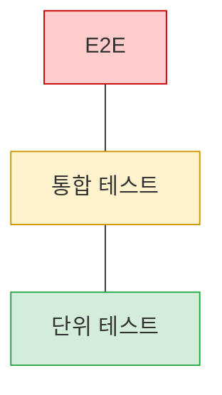
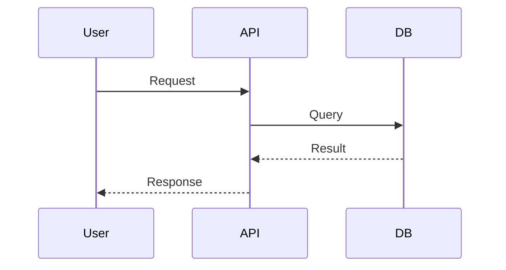

# Mermaid Converter Skill

ASCII 아트 다이어그램을 Mermaid 코드로 변환한다.

## 지원 패턴

### 1. 피라미드 (계층 구조)

**Before (ASCII):**
```
        /\
       /  \     E2E
      /    \
     /------\
    /        \
   /   통합   \
  /____________\
```

**After (Mermaid):**


### 2. 박스 다이어그램

**Before (ASCII):**
```
+--------+     +--------+
| Client | --> | Server |
+--------+     +--------+
```

**After (Mermaid):**


### 3. 시퀀스 다이어그램

**Before (ASCII):**
```
User -> API: Request
API -> DB: Query
DB --> API: Result
API --> User: Response
```

**After (Mermaid):**


## 변환 규칙

| ASCII 패턴 | Mermaid 타입 |
|-----------|-------------|
| 피라미드 (`/\`, `\/`) | `flowchart TB` |
| 좌우 화살표 (`-->`, `->`) | `flowchart LR` |
| 시퀀스 (`User -> API:`) | `sequenceDiagram` |
| 박스 (`+---+`) | `flowchart` with nodes |

## 스타일 가이드

### 색상 팔레트

| 용도 | 색상 | 코드 |
|-----|------|------|
| 위험/상위 | 빨강 | `fill:#ffcccc,stroke:#cc0000` |
| 경고/중간 | 노랑 | `fill:#fff3cd,stroke:#cc9900` |
| 안전/하위 | 초록 | `fill:#d4edda,stroke:#28a745` |
| 강조 | 금색 | `fill:#ffd700,stroke:#cc9900` |

### 노드 ID 규칙

- 같은 문서 내 중복 방지: `E2E`, `E2E2`, `E2E3`
- 의미 있는 이름 사용: `Client`, `Server`, `Database`

## 동작

1. ASCII 다이어그램 패턴 인식
2. 적절한 Mermaid 타입 선택
3. 노드와 연결 추출
4. 스타일 적용
5. Mermaid 코드 블록으로 교체
