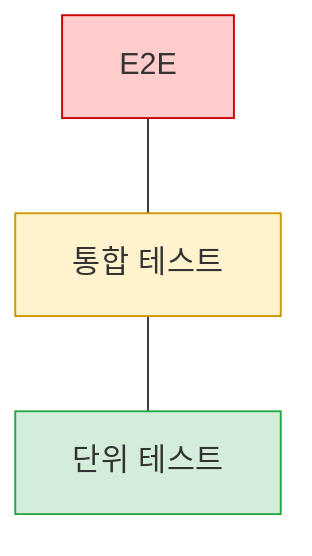
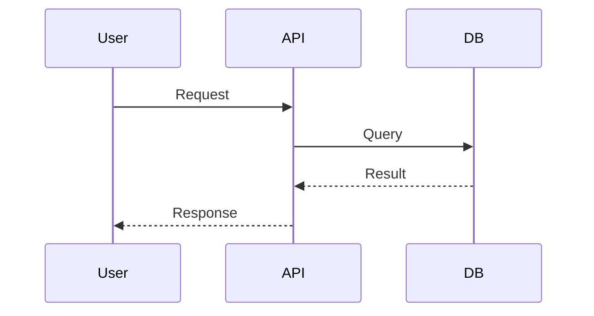
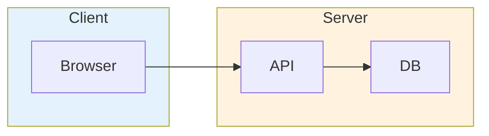
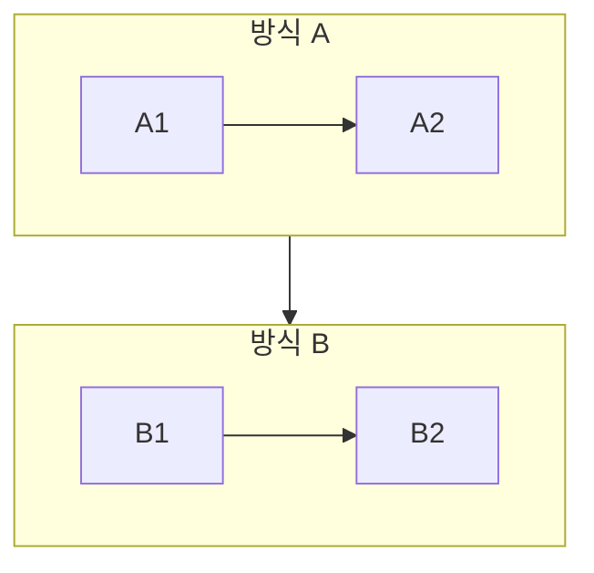
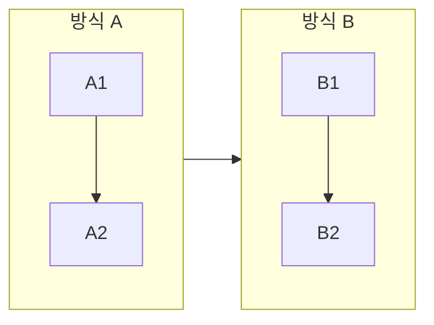

# Mermaid Converter Skill

ASCII 아트 다이어그램을 Mermaid 코드로 변환한다.

## 지원 패턴

### 1. 피라미드 (계층 구조)

**Before (ASCII):**
```
        /\
       /  \     E2E
      /    \
     /------\
    /        \
   /   통합   \
  /____________\
```

**After (Mermaid):**


### 2. 박스 다이어그램

**Before (ASCII):**
```
+--------+     +--------+
| Client | --> | Server |
+--------+     +--------+
```

**After (Mermaid):**


### 3. 시퀀스 다이어그램

**Before (ASCII):**
```
User -> API: Request
API -> DB: Query
DB --> API: Result
API --> User: Response
```

**After (Mermaid):**


## 변환 규칙

| ASCII 패턴 | Mermaid 타입 |
|-----------|-------------|
| 피라미드 (`/\`, `\/`) | `flowchart TB` |
| 좌우 화살표 (`-->`, `->`) | `flowchart LR` |
| 시퀀스 (`User -> API:`) | `sequenceDiagram` |
| 박스 (`+---+`) | `flowchart` with nodes |

## 스타일 가이드

### 색상 팔레트

| 용도 | 색상 | 코드 |
|-----|------|------|
| 위험/상위 | 빨강 | `fill:#ffcccc,stroke:#cc0000` |
| 경고/중간 | 노랑 | `fill:#fff3cd,stroke:#cc9900` |
| 안전/하위 | 초록 | `fill:#d4edda,stroke:#28a745` |
| 강조 | 금색 | `fill:#ffd700,stroke:#cc9900` |

### 노드 ID 규칙

- 같은 문서 내 중복 방지: `E2E`, `E2E2`, `E2E3`
- 의미 있는 이름 사용: `Client`, `Server`, `Database`

## 레이아웃 검증 체크리스트

Mermaid 다이어그램 작성 후 반드시 확인한다.

### 방향 선택

| 다이어그램 유형 | 권장 방향 | 이유 |
|---------------|----------|------|
| 파이프라인, 데이터 흐름 | `LR` | 읽기 방향과 일치 |
| 계층 구조, 상속 | `TB` | 위에서 아래로 내려가는 구조 |
| 의사결정 트리 | `TD` | 분기가 아래로 펼쳐짐 |
| 시간순 이벤트 | `LR` | 타임라인 표현 |
| 아키텍처 레이어 | `TB` | 상위→하위 계층 |

### 노드 수 제한

| 방향 | 권장 노드 수 | 이유 |
|-----|-------------|------|
| LR | 가로 4-6개 | 화면 폭 초과 방지 |
| TB | 세로 4-5개 | 스크롤 최소화 |
| subgraph 내 | 3-4개 | 복잡도 관리 |

### 텍스트 길이

- 노드 레이블: **15자 이내** (한글 기준)
- 긴 텍스트는 `<br/>`로 줄바꿈
- 아주 긴 설명은 노드 밖으로 빼기

```mermaid
%% ❌ 나쁜 예
flowchart LR
    A["사용자가 로그인하면 인증 서버에서 토큰을 발급받아 API 서버로 전달한다"]

%% ✅ 좋은 예
flowchart LR
    A["로그인 요청"] --> B["토큰 발급"] --> C["API 호출"]
```

### subgraph 사용

- 3개 이상의 관련 노드는 subgraph로 그룹화
- subgraph 이름은 짧게 (영문 권장)
- 색상으로 역할 구분



### subgraph 배치 규칙 (중요!)

**2-3개 subgraph 비교 시 반드시 `flowchart LR` 사용**





| subgraph 수 | 권장 방향 |
|-------------|----------|
| 2-3개 (비교) | `LR` |
| 4개 이상 (아키텍처) | `TB` |
| 계층 구조 (캐시, 레이어) | `TB` |

### 화살표 스타일

| 패턴 | 사용처 |
|-----|-------|
| `-->` | 일반 흐름 |
| `-.->` | 비동기, 선택적 |
| `==>` | 강조, 주요 흐름 |
| `-->｜label｜` | 조건, 설명 |

### 자주 하는 실수

| 실수 | 해결책 |
|-----|-------|
| LR인데 노드가 7개 이상 | subgraph로 그룹화 또는 TB로 변경 |
| 노드 텍스트가 너무 김 | `<br/>`로 줄바꿈, 약어 사용 |
| 색상이 너무 많음 | 역할별 2-3색으로 제한 |
| subgraph 안에 subgraph | 1단계 중첩만 권장 |
| 화살표가 교차 | 노드 순서 재배치 |

## 동작

1. ASCII 다이어그램 패턴 인식
2. 적절한 Mermaid 타입 선택 (**방향 검증**)
3. 노드와 연결 추출 (**노드 수 검증**)
4. 스타일 적용 (**텍스트 길이 검증**)
5. Mermaid 코드 블록으로 교체
6. **레이아웃 체크리스트 확인**
