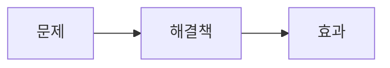
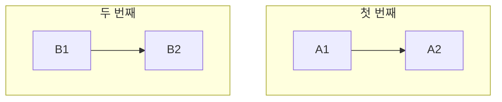
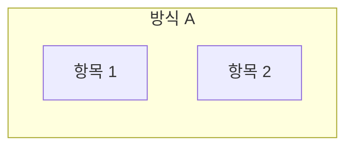
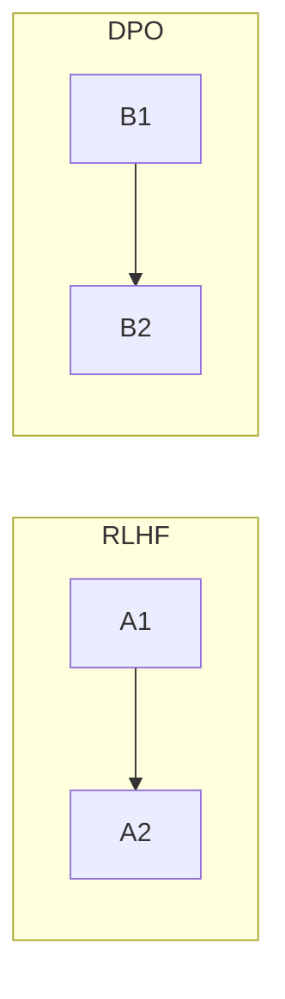
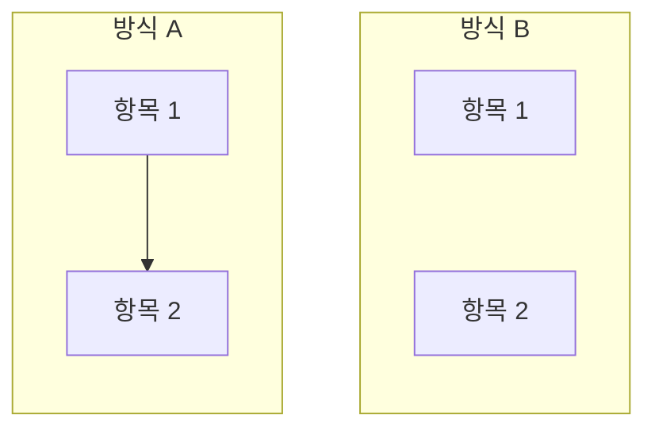
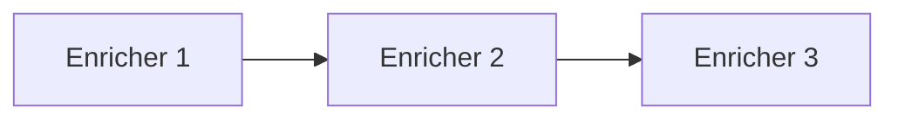

# 글쓰기 가이드

## 문체 규칙

### 기본 원칙
- **~다 체** 사용 (했다, 된다, 이다)
- 간결하고 직접적인 표현
- 불필요한 수식어 제거

### 피해야 할 표현
- `:` 로 끝나는 문장 → 마침표로 끝내기
- "~하면 된다" 남발 → 직접적 서술
- "다음과 같다", "아래와 같이" → 바로 내용 제시
- 과도한 강조 (정말, 매우, 굉장히)
- **"완벽 가이드", "완전 정복"** 같은 과장된 제목 → "가이드", "심층 분석", "활용법" 등 담백하게

### "~할 수 있다" 사용 기준
- ✅ **가능성/능력**을 설명할 때: "백그라운드에서 다른 작업을 할 수 있다"
- ❌ **단순 사실**을 완곡하게 표현할 때: "에러가 발생할 수 있다" → "에러가 발생한다"

### 좋은 예시
```
❌ 최신 PaperMod는 Hugo v0.146.0 이상을 요구한다:
✅ 최신 PaperMod는 Hugo v0.146.0 이상이 필요하다.

❌ 다음과 같이 설정하면 된다:
✅ 이렇게 설정한다.

❌ 에러가 발생할 수 있다:
✅ 이런 에러가 발생한다.

✅ 테스트를 돌리면서 다른 작업을 할 수 있다. (가능성 설명, OK)
```

## 포스트 구조

### Front Matter
```yaml
---
title: "제목"
date: YYYY-MM-DD
draft: false
tags: ["태그1", "태그2"]
categories: ["카테고리"]
summary: "한 줄 요약"
---
```

### 본문 구조
1. **개요** - 왜 이 글을 쓰는지, 무엇을 다루는지
2. **본문** - 핵심 내용
3. **결론/정리** - 요약 또는 다음 단계 (선택)

### 코드 블록
- 언어 명시 필수: \`\`\`bash, \`\`\`python 등
- 주석은 최소화, 코드가 스스로 설명하도록
- 긴 출력은 생략 (...으로 표시)

## 코드와 설명의 균형 (중요!)

### 핵심 원칙
**코드보다 개념 설명, 다이어그램, 인용문을 우선한다.** 독자가 "왜"를 이해하면 코드는 스스로 읽을 수 있다.

### 코드 블록 사용 기준
- ✅ **핵심 인터페이스/API**: 독자가 직접 구현할 때 참고할 코드
- ✅ **10줄 이하 핵심 로직**: 글로 설명하기 어려운 알고리즘
- ❌ **구현 세부사항**: Spring Config, DTO, 반복적인 CRUD
- ❌ **긴 코드 블록**: 30줄 이상은 GitHub 링크로 대체

### 대안 활용
| 상황 | 코드 대신 |
|------|----------|
| 흐름 설명 | Mermaid 다이어그램 |
| 개념 소개 | 인용문 + 설명 |
| 비교/분류 | 테이블 |
| 단계별 처리 | 번호 목록 |

### 다이어그램 적극 활용

- `flowchart`: 흐름, 아키텍처
- `sequenceDiagram`: 시간순 상호작용
- `pie`: 비율, 분포

### Mermaid 레이아웃 규칙 (중요!)

**⚠️ 작성 전 체크리스트**
- [ ] `flowchart LR` 사용했는가? (TB는 4+ subgraph일 때만)
- [ ] subgraph가 2개 이상이면 `~~~`로 연결했는가?
- [ ] subgraph 내부 노드들이 `-->`나 `~~~`로 연결되었는가?

**기본 원칙: 가로 우선 (`flowchart LR`)**

세로 배치(`TB`)는 공백이 많이 생겨 가독성이 떨어진다. 특히 subgraph가 2-3개일 때 문제가 심하다.

| 상황 | 방향 | 이유 |
|------|------|------|
| subgraph 2-3개 비교 | `LR` | 가로 배치로 공백 최소화 |
| 단순 순서도 (5개 이하) | `LR` | 한 줄에 표시 |
| 복잡한 아키텍처 (4+ subgraph) | `TB` | 세로가 더 읽기 쉬움 |
| 계층 구조 (캐시, 레이어) | `TB` | 위→아래 흐름이 자연스러움 |

**❌ 피해야 할 패턴 1: flowchart TB로 비교**

→ 두 subgraph가 세로로 나열되어 공백 낭비

**❌ 피해야 할 패턴 2: 노드 연결 없이 나열**

→ LR이어도 노드가 연결 없이 나열되면 **세로로 쌓임**

**❌ 피해야 할 패턴 3: subgraph 간 연결 없음**

→ flowchart LR이어도 **subgraph 간 연결이 없으면 세로로 쌓임**

**✅ 권장 패턴**

→ `-->` (흐름) 또는 `~~~` (비표시 연결)로 가로 배치 강제

**노드 연결 방법**
| 상황 | 연결 방식 | 예시 |
|------|----------|------|
| 순차 흐름 | `-->` | `A --> B --> C` |
| 병렬 항목 | `~~~` | `A ~~~ B ~~~ C` |
| 단일 노드에 통합 | `<br/>` | `A["항목1<br/>항목2"]` |

**긴 순서도는 텍스트 축약**
```
❌ A["📢 장애 알람<br/>(Sentry, DataDog)"] --> B["🤖 Claude 분석<br/>(프로젝트, 심각도)"]
✅ A["📢 장애 알람"] --> B["🤖 분석"] --> C["💬 알림"]
```

### 인용문으로 권위 부여
```markdown
> "The first rule of optimization is: don't do it."
> — Michael A. Jackson
```
- 원칙을 설명할 때 저명한 출처 인용
- 공식 문서, 논문, 저명한 개발자 글 활용

### 좋은 예시 vs 나쁜 예시

**❌ 코드 중심 (피해야 함)**
```kotlin
class ContextEnrichmentPipeline(enrichers: List<ContextEnricher>) {
    private val sorted = enrichers.sortedBy { it.priority }
    suspend fun enrich(ctx: EnrichmentContext): EnrichmentContext {
        var current = ctx
        for (e in sorted) {
            if (e.shouldEnrich(current)) {
                current = e.enrich(current)
            }
        }
        return current
    }
}
```

**✅ 설명 중심 (권장)**
> Chain of Responsibility 패턴으로 각 Enricher가 독립적으로 동작한다.

파이프라인은 priority 순으로 Enricher를 실행한다. 한 Enricher가 실패해도 다음은 계속 실행된다.



**핵심 인터페이스만 코드로 제시한다.**
```kotlin
interface ContextEnricher {
    val priority: Int
    fun shouldEnrich(ctx: EnrichmentContext): Boolean
    suspend fun enrich(ctx: EnrichmentContext): EnrichmentContext
}
```

## 태그 컨벤션

### 기술 태그
- 언어: Python, JavaScript, Go, Rust
- 도구: Docker, Git, Hugo
- 플랫폼: AWS, GCP, GitHub

### 주제 태그
- TIL: 오늘 배운 것
- 트러블슈팅: 문제 해결 기록
- 설정: 환경 설정 관련

## Claude Code 사용 시

### 포스트 작성 요청
```
"오늘 작업한 {주제}를 정리해서 포스팅해줘"
"이 내용을 dev-notes에 올려줘"
```

### 자동 처리
- 파일명: 날짜-슬러그 형식 자동 생성
- 태그: 내용 기반 자동 추천
- 배포: git push까지 자동 실행 (요청 시)
