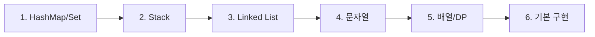

15분 라이브코딩 면접에서 자주 나오는 Easy 문제들을 패턴별로 정리했다.

---

## 학습 순서



---

## 1. HashMap/HashSet 패턴

> **핵심**: O(1) 조회로 시간복잡도 최적화

| 문제 | 핵심 아이디어 |
|------|-------------|
| [Two Sum](/dev-notes/posts/2022-01-20-leetcode-two-sum/) | `target - nums[i]`가 Map에 있는지 확인 |
| [Contains Duplicate](/dev-notes/posts/2022-01-21-leetcode-contains-duplicate/) | `Set.add()`가 false면 중복 |
| [Single Number](/dev-notes/posts/2022-01-22-leetcode-single-number/) | XOR: `a ^ a = 0` |

---

## 2. Stack 패턴

> **핵심**: LIFO로 짝 맞추기

| 문제 | 핵심 아이디어 |
|------|-------------|
| [Valid Parentheses](/dev-notes/posts/2022-01-23-leetcode-valid-parentheses/) | 여는 괄호 push, 닫는 괄호에서 pop 비교 |

---

## 3. Linked List 패턴

> **핵심**: 포인터 조작, null 체크 필수

| 문제 | 핵심 아이디어 |
|------|-------------|
| [Reverse Linked List](/dev-notes/posts/2022-01-24-leetcode-reverse-linked-list/) | prev, curr, next 세 포인터 |
| [Linked List Cycle](/dev-notes/posts/2022-01-25-leetcode-linked-list-cycle/) | Floyd's 토끼와 거북이 |
| [Merge Two Sorted Lists](/dev-notes/posts/2022-02-04-leetcode-merge-two-sorted-lists/) | 더미 헤드, 남은 리스트 연결 |

---

## 4. 문자열 패턴

> **핵심**: 투 포인터, 빈도 배열

| 문제 | 핵심 아이디어 |
|------|-------------|
| [Valid Palindrome](/dev-notes/posts/2022-01-26-leetcode-valid-palindrome/) | 전처리 + reverse 또는 투 포인터 |
| [Palindrome Index](/dev-notes/posts/2022-01-27-hackerrank-palindrome-index/) | 다르면 왼쪽/오른쪽 제거 시도 |
| [Anagram](/dev-notes/posts/2022-01-28-hackerrank-anagram/) | `int[26]` 빈도 배열 |

---

## 5. 배열/투포인터/DP 패턴

> **핵심**: 정렬 후 양 끝에서 접근, 점화식

| 문제 | 핵심 아이디어 |
|------|-------------|
| [Remove Duplicates](/dev-notes/posts/2022-01-30-leetcode-remove-duplicates/) | in-place 수정, k 이후는 검사 안 함 |
| [Merge Sorted Array](/dev-notes/posts/2022-02-05-leetcode-merge-sorted-array/) | 뒤에서부터 채우기 |
| [Best Time to Buy Stock](/dev-notes/posts/2022-01-31-leetcode-best-time-to-buy-stock/) | 최저점 추적하며 이익 계산 |
| [Maximum Subarray](/dev-notes/posts/2022-02-01-leetcode-maximum-subarray/) | Kadane: 새로 시작 vs 이어가기 |
| [Binary Search](/dev-notes/posts/2022-02-02-leetcode-binary-search/) | `left + (right - left) / 2` |
| [Climbing Stairs](/dev-notes/posts/2022-02-03-leetcode-climbing-stairs/) | 피보나치: `dp[n] = dp[n-1] + dp[n-2]` |

---

## 6. 기본 구현 패턴

> **핵심**: 조건문, 수학 연산

| 문제 | 핵심 아이디어 |
|------|-------------|
| [FizzBuzz](/dev-notes/posts/2022-01-29-hackerrank-fizzbuzz/) | 15 먼저 체크 (조건 순서 중요) |
| [Reverse Integer](/dev-notes/posts/2022-02-06-leetcode-reverse-integer/) | `% 10` 추출, `/ 10` 제거, 오버플로우 체크 |

---

## 패턴별 핵심 코드

### HashMap

```java
Map<Integer, Integer> map = new HashMap<>();
if (map.containsKey(target - num)) return ...;
map.put(num, index);
```

### Stack

```java
Deque<Character> stack = new ArrayDeque<>();
stack.push(c);
stack.pop();
stack.isEmpty();
```

### Linked List

```java
// 뒤집기
ListNode prev = null, curr = head;
while (curr != null) {
    ListNode next = curr.next;
    curr.next = prev;
    prev = curr;
    curr = next;
}
```

### 투 포인터

```java
int left = 0, right = arr.length - 1;
while (left < right) {
    // 비교 후 left++ 또는 right--
}
```

### DP

```java
dp[i] = dp[i-1] + dp[i-2];  // 피보나치
curr = Math.max(nums[i], curr + nums[i]);  // Kadane
```

---

## 면접 팁

1. **Easy는 10분 내 풀어야** - 15분 중 5분은 질문/설명
2. **먼저 간단한 풀이 제시** → "최적화할 수 있나요?" 질문에 개선
3. **엣지 케이스 먼저 언급**: null, 빈 배열, 단일 원소
4. **시간/공간 복잡도 항상 말하기**

---

## 다음 단계

Easy를 확실히 익힌 후 Medium으로:
- Two Sum II (정렬된 배열 + 투 포인터)
- 3Sum (투 포인터 응용)
- LRU Cache (HashMap + Linked List)
- Binary Tree Level Order Traversal (BFS)
