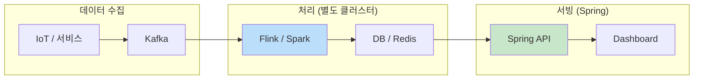
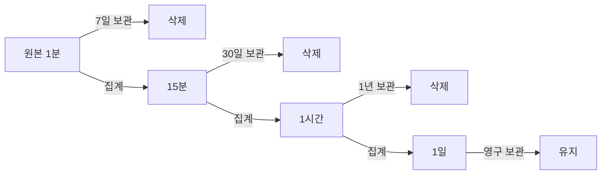
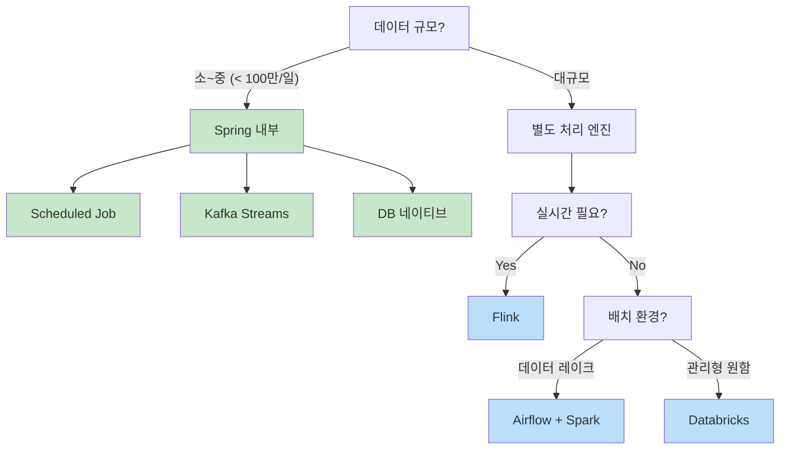

1분 간격의 시계열 데이터를 15분, 1시간 단위로 집계해야 할 때가 있다. 대시보드 성능 최적화, 장기 보관 비용 절감 등이 목적이다.

---

## 도구 분류: 오케스트레이션 vs 처리 엔진

먼저 각 도구의 역할을 이해해야 한다.

| 분류 | 도구 | 역할 |
|------|------|------|
| **오케스트레이션** | Airflow | 언제, 어떤 순서로 실행할지 스케줄링 |
| **처리 엔진 (배치)** | Spark, Databricks | 대용량 데이터 집계 |
| **처리 엔진 (스트림)** | Flink, Kafka Streams | 실시간 데이터 집계 |
| **API 서빙** | Spring Boot | 집계된 데이터를 API로 제공 |

**Airflow는 스케줄러**, Spark/Flink는 **실행 엔진**이다. 보통 조합해서 사용한다.

---

## 아키텍처 패턴

### Spring 내부에서 처리 (소~중규모)

Spring Boot 애플리케이션 안에서 모든 처리를 한다.


- **Scheduled Job**: `@Scheduled`로 주기적 집계
- **Kafka Streams**: Spring 앱 내에서 스트림 처리

**적합**: 데이터 < 100만 건/일, 팀이 작음

### 처리 엔진 분리 (대규모)

Flink/Spark가 집계하고, Spring은 결과만 서빙한다.



**Flink/Spark와 Spring은 별도 애플리케이션**이고, **저장소를 통해 연결**된다.

**적합**: 데이터 > 100만 건/일, 실시간 필수, 전담 데이터팀 있음

---

## 집계 방식 선택

데이터 특성에 따라 집계 함수가 달라진다.

| 데이터 유형 | 집계 방식 | 예시 |
|------------|----------|------|
| 순간 값 (gauge) | `AVG`, `LAST` | 온도, CPU 사용률 |
| 누적 값 (counter) | `SUM` | 요청 수, 이벤트 수 |
| 범위 분석 | `MIN`, `MAX` | 응답 시간 피크 |
| 금융 데이터 | `OHLC` | 주가 (시가, 고가, 저가, 종가) |

---

## 구현 방법

### 1. Scheduled Job (Spring 내부)

가장 단순한 방식. 소~중규모에 적합하다.

```kotlin
@Scheduled(cron = "0 */15 * * * *")  // 매 15분
@SchedulerLock(name = "rollup-15m", lockAtMostFor = "14m")
fun rollUp15Minutes() {
    val bucketEnd = Instant.now().truncatedTo(ChronoUnit.MINUTES)
    val bucketStart = bucketEnd.minus(15, ChronoUnit.MINUTES)

    val aggregated = telemetryRepository.aggregateByBucket(bucketStart, bucketEnd)
    aggregatedRepository.saveAll(aggregated)
}
```

**장점**: 구현 단순, 별도 인프라 불필요
**단점**: 대용량에서 느림, 장애 시 누락 가능

### 2. Kafka Streams (Spring 내부)

Spring Boot 앱 안에서 실행되는 스트림 처리. **별도 클러스터 불필요**.

```kotlin
@Bean
fun telemetryStream(builder: StreamsBuilder): KStream<String, Telemetry> {
    return builder.stream<String, Telemetry>("telemetry")
        .groupByKey()
        .windowedBy(TimeWindows.ofSizeWithNoGrace(Duration.ofMinutes(15)))
        .aggregate(
            { AggregateState() },
            { _, value, state -> state.add(value) }
        )
        .toStream()
        .map { key, state -> KeyValue(key.key(), state.toResult()) }
        .through("telemetry-15m")
}
```

**장점**: Exactly-once 보장, Spring과 통합 용이
**단점**: Kafka 필수, 복잡한 처리는 한계

### 3. Flink (별도 클러스터)

대용량 실시간 처리. **Spring과 별도 프로젝트**로 운영한다.

```java
// Flink Job (별도 프로젝트, Spring 아님)
public class TelemetryRollupJob {
    public static void main(String[] args) throws Exception {
        StreamExecutionEnvironment env = StreamExecutionEnvironment.getExecutionEnvironment();

        KafkaSource<Telemetry> source = KafkaSource.<Telemetry>builder()
            .setBootstrapServers("kafka:9092")
            .setTopics("telemetry")
            .build();

        env.fromSource(source, WatermarkStrategy.forMonotonousTimestamps(), "Kafka")
            .keyBy(Telemetry::getDeviceId)
            .window(TumblingEventTimeWindows.of(Time.minutes(15)))
            .aggregate(new TelemetryAggregator())
            .addSink(JdbcSink.sink(...));  // DB에 저장

        env.execute("Telemetry Rollup");
    }
}
```

**Spring은 DB에서 읽기만 한다**:

```kotlin
// Spring API (별도 프로젝트)
@GetMapping("/telemetry/{deviceId}/15m")
fun get15MinData(@PathVariable deviceId: String): List<AggregatedTelemetry> {
    return aggregatedRepository.findByDeviceId(deviceId)  // Flink가 저장한 데이터
}
```

**장점**: 대규모 처리, 이벤트 시간 기반, Exactly-once
**단점**: 별도 클러스터 필요, 운영 복잡

### 4. Airflow + Spark (배치 대규모)

Airflow가 스케줄링, Spark가 처리. 데이터 레이크 환경에서 표준.

```python
# Airflow DAG
@dag(schedule_interval="*/15 * * * *")
def telemetry_rollup():
    @task
    def run_spark_job():
        spark_submit(application="s3://jobs/telemetry_rollup.py")
    run_spark_job()
```

```python
# Spark Job
from pyspark.sql import functions as F

df = spark.read.parquet("s3://data/telemetry/raw/")
aggregated = df \
    .withColumn("bucket", F.window("timestamp", "15 minutes")) \
    .groupBy("device_id", "bucket") \
    .agg(F.avg("value").alias("avg_value"))

aggregated.write.mode("append").parquet("s3://data/telemetry/15m/")
```

**장점**: 대용량 배치 최적, 재처리 용이
**단점**: 실시간 불가, 인프라 비용

### 5. Databricks (관리형)

Spark + Delta Lake + 관리형 인프라.

```python
# Delta Live Tables
@dlt.table
def telemetry_15m():
    return (
        dlt.read("telemetry_raw")
        .withColumn("bucket", F.window("timestamp", "15 minutes"))
        .groupBy("device_id", "bucket")
        .agg(F.avg("value").alias("avg_value"))
    )
```

**장점**: 관리형, Auto-scaling, Delta Lake ACID
**단점**: 비용 높음, 벤더 종속

### 6. DB 네이티브 (권장)

데이터베이스가 자동으로 집계. 코드 최소화.

**TimescaleDB Continuous Aggregates**:

```sql
CREATE MATERIALIZED VIEW telemetry_15m
WITH (timescaledb.continuous) AS
SELECT
    time_bucket('15 minutes', timestamp) AS bucket,
    device_id,
    AVG(value) AS avg_value,
    MIN(value) AS min_value,
    MAX(value) AS max_value
FROM telemetry
GROUP BY bucket, device_id;

-- 자동 갱신 정책
SELECT add_continuous_aggregate_policy('telemetry_15m',
    start_offset => INTERVAL '1 hour',
    end_offset => INTERVAL '15 minutes',
    schedule_interval => INTERVAL '15 minutes');
```

**장점**: 코드 최소, 안정적, 트랜잭션 보장
**단점**: 특정 DB 종속

---

## Flink/Spark와 Spring 연동 패턴

### 패턴 1: 처리 엔진 → DB → Spring (가장 일반적)

```
Kafka → Flink → PostgreSQL → Spring API
```

- Flink가 집계 후 DB에 저장
- Spring은 DB에서 읽기만
- **단순하고 안정적**

### 패턴 2: 처리 엔진 → Kafka → Spring

```
Kafka (raw) → Flink → Kafka (aggregated) → Spring Consumer → DB
```

- Flink가 결과를 Kafka 토픽으로 발행
- Spring이 구독해서 DB에 저장
- **다른 서비스도 집계 결과 구독 가능**

### 패턴 3: 처리 엔진 → Redis → Spring (실시간)

```
Kafka → Flink → Redis → Spring API → WebSocket → Dashboard
```

- 최근 15분만 Redis에 유지
- 초저지연 조회
- **실시간 모니터링에 적합**

---

## Multi-resolution 저장 전략



조회 시 기간에 따라 적절한 해상도 테이블을 선택한다.

---

## Edge Cases 처리

| 케이스 | 처리 방법 |
|--------|----------|
| **결측치** | `completeness` 필드로 신뢰도 표시 |
| **늦은 도착** | Flink `allowedLateness()`, 별도 재처리 |
| **부분 윈도우** | 완료된 버킷만 집계 |

---

## 방식 비교

| 방식 | 규모 | 지연 | 복잡도 | 실행 환경 |
|------|:----:|:----:|:------:|----------|
| Scheduled Job | 소~중 | 분 | 낮음 | Spring 내부 |
| Kafka Streams | 중 | 초 | 중 | Spring 내부 |
| Flink | 대 | 초 | 높음 | **별도 클러스터** |
| Airflow + Spark | 대 | 분~시간 | 중 | **별도 클러스터** |
| Databricks | 대 | 분 | 낮음 | **관리형** |
| DB 네이티브 | 소~대 | 분 | 낮음 | DB |

---

## 선택 가이드



## 정리

| 상황 | 권장 |
|------|------|
| 소규모, 빠른 구현 | **Scheduled Job** or **DB 네이티브** |
| 중규모, Kafka 사용 중 | **Kafka Streams** (Spring 내부) |
| 대규모, 실시간 필수 | **Flink** (별도 클러스터) |
| 대규모, 배치 중심 | **Airflow + Spark** |
| 관리형 원함 | **Databricks** |

**핵심**:
- 소~중규모는 **Spring 내부에서 처리**
- 대규모는 **처리 엔진 분리** (Flink/Spark)
- Flink/Spark는 Spring과 **별도 애플리케이션**, 저장소로 연결
