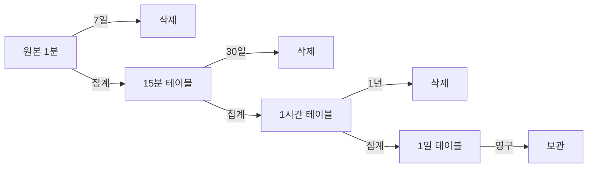
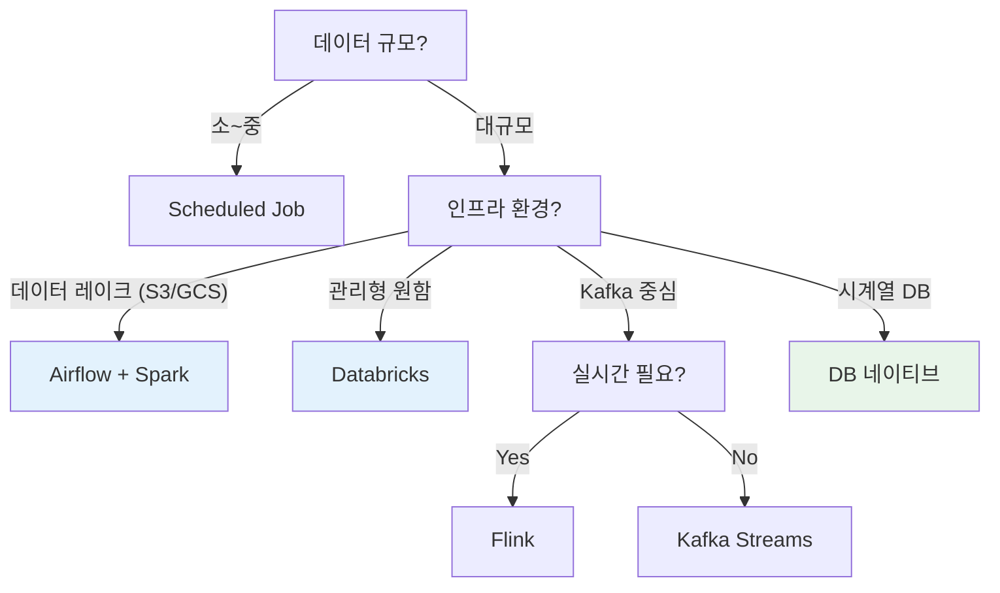

1분 간격의 시계열 데이터를 15분, 1시간 단위로 집계해야 할 때가 있다. 대시보드 성능 최적화, 장기 보관 비용 절감 등이 목적이다.

---

## 집계 방식 선택

데이터 특성에 따라 집계 함수가 달라진다.

| 데이터 유형 | 집계 방식 | 예시 |
|------------|----------|------|
| 순간 값 (gauge) | `AVG`, `LAST` | 온도, CPU 사용률 |
| 누적 값 (counter) | `SUM` | 요청 수, 이벤트 수 |
| 범위 분석 | `MIN`, `MAX` | 응답 시간 피크 |
| 금융 데이터 | `OHLC` | 주가 (시가, 고가, 저가, 종가) |

---

## 다운샘플링 시점

| 방식 | 적합한 경우 | 지연 |
|------|-----------|------|
| Write-time | 집계 패턴 고정, 읽기 많음 | 없음 |
| Read-time | 유연성 필요, 데이터 적음 | 쿼리 시 |
| Batch Roll-up | 대용량, 다중 해상도 | 분~시간 |
| Stream Processing | 실시간 + 대용량 | 초~분 |

---

## Batch Roll-up 구현 방법

### 1. Scheduled Job (Spring)

가장 단순한 방식. 중소규모에 적합하다.

```kotlin
@Scheduled(cron = "0 */15 * * * *")  // 매 15분
@SchedulerLock(name = "rollup-15m", lockAtMostFor = "14m")  // 분산 락
fun rollUp15Minutes() {
    val bucketEnd = Instant.now().truncatedTo(ChronoUnit.MINUTES)
    val bucketStart = bucketEnd.minus(15, ChronoUnit.MINUTES)

    val aggregated = telemetryRepository.aggregateByBucket(bucketStart, bucketEnd)
    aggregatedRepository.saveAll(aggregated)
}
```

```sql
-- aggregateByBucket 쿼리
SELECT
    device_id,
    date_trunc('hour', timestamp) +
        INTERVAL '15 min' * (EXTRACT(MINUTE FROM timestamp)::int / 15) AS bucket,
    AVG(value) AS avg_value,
    MIN(value) AS min_value,
    MAX(value) AS max_value,
    COUNT(*) AS sample_count
FROM telemetry
WHERE timestamp >= :start AND timestamp < :end
GROUP BY device_id, bucket
```

**장점**: 구현 단순, 디버깅 쉬움
**단점**: 장애 시 누락 가능, 대용량에서 느림

### 2. Kafka Consumer + Windowing

이벤트 기반 처리. 실시간에 가까운 집계가 가능하다.

```kotlin
@KafkaListener(topics = ["telemetry"])
fun consume(records: List<ConsumerRecord<String, Telemetry>>) {
    records.groupBy { to15MinBucket(it.value().timestamp) }
        .forEach { (bucket, events) ->
            val key = "${events.first().value().deviceId}:$bucket"

            // Redis에 증분 집계
            redisTemplate.opsForHash<String, Double>().increment(key, "sum", events.sumOf { it.value().value })
            redisTemplate.opsForHash<String, Long>().increment(key, "count", events.size.toLong())
            redisTemplate.expire(key, Duration.ofHours(2))
        }
}

// 별도 Job으로 Redis → DB 플러시
@Scheduled(fixedDelay = 60_000)
fun flushToDb() {
    val keys = redisTemplate.keys("telemetry:*:15m:*")
    keys.filter { isCompleteBucket(it) }
        .forEach { key ->
            val data = redisTemplate.opsForHash<String, Any>().entries(key)
            aggregatedRepository.save(toAggregatedData(key, data))
            redisTemplate.delete(key)
        }
}
```

**장점**: 실시간에 가까움, 확장성 좋음
**단점**: 복잡도 높음, Redis 의존

### 3. Kafka Streams (Tumbling Window)

Kafka Streams의 윈도우 기능을 활용한다.

```kotlin
val streamsBuilder = StreamsBuilder()

streamsBuilder.stream<String, Telemetry>("telemetry")
    .groupByKey()
    .windowedBy(TimeWindows.ofSizeWithNoGrace(Duration.ofMinutes(15)))
    .aggregate(
        { AggregateState() },
        { _, value, state -> state.add(value) },
        Materialized.with(Serdes.String(), aggregateSerde)
    )
    .toStream()
    .map { windowedKey, state ->
        KeyValue(
            "${windowedKey.key()}:${windowedKey.window().start()}",
            state.toResult()
        )
    }
    .to("telemetry-15m")
```

**장점**: Exactly-once 보장, 상태 관리 내장
**단점**: Kafka 생태계에 종속

### 4. Apache Flink (실시간 대규모)

대용량 실시간 처리에 적합하다.

```java
DataStream<Telemetry> stream = env.addSource(kafkaSource);

stream
    .keyBy(Telemetry::getDeviceId)
    .window(TumblingEventTimeWindows.of(Time.minutes(15)))
    .aggregate(new TelemetryAggregator())
    .addSink(jdbcSink);
```

**장점**: 대규모 처리, 이벤트 시간 기반 정확한 윈도우
**단점**: 운영 복잡도 높음, 별도 클러스터 필요

### 5. Airflow + Spark (배치 대규모)

Airflow가 스케줄링, Spark가 처리를 담당한다. 데이터 레이크 환경에서 표준.

```python
# Airflow DAG
@dag(schedule_interval="*/15 * * * *")
def telemetry_rollup():

    @task
    def run_spark_job():
        spark_submit(
            application="s3://jobs/telemetry_rollup.py",
            conf={"spark.sql.shuffle.partitions": "200"}
        )

    run_spark_job()
```

```python
# Spark Job (telemetry_rollup.py)
from pyspark.sql import functions as F

df = spark.read.parquet("s3://data/telemetry/raw/")

aggregated = df \
    .withColumn("bucket", F.window("timestamp", "15 minutes")) \
    .groupBy("device_id", "bucket") \
    .agg(
        F.avg("value").alias("avg_value"),
        F.min("value").alias("min_value"),
        F.max("value").alias("max_value"),
        F.count("*").alias("sample_count")
    )

aggregated.write.mode("append").parquet("s3://data/telemetry/15m/")
```

**장점**: 대용량 배치에 최적, 재처리 용이, 데이터 레이크 통합
**단점**: 실시간 불가 (분~시간 지연), 인프라 비용

### 6. Databricks (Spark + Delta Lake)

Databricks는 Spark + Delta Lake + 관리형 인프라를 제공한다.

```python
# Delta Live Tables (선언적 파이프라인)
@dlt.table
def telemetry_15m():
    return (
        dlt.read("telemetry_raw")
        .withColumn("bucket", F.window("timestamp", "15 minutes"))
        .groupBy("device_id", "bucket")
        .agg(
            F.avg("value").alias("avg_value"),
            F.min("value").alias("min_value"),
            F.max("value").alias("max_value")
        )
    )
```

```sql
-- Databricks SQL로도 가능
CREATE OR REFRESH STREAMING LIVE TABLE telemetry_15m AS
SELECT
    window(timestamp, '15 minutes') AS bucket,
    device_id,
    avg(value) AS avg_value
FROM STREAM(telemetry_raw)
GROUP BY bucket, device_id;
```

**장점**: 관리형 인프라, Delta Lake ACID, Auto-scaling
**단점**: 비용 높음, 벤더 종속

### 7. DB 네이티브 집계 (권장)

데이터베이스가 자동으로 집계한다. 코드가 가장 적다.

#### TimescaleDB Continuous Aggregates

```sql
-- 자동 집계 뷰 생성
CREATE MATERIALIZED VIEW telemetry_15m
WITH (timescaledb.continuous) AS
SELECT
    time_bucket('15 minutes', timestamp) AS bucket,
    device_id,
    AVG(value) AS avg_value,
    MIN(value) AS min_value,
    MAX(value) AS max_value,
    COUNT(*) AS sample_count
FROM telemetry
GROUP BY bucket, device_id;

-- 자동 갱신 정책 (15분마다, 1시간 전 데이터까지)
SELECT add_continuous_aggregate_policy('telemetry_15m',
    start_offset => INTERVAL '1 hour',
    end_offset => INTERVAL '15 minutes',
    schedule_interval => INTERVAL '15 minutes');

-- 원본 데이터 자동 삭제 (7일 후)
SELECT add_retention_policy('telemetry', INTERVAL '7 days');
```

#### ClickHouse Materialized View

```sql
-- 원본 테이블
CREATE TABLE telemetry (
    timestamp DateTime,
    device_id String,
    value Float64
) ENGINE = MergeTree()
ORDER BY (device_id, timestamp);

-- 자동 집계 (INSERT 시 자동 실행)
CREATE MATERIALIZED VIEW telemetry_15m
ENGINE = SummingMergeTree()
ORDER BY (device_id, bucket)
AS SELECT
    toStartOfFifteenMinutes(timestamp) AS bucket,
    device_id,
    avg(value) AS avg_value,
    min(value) AS min_value,
    max(value) AS max_value,
    count() AS sample_count
FROM telemetry
GROUP BY bucket, device_id;
```

**장점**: 코드 최소, 안정적, 트랜잭션 보장
**단점**: 특정 DB에 종속

---

## Multi-resolution 저장 전략



```sql
-- 조회 시 기간에 따라 테이블 선택
SELECT * FROM telemetry_15m WHERE timestamp > NOW() - INTERVAL '7 days';
SELECT * FROM telemetry_1h WHERE timestamp > NOW() - INTERVAL '30 days';
SELECT * FROM telemetry_1d WHERE timestamp > NOW() - INTERVAL '1 year';
```

---

## Edge Cases 처리

### 결측치 (Missing Data)

```kotlin
data class AggregatedData(
    val bucket: Instant,
    val avg: Double?,
    val count: Int,
    val completeness: Double  // count / 15 (expected)
)

// 대시보드에서 completeness < 0.8 이면 경고 표시
```

### 늦게 도착한 데이터 (Late Arrival)

```kotlin
// Flink: Watermark + Allowed Lateness
.window(TumblingEventTimeWindows.of(Time.minutes(15)))
.allowedLateness(Time.minutes(5))  // 5분까지 늦은 데이터 허용
.sideOutputLateData(lateOutputTag)  // 그 이후는 별도 처리
```

### 부분 윈도우 (Partial Window)

```kotlin
// 현재 진행 중인 버킷은 집계하지 않음
val bucketEnd = now.truncatedTo(ChronoUnit.MINUTES)
val completedBucketEnd = bucketEnd.minus(15, ChronoUnit.MINUTES)
```

---

## 방식 비교

| 방식 | 규모 | 지연 | 복잡도 | 적합한 환경 |
|------|:----:|:----:|:------:|------------|
| Scheduled Job | 소~중 | 분 | 낮음 | Spring 백엔드 |
| Kafka Consumer | 중~대 | 초~분 | 중 | Kafka 사용 중 |
| Kafka Streams | 중~대 | 초 | 중 | Kafka 생태계 |
| Flink | 대 | 초 | 높음 | 실시간 필수 |
| Airflow + Spark | 대 | 분~시간 | 중 | 데이터 레이크 |
| Databricks | 대 | 분 | 낮음 | 관리형 원하면 |
| DB 네이티브 | 소~대 | 분 | 낮음 | 시계열 DB 사용 |

---

## 권장 조합

| 상황 | 권장 방식 |
|------|----------|
| 빠른 구현, 소규모 | Scheduled Job + PostgreSQL |
| 중규모, Kafka 사용 중 | Kafka Streams |
| 대규모, 실시간 필수 | Flink |
| 대규모, 배치 중심 | **Airflow + Spark** |
| 데이터 레이크, 관리형 | **Databricks** |
| 시계열 DB 도입 가능 | TimescaleDB Continuous Aggregates |
| OLAP 분석 중심 | ClickHouse Materialized View |

### 환경별 선택 가이드



**Best Practice**:
- **백엔드 서비스**: DB 네이티브 집계 (코드 적음, 트랜잭션 보장)
- **데이터 플랫폼**: Airflow + Spark 또는 Databricks (재처리 용이, 확장성)
