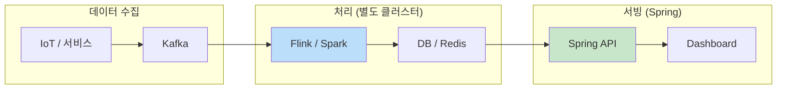
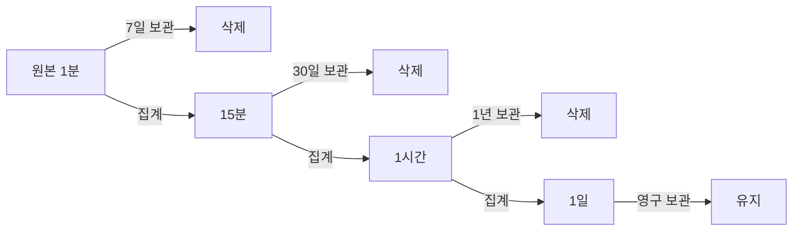
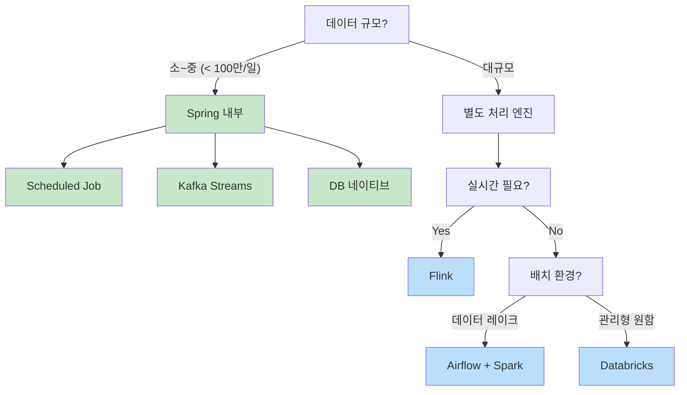
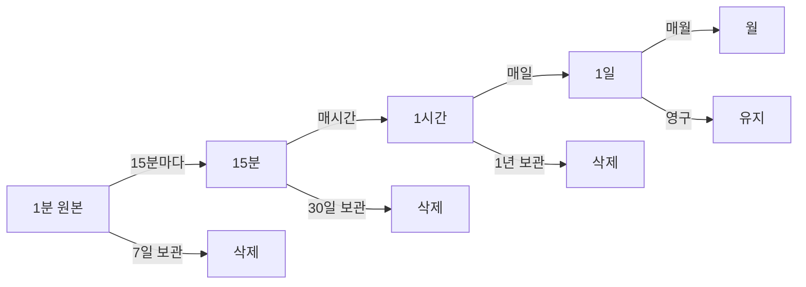
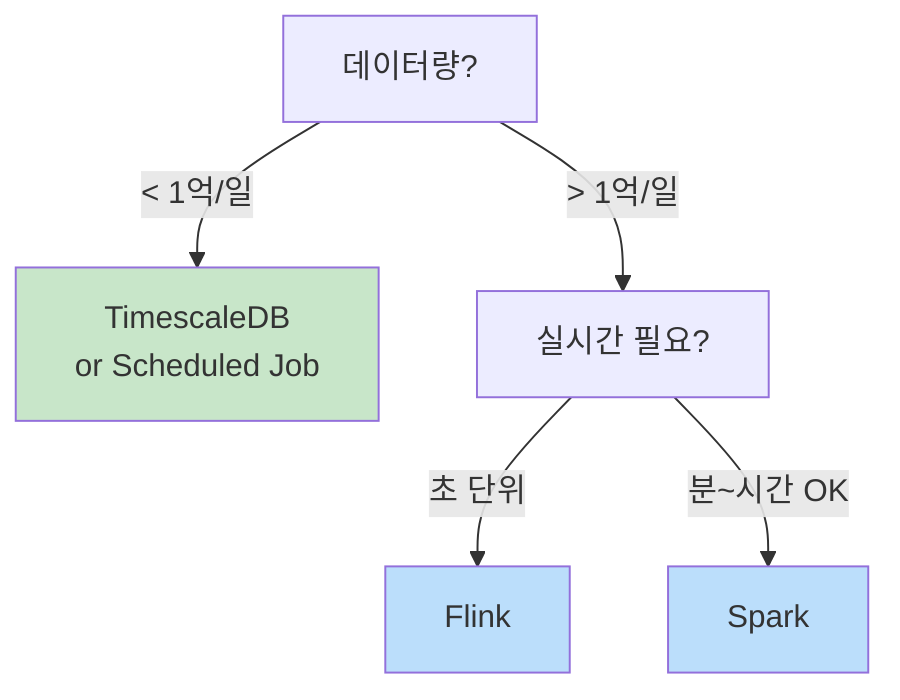

1분 간격의 시계열 데이터를 15분, 1시간 단위로 집계해야 할 때가 있다. 대시보드 성능 최적화, 장기 보관 비용 절감 등이 목적이다.

---

## 도구 분류: 오케스트레이션 vs 처리 엔진

먼저 각 도구의 역할을 이해해야 한다.

| 분류 | 도구 | 역할 |
|------|------|------|
| **오케스트레이션** | Airflow | 언제, 어떤 순서로 실행할지 스케줄링 |
| **처리 엔진 (배치)** | Spark, Databricks | 대용량 데이터 집계 |
| **처리 엔진 (스트림)** | Flink, Kafka Streams | 실시간 데이터 집계 |
| **API 서빙** | Spring Boot | 집계된 데이터를 API로 제공 |

**Airflow는 스케줄러**, Spark/Flink는 **실행 엔진**이다. 보통 조합해서 사용한다.

---

## 아키텍처 패턴

### Spring 내부에서 처리 (소~중규모)

Spring Boot 애플리케이션 안에서 모든 처리를 한다.


- **Scheduled Job**: `@Scheduled`로 주기적 집계
- **Kafka Streams**: Spring 앱 내에서 스트림 처리

**적합**: 데이터 < 100만 건/일, 팀이 작음

### 처리 엔진 분리 (대규모)

Flink/Spark가 집계하고, Spring은 결과만 서빙한다.



**Flink/Spark와 Spring은 별도 애플리케이션**이고, **저장소를 통해 연결**된다.

**적합**: 데이터 > 100만 건/일, 실시간 필수, 전담 데이터팀 있음

---

## 집계 방식 선택

데이터 특성에 따라 집계 함수가 달라진다.

| 데이터 유형 | 집계 방식 | 예시 |
|------------|----------|------|
| 순간 값 (gauge) | `AVG`, `LAST` | 온도, CPU 사용률 |
| 누적 값 (counter) | `SUM` | 요청 수, 이벤트 수 |
| 범위 분석 | `MIN`, `MAX` | 응답 시간 피크 |
| 금융 데이터 | `OHLC` | 주가 (시가, 고가, 저가, 종가) |

---

## 구현 방법

### 1. Scheduled Job (Spring 내부)

가장 단순한 방식. 소~중규모에 적합하다.

```kotlin
@Scheduled(cron = "0 */15 * * * *")  // 매 15분
@SchedulerLock(name = "rollup-15m", lockAtMostFor = "14m")
fun rollUp15Minutes() {
    val bucketEnd = Instant.now().truncatedTo(ChronoUnit.MINUTES)
    val bucketStart = bucketEnd.minus(15, ChronoUnit.MINUTES)

    val aggregated = telemetryRepository.aggregateByBucket(bucketStart, bucketEnd)
    aggregatedRepository.saveAll(aggregated)
}
```

**장점**: 구현 단순, 별도 인프라 불필요
**단점**: 대용량에서 느림, 장애 시 누락 가능

### 2. Kafka Streams (Spring 내부)

Spring Boot 앱 안에서 실행되는 스트림 처리. **별도 클러스터 불필요**.

```kotlin
@Bean
fun telemetryStream(builder: StreamsBuilder): KStream<String, Telemetry> {
    return builder.stream<String, Telemetry>("telemetry")
        .groupByKey()
        .windowedBy(TimeWindows.ofSizeWithNoGrace(Duration.ofMinutes(15)))
        .aggregate(
            { AggregateState() },
            { _, value, state -> state.add(value) }
        )
        .toStream()
        .map { key, state -> KeyValue(key.key(), state.toResult()) }
        .through("telemetry-15m")
}
```

**장점**: Exactly-once 보장, Spring과 통합 용이
**단점**: Kafka 필수, 복잡한 처리는 한계

### 3. Flink (별도 클러스터)

대용량 실시간 처리. **Spring과 별도 프로젝트**로 운영한다.

```java
// Flink Job (별도 프로젝트, Spring 아님)
public class TelemetryRollupJob {
    public static void main(String[] args) throws Exception {
        StreamExecutionEnvironment env = StreamExecutionEnvironment.getExecutionEnvironment();

        KafkaSource<Telemetry> source = KafkaSource.<Telemetry>builder()
            .setBootstrapServers("kafka:9092")
            .setTopics("telemetry")
            .build();

        env.fromSource(source, WatermarkStrategy.forMonotonousTimestamps(), "Kafka")
            .keyBy(Telemetry::getDeviceId)
            .window(TumblingEventTimeWindows.of(Time.minutes(15)))
            .aggregate(new TelemetryAggregator())
            .addSink(JdbcSink.sink(...));  // DB에 저장

        env.execute("Telemetry Rollup");
    }
}
```

**Spring은 DB에서 읽기만 한다**:

```kotlin
// Spring API (별도 프로젝트)
@GetMapping("/telemetry/{deviceId}/15m")
fun get15MinData(@PathVariable deviceId: String): List<AggregatedTelemetry> {
    return aggregatedRepository.findByDeviceId(deviceId)  // Flink가 저장한 데이터
}
```

**장점**: 대규모 처리, 이벤트 시간 기반, Exactly-once
**단점**: 별도 클러스터 필요, 운영 복잡

### 4. Airflow + Spark (배치 대규모)

Airflow가 스케줄링, Spark가 처리. 데이터 레이크 환경에서 표준.

```python
# Airflow DAG
@dag(schedule_interval="*/15 * * * *")
def telemetry_rollup():
    @task
    def run_spark_job():
        spark_submit(application="s3://jobs/telemetry_rollup.py")
    run_spark_job()
```

```python
# Spark Job
from pyspark.sql import functions as F

df = spark.read.parquet("s3://data/telemetry/raw/")
aggregated = df \
    .withColumn("bucket", F.window("timestamp", "15 minutes")) \
    .groupBy("device_id", "bucket") \
    .agg(F.avg("value").alias("avg_value"))

aggregated.write.mode("append").parquet("s3://data/telemetry/15m/")
```

**장점**: 대용량 배치 최적, 재처리 용이
**단점**: 실시간 불가, 인프라 비용

### 5. Databricks (관리형)

Spark + Delta Lake + 관리형 인프라.

```python
# Delta Live Tables
@dlt.table
def telemetry_15m():
    return (
        dlt.read("telemetry_raw")
        .withColumn("bucket", F.window("timestamp", "15 minutes"))
        .groupBy("device_id", "bucket")
        .agg(F.avg("value").alias("avg_value"))
    )
```

**장점**: 관리형, Auto-scaling, Delta Lake ACID
**단점**: 비용 높음, 벤더 종속

### 6. DB 네이티브 (권장)

데이터베이스가 자동으로 집계. 코드 최소화.

**TimescaleDB Continuous Aggregates**:

```sql
CREATE MATERIALIZED VIEW telemetry_15m
WITH (timescaledb.continuous) AS
SELECT
    time_bucket('15 minutes', timestamp) AS bucket,
    device_id,
    AVG(value) AS avg_value,
    MIN(value) AS min_value,
    MAX(value) AS max_value
FROM telemetry
GROUP BY bucket, device_id;

-- 자동 갱신 정책
SELECT add_continuous_aggregate_policy('telemetry_15m',
    start_offset => INTERVAL '1 hour',
    end_offset => INTERVAL '15 minutes',
    schedule_interval => INTERVAL '15 minutes');
```

**장점**: 코드 최소, 안정적, 트랜잭션 보장
**단점**: 특정 DB 종속

---

## Flink/Spark와 Spring 연동 패턴

### 패턴 1: 처리 엔진 → DB → Spring (가장 일반적)

```
Kafka → Flink → PostgreSQL → Spring API
```

- Flink가 집계 후 DB에 저장
- Spring은 DB에서 읽기만
- **단순하고 안정적**

### 패턴 2: 처리 엔진 → Kafka → Spring

```
Kafka (raw) → Flink → Kafka (aggregated) → Spring Consumer → DB
```

- Flink가 결과를 Kafka 토픽으로 발행
- Spring이 구독해서 DB에 저장
- **다른 서비스도 집계 결과 구독 가능**

### 패턴 3: 처리 엔진 → Redis → Spring (실시간)

```
Kafka → Flink → Redis → Spring API → WebSocket → Dashboard
```

- 최근 15분만 Redis에 유지
- 초저지연 조회
- **실시간 모니터링에 적합**

---

## Multi-resolution 저장 전략



조회 시 기간에 따라 적절한 해상도 테이블을 선택한다.

---

## 데이터 단절과 복구

시계열 집계에서 가장 까다로운 문제. 네트워크 장애, 시스템 다운타임 등으로 데이터가 누락되거나 늦게 도착한다.

### Gap 감지

```kotlin
// 예상 버킷과 실제 버킷 비교
fun detectGaps(deviceId: String, from: Instant, to: Instant): List<Instant> {
    val expected = generateBuckets(from, to, Duration.ofMinutes(15))
    val actual = repository.findBuckets(deviceId, from, to).map { it.bucket }
    return expected - actual.toSet()
}

// 집계 시 completeness 메타데이터 저장
data class AggregatedData(
    val bucket: Instant,
    val avg: Double,
    val count: Int,           // 실제 데이터 포인트 수
    val expectedCount: Int,   // 예상 데이터 포인트 수 (15분 = 15개)
    val completeness: Double  // count / expectedCount
)
```

### Gap 처리 전략

| 전략 | 방식 | 적합한 경우 |
|------|------|------------|
| **Null 유지** | 빈 버킷 그대로 | 정확성 중요 (센서, 금융) |
| **보간 (Interpolation)** | 앞뒤 값 평균/선형 | 시각화용, 연속 데이터 |
| **Last Value (LOCF)** | 마지막 값 유지 | 상태 데이터 (on/off, 설정) |
| **Zero Fill** | 0으로 채움 | 카운터 (없으면 0건) |

```kotlin
// 조회 시 Gap 처리
fun getDataWithGapFill(
    deviceId: String,
    from: Instant,
    to: Instant,
    strategy: GapFillStrategy
): List<DataPoint> {
    val data = repository.findBetween(deviceId, from, to).associateBy { it.bucket }
    val allBuckets = generateBuckets(from, to, Duration.ofMinutes(15))

    return allBuckets.map { bucket ->
        data[bucket] ?: when (strategy) {
            GapFillStrategy.NULL -> DataPoint(bucket, null)
            GapFillStrategy.ZERO -> DataPoint(bucket, 0.0)
            GapFillStrategy.INTERPOLATE -> interpolate(data, bucket)
            GapFillStrategy.LOCF -> lastKnownValue(data, bucket)
        }
    }
}
```

### 늦은 도착 데이터 (Late Arrival)

데이터가 집계 완료 후 도착하는 경우.

```
[문제 상황]
09:00~09:15 버킷 → 09:20에 집계 완료
09:25에 09:10 데이터 도착 → 이미 집계됨, 어떻게?
```

**처리 방법**:

| 방법 | 장점 | 단점 | 적합한 경우 |
|------|------|------|------------|
| **재집계** | 정확 | 비용 높음 | 금융, 과금 |
| **보정 테이블** | 빠름 | 조회 복잡 | 대시보드 |
| **무시** | 단순 | 부정확 | SLA 허용 시 |

```kotlin
// 방법 1: 해당 버킷 재집계
@Scheduled(cron = "0 30 * * * *")  // 매시 30분 (늦은 데이터 대기 후)
fun reprocessLateData() {
    val lateData = rawRepository.findLateArrivals(Duration.ofHours(1))
    val affectedBuckets = lateData.map { it.timestamp.truncateTo15Min() }.distinct()

    affectedBuckets.forEach { bucket ->
        val recalculated = rawRepository.aggregateBucket(bucket)
        aggregatedRepository.upsert(recalculated)
    }
}

// 방법 2: 보정 테이블에 델타 저장
fun handleLateArrival(data: RawData) {
    val bucket = data.timestamp.truncateTo15Min()
    val existing = aggregatedRepository.find(bucket)

    if (existing != null) {
        // 원본 수정 대신 보정치 저장
        correctionRepository.save(Correction(bucket, data.value))
    }
}
```

### 도구별 Late Data 지원

| 도구 | 메커니즘 | 설정 |
|------|----------|------|
| **Flink** | `allowedLateness()` + Side Output | 지연 허용 시간, 별도 스트림으로 출력 |
| **Kafka Streams** | Grace Period | `TimeWindows.ofSizeWithNoGrace()` vs `ofSizeAndGrace()` |
| **Scheduled Job** | 재처리 배치 | 별도 스케줄 구현 |
| **TimescaleDB** | Refresh Policy | `start_offset`으로 재집계 범위 지정 |

**Flink Late Data 처리**:

```java
OutputTag<Telemetry> lateDataTag = new OutputTag<>("late-data") {};

SingleOutputStreamOperator<Aggregated> result = stream
    .keyBy(Telemetry::getDeviceId)
    .window(TumblingEventTimeWindows.of(Time.minutes(15)))
    .allowedLateness(Time.minutes(30))  // 30분까지 늦은 데이터 허용
    .sideOutputLateData(lateDataTag)     // 그 이후는 별도 처리
    .aggregate(new Aggregator());

// 30분 넘게 늦은 데이터 → 별도 재처리
DataStream<Telemetry> lateStream = result.getSideOutput(lateDataTag);
lateStream.addSink(new LateDataHandler());
```

**TimescaleDB Refresh Policy**:

```sql
-- 1시간 전까지의 데이터를 재집계 (늦은 도착 대응)
SELECT add_continuous_aggregate_policy('data_15m',
    start_offset => INTERVAL '1 hour',   -- 1시간 전부터
    end_offset => INTERVAL '15 minutes', -- 15분 전까지
    schedule_interval => INTERVAL '15 minutes'
);
```

### 며칠 뒤 도착 데이터 (Late Batch)

엣지 디바이스가 오프라인이었다가 며칠 뒤 일괄 업로드하는 경우. 일반적인 Late Arrival과 다른 전략이 필요하다.

```
디바이스 오프라인 3일 → 복귀 → 3일치 데이터 일괄 업로드
→ 원본 데이터 이미 삭제됨 (7일 보관 정책)
→ 집계도 완료됨
→ 어떻게?
```

**Late Batch 감지**:

```kotlin
fun handleUpload(deviceId: String, data: List<RawData>) {
    val oldestTimestamp = data.minOf { it.timestamp }
    val delay = Duration.between(oldestTimestamp, Instant.now())

    if (delay > Duration.ofHours(24)) {
        // 24시간 이상 지연 → Late Batch 처리
        lateDataProcessor.process(deviceId, data)
    } else {
        rawRepository.saveAll(data)
    }
}
```

**처리 전략**:

| 전략 | 방식 | 적합한 경우 |
|------|------|------------|
| **재집계** | 원본 저장 후 영향받는 버킷 재계산 | 정확성 필수 (과금) |
| **별도 테이블** | late 테이블에 저장, 쿼리 시 병합 | 대시보드용 |
| **감사 로그** | 늦은 원본만 영구 보관 | 디버깅/감사 |

**전략 1: 재집계**

```kotlin
fun reprocessLateBatch(deviceId: String, data: List<RawData>) {
    // 1. 원본 저장 (늦었더라도 보관)
    rawRepository.saveAll(data)

    // 2. 영향받는 버킷 재집계
    val affectedBuckets = data.map { it.timestamp.truncateTo15Min() }.distinct()
    affectedBuckets.forEach { bucket ->
        val recalculated = rawRepository.aggregateBucket(deviceId, bucket)
        aggregatedRepository.upsert(recalculated)
    }

    // 3. 메타데이터 업데이트
    affectedBuckets.forEach { bucket ->
        aggregatedRepository.markAsContainsLateData(deviceId, bucket)
    }
}
```

**전략 2: 별도 테이블 + 쿼리 병합**

```sql
-- 조회 시 정상 + 늦은 데이터 병합
SELECT bucket, device_id, AVG(avg) AS avg
FROM (
    SELECT * FROM data_15m WHERE device_id = ? AND bucket BETWEEN ? AND ?
    UNION ALL
    SELECT * FROM data_15m_late WHERE device_id = ? AND bucket BETWEEN ? AND ?
) combined
GROUP BY bucket, device_id;
```

**보관 기간 조정**:

| 데이터 | 기존 | 조정 | 이유 |
|--------|------|------|------|
| 원본 (1분) | 7일 | **30일** | 늦은 배치 재집계 여유 |
| 늦은 원본 | - | **영구** | 감사/디버깅 |
| 15분 집계 | 30일 | 90일 | Late Batch 반영 기간 |

> **원본 보관 기간 = 예상 최대 오프라인 기간 + 여유**

**메타데이터로 추적**:

```kotlin
data class AggregatedData(
    val bucket: Instant,
    val deviceId: String,
    val avg: Double,
    val completeness: Double,
    val lastUpdated: Instant,       // 마지막 갱신 시점
    val containsLateData: Boolean,  // 늦은 데이터 포함 여부
    val lateDataRatio: Double       // 늦은 데이터 비율
)
```

### 부분 윈도우 처리

버킷이 아직 완료되지 않았을 때 조회하면 불완전한 데이터가 반환된다.

```kotlin
// 현재 진행 중인 버킷은 제외
fun getCompletedBuckets(deviceId: String, to: Instant): List<AggregatedData> {
    val lastCompleteBucket = to.truncateTo15Min().minus(15, ChronoUnit.MINUTES)
    return repository.findBefore(deviceId, lastCompleteBucket)
}

// 또는 completeness 필드로 필터링
fun getReliableData(deviceId: String): List<AggregatedData> {
    return repository.findAll(deviceId)
        .filter { it.completeness >= 0.8 }  // 80% 이상만
}
```

---

## 방식 비교

| 방식 | 규모 | 지연 | 복잡도 | 실행 환경 |
|------|:----:|:----:|:------:|----------|
| Scheduled Job | 소~중 | 분 | 낮음 | Spring 내부 |
| Kafka Streams | 중 | 초 | 중 | Spring 내부 |
| Flink | 대 | 초 | 높음 | **별도 클러스터** |
| Airflow + Spark | 대 | 분~시간 | 중 | **별도 클러스터** |
| Databricks | 대 | 분 | 낮음 | **관리형** |
| DB 네이티브 | 소~대 | 분 | 낮음 | DB |

---

## 선택 가이드



## 정리

| 상황 | 권장 |
|------|------|
| 소규모, 빠른 구현 | **Scheduled Job** or **DB 네이티브** |
| 중규모, Kafka 사용 중 | **Kafka Streams** (Spring 내부) |
| 대규모, 실시간 필수 | **Flink** (별도 클러스터) |
| 대규모, 배치 중심 | **Airflow + Spark** |
| 관리형 원함 | **Databricks** |

**핵심**:
- 소~중규모는 **Spring 내부에서 처리**
- 대규모는 **처리 엔진 분리** (Flink/Spark)
- Flink/Spark는 Spring과 **별도 애플리케이션**, 저장소로 연결

---

## 실전 예시: 다중 해상도 API

1분, 15분, 1시간, 1일, 월, 년 단위로 데이터를 제공해야 하는 경우.

### Cascading Aggregation

상위 해상도는 **하위 집계 결과를 재집계**한다. 매번 원본을 읽지 않음.



### 저장 전략

| 해상도 | 테이블 | 보관 기간 | 원본 |
|--------|--------|----------|------|
| 1분 | `raw_data` | 7일 | - |
| 15분 | `data_15m` | 30일 | 1분 |
| 1시간 | `data_1h` | 1년 | 15분 |
| 1일 | `data_1d` | 영구 | 1시간 |
| 월/년 | - | - | 1일 쿼리 |

**월/년**은 별도 테이블 없이 `data_1d`를 GROUP BY로 조회.

### TimescaleDB로 구현

```sql
-- 1. 15분 집계 (1분 원본에서)
CREATE MATERIALIZED VIEW data_15m WITH (timescaledb.continuous) AS
SELECT time_bucket('15 minutes', ts) AS bucket, device_id,
       AVG(value) AS avg, MIN(value) AS min, MAX(value) AS max
FROM raw_data GROUP BY bucket, device_id;

-- 2. 1시간 집계 (15분에서)
CREATE MATERIALIZED VIEW data_1h WITH (timescaledb.continuous) AS
SELECT time_bucket('1 hour', bucket) AS bucket, device_id,
       AVG(avg) AS avg, MIN(min) AS min, MAX(max) AS max
FROM data_15m GROUP BY bucket, device_id;

-- 3. 1일 집계 (1시간에서)
CREATE MATERIALIZED VIEW data_1d WITH (timescaledb.continuous) AS
SELECT time_bucket('1 day', bucket) AS bucket, device_id,
       AVG(avg) AS avg, MIN(min) AS min, MAX(max) AS max
FROM data_1h GROUP BY bucket, device_id;
```

### Spring API

```kotlin
@GetMapping("/data/{deviceId}")
fun getData(
    @PathVariable deviceId: String,
    @RequestParam resolution: String,
    @RequestParam from: Instant,
    @RequestParam to: Instant
): List<DataPoint> {
    return when (resolution) {
        "1m" -> rawRepository.find(deviceId, from, to)
        "15m" -> data15mRepository.find(deviceId, from, to)
        "1h" -> data1hRepository.find(deviceId, from, to)
        "1d" -> data1dRepository.find(deviceId, from, to)
        else -> throw BadRequestException("Invalid resolution")
    }
}

// 기간에 따라 자동 해상도 선택
fun getOptimalResolution(from: Instant, to: Instant): String {
    val hours = Duration.between(from, to).toHours()
    return when {
        hours <= 1 -> "1m"
        hours <= 24 -> "15m"
        hours <= 168 -> "1h"
        else -> "1d"
    }
}
```

### Flink로 다중 해상도 구현

대규모에서는 Flink로 실시간 집계. **15분까지만 사전 집계**하고, 시간/일은 조회 시 동적 집계한다 (타임존 이슈).

```java
DataStream<Telemetry> stream = env.fromSource(kafkaSource, ...);

// 15분 집계만 사전 처리 (타임존 무관)
stream.keyBy(Telemetry::getDeviceId)
    .window(TumblingEventTimeWindows.of(Time.minutes(15)))
    .aggregate(new Aggregator())
    .addSink(jdbcSink("data_15m"));

// 1시간/1일은 사전 집계하지 않음 → 조회 시 타임존 기반 동적 집계
```

### 타임존 고려 사항 (중요)

시간/일/월 집계는 **타임존에 따라 경계가 달라진다**.

```
UTC 00:00 = KST 09:00
→ UTC 기준 "2024-01-15"는 KST 기준 01-15 09:00 ~ 01-16 09:00
→ 사용자에게 하루 데이터가 어긋남
```

**권장: 15분까지만 사전 집계**

| 해상도 | 사전 집계 | 이유 |
|--------|:--------:|------|
| 1분 | ✅ | 타임존 무관 |
| 15분 | ✅ | 타임존 무관 |
| 1시간 | ❌ | 일부 지역 30분 오프셋 (인도 UTC+5:30) |
| 1일+ | ❌ | 타임존마다 경계 다름 |

**시간/일/월은 요청 시점에 동적 집계**:

```kotlin
// 사용자 타임존 기반 일별 집계
fun getDailyData(
    deviceId: String,
    date: LocalDate,
    userTimezone: ZoneId
): DataPoint {
    // 사용자 타임존으로 하루의 시작/끝 계산
    val startUtc = date.atStartOfDay(userTimezone).toInstant()
    val endUtc = date.plusDays(1).atStartOfDay(userTimezone).toInstant()

    // 15분 집계 데이터를 동적으로 재집계
    return data15mRepository.findBetween(deviceId, startUtc, endUtc)
        .let { aggregate(it) }
}

// API에서 타임존 파라미터 받기
@GetMapping("/data/{deviceId}/daily")
fun getDailyData(
    @PathVariable deviceId: String,
    @RequestParam date: LocalDate,
    @RequestParam(defaultValue = "Asia/Seoul") tz: String
): DataPoint {
    return getDailyData(deviceId, date, ZoneId.of(tz))
}
```

**TimescaleDB도 동일하게 처리**:

```sql
-- 사용자 타임존 기반 일별 조회
SELECT
    date_trunc('day', bucket AT TIME ZONE 'Asia/Seoul') AS day,
    device_id,
    AVG(avg) AS avg_value
FROM data_15m
WHERE bucket >= '2024-01-15'::date AT TIME ZONE 'Asia/Seoul'
  AND bucket < '2024-01-16'::date AT TIME ZONE 'Asia/Seoul'
GROUP BY day, device_id;
```

> **정리**: 15분까지는 UTC 기준 사전 집계, 시간/일/월은 사용자 타임존 기반 동적 집계.

---

## Flink/Spark는 언제 필요한가?

단순 집계(AVG, MIN, MAX)는 어떤 도구든 가능하다. 차이는 **규모와 운영 비용**.

| 기준 | TimescaleDB / Scheduled Job | Flink / Spark |
|------|:---------------------------:|:-------------:|
| 데이터량 | < 1억 건/일 | **> 1억 건/일** |
| 디바이스 수 | < 1만 대 | > 1만 대 |
| 처리 지연 | 분 단위 OK | **초 단위 필수** |
| 팀 구성 | 백엔드만 | 데이터 엔지니어 있음 |
| 인프라 | DB만 | Kafka + 클러스터 |

### Flink가 적합한 경우

- 초 단위 실시간 필수
- 이벤트 시간 기반 정확한 윈도우
- Late arrival 데이터 처리 필요
- 원본 스트림으로 다중 해상도 동시 집계

### Spark가 적합한 경우

- 대용량 배치 처리
- 데이터 레이크 환경 (S3/GCS)
- 과거 데이터 재처리 빈번
- 분~시간 지연 허용

### 오버엔지니어링 주의



**Flink/Spark가 "부적합"한 게 아니라, 규모가 작으면 "과한" 것이다.**

| 상황 | 권장 |
|------|------|
| 중규모, 빠른 구현 | **TimescaleDB** |
| 대규모, 실시간 필수 | **Flink** |
| 대규모, 배치 OK | **Spark** |
| Kafka 이미 있음 | **Flink** or **Kafka Streams**
