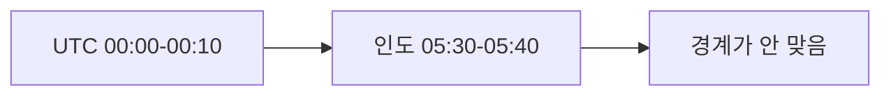
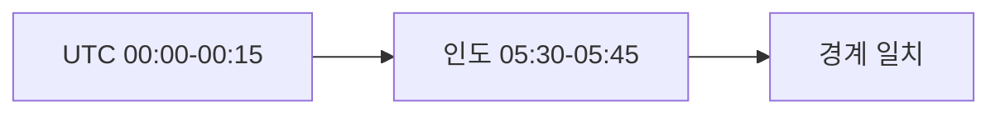
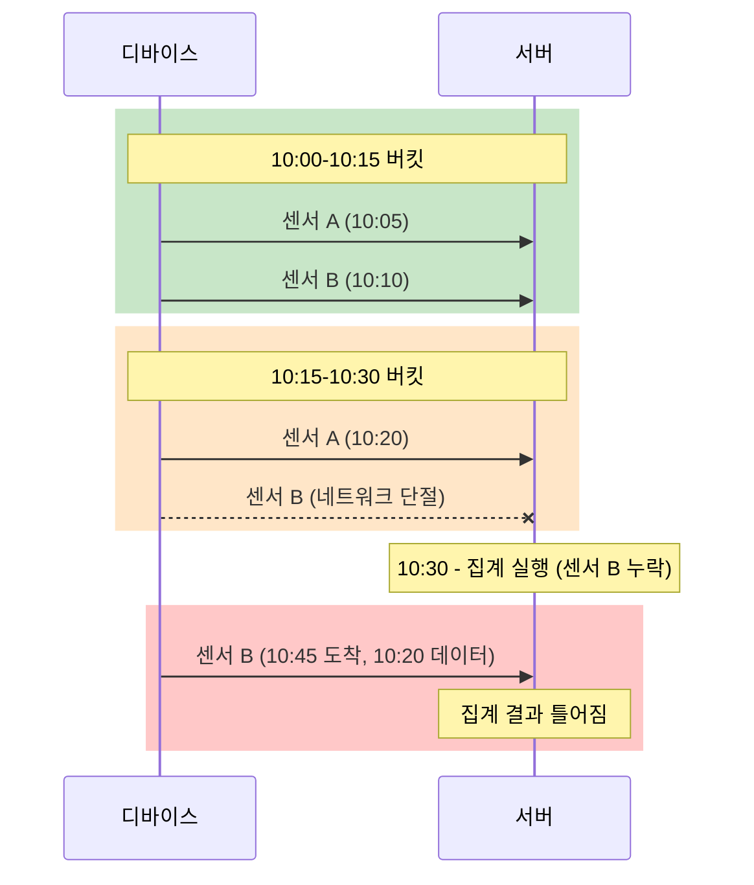
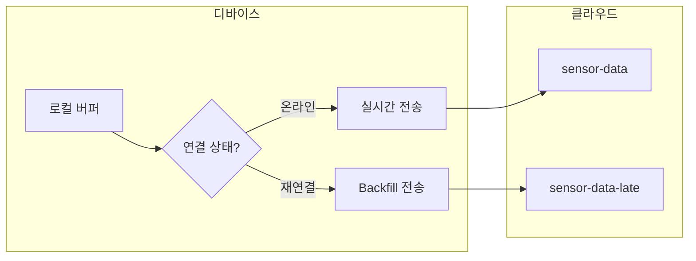
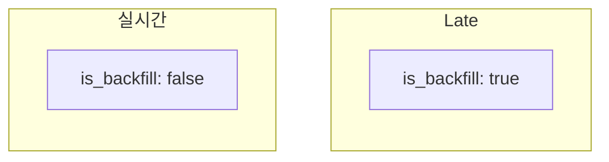
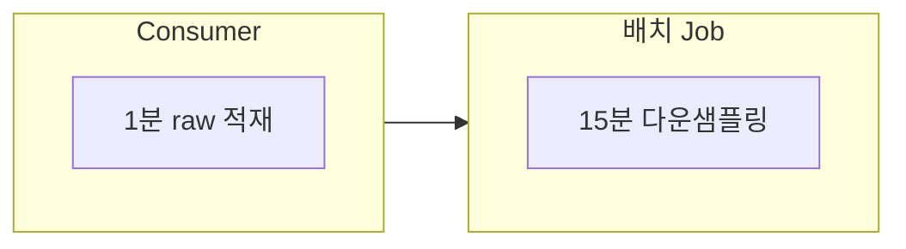
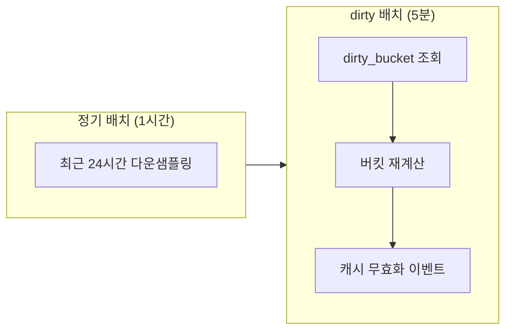
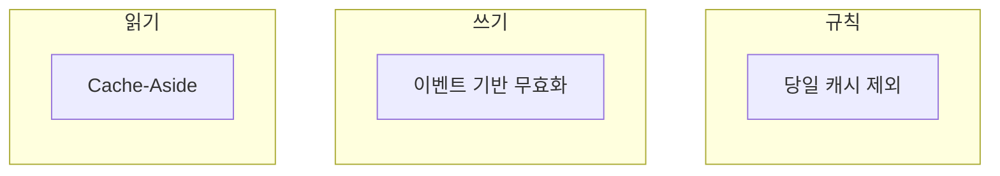
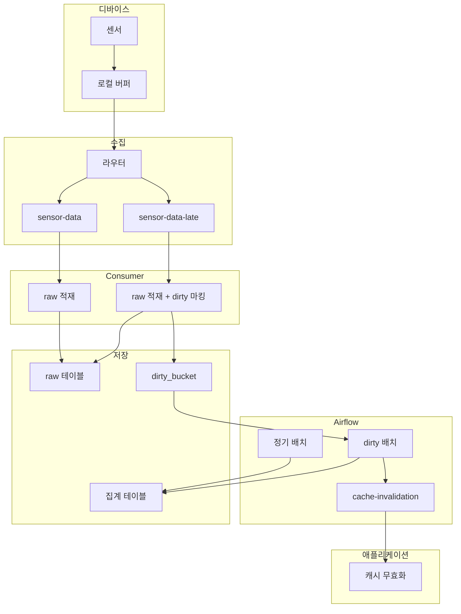

IoT 시계열 데이터를 다룰 때 두 가지 문제가 자주 발생한다.

1. **다운샘플링 단위 선택**: 왜 10분이 아닌 15분인가?
2. **단절 데이터 처리**: 늦게 도착한 데이터로 집계가 틀어지면 어떻게 하나?

실제 프로젝트에서 겪은 경험을 바탕으로 정리한다.

## 15분 다운샘플링의 이유

1분 단위로 수집한 IoT 데이터를 API로 제공할 때, 원본 그대로 내려주면 데이터량이 너무 많다. 다운샘플링이 필요하다.

처음에는 10분 단위를 고려했다. 하지만 타임존 문제가 있다.

### 모든 타임존은 15분의 배수

전 세계 타임존 오프셋을 보면 특이한 패턴이 있다.

| 타임존 | UTC 오프셋 |
|--------|-----------|
| UTC | +00:00 |
| KST (한국) | +09:00 |
| IST (인도) | +05:30 |
| NPT (네팔) | +05:45 |
| ACST (호주 중부) | +09:30 |
| CHAST (채텀 제도) | +12:45 |

네팔(+05:45)이나 채텀 제도(+12:45)처럼 45분 오프셋도 있다. 하지만 모든 타임존 오프셋은 15분의 배수다.

10분 단위로 다운샘플링하면 이런 문제가 생긴다.



UTC 기준 10분 버킷이 인도 시간(+05:30)으로 변환하면 깔끔하게 떨어지지 않는다. 30분 오프셋 때문에 버킷 경계가 어긋난다.

15분 단위면 모든 타임존에서 정시(00, 15, 30, 45분)에 맞춰진다.



> 글로벌 서비스라면 15분 단위가 타임존 친화적인 선택이다.

## 단절 데이터란?

IoT 디바이스는 네트워크 불안정, 배터리 부족 등으로 데이터 전송이 지연된다. 이렇게 늦게 도착하는 데이터를 단절 데이터(late-arriving data)라고 한다.



10:15-10:30 구간의 센서 B 데이터가 10:45에 도착하면, 이미 계산된 집계 결과가 틀어진다.

## 디바이스 메시지 설계

단절 데이터를 효율적으로 처리하려면 디바이스 측 메시지 설계가 중요하다.

### 권장 메시지 구조

```json
{
  "device_id": "sensor-001",
  "event_time": "2025-01-17T10:05:00Z",
  "sent_time": "2025-01-17T14:30:00Z",
  "sequence": 12345,
  "is_backfill": true,
  "value": 23.5
}
```

| 필드 | 용도 |
|------|------|
| `event_time` | 실제 측정 시간. 집계 버킷 결정에 사용 |
| `sent_time` | 전송 시간. 지연 시간 계산에 사용 |
| `sequence` | 중복 감지, 순서 검증 |
| `is_backfill` | 단절 후 재전송 플래그 |

### 디바이스 전송 전략



디바이스가 오프라인이었다가 재연결되면, 로컬 버퍼에 쌓인 데이터를 `is_backfill: true`로 표시해서 전송한다. 클라우드에서는 `sent_time - event_time`으로 지연 시간을 계산하고, 적절한 토픽으로 라우팅한다.

## 토픽 분리 전략

단절 데이터를 같은 토픽에서 처리하면 비효율적이다. 지연 정도에 따라 토픽을 분리한다.

### 2단계 처리 구조



| 단계 | 조건 | 토픽 | 처리 방식 |
|------|------|------|----------|
| 실시간 | `is_backfill: false` | sensor-data | 집계 upsert |
| Late | `is_backfill: true` | sensor-data-late | 버킷 재집계 |

Late 토픽에서는 1시간 전 데이터든 일주일 전 데이터든 동일하게 처리한다. 해당 버킷만 재집계하면 되므로 별도 DLQ가 필요 없다.

### 라우팅 로직

```java
void route(SensorData data) {
    String topic = data.isBackfill()
        ? "sensor-data-late"
        : "sensor-data";

    kafkaTemplate.send(topic, data);
}
```

디바이스가 `is_backfill` 플래그를 설정해서 보내므로, 클라우드에서는 지연 시간을 계산할 필요가 없다.

## Consumer와 배치 구조

Consumer는 1분 raw 데이터만 적재하고, 15분 다운샘플링은 배치로 처리한다.



### 실시간 Consumer

```java
@KafkaListener(topics = "sensor-data")
void consume(SensorData data) {
    rawDataRepository.save(data);
}
```

### Late Consumer + Dirty Bucket

단절 데이터가 도착하면 raw 적재 후, 해당 버킷을 dirty로 마킹한다.

```java
@KafkaListener(topics = "sensor-data-late")
void consumeLate(SensorData data) {
    // 1. raw 적재
    rawDataRepository.save(data);

    // 2. 해당 버킷을 dirty로 마킹
    LocalDateTime bucket = timeBucket15Min(data.getEventTime());
    dirtyBucketRepository.upsert(data.getDeviceId(), bucket);
}
```

`timeBucket15Min`은 타임스탬프를 15분 단위로 내림한다.

```
10:07 → 10:00
10:17 → 10:15
10:33 → 10:30
```

### Dirty Bucket 테이블

```sql
CREATE TABLE dirty_bucket (
    device_id VARCHAR(50),
    bucket TIMESTAMP,
    created_at TIMESTAMP DEFAULT NOW(),
    PRIMARY KEY (device_id, bucket)
);
```

4시간 오프라인 후 240개 단절 데이터가 와도, dirty_bucket에는 최대 16개 버킷만 기록된다 (중복 제거).

### 배치 Job (Airflow)

정기 배치와 dirty 배치를 분리한다.



| 배치 | 주기 | 역할 |
|------|------|------|
| 정기 배치 | 1시간 | 최근 24시간 raw 데이터를 15분 단위로 집계 |
| dirty 배치 | 5분 | dirty_bucket에 마킹된 버킷만 재계산 |

dirty 배치는 재계산 후 `cache-invalidation` 토픽으로 Kafka 이벤트를 발행한다. 애플리케이션에서 이 이벤트를 받아 해당 버킷의 캐시를 무효화한다.

일주일 전 단절 데이터가 와도 정확히 그 버킷만 재계산한다. 최근 24시간 재계산으로는 커버되지 않는 오래된 버킷을 dirty_bucket이 처리한다.

## 캐시 전략

다운샘플링된 데이터를 API로 제공할 때 캐시가 필요하다. 하지만 단절 데이터 때문에 캐시 무효화 전략이 중요하다.

### 하이브리드 캐시 전략



1. **Cache-Aside**: 캐시 미스 시 DB 조회 후 캐시 저장
2. **이벤트 기반 무효화**: Late Consumer에서 재집계 후 해당 버킷 캐시 삭제
3. **당일 데이터 캐시 제외**: 변동 가능성이 높은 당일 데이터는 캐시하지 않음

### 왜 당일 데이터를 캐시하지 않나?

단절 데이터는 대부분 당일 또는 최근 24시간 내에 도착한다. 과거 데이터는 거의 변하지 않는다.

```
요청: 2025-01-15 데이터
→ 캐시 사용 (변동 없음)

요청: 2025-01-17 (오늘) 데이터
→ DB 직접 조회 (변동 가능성)
```

## 전체 아키텍처



## 정리

| 항목 | 결정 | 이유 |
|------|------|------|
| 다운샘플링 단위 | 15분 | 모든 타임존이 15분의 배수 |
| 토픽 분리 | 2단계 | 실시간/Late로 단순하게 |
| 배치 | Airflow | 워크플로우 관리, 모니터링 |
| 재집계 범위 | dirty_bucket | 영향받는 버킷만 재계산 |
| 캐시 무효화 | Kafka 이벤트 | 느슨한 결합 |

IoT 시계열 데이터는 "정확한 실시간"보다 "적당히 빠른 최종 일관성"이 현실적인 목표다.

## 참고

- [Uber: Building Reliable Reprocessing and Dead Letter Queues with Kafka](https://www.uber.com/blog/reliable-reprocessing/)
- [Apache Flink: Timely Stream Processing](https://nightlies.apache.org/flink/flink-docs-master/docs/concepts/time/)
- [Immerok: Capturing Late Data in Flink](https://docs.immerok.cloud/docs/how-to-guides/development/capturing-late-data-and-send-to-separate-sink-with-apache-flink/)
