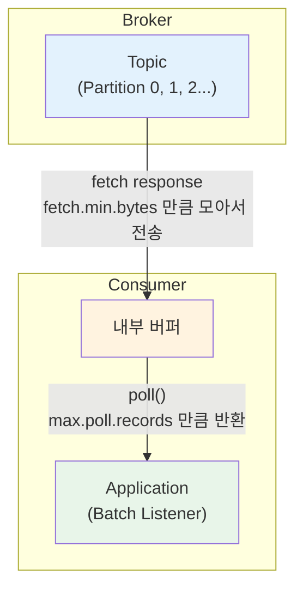

## 문제 상황

Telemetry 서비스는 1분마다 각 장비의 모니터링 메시지를 수신하여 파싱하고 저장하는 역할을 수행한다. 초기에는 메시지를 개별적으로 처리하고 데이터베이스에 건별로 삽입하는 방식을 사용했다.


이 접근법은 단순하고 직관적이지만, 데이터 양이 급격히 증가하면서 문제가 발생했다.

**개별 처리 방식의 한계**

1. **네트워크 오버헤드**: 각 메시지마다 DB 통신 발생
2. **트랜잭션 비용**: 메시지당 트랜잭션 시작/커밋
3. **Connection Pool 고갈**: 동시 처리 시 커넥션 부족
4. **처리량 한계**: 메시지 양 증가에 선형적으로 느려짐

---

## 개선 전략 개요

세 가지 전략을 조합하여 대용량 데이터 처리 아키텍처로 전환했다.

| 전략 | 목적 | 효과 |
|------|------|------|
| Kafka Batch Listener | 메시지 묶음 처리 | 네트워크 오버헤드 감소 |
| Bulk Insert | DB 쓰기 최적화 | 트랜잭션 비용 절감 |
| Concurrency + @Async | 병렬 처리 | 처리량 증가 |


---

## 전략 1: Kafka Batch Listener

### Batch Listener란?

일반적인 Kafka Listener가 메시지를 개별적으로 처리하는 것과 달리, Batch Listener는 여러 메시지를 한 번에 처리한다. [Spring Kafka 공식 문서](https://docs.spring.io/spring-kafka/reference/kafka/receiving-messages/message-listener-container.html)에 따르면, Batch 모드는 "배치 전체를 처리하는 경우"에 성능 향상을 제공한다.

> Batch mode will improve performance if you are processing the batch as a whole - e.g. a batch insert using JDBC in a single transaction.

### Container Factory 설정

```kotlin
@Bean
fun batchKafkaListenerContainerFactory(): ConcurrentKafkaListenerContainerFactory<String, String> {
    val factory = ConcurrentKafkaListenerContainerFactory<String, String>()
    factory.consumerFactory = batchConsumerFactory()
    factory.isBatchListener = true

    factory.containerProperties.apply {
        ackMode = ContainerProperties.AckMode.MANUAL_IMMEDIATE
        idleBetweenPolls = 60000  // poll 사이 대기 시간
    }

    return factory
}
```

**핵심 설정**

| 설정 | 역할 |
|------|------|
| `setBatchListener(true)` | 배치 모드 활성화 |
| `AckMode.MANUAL_IMMEDIATE` | 수동 커밋으로 정확한 오프셋 관리 |
| `idleBetweenPolls` | poll 사이 대기 시간으로 메시지 축적 |

### Consumer 설정

```kotlin
@Bean
fun batchConsumerFactory(): ConsumerFactory<String, String> {
    val props = mapOf(
        ConsumerConfig.BOOTSTRAP_SERVERS_CONFIG to bootstrapServers,
        ConsumerConfig.GROUP_ID_CONFIG to groupId,
        ConsumerConfig.AUTO_OFFSET_RESET_CONFIG to "earliest",

        // 배치 크기 제어
        ConsumerConfig.MAX_POLL_RECORDS_CONFIG to 500,
        ConsumerConfig.FETCH_MIN_BYTES_CONFIG to 500000,
        ConsumerConfig.FETCH_MAX_WAIT_MS_CONFIG to 3000,

        // 타임아웃 설정
        ConsumerConfig.MAX_POLL_INTERVAL_MS_CONFIG to 300000,
        ConsumerConfig.SESSION_TIMEOUT_MS_CONFIG to 15000,
        ConsumerConfig.HEARTBEAT_INTERVAL_MS_CONFIG to 5000,
    )
    return DefaultKafkaConsumerFactory(props)
}
```

**주요 Consumer Config 옵션**

| 옵션 | 기본값 | 튜닝값 | 설명 | 이유 |
|------|--------|--------|------|------|
| `auto.offset.reset` | latest | earliest | 오프셋 없을 때 시작 위치 | 메시지 유실 방지 |
| `enable.auto.commit` | true | false | 자동 오프셋 커밋 여부 | At-least-once 보장 |
| `max.poll.records` | 500 | 500 | poll()당 최대 레코드 수 | 기본값 적정 |
| `fetch.min.bytes` | 1 byte | 500KB | 브로커가 모아서 보낼 최소 데이터 | 네트워크 효율 향상 |
| `fetch.max.wait.ms` | 500ms | 3초 | fetch.min.bytes 대기 시간 | 배치 축적 대기 |
| `max.poll.interval.ms` | 5분 | 5분 | poll() 간 최대 허용 시간 | 기본값 적정 |
| `session.timeout.ms` | 45초 | 15초 | Consumer 생존 확인 주기 | 빠른 장애 감지 |

**auto.offset.reset 선택 기준**

| 값 | 동작 | 사용 시점 |
|-----|------|----------|
| `earliest` | 가장 오래된 메시지부터 | 메시지 유실 방지가 중요할 때 |
| `latest` | 새로운 메시지부터 | 실시간 처리, 과거 데이터 불필요할 때 |

**수동 커밋 vs 자동 커밋**

위 설정에서 `enable.auto.commit=false`로 수동 커밋을 사용했다.

| 방식 | 장점 | 단점 |
|------|------|------|
| 수동 커밋 | At-least-once 보장 | 오버헤드 |
| 자동 커밋 | 성능 우선, 간단 | 크래시 시 유실 가능 |

**DLQ가 있어도 자동 커밋은 크래시 시 유실 위험이 있다.** DLQ는 "처리 중 예외"를 잡는 것이지, "커밋 후 크래시"는 복구할 수 없다.

```
자동 커밋 + 크래시 시나리오:
1. poll()로 메시지 100개 가져옴
2. 50개 처리 중...
3. 자동 커밋 발동 → 오프셋 100까지 커밋
4. 앱 크래시!
5. 재시작 → 51~100번 메시지 유실 (DLQ로 안 감)
```

Telemetry 서비스는 **모든 데이터를 적재해야 하므로 유실이 허용되지 않는다**. 그래서 수동 커밋으로 At-least-once를 보장하고, 처리 실패 시 DLQ로 복구할 수 있게 했다.

### fetch와 poll의 동작 위치

설정을 이해하려면 **어디에서 동작하는지** 알아야 한다.



| 설정 | 동작 위치 | 역할 |
|------|----------|------|
| `fetch.min.bytes` | Broker → Consumer | 네트워크로 **보내기 전** 최소 데이터량 |
| `max.poll.records` | Consumer 내부 | 버퍼에서 **꺼낼 때** 최대 개수 |

**fetch.min.bytes를 높이면?**
- 브로커가 충분한 데이터를 모아서 한 번에 전송
- 네트워크 왕복 감소 → 처리량 증가
- 단, 데이터가 적을 때 지연 발생 (fetch.max.wait.ms까지 대기)

### Batch Listener 구현

```kotlin
@KafkaListener(
    topics = ["telemetry.1min.batch.v1"],
    containerFactory = "batchKafkaListenerContainerFactory"
)
fun consume(records: List<ConsumerRecord<String, String>>, ack: Acknowledgment) {
    try {
        val parsedData = records.map { parser.parse(it.value()) }
        repository.saveAll(parsedData)
        ack.acknowledge()
    } catch (e: Exception) {
        // 에러 처리
        throw e
    }
}
```

---

## 전략 2: Bulk Insert

### Spring JDBC의 batchUpdate

개별 INSERT 대신 Bulk Insert를 사용하면 DB 쓰기 성능이 크게 향상된다. [Spring 공식 문서](https://docs.spring.io/spring-framework/reference/data-access/jdbc/advanced.html)에서는 "대부분의 JDBC 드라이버는 동일한 prepared statement에 대한 배치 호출 시 성능이 향상된다"고 설명한다.

```kotlin
fun saveAll(bulkData: List<TelemetryData>): IntArray {
    val batch = SqlParameterSourceUtils.createBatch(bulkData.toTypedArray())
    return namedParameterJdbcTemplate.batchUpdate(SQL_INSERT, batch)
}
```

### 성능 최적화 포인트

**1. JDBC URL 설정**

PostgreSQL의 경우 `reWriteBatchedInserts=true` 옵션을 추가하면 배치 INSERT가 단일 multi-value statement로 변환된다.

```yaml
spring:
  datasource:
    url: jdbc:postgresql://localhost:5432/db?reWriteBatchedInserts=true
```

MySQL에서는 다음 옵션을 권장한다.

```yaml
spring:
  datasource:
    url: jdbc:mysql://localhost:3306/db?rewriteBatchedStatements=true&cachePrepStmts=true&useServerPrepStmts=true
```

**2. 적정 배치 크기**

배치 크기는 100~500개가 적절하다. 너무 작으면 오버헤드 감소 효과가 적고, 너무 크면 메모리 압박이 발생한다.

**3. 인덱스 영향**

대상 테이블의 인덱스가 많을수록 성능이 저하된다. 각 행 삽입 시 인덱스 조정이 필요하기 때문이다.

---

## 전략 3: Concurrency와 @Async

### 파티션 증가의 부작용

Kafka에서 처리량을 늘리는 일반적인 방법은 파티션 수를 늘리는 것이다. 하지만 이 접근법에는 부작용이 있다.

| 문제 | 설명 |
|------|------|
| 브로커 메모리 증가 | 각 파티션의 메타데이터를 메모리에 저장 |
| 리밸런싱 오버헤드 | 파티션이 많을수록 리더 선출/리밸런싱 빈번 |
| 복제 지연 | 복제할 데이터 양 증가 |
| 장애 복구 시간 증가 | 복구할 데이터 양 증가 |

### 애플리케이션 레벨 스케일링

파티션 수를 늘리는 대신, 애플리케이션 레벨에서 동시성을 확보한다.

**Concurrency 설정**

```kotlin
@Bean
fun batchKafkaListenerContainerFactory(): ConcurrentKafkaListenerContainerFactory<String, String> {
    val factory = ConcurrentKafkaListenerContainerFactory<String, String>()
    factory.setConcurrency(2)  // Consumer 스레드 수
    // ...
    return factory
}
```

**Async 설정**

```kotlin
@Configuration
@EnableAsync
class AsyncConfig {

    @Bean("batchExecutor")
    fun batchExecutor(): Executor {
        return ThreadPoolTaskExecutor().apply {
            corePoolSize = 3
            maxPoolSize = 8
            queueCapacity = 20
            keepAliveSeconds = 120
            setRejectedExecutionHandler(ThreadPoolExecutor.CallerRunsPolicy())
            setThreadNamePrefix("Async-Batch-")
            initialize()
        }
    }

    @Bean("parserExecutor")
    fun parserExecutor(): Executor {
        return ThreadPoolTaskExecutor().apply {
            corePoolSize = 3
            maxPoolSize = 8
            queueCapacity = 20
            keepAliveSeconds = 120
            setRejectedExecutionHandler(ThreadPoolExecutor.CallerRunsPolicy())
            setThreadNamePrefix("Async-Parser-")
            initialize()
        }
    }
}
```

**Async 적용**

```kotlin
@Async("batchExecutor")
@Transactional
fun saveAllAsync(bulkData: List<TelemetryData>) {
    repository.saveAll(bulkData)
}
```

> **CallerRunsPolicy**: 큐가 가득 찼을 때 호출자 스레드에서 직접 실행한다. 백프레셔 효과로 시스템 과부하를 방지한다.

---

## 결과

### 부하 테스트 환경

| 구성 요소 | 사양 |
|----------|------|
| Kafka Broker | kafka.m5.2xlarge, 2개 |
| K8S Deployment | 4 Pod (CPU 6 cores, Memory 6000Mi limit) |
| TimescaleDB | m5.4xlarge Access Node + 2 Data Node |

### 목표 달성

- **1분마다 50만 건** 메시지 처리 (하루 누적 7억 2천 건)
- 메시지 크기: 약 5KB

---

## 정리

대용량 Kafka 메시지 처리를 위한 세 가지 전략을 조합했다.

| 전략 | 적용 위치 | 효과 |
|------|----------|------|
| Batch Listener | Consumer | 네트워크 오버헤드 감소, 트랜잭션 단위 확대 |
| Bulk Insert | Repository | DB 쓰기 성능 향상 |
| Async + Concurrency | Service | 병렬 처리로 처리량 증가 |

**핵심 원칙**

1. **Batch Listener**는 개별 처리가 아닌 "배치 전체 처리"에서 효과가 있다
2. **Bulk Insert**는 JDBC 드라이버 설정(`reWriteBatchedInserts`)과 함께 사용해야 최대 효과
3. **파티션 증가** 대신 애플리케이션 레벨 동시성으로 Kafka 인프라 복잡도를 낮춘다

---

## 참고 자료

- [Spring Kafka - Message Listener Container](https://docs.spring.io/spring-kafka/reference/kafka/receiving-messages/message-listener-container.html)
- [Spring JDBC Batch Operations](https://docs.spring.io/spring-framework/reference/data-access/jdbc/advanced.html)
- [Baeldung - Spring JDBC Batch Inserts](https://www.baeldung.com/spring-jdbc-batch-inserts)
- [Baeldung - Consuming Messages in Batch in Kafka](https://www.baeldung.com/kafka-kafkalistener-annotation-handle-messages-batch)
