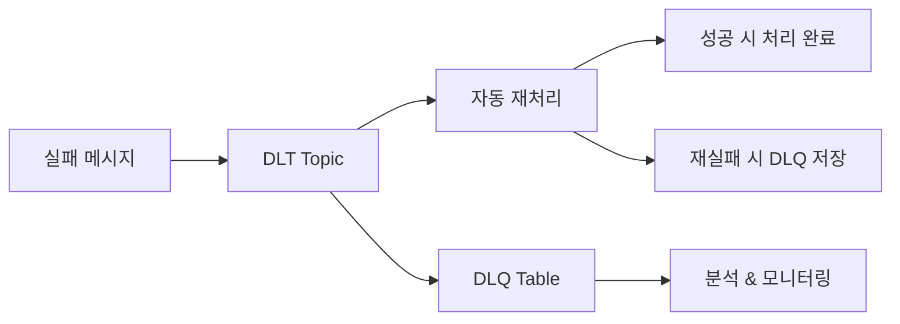

## Dead Letter Topic이란?

분산 시스템에서 메시지 처리 실패는 흔한 일이다. 일시적인 네트워크 지연, 외부 API 오류, 데이터 형식 불일치 등 다양한 이유로 실패가 발생한다. 이러한 실패를 효과적으로 관리하기 위해 Dead Letter Topic(DLT)과 재시도 전략이 필요하다.

DLT는 재시도에도 불구하고 처리에 실패한 메시지를 저장하는 Kafka 토픽이다. '마지막 피난처'로서 다음 역할을 수행한다.

- 처리 실패 메시지의 안전한 격리
- 실패 원인 분석 및 디버깅
- 메인 데이터 스트림의 방해 최소화

---

## @RetryableTopic으로 재시도 구현

Spring Kafka 2.7.0부터 `@RetryableTopic` 어노테이션으로 non-blocking 재시도를 선언적으로 구현할 수 있다. [Spring Kafka 공식 문서](https://docs.spring.io/spring-kafka/reference/retrytopic/dlt-strategies.html)에서 상세 설정을 확인할 수 있다.

### 기본 구현

```kotlin
@RetryableTopic(
    attempts = "5",
    backoff = Backoff(delay = 5000, multiplier = 2.0),
    dltStrategy = DltStrategy.FAIL_ON_ERROR,
    dltTopicSuffix = ".dlt",
    retryTopicSuffix = ".retry",
    exclude = [NonRetryableException::class]
)
@KafkaListener(
    topics = ["order.created"],
    groupId = "order-service",
    containerFactory = "kafkaListenerContainerFactory"
)
fun consume(record: ConsumerRecord<String, String>) {
    try {
        val order = objectMapper.readValue(record.value(), Order::class.java)
        orderService.process(order)
    } catch (e: RetryableException) {
        log.error("Retryable error: ${e.message}")
        throw e  // 재시도 대상
    } catch (e: NonRetryableException) {
        log.error("Non-retryable error: ${e.message}")
        throw e  // 즉시 DLT로 이동
    }
}
```

### 주요 설정 옵션

| 옵션 | 설명 |
|------|------|
| `attempts` | 최대 시도 횟수 (첫 시도 포함) |
| `backoff.delay` | 재시도 간 대기 시간 (ms) |
| `backoff.multiplier` | 대기 시간 증가율 |
| `dltStrategy` | DLT 처리 실패 시 동작 |
| `exclude` | 재시도하지 않을 예외 클래스 |

### 재시도 흐름

`attempts = 5`, `delay = 5000`, `multiplier = 2.0` 설정 시 흐름은 다음과 같다.

```
1차 시도 → 실패 → order.created.retry-0 (5초 후)
2차 시도 → 실패 → order.created.retry-1 (10초 후)
3차 시도 → 실패 → order.created.retry-2 (20초 후)
4차 시도 → 실패 → order.created.retry-3 (40초 후)
5차 시도 → 실패 → order.created.dlt
```

---

## DLT 처리 전략

### @DltHandler로 DLT 메시지 처리

```kotlin
@DltHandler
fun processDltMessage(
    record: ConsumerRecord<String, String>,
    @Header(KafkaHeaders.RECEIVED_TOPIC) topic: String,
    @Header(KafkaHeaders.RECEIVED_PARTITION) partition: Int,
    @Header(KafkaHeaders.OFFSET) offset: Long,
    @Header(KafkaHeaders.EXCEPTION_MESSAGE) errorMessage: String
) {
    log.error("""
        DLT 메시지 수신
        - Topic: $topic
        - Partition: $partition
        - Offset: $offset
        - Error: $errorMessage
        - Value: ${record.value()}
    """.trimIndent())

    // 알림 발송, DB 저장 등
    alertService.sendDltAlert(topic, errorMessage)
    dltRepository.save(DltRecord(topic, partition, offset, record.value(), errorMessage))
}
```

### DLT 처리 실패 전략

DLT 처리 자체가 실패할 경우 두 가지 옵션이 있다.

| 전략 | 동작 | 사용 시점 |
|------|------|----------|
| `ALWAYS_RETRY_ON_ERROR` | DLT로 다시 전송 (기본값) | 일시적 오류가 예상될 때 |
| `FAIL_ON_ERROR` | 처리 중단 | DLT 처리가 반드시 성공해야 할 때 |

```kotlin
@RetryableTopic(
    dltProcessingFailureStrategy = DltStrategy.FAIL_ON_ERROR
)
```

### DLT 없이 운영하기

특정 상황에서는 DLT 없이 재시도만 수행할 수 있다.

```kotlin
@RetryableTopic(
    dltProcessingFailureStrategy = DltStrategy.NO_DLT
)
```

---

## DLT + DLQ 이중 구조

실무에서는 **DLT(재처리용)**와 **DLQ(분석용)** 이중 구조가 효과적이다. 각각의 역할을 명확히 분리하여 운영한다.



### DLT: 임시 보관 및 재처리

Kafka Topic으로 단기간 메시지를 보관하고 자동 재처리한다.

```kotlin
@DltHandler
fun processDltMessage(
    record: ConsumerRecord<String, String>,
    @Header(KafkaHeaders.EXCEPTION_MESSAGE) errorMessage: String
) {
    // 1. DLQ에 영구 저장 (분석용)
    dlqService.save(record, errorMessage)
    
    // 2. 재처리 가능 여부 판단
    if (shouldRetry(errorMessage)) {
        // 3. 잠시 후 재시도 (DLT에서 자동 처리)
        log.info("메시지가 DLT에서 재처리됩니다: ${record.key()}")
        return
    }
    
    // 4. 재처리 불가능한 경우 알림
    alertService.sendAlert("재처리 불가능한 메시지", record.value())
}
```

### DLQ: PostgreSQL 영구 보관

분석과 모니터링을 위해 PostgreSQL에 영구 저장한다.

```sql
CREATE TABLE dead_letter_queue (
    id BIGSERIAL PRIMARY KEY,
    topic VARCHAR(255) NOT NULL,
    partition_id INTEGER,
    offset_value BIGINT,
    message_key VARCHAR(500),
    message_value TEXT NOT NULL,
    error_type VARCHAR(255),
    error_message TEXT,
    retry_count INTEGER DEFAULT 0,
    status VARCHAR(50) DEFAULT 'FAILED',  -- FAILED, REPROCESSING, RESOLVED
    created_at TIMESTAMP DEFAULT NOW(),
    resolved_at TIMESTAMP
);

CREATE INDEX idx_dlq_topic_status ON dead_letter_queue(topic, status);
CREATE INDEX idx_dlq_error_type ON dead_letter_queue(error_type);
CREATE INDEX idx_dlq_created_at ON dead_letter_queue(created_at);
```

### DLQ 서비스 구현

```kotlin
@Service
class DlqService(
    private val dlqRepository: DlqRepository
) {
    fun save(record: ConsumerRecord<String, String>, errorMessage: String) {
        val dlq = DlqEntity(
            topic = record.topic(),
            partitionId = record.partition(),
            offsetValue = record.offset(),
            messageKey = record.key(),
            messageValue = record.value(),
            errorType = extractErrorType(errorMessage),
            errorMessage = errorMessage
        )
        dlqRepository.save(dlq)
    }
    
    private fun extractErrorType(errorMessage: String): String {
        return when {
            errorMessage.contains("ValidationException") -> "VALIDATION_ERROR"
            errorMessage.contains("SerializationException") -> "SERIALIZATION_ERROR"
            errorMessage.contains("TimeoutException") -> "TIMEOUT_ERROR"
            else -> "UNKNOWN_ERROR"
        }
    }
}
```


---

## 예외 분류 전략

재시도할 예외와 즉시 DLT로 보낼 예외를 명확히 구분해야 한다.

### Retryable 예외

일시적이며 재시도로 해결될 가능성이 있는 예외다.

- 네트워크 타임아웃
- 외부 API 일시 장애
- 데이터베이스 연결 실패
- 리소스 부족 (Rate Limit)

### Non-Retryable 예외

재시도해도 해결되지 않는 예외다.

- 메시지 역직렬화 실패 (`DeserializationException`)
- 데이터 유효성 검증 실패
- 비즈니스 로직 오류
- 메시지 형식 불일치 (`MessageConversionException`)

```kotlin
@RetryableTopic(
    exclude = [
        DeserializationException::class,
        MessageConversionException::class,
        ValidationException::class,
        BusinessRuleViolationException::class
    ]
)
```

> Spring Kafka는 `DeserializationException`, `MessageConversionException`, `ConversionException`을 기본적으로 fatal 예외로 처리하여 `ALWAYS_RETRY_ON_ERROR`에서도 재시도하지 않는다.

---

## DLT 자동 시작 제어

DLT 핸들러를 수동으로 시작하도록 설정할 수 있다.

```kotlin
@RetryableTopic(
    autoStartDltHandler = false
)
```

이후 `KafkaListenerEndpointRegistry`로 필요할 때 시작한다.

```kotlin
@EventListener(ApplicationReadyEvent::class)
fun onApplicationReady() {
    if (shouldStartDltHandler()) {
        registry.getListenerContainer("order-dlt-handler")?.start()
    }
}
```

---

## 정리

Kafka 메시지 처리 실패 관리를 위한 실용적 전략을 정리한다.

| 구성 요소 | 역할 |
|----------|------|
| `@RetryableTopic` | 선언적 재시도 설정 |
| `@DltHandler` | DLT 메시지 처리 및 DLQ 저장 |
| `DLT (Topic)` | 임시 보관 및 자동 재처리 |
| `DLQ (PostgreSQL)` | 영구 저장 및 분석 |

**핵심 원칙**

1. **이중 구조**: DLT(재처리) + DLQ(분석) 역할 분리
2. **예외 분류**: Retryable vs Non-Retryable 명확히 구분
3. **간단한 저장**: PostgreSQL에 저장하여 SQL로 분석

---

## 참고 자료

- [Spring Kafka - DLT Strategies](https://docs.spring.io/spring-kafka/reference/retrytopic/dlt-strategies.html)
- [Baeldung - Dead Letter Queue for Kafka With Spring](https://www.baeldung.com/kafka-spring-dead-letter-queue)
- [Baeldung - Implementing Retry in Kafka Consumer](https://www.baeldung.com/spring-retry-kafka-consumer)
- [Spring Kafka Non-Blocking Retries and Dead Letter Topics](https://github.com/eugene-khyst/spring-kafka-non-blocking-retries-and-dlt)
