> **시리즈**: AI 자동화 블로그 만들기
> 1. **Hugo + GitHub Pages 구축** ← 현재 글
> 2. [Claude Code로 이슈 기반 자동 포스팅](/dev-notes/posts/2025-11-29-github-claude-automation/)

---

## 개요

개발하면서 배운 것들을 정리하고 싶은데, 매번 수동으로 블로그에 올리기가 번거로웠다. 이 시리즈에서는 마크다운 블로그 구축부터 AI 자동화까지 전체 파이프라인을 구축한다.

**이번 글의 목표**
- 마크다운 작성 → Git push → 자동 배포
- 미니멀한 디자인
- 검색 기능

## 기술 스택

| 도구 | 용도 |
|------|------|
| Hugo | 정적 사이트 생성기 (빠른 빌드) |
| PaperMod | 깔끔한 Hugo 테마 |
| GitHub Pages | 무료 호스팅 |
| GitHub Actions | 자동 빌드/배포 |

## 구축 과정

### 1. Hugo 설치

```bash
brew install hugo
hugo version  # v0.152.2 확인
```

### 2. 프로젝트 생성

```bash
hugo new site dev-notes --format toml
cd dev-notes
git init
git branch -m main
```

### 3. PaperMod 테마 설치

```bash
git submodule add --depth=1 https://github.com/adityatelange/hugo-PaperMod.git themes/PaperMod
```

### 4. 사이트 설정 (hugo.toml)

```toml
baseURL = 'https://USERNAME.github.io/dev-notes/'
languageCode = 'ko-kr'
title = 'Dev Notes'
theme = 'PaperMod'

# 빌드 설정
enableRobotsTXT = true
buildDrafts = false

# 페이지네이션
[pagination]
  pagerSize = 10

[params]
  env = "production"
  defaultTheme = "auto"  # 다크모드 자동 지원

  [params.homeInfoParams]
    Title = "Dev Notes"
    Content = "개발하면서 배운 것들을 기록합니다."

# 메뉴
[menu]
  [[menu.main]]
    name = "Posts"
    url = "/posts/"
    weight = 10
  [[menu.main]]
    name = "Tags"
    url = "/tags/"
    weight = 20
  [[menu.main]]
    name = "Search"
    url = "/search/"
    weight = 30

# 검색 기능
[outputs]
  home = ["HTML", "RSS", "JSON"]

# 코드 하이라이팅
[markup.highlight]
  codeFences = true
  style = "monokai"
```

### 5. GitHub Actions 워크플로우

`.github/workflows/deploy.yml` 파일을 만든다.

```yaml
name: Deploy Hugo site to GitHub Pages

on:
  push:
    branches: [main]
  workflow_dispatch:

permissions:
  contents: read
  pages: write
  id-token: write

jobs:
  build:
    runs-on: ubuntu-latest
    env:
      HUGO_VERSION: 0.152.2
    steps:
      - name: Install Hugo CLI
        run: |
          wget -O ${{ runner.temp }}/hugo.deb https://github.com/gohugoio/hugo/releases/download/v${HUGO_VERSION}/hugo_extended_${HUGO_VERSION}_linux-amd64.deb \
          && sudo dpkg -i ${{ runner.temp }}/hugo.deb

      - name: Checkout
        uses: actions/checkout@v4
        with:
          submodules: recursive

      - name: Setup Pages
        id: pages
        uses: actions/configure-pages@v5

      - name: Build with Hugo
        run: hugo --gc --minify --baseURL "${{ steps.pages.outputs.base_url }}/"

      - name: Upload artifact
        uses: actions/upload-pages-artifact@v3
        with:
          path: ./public

  deploy:
    environment:
      name: github-pages
      url: ${{ steps.deployment.outputs.page_url }}
    runs-on: ubuntu-latest
    needs: build
    steps:
      - name: Deploy to GitHub Pages
        uses: actions/deploy-pages@v4
```

### 6. GitHub 저장소 생성 및 배포

```bash
# GitHub CLI 로그인
gh auth login

# 저장소 생성 및 푸시
gh repo create dev-notes --public --source=. --push

# GitHub Pages 활성화
gh api repos/USERNAME/dev-notes/pages -X POST -f build_type=workflow
```

## 자동 포스팅 스크립트

새 포스트 생성을 쉽게 하려고 스크립트를 만들었다.

```bash
#!/bin/bash
# scripts/new-post.sh
TITLE="${1:-Untitled}"
TAGS="${2:-일반}"
DATE=$(date +%Y-%m-%d)
FILENAME=$(echo "$TITLE" | tr '[:upper:]' '[:lower:]' | sed 's/[^a-z0-9 ]//g' | tr ' ' '-')

cat > "content/posts/${DATE}-${FILENAME}.md" << EOF
---
title: "$TITLE"
date: $DATE
draft: false
tags: ["${TAGS//,/\", \"}"]
---

내용을 작성하세요.
EOF
```

### 사용법

```bash
# 새 포스트 생성
./scripts/new-post.sh "오늘 배운 것" "TIL,Python"

# 파이프로 내용 전달 후 자동 배포
echo "내용..." | AUTO_PUSH=true ./scripts/auto-post.sh "제목" "태그"

# 로컬 미리보기
hugo server -D
```

## 트러블슈팅

### PaperMod 테마 버전 호환성

최신 PaperMod는 Hugo v0.146.0 이상이 필요하다. GitHub Actions 워크플로우에서 버전을 맞춰야 한다.

```yaml
env:
  HUGO_VERSION: 0.152.2  # 최신 버전 사용
```

### GitHub Actions workflow 권한

처음 푸시할 때 workflow 파일 권한 오류가 발생할 수 있다. 이렇게 해결한다.

```bash
# workflow 권한 추가
gh auth refresh -h github.com -s workflow
gh auth setup-git
```

## Mermaid 다이어그램 지원

플로우차트나 시퀀스 다이어그램을 마크다운에서 바로 작성할 수 있도록 Mermaid를 설정했다.

### 렌더 훅 생성

`layouts/_default/_markup/render-codeblock-mermaid.html` 파일을 만든다.

```html
<pre class="mermaid">
{{- .Inner | safeHTML }}
</pre>
```

마크다운의 ` ```mermaid ` 코드블록을 `<pre class="mermaid">` 태그로 변환한다.

### Mermaid 스크립트 로드

`layouts/partials/extend_footer.html` 파일을 만든다.

```html
<script type="module">
  import mermaid from 'https://cdn.jsdelivr.net/npm/mermaid@11/dist/mermaid.esm.min.mjs';

  const isDark = document.body.classList.contains('dark') ||
                 document.documentElement.getAttribute('data-theme') === 'dark';

  mermaid.initialize({
    startOnLoad: true,
    theme: isDark ? 'dark' : 'default',
    securityLevel: 'loose'
  });

  mermaid.run();
</script>
```

PaperMod 테마의 `extend_footer.html` 파셜을 오버라이드해서 Mermaid ESM 모듈을 로드한다. 다크모드에 맞게 다이어그램 색상이 자동 전환된다.

### 사용 예시

````markdown

```mermaid
flowchart LR
    A[마크다운 작성] --> B[Git Push] --> C[자동 배포]
```

````

이렇게 렌더링된다.


---

## 결과

- **사이트 URL**: https://gyeom.github.io/dev-notes/
- **자동 배포**: main 브랜치에 push하면 1분 내 배포 완료
- **다크모드**: 시스템 설정에 따라 자동 전환
- **검색**: 전체 포스트 검색 지원
- **다이어그램**: Mermaid로 플로우차트 지원

이제 마크다운 파일만 작성하고 push하면 자동으로 블로그가 업데이트된다.

---

## 다음 단계

블로그 구축이 완료됐다. 다음 글에서는 GitHub 이슈에서 `@claude`를 멘션하면 Claude가 포스트를 작성하고 PR까지 자동 생성하는 워크플로우를 구축한다.

👉 [AI 자동화 블로그 만들기 (2) - Claude Code로 이슈 기반 자동 포스팅](/dev-notes/posts/2025-11-29-github-claude-automation/)
