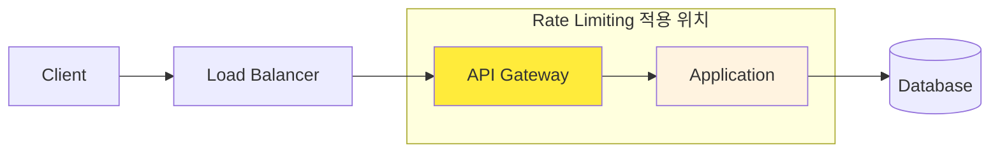
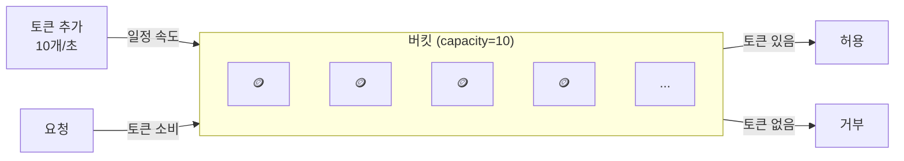
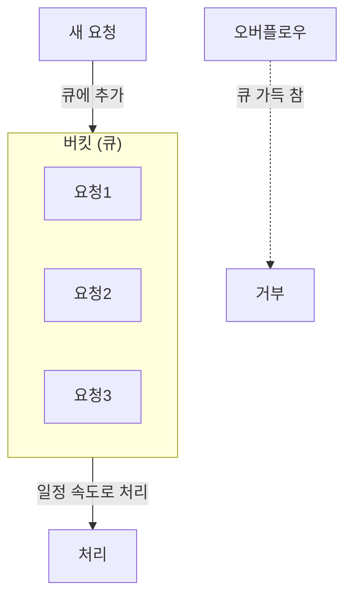
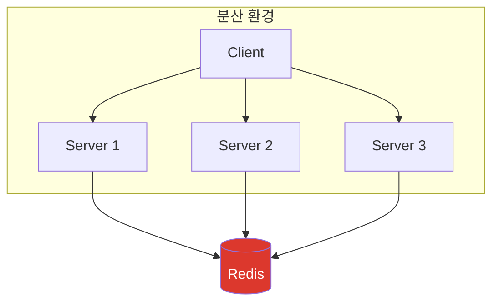
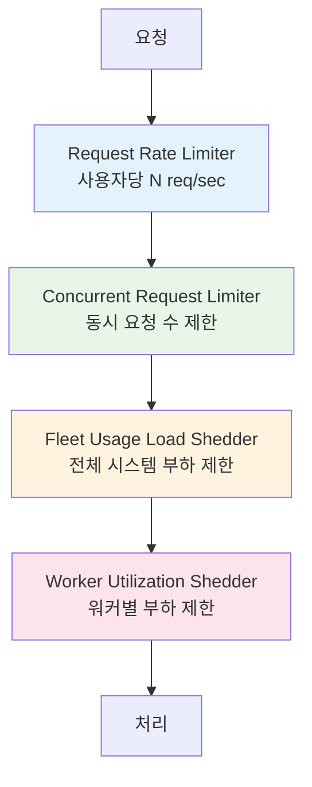

트래픽이 급증하면 서버는 어떻게 될까? 정상 사용자의 요청도 처리하지 못하고, 최악의 경우 서비스 전체가 다운된다. Rate Limiting은 이런 상황을 방지하는 첫 번째 방어선이다.

## Rate Limiting이란?

Rate Limiting은 **일정 시간 동안 허용되는 요청 수를 제한**하는 기술이다.

```
사용자 A: 1초에 1000번 요청 → 100번만 허용, 900번 거부 (429 Too Many Requests)
```

### 왜 필요한가?

| 목적 | 설명 |
|------|------|
| **서비스 보호** | 단일 사용자가 리소스를 독점하는 것을 방지 |
| **DDoS 방어** | 악의적인 대량 요청 차단 |
| **비용 관리** | 클라우드 환경에서 과도한 리소스 사용 방지 |
| **공정성** | 모든 사용자에게 균등한 서비스 제공 |
| **과금 모델** | API 티어별 차등 제한 (Free: 100/분, Pro: 1000/분) |

### 어디에 적용하는가?



- **API Gateway**: 전역 Rate Limiting (Kong, Nginx, AWS API Gateway)
- **Application**: 세밀한 비즈니스 로직별 제한 (Bucket4j, Resilience4j)
- **Database**: Connection Pool 제한

## 핵심 알고리즘

Rate Limiting 알고리즘은 크게 5가지가 있다. 각각의 특성을 이해하고 상황에 맞게 선택해야 한다.

### 1. Token Bucket

가장 널리 사용되는 알고리즘이다. [Stripe](https://stripe.com/blog/rate-limiters), [AWS](https://docs.aws.amazon.com/), [Kong](https://docs.konghq.com/hub/kong-inc/rate-limiting/) 등이 사용한다.



**동작 원리**
1. 버킷에 일정 속도로 토큰이 추가된다 (예: 초당 10개)
2. 요청이 오면 토큰을 1개 소비한다
3. 토큰이 없으면 요청을 거부한다
4. 버킷 용량을 초과하면 토큰이 버려진다 (burst 제한)

```kotlin
class TokenBucket(
    private val capacity: Long,      // 버킷 최대 용량
    private val refillRate: Long,    // 초당 토큰 추가량
) {
    private var tokens: Double = capacity.toDouble()
    private var lastRefillTime: Long = System.nanoTime()

    @Synchronized
    fun tryConsume(): Boolean {
        refill()
        return if (tokens >= 1) {
            tokens -= 1
            true
        } else {
            false
        }
    }

    private fun refill() {
        val now = System.nanoTime()
        val elapsed = (now - lastRefillTime) / 1_000_000_000.0
        tokens = minOf(capacity.toDouble(), tokens + elapsed * refillRate)
        lastRefillTime = now
    }
}
```

**특징**
- 장점: Burst 트래픽 허용 (버킷 용량만큼)
- 장점: 메모리 효율적 (토큰 수, 마지막 리필 시간만 저장)
- 단점: 분산 환경에서 동기화 필요

### 2. Leaky Bucket

요청을 **일정한 속도로** 처리한다. 버킷에 물이 차면 넘치듯이, 큐가 가득 차면 요청을 버린다.



**Token Bucket vs Leaky Bucket**

| 특성 | Token Bucket | Leaky Bucket |
|------|--------------|--------------|
| Burst 허용 | O (버킷 용량만큼) | X (일정 속도 유지) |
| 출력 속도 | 가변적 | 일정함 |
| 사용 사례 | API Rate Limiting | 트래픽 셰이핑 |

### 3. Fixed Window Counter

가장 단순한 알고리즘이다. 시간을 고정 윈도우로 나누고 각 윈도우의 요청 수를 카운트한다.

```
시간: |----1분----|----1분----|----1분----|
요청:     95          100         80
제한:    100         100         100
```

```kotlin
class FixedWindowCounter(
    private val limit: Int,
    private val windowSizeMs: Long
) {
    private var windowStart: Long = System.currentTimeMillis()
    private var count: Int = 0

    @Synchronized
    fun tryAcquire(): Boolean {
        val now = System.currentTimeMillis()

        // 새 윈도우 시작
        if (now - windowStart >= windowSizeMs) {
            windowStart = now
            count = 0
        }

        return if (count < limit) {
            count++
            true
        } else {
            false
        }
    }
}
```

**문제: 경계 버스트**

```
        윈도우 1          윈도우 2
    |---------|---------|
              ↑
         경계 시점

윈도우 1 마지막 1초: 100 요청
윈도우 2 처음 1초: 100 요청
→ 2초 동안 200 요청 허용 (제한의 2배!)
```

### 4. Sliding Window Log

모든 요청의 타임스탬프를 저장하고, 현재 시점 기준으로 윈도우 내 요청 수를 계산한다.

```kotlin
class SlidingWindowLog(
    private val limit: Int,
    private val windowSizeMs: Long
) {
    private val timestamps = mutableListOf<Long>()

    @Synchronized
    fun tryAcquire(): Boolean {
        val now = System.currentTimeMillis()
        val windowStart = now - windowSizeMs

        // 윈도우 밖의 오래된 타임스탬프 제거
        timestamps.removeAll { it < windowStart }

        return if (timestamps.size < limit) {
            timestamps.add(now)
            true
        } else {
            false
        }
    }
}
```

**특징**
- 장점: 정확한 Rate Limiting (경계 버스트 문제 없음)
- 단점: 메모리 사용량 높음 (모든 타임스탬프 저장)

### 5. Sliding Window Counter

Fixed Window와 Sliding Window Log의 하이브리드. 이전 윈도우의 가중치를 반영한다.

```
현재 시점: 윈도우 2의 30% 지점
이전 윈도우: 80 요청
현재 윈도우: 20 요청

가중 카운트 = 80 * 0.7 + 20 * 1.0 = 76
```

```kotlin
class SlidingWindowCounter(
    private val limit: Int,
    private val windowSizeMs: Long
) {
    private var prevWindowCount: Int = 0
    private var currWindowCount: Int = 0
    private var currWindowStart: Long = System.currentTimeMillis()

    @Synchronized
    fun tryAcquire(): Boolean {
        val now = System.currentTimeMillis()
        val elapsed = now - currWindowStart

        // 새 윈도우로 전환
        if (elapsed >= windowSizeMs) {
            prevWindowCount = currWindowCount
            currWindowCount = 0
            currWindowStart = now - (elapsed % windowSizeMs)
        }

        // 가중치 계산 (이전 윈도우의 남은 비율)
        val prevWeight = 1.0 - (elapsed.toDouble() / windowSizeMs)
        val weightedCount = prevWindowCount * prevWeight + currWindowCount

        return if (weightedCount < limit) {
            currWindowCount++
            true
        } else {
            false
        }
    }
}
```

### 알고리즘 비교 정리

| 알고리즘 | 메모리 | 정확도 | Burst 허용 | 구현 복잡도 |
|----------|--------|--------|------------|-------------|
| Token Bucket | O(1) | 높음 | O | 중간 |
| Leaky Bucket | O(N) | 높음 | X | 중간 |
| Fixed Window | O(1) | 낮음 | 경계에서 2배 | 쉬움 |
| Sliding Window Log | O(N) | 매우 높음 | X | 중간 |
| Sliding Window Counter | O(1) | 높음 | 일부 | 중간 |

**선택 가이드**
- Burst 트래픽 허용 필요 → **Token Bucket**
- 일정한 처리 속도 필요 → **Leaky Bucket**
- 단순한 구현 필요 → **Fixed Window** (정확도 낮음 감안)
- 높은 정확도 + 메모리 효율 → **Sliding Window Counter**

## 분산 환경 구현: Redis + Lua

단일 서버에서는 인메모리로 충분하지만, 분산 환경에서는 **중앙화된 저장소**가 필요하다.



### 왜 Redis + Lua인가?

**문제: Race Condition**

```kotlin
// 이 코드는 분산 환경에서 안전하지 않다
fun checkRateLimit(key: String, limit: Int): Boolean {
    val current = redis.get(key)?.toInt() ?: 0  // 읽기
    if (current < limit) {
        redis.incr(key)  // 쓰기
        return true
    }
    return false
}
```

두 서버가 동시에 `get`하면 둘 다 `current < limit`으로 판단하고, 둘 다 증가시킨다.

**해결: Lua Script의 원자성**

Redis의 Lua 스크립트는 **단일 명령처럼 원자적으로 실행**된다.

```lua
-- sliding_window_rate_limit.lua
local key = KEYS[1]
local limit = tonumber(ARGV[1])
local window_size = tonumber(ARGV[2])
local now = tonumber(ARGV[3])

-- 윈도우 시작 시점
local window_start = now - window_size

-- 오래된 요청 제거
redis.call('ZREMRANGEBYSCORE', key, '-inf', window_start)

-- 현재 윈도우 내 요청 수
local current = redis.call('ZCARD', key)

if current < limit then
    -- 새 요청 추가 (score = timestamp, member = unique id)
    redis.call('ZADD', key, now, now .. '-' .. math.random())
    -- TTL 설정 (윈도우 크기 + 여유)
    redis.call('EXPIRE', key, math.ceil(window_size / 1000) + 1)
    return 1  -- 허용
else
    return 0  -- 거부
end
```

### Token Bucket - Redis Lua 구현

```lua
-- token_bucket.lua
local key = KEYS[1]
local capacity = tonumber(ARGV[1])     -- 버킷 용량
local refill_rate = tonumber(ARGV[2])  -- 초당 토큰
local now = tonumber(ARGV[3])          -- 현재 시간 (초)
local requested = tonumber(ARGV[4])    -- 요청 토큰 수

-- 현재 상태 조회
local bucket = redis.call('HMGET', key, 'tokens', 'last_refill')
local tokens = tonumber(bucket[1]) or capacity
local last_refill = tonumber(bucket[2]) or now

-- 토큰 리필
local elapsed = now - last_refill
local refill = elapsed * refill_rate
tokens = math.min(capacity, tokens + refill)

-- 토큰 소비 시도
if tokens >= requested then
    tokens = tokens - requested
    redis.call('HMSET', key, 'tokens', tokens, 'last_refill', now)
    redis.call('EXPIRE', key, math.ceil(capacity / refill_rate) * 2)
    return 1  -- 허용
else
    redis.call('HMSET', key, 'tokens', tokens, 'last_refill', now)
    return 0  -- 거부
end
```

### Kotlin에서 Redis Lua 호출

```kotlin
@Component
class RedisRateLimiter(
    private val redisTemplate: StringRedisTemplate
) {
    private val tokenBucketScript = DefaultRedisScript<Long>().apply {
        setScriptText(loadScript("token_bucket.lua"))
        resultType = Long::class.java
    }

    fun isAllowed(
        key: String,
        capacity: Long,
        refillRate: Long
    ): Boolean {
        val now = System.currentTimeMillis() / 1000.0
        val result = redisTemplate.execute(
            tokenBucketScript,
            listOf("rate_limit:$key"),
            capacity.toString(),
            refillRate.toString(),
            now.toString(),
            "1"
        )
        return result == 1L
    }

    private fun loadScript(name: String): String {
        return javaClass.classLoader
            .getResourceAsStream("lua/$name")!!
            .bufferedReader()
            .readText()
    }
}
```

## Spring Boot 구현

### 방법 1: Bucket4j

[Bucket4j](https://github.com/bucket4j/bucket4j)는 Token Bucket 알고리즘의 Java 구현체다. Redis, Hazelcast 등 분산 캐시를 지원한다.

**의존성**

```kotlin
// build.gradle.kts
implementation("com.bucket4j:bucket4j-core:8.7.0")
implementation("com.bucket4j:bucket4j-redis:8.7.0")
```

**설정**

```kotlin
@Configuration
class RateLimitConfig(
    private val redissonClient: RedissonClient
) {
    @Bean
    fun proxyManager(): ProxyManager<String> {
        return RedissonBasedProxyManager.builderFor(redissonClient)
            .build()
    }
}
```

**인터셉터**

```kotlin
@Component
class RateLimitInterceptor(
    private val proxyManager: ProxyManager<String>
) : HandlerInterceptor {

    override fun preHandle(
        request: HttpServletRequest,
        response: HttpServletResponse,
        handler: Any
    ): Boolean {
        val clientId = extractClientId(request)
        val bucket = resolveBucket(clientId)

        val probe = bucket.tryConsumeAndReturnRemaining(1)

        if (probe.isConsumed) {
            response.addHeader("X-RateLimit-Remaining", probe.remainingTokens.toString())
            return true
        }

        response.status = 429
        response.addHeader("Retry-After",
            (probe.nanosToWaitForRefill / 1_000_000_000).toString())
        response.writer.write("""{"error": "Too Many Requests"}""")
        return false
    }

    private fun resolveBucket(clientId: String): Bucket {
        return proxyManager.builder()
            .build(clientId) {
                Bandwidth.builder()
                    .capacity(100)                    // 버킷 용량
                    .refillGreedy(100, Duration.ofMinutes(1))  // 분당 100개 리필
                    .build()
            }
    }

    private fun extractClientId(request: HttpServletRequest): String {
        // API Key, User ID, 또는 IP 기반
        return request.getHeader("X-API-Key")
            ?: request.getHeader("Authorization")?.substringAfter("Bearer ")
            ?: request.remoteAddr
    }
}
```

### 방법 2: Resilience4j

[Resilience4j](https://resilience4j.readme.io/docs/ratelimiter)는 Circuit Breaker, Rate Limiter, Bulkhead 등 회복탄력성 패턴을 제공한다.

**의존성**

```kotlin
implementation("io.github.resilience4j:resilience4j-spring-boot3:2.1.0")
implementation("org.springframework.boot:spring-boot-starter-aop")
```

**설정**

```yaml
# application.yml
resilience4j:
  ratelimiter:
    instances:
      default:
        limit-for-period: 100        # 주기당 허용 요청
        limit-refresh-period: 1m     # 리프레시 주기
        timeout-duration: 0s         # 대기 시간 (0 = 즉시 실패)
      premium:
        limit-for-period: 1000
        limit-refresh-period: 1m
        timeout-duration: 500ms
```

**사용**

```kotlin
@RestController
class ApiController {

    @GetMapping("/api/data")
    @RateLimiter(name = "default", fallbackMethod = "fallback")
    fun getData(): ResponseEntity<String> {
        return ResponseEntity.ok("Success")
    }

    fun fallback(e: RequestNotPermitted): ResponseEntity<String> {
        return ResponseEntity.status(429)
            .header("Retry-After", "60")
            .body("""{"error": "Rate limit exceeded"}""")
    }
}
```

### 방법 비교

| 기준 | Bucket4j | Resilience4j |
|------|----------|--------------|
| 알고리즘 | Token Bucket | Sliding Window |
| 분산 지원 | Redis, Hazelcast 등 | 기본 인메모리 |
| Burst 허용 | O | X |
| 기타 기능 | Rate Limiting 전용 | Circuit Breaker, Retry 등 통합 |
| 사용 시점 | API Rate Limiting | 회복탄력성 전반 |

## HTTP 응답 설계

클라이언트가 Rate Limit 상태를 알 수 있도록 표준 헤더를 사용한다.

### 표준 헤더

```http
HTTP/1.1 200 OK
X-RateLimit-Limit: 100
X-RateLimit-Remaining: 95
X-RateLimit-Reset: 1701388800
```

```http
HTTP/1.1 429 Too Many Requests
Retry-After: 60
X-RateLimit-Limit: 100
X-RateLimit-Remaining: 0
X-RateLimit-Reset: 1701388800
Content-Type: application/json

{
  "error": "Too Many Requests",
  "message": "Rate limit exceeded. Please retry after 60 seconds."
}
```

| 헤더 | 설명 |
|------|------|
| `X-RateLimit-Limit` | 윈도우당 최대 요청 수 |
| `X-RateLimit-Remaining` | 남은 요청 수 |
| `X-RateLimit-Reset` | 리셋 시점 (Unix timestamp) |
| `Retry-After` | 재시도까지 대기 시간 (초) |

### 구현 예시

```kotlin
@Component
class RateLimitResponseHandler {

    fun addHeaders(response: HttpServletResponse, probe: ConsumptionProbe) {
        response.addHeader("X-RateLimit-Limit", "100")
        response.addHeader("X-RateLimit-Remaining",
            probe.remainingTokens.toString())
        response.addHeader("X-RateLimit-Reset",
            (System.currentTimeMillis() / 1000 + 60).toString())
    }

    fun handleExceeded(response: HttpServletResponse, waitTimeNanos: Long) {
        val retryAfterSeconds = (waitTimeNanos / 1_000_000_000) + 1
        response.status = 429
        response.contentType = "application/json"
        response.addHeader("Retry-After", retryAfterSeconds.toString())
        response.writer.write("""
            {
                "error": "Too Many Requests",
                "retryAfter": $retryAfterSeconds
            }
        """.trimIndent())
    }
}
```

## 실제 사례

### Stripe의 4계층 Rate Limiting

[Stripe](https://stripe.com/blog/rate-limiters)는 4가지 Rate Limiter를 조합해서 사용한다.



1. **Request Rate Limiter**: 사용자당 초당 요청 수 제한 (Token Bucket)
2. **Concurrent Request Limiter**: 동시 진행 중인 요청 수 제한
3. **Fleet Usage Load Shedder**: 전체 시스템 부하가 높으면 저우선순위 트래픽 차단
4. **Worker Utilization Shedder**: 개별 워커 과부하 방지

### GitHub의 분산 Rate Limiter

[GitHub](https://github.blog/2021-04-05-how-we-scaled-github-api-sharded-replicated-rate-limiter-redis/)는 Redis를 사용한 분산 Rate Limiter를 구현했다.

- **Lua Script**: 원자적 연산 보장
- **Sharding**: 단일 Redis 병목 방지
- **Replication**: 고가용성 확보
- **인증 사용자**: 시간당 5,000 요청
- **비인증 사용자**: 시간당 60 요청 (IP 기반)

## 운영 고려사항

### 1. 계층별 Rate Limiting

```yaml
rate_limits:
  global:
    limit: 10000
    window: 1s
  per_user:
    free:
      limit: 100
      window: 1m
    pro:
      limit: 1000
      window: 1m
  per_endpoint:
    /api/search:
      limit: 10
      window: 1m
    /api/export:
      limit: 5
      window: 1h
```

### 2. Graceful Degradation

```kotlin
fun handleRateLimit(e: RateLimitExceededException): Response {
    return when {
        // 임계점 근처: 경고만
        e.remainingPercent > 10 -> Response.ok().header("X-RateLimit-Warning", "true")

        // 초과: 캐시된 응답 반환
        cachedResponse != null -> cachedResponse

        // 완전 초과: 429 반환
        else -> Response.status(429).build()
    }
}
```

### 3. 모니터링

```kotlin
@Component
class RateLimitMetrics(
    private val meterRegistry: MeterRegistry
) {
    private val allowedCounter = meterRegistry.counter("rate_limit.allowed")
    private val deniedCounter = meterRegistry.counter("rate_limit.denied")
    private val latencyTimer = meterRegistry.timer("rate_limit.latency")

    fun recordAllowed() = allowedCounter.increment()
    fun recordDenied() = deniedCounter.increment()
    fun recordLatency(duration: Duration) = latencyTimer.record(duration)
}
```

### 4. Redis 장애 대응

```kotlin
fun isAllowedWithFallback(key: String): Boolean {
    return try {
        redisRateLimiter.isAllowed(key)
    } catch (e: RedisConnectionException) {
        // Redis 장애 시 로컬 인메모리로 폴백
        logger.warn("Redis unavailable, falling back to local rate limiter")
        localRateLimiter.isAllowed(key)
    }
}
```

## 정리

Rate Limiting은 API를 보호하는 필수 기술이다.

### 알고리즘 선택

| 상황 | 추천 알고리즘 |
|------|--------------|
| Burst 허용 필요 | Token Bucket |
| 정확한 제한 필요 | Sliding Window Counter |
| 단순 구현 | Fixed Window (정확도 희생) |

### 구현 방식

| 환경 | 추천 방식 |
|------|----------|
| 단일 서버 | 인메모리 (Bucket4j, Guava) |
| 분산 서버 | Redis + Lua Script |
| API Gateway | Kong, Nginx, AWS API Gateway |

### 핵심 포인트

1. **원자성**: 분산 환경에서는 Redis Lua Script로 Race Condition 방지
2. **계층화**: 전역 → 사용자별 → 엔드포인트별 다단계 제한
3. **클라이언트 안내**: 표준 HTTP 헤더로 Rate Limit 상태 전달
4. **Fallback**: Redis 장애 시 로컬 Rate Limiter로 폴백

## 참고 자료

- [Stripe - Scaling your API with rate limiters](https://stripe.com/blog/rate-limiters)
- [GitHub - How we scaled the GitHub API with a sharded, replicated rate limiter in Redis](https://github.blog/2021-04-05-how-we-scaled-github-api-sharded-replicated-rate-limiter-redis/)
- [Kong - Rate Limiting Plugin](https://docs.konghq.com/hub/kong-inc/rate-limiting/)
- [Resilience4j - RateLimiter](https://resilience4j.readme.io/docs/ratelimiter)
- [Baeldung - Rate Limiting a Spring API Using Bucket4j](https://www.baeldung.com/spring-bucket4j)
- [Redis - How to build a Rate Limiter](https://redis.io/learn/howtos/ratelimiting)
- [FreeCodeCamp - How to Build a Distributed Rate Limiting System Using Redis and Lua Scripts](https://www.freecodecamp.org/news/build-rate-limiting-system-using-redis-and-lua/)
- [IETF - RateLimit Header Fields for HTTP (Draft)](https://www.ietf.org/archive/id/draft-polli-ratelimit-headers-02.html)
- [MDN - 429 Too Many Requests](https://developer.mozilla.org/en-US/docs/Web/HTTP/Reference/Status/429)
- [GeeksforGeeks - Rate Limiting Algorithms](https://www.geeksforgeeks.org/system-design/rate-limiting-algorithms-system-design/)
- [AlgoMaster - Rate Limiting Algorithms Explained with Code](https://blog.algomaster.io/p/rate-limiting-algorithms-explained-with-code)
