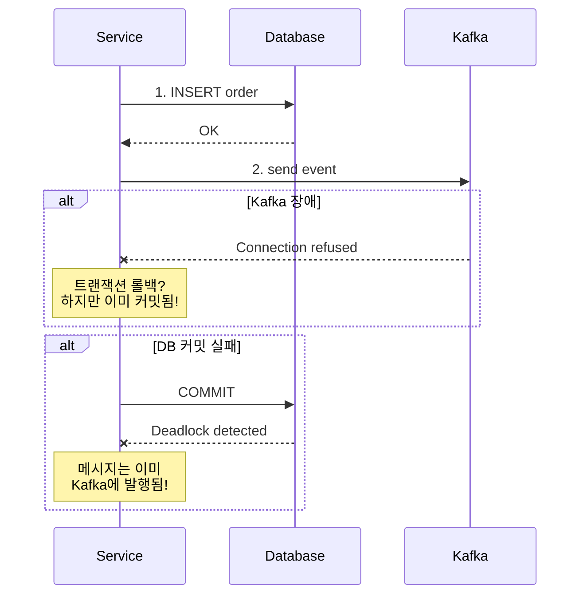
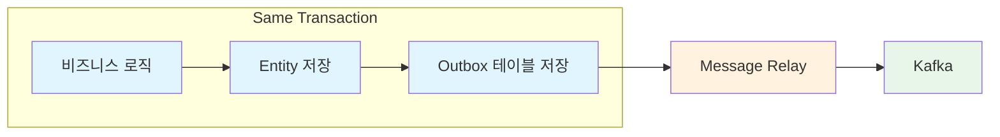
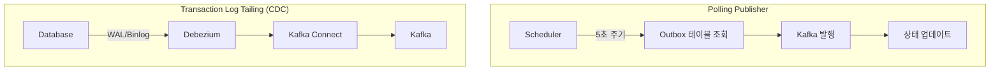
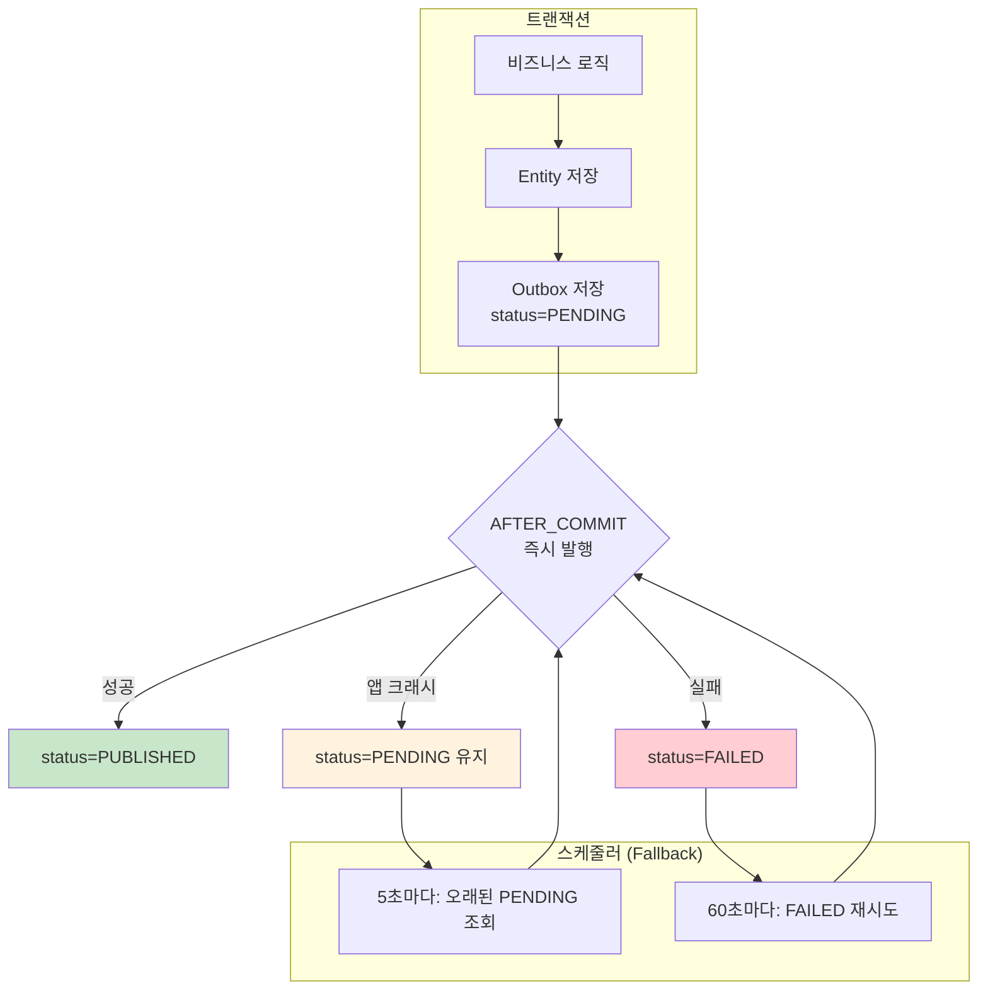
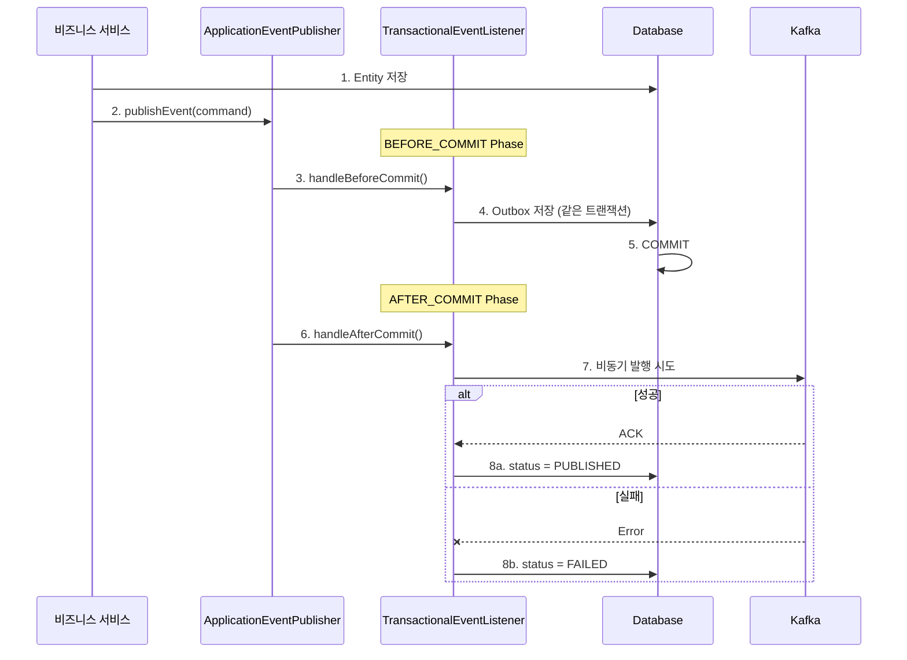
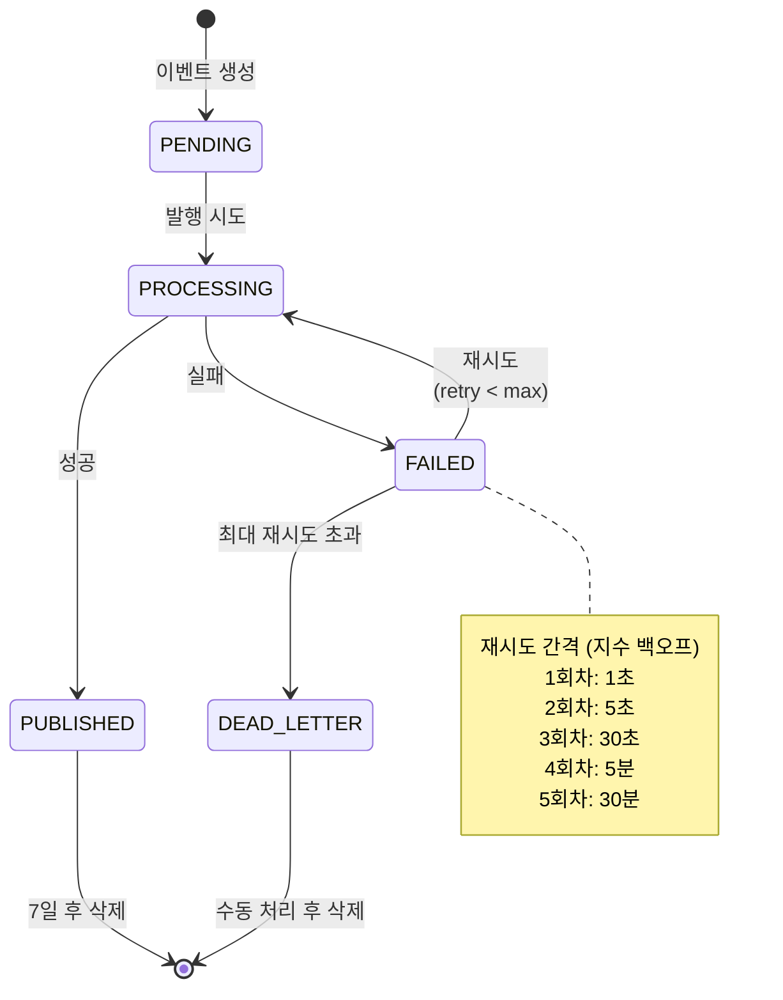
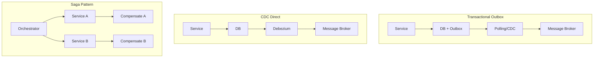

마이크로서비스 아키텍처에서 가장 까다로운 문제 중 하나는 **데이터베이스 변경과 메시지 발행의 일관성**이다. 주문을 저장했는데 Kafka 메시지 발행이 실패하면? 반대로 메시지는 발행했는데 DB 커밋이 실패하면?

이 글에서는 이 문제를 해결하는 Transactional Outbox 패턴을 정리한다. 특히 전형적인 Polling/CDC 방식과 달리, **즉시 발행을 시도하고 Outbox를 실패 복구용으로 활용하는 하이브리드 방식**을 중심으로 설명한다.

## 문제: Dual Write Problem

분산 시스템에서 흔히 마주치는 상황이다.

```kotlin
@Transactional
fun createOrder(command: CreateOrderCommand): Order {
    // 1. 주문 저장
    val order = orderRepository.save(Order.from(command))

    // 2. 이벤트 발행 - 여기서 문제 발생!
    kafkaTemplate.send("order-events", OrderCreatedEvent(order.id))

    return order
}
```

이 코드의 문제점은 무엇일까?



**Dual Write Problem**이 발생한다.

| 시나리오 | 결과 | 문제 |
|----------|------|------|
| DB 성공, Kafka 실패 | 주문 저장됨, 이벤트 없음 | 다른 서비스가 주문을 모름 |
| Kafka 성공, DB 실패 | 이벤트 발행됨, 주문 없음 | 존재하지 않는 주문 이벤트 |
| 둘 다 성공 후 크래시 | 불확실 | 어디까지 처리됐는지 알 수 없음 |

2PC(Two-Phase Commit)로 해결할 수 있지만, 분산 환경에서 2PC는 성능 저하와 가용성 문제를 야기한다. Kafka는 XA 트랜잭션을 지원하지 않기도 한다.

## 해결책: Transactional Outbox 패턴

[Chris Richardson](https://microservices.io/patterns/data/transactional-outbox.html)이 정립한 이 패턴의 핵심 아이디어는 단순하다.

> **메시지를 직접 발행하지 말고, 같은 트랜잭션 내에서 Outbox 테이블에 저장하라.**



이렇게 하면 비즈니스 데이터와 이벤트가 **같은 트랜잭션**에서 커밋된다. 트랜잭션이 성공하면 둘 다 저장되고, 실패하면 둘 다 롤백된다. 원자성이 보장되는 것이다.

### Outbox 테이블 설계

```sql
CREATE TABLE event_outbox (
    id              UUID PRIMARY KEY,
    aggregate_id    VARCHAR(255) NOT NULL,    -- 이벤트 발생 엔티티 ID
    aggregate_type  VARCHAR(100) NOT NULL,    -- 엔티티 타입 (Order, Payment 등)
    event_type      VARCHAR(100) NOT NULL,    -- 이벤트 타입 (Created, Updated 등)
    topic           VARCHAR(255) NOT NULL,    -- 대상 Kafka 토픽
    partition_key   VARCHAR(255) NOT NULL,    -- 파티션 키 (순서 보장용)
    payload         TEXT NOT NULL,            -- 이벤트 페이로드 (JSON)
    headers         TEXT,                     -- 추가 헤더 (correlation-id 등)
    status          VARCHAR(20) NOT NULL,     -- PENDING, PUBLISHED, FAILED, DEAD_LETTER
    retry_count     INT DEFAULT 0,            -- 재시도 횟수
    last_error      TEXT,                     -- 마지막 에러 메시지
    created_at      TIMESTAMPTZ NOT NULL,
    processed_at    TIMESTAMPTZ,
    next_retry_at   TIMESTAMPTZ               -- 다음 재시도 예정 시간
);

-- 처리 대상 조회용 인덱스
CREATE INDEX idx_outbox_status_created
    ON event_outbox(status, created_at);

-- 재시도 대상 조회용 인덱스
CREATE INDEX idx_outbox_status_retry
    ON event_outbox(status, next_retry_at)
    WHERE status IN ('PENDING', 'FAILED');
```

핵심 설계 포인트는 다음과 같다.

- **partition_key**: 같은 aggregate의 이벤트 순서를 보장하려면 Kafka 파티션 키가 필요하다
- **status**: 이벤트 생명주기를 추적한다 (PENDING → PUBLISHED 또는 FAILED → DEAD_LETTER)
- **next_retry_at**: 지수 백오프 재시도를 위한 필드
- **복합 인덱스**: 폴링 쿼리 성능을 위해 필수

## Message Relay 구현 방식

Outbox 테이블에 저장된 이벤트를 Kafka로 전달하는 방식은 크게 두 가지다.



### 방식 1: Polling Publisher

주기적으로 Outbox 테이블을 조회해서 PENDING 상태의 이벤트를 발행한다.

**장점**
- 구현이 단순하다
- 추가 인프라가 필요 없다
- 디버깅이 쉽다

**단점**
- 폴링 주기만큼 지연이 발생한다
- DB에 주기적인 쿼리 부하가 발생한다
- 스케일 아웃 시 중복 처리 방지 로직이 필요하다

### 방식 2: Transaction Log Tailing (CDC)

[Debezium](https://debezium.io/documentation/reference/stable/transformations/outbox-event-router.html) 같은 CDC 도구로 DB 트랜잭션 로그를 읽어서 변경사항을 Kafka로 스트리밍한다.

**장점**
- 거의 실시간에 가까운 지연 (ms 단위)
- DB 폴링 부하가 없다
- 이벤트 순서가 보장된다

**단점**
- Kafka Connect, Debezium 등 추가 인프라가 필요하다
- 운영 복잡도가 높다
- DB 종류별 설정이 다르다

### 어떤 방식을 선택할까?

| 기준 | Polling Publisher | CDC (Debezium) |
|------|-------------------|----------------|
| 지연 허용 | 수 초 OK | 수 ms 필요 |
| 인프라 | 단순 | Kafka Connect 클러스터 필요 |
| 팀 규모 | 소규모 | 전담 인프라팀 있음 |
| 이벤트 볼륨 | 낮음~중간 | 높음 |

실무에서는 Polling Publisher로 시작해서 요구사항이 까다로워지면 CDC로 전환하는 경우가 많다.

### 방식 3: 하이브리드 - 즉시 발행 + Outbox Fallback

전형적인 Outbox 패턴은 **모든 이벤트**를 Polling이나 CDC로 발행한다. 하지만 실무에서는 다른 접근도 가능하다.

> 트랜잭션 커밋 직후 **즉시 Kafka 발행을 시도**하고, Outbox 스케줄러는 **실패하거나 누락된 이벤트만** 처리한다.



이 방식의 핵심은 **이중 안전망**이다.

1. **빠른 경로 (정상)**: AFTER_COMMIT → 즉시 Kafka 발행 → PUBLISHED
2. **느린 경로 1 (발행 실패)**: FAILED 상태 → 스케줄러가 60초마다 재시도
3. **느린 경로 2 (앱 크래시)**: PENDING 유지 → 스케줄러가 10초 이상 된 PENDING 처리

**왜 이렇게 설계할까?**

| 관점 | 전형적인 Polling | 하이브리드 방식 |
|------|------------------|-----------------|
| **지연** | 폴링 주기만큼 (5초) | 즉시 (성공 시 0ms) |
| **DB 부하** | 매번 전체 PENDING 조회 | 실패/누락 시에만 조회 |
| **복잡도** | 단순 | Spring Event 연동 필요 |
| **Outbox 역할** | 모든 이벤트 발행 | 실패 복구용 안전망 |

대부분의 이벤트가 정상 발행되는 환경에서는 하이브리드 방식이 효율적이다. Kafka가 안정적이라면 99% 이상의 이벤트가 즉시 발행되고, 스케줄러는 간헐적인 실패만 처리한다.

**스케줄러의 두 가지 역할**

```kotlin
// 1. 오래된 PENDING 처리 (5초마다)
// - AFTER_COMMIT이 실행되기 전에 앱이 크래시된 경우
// - 10초 이상 PENDING 상태인 이벤트만 대상
@Scheduled(fixedDelay = 5000)
fun processDelayedPendingEvents() {
    val events = outboxRepository.findByStatus(PENDING)
        .filter { it.createdAt < now().minusSeconds(10) }  // 경쟁 상태 방지
    // ...
}

// 2. FAILED 재시도 (60초마다)
// - AFTER_COMMIT이나 스케줄러에서 Kafka 발행이 실패한 경우
@Scheduled(fixedDelay = 60000)
fun retryFailedEvents() {
    val events = outboxRepository.findByStatus(FAILED)
        .filter { it.nextRetryAt <= now() }  // 지수 백오프 적용
    // ...
}
```

**트레이드오프**

- 장점: 낮은 지연, 적은 DB 부하, 앱 크래시에도 안전
- 단점: `AFTER_COMMIT`에서 상태 업데이트 시 별도 트랜잭션 필요
- 고려사항: PENDING 처리 시 AFTER_COMMIT과의 경쟁 상태 방지 로직 필요 (최소 대기 시간)

이 방식은 [Spring 공식 블로그](https://spring.io/blog/2023/10/24/a-use-case-for-transactions-adapting-to-transactional-outbox-pattern/)에서도 언급된 접근법이다. 이 글에서는 하이브리드 방식을 중심으로 설명한다.

## Spring 구현: @TransactionalEventListener 활용

Spring의 [@TransactionalEventListener](https://docs.spring.io/spring-framework/reference/data-access/transaction/event.html)를 활용하면 트랜잭션 라이프사이클에 맞춰 이벤트를 처리할 수 있다.

### 아키텍처 개요



### TransactionPhase 이해하기

[Spring 공식 문서](https://docs.spring.io/spring-framework/docs/current/javadoc-api/org/springframework/transaction/event/TransactionalEventListener.html)에 따르면 4가지 Phase가 있다.

| Phase | 실행 시점 | 용도 |
|-------|----------|------|
| `BEFORE_COMMIT` | 커밋 직전 | Outbox에 이벤트 저장 |
| `AFTER_COMMIT` | 커밋 직후 (기본값) | Kafka 발행 시도 |
| `AFTER_ROLLBACK` | 롤백 직후 | 실패 로깅 |
| `AFTER_COMPLETION` | 커밋/롤백 완료 후 | 정리 작업 |

### 이벤트 발행 명령 정의

```kotlin
data class EventPublishCommand(
    val topic: String,
    val key: String,
    val envelope: DomainEventEnvelope<*>,
    val correlationId: String?,
    var outboxId: UUID? = null  // BEFORE_COMMIT에서 설정됨
)

data class DomainEventEnvelope<T>(
    val eventId: String = UUID.randomUUID().toString(),
    val eventType: String,
    val aggregateId: String,
    val aggregateType: String,
    val occurredAt: OffsetDateTime = OffsetDateTime.now(),
    val version: String = "1.0.0",
    val payload: T
)
```

### Two-Phase 이벤트 리스너

핵심 구현이다. BEFORE_COMMIT에서 저장하고, AFTER_COMMIT에서 발행한다.

```kotlin
@Component
class TransactionalEventPublisher(
    private val outboxRepository: EventOutboxRepository,
    private val kafkaTemplate: KafkaTemplate<String, Any>,
    private val objectMapper: ObjectMapper
) {
    private val logger = LoggerFactory.getLogger(javaClass)

    /**
     * Phase 1: 트랜잭션 커밋 직전 - Outbox에 저장
     * 비즈니스 트랜잭션과 같이 커밋/롤백된다.
     */
    @TransactionalEventListener(phase = TransactionPhase.BEFORE_COMMIT)
    fun handleBeforeCommit(command: EventPublishCommand) {
        val outboxEntity = EventOutboxEntity(
            id = UUID.randomUUID(),
            aggregateId = command.envelope.aggregateId,
            aggregateType = command.envelope.aggregateType,
            eventType = command.envelope.eventType,
            topic = command.topic,
            partitionKey = command.key,
            payload = objectMapper.writeValueAsString(command.envelope),
            headers = buildHeaders(command),
            status = EventOutboxStatus.PENDING,
            createdAt = OffsetDateTime.now()
        )

        val saved = outboxRepository.save(outboxEntity)
        command.outboxId = saved.id

        logger.debug("Event saved to outbox: id={}, type={}",
            saved.id, command.envelope.eventType)
    }

    /**
     * Phase 2: 트랜잭션 커밋 직후 - Kafka 발행 시도
     * 실패해도 Outbox에 저장되어 있으므로 나중에 재시도된다.
     */
    @TransactionalEventListener(phase = TransactionPhase.AFTER_COMMIT)
    fun handleAfterCommit(command: EventPublishCommand) {
        val outboxId = command.outboxId ?: return

        // 비동기로 처리해서 응답 지연 방지
        CoroutineScope(Dispatchers.IO).launch {
            try {
                publishToKafka(command)
                updateOutboxStatus(outboxId, EventOutboxStatus.PUBLISHED)
                logger.info("Event published: id={}", outboxId)
            } catch (e: Exception) {
                updateOutboxStatusToFailed(outboxId, e)
                logger.warn("Event publish failed, will retry: id={}", outboxId, e)
            }
        }
    }

    @TransactionalEventListener(phase = TransactionPhase.AFTER_ROLLBACK)
    fun handleAfterRollback(command: EventPublishCommand) {
        logger.debug("Transaction rolled back, event discarded: type={}",
            command.envelope.eventType)
    }

    private suspend fun publishToKafka(command: EventPublishCommand) {
        val message = MessageBuilder
            .withPayload(command.envelope)
            .setHeader(KafkaHeaders.TOPIC, command.topic)
            .setHeader(KafkaHeaders.KEY, command.key)
            .apply {
                command.correlationId?.let {
                    setHeader("X-Correlation-ID", it)
                }
            }
            .build()

        // 30초 타임아웃으로 동기 대기
        kafkaTemplate.send(message).get(30, TimeUnit.SECONDS)
    }

    private fun buildHeaders(command: EventPublishCommand): String? {
        val headers = mutableMapOf<String, String>()
        command.correlationId?.let { headers["X-Correlation-ID"] = it }
        return if (headers.isNotEmpty()) {
            objectMapper.writeValueAsString(headers)
        } else null
    }
}
```

### 비즈니스 서비스에서 사용

```kotlin
@Service
@Transactional
class OrderService(
    private val orderRepository: OrderRepository,
    private val applicationEventPublisher: ApplicationEventPublisher
) {
    fun createOrder(command: CreateOrderCommand): Order {
        // 1. 비즈니스 로직 수행
        val order = Order.create(command)
        val savedOrder = orderRepository.save(order)

        // 2. 이벤트 발행 (같은 트랜잭션 내에서 Outbox에 저장됨)
        val envelope = DomainEventEnvelope(
            eventType = "OrderCreated",
            aggregateId = savedOrder.id.toString(),
            aggregateType = "Order",
            payload = OrderCreatedEvent(
                orderId = savedOrder.id,
                customerId = savedOrder.customerId,
                totalAmount = savedOrder.totalAmount,
                createdAt = savedOrder.createdAt
            )
        )

        applicationEventPublisher.publishEvent(
            EventPublishCommand(
                topic = "order-events",
                key = savedOrder.id.toString(),
                envelope = envelope,
                correlationId = MDC.get("X-Correlation-ID")
            )
        )

        return savedOrder
    }
}
```

## Outbox Processor: 실패한 이벤트 재시도

AFTER_COMMIT에서 Kafka 발행이 실패하면 이벤트는 FAILED 상태로 남는다. 별도의 스케줄러가 이를 처리한다.

### 스케줄러 구현

```kotlin
@Component
class EventOutboxProcessor(
    private val outboxRepository: EventOutboxRepository,
    private val kafkaTemplate: KafkaTemplate<String, Any>,
    private val slackNotifier: SlackNotifier?,
    private val properties: OutboxProperties
) {
    private val logger = LoggerFactory.getLogger(javaClass)

    companion object {
        // 지수 백오프 재시도 간격
        private val RETRY_DELAYS = listOf(1L, 5L, 30L, 300L, 1800L)  // 초 단위
    }

    /**
     * 지연된 PENDING 이벤트 처리 (5초 주기)
     * AFTER_COMMIT 핸들러가 실패했거나 앱이 크래시된 경우를 처리한다.
     */
    @Scheduled(fixedDelay = 5000)
    @Transactional
    fun processDelayedPendingEvents() {
        // 10초 이상 된 PENDING 이벤트만 처리 (AFTER_COMMIT과의 경쟁 방지)
        val delayedEvents = outboxRepository.findByStatusForProcessing(
            status = EventOutboxStatus.PENDING,
            now = OffsetDateTime.now(),
            limit = properties.batchSize
        ).filter {
            it.createdAt.isBefore(OffsetDateTime.now().minusSeconds(10))
        }

        if (delayedEvents.isEmpty()) return

        logger.info("Processing {} delayed pending events", delayedEvents.size)
        delayedEvents.forEach { processEvent(it) }
    }

    /**
     * 실패한 이벤트 재시도 (60초 주기)
     */
    @Scheduled(fixedDelay = 60000)
    @Transactional
    fun retryFailedEvents() {
        val failedEvents = outboxRepository.findByStatusForProcessing(
            status = EventOutboxStatus.FAILED,
            now = OffsetDateTime.now(),
            limit = properties.batchSize
        )

        if (failedEvents.isEmpty()) return

        logger.info("Retrying {} failed events", failedEvents.size)

        failedEvents.forEach { event ->
            if (event.retryCount < properties.maxRetryCount) {
                processEvent(event)
            } else {
                markAsDeadLetter(event)
            }
        }
    }

    /**
     * 오래된 이벤트 정리 (매일 02:00)
     */
    @Scheduled(cron = "0 0 2 * * ?")
    @Transactional
    fun cleanupOldEvents() {
        val cutoffDate = OffsetDateTime.now().minusDays(properties.retentionDays)

        val deletedCount = outboxRepository.deleteProcessedEventsBefore(
            status = EventOutboxStatus.PUBLISHED,
            before = cutoffDate
        )

        if (deletedCount > 0) {
            logger.info("Cleaned up {} old published events", deletedCount)
        }
    }

    private fun processEvent(event: EventOutboxEntity) {
        try {
            event.status = EventOutboxStatus.PROCESSING
            outboxRepository.save(event)

            publishToKafka(event)

            event.status = EventOutboxStatus.PUBLISHED
            event.processedAt = OffsetDateTime.now()
            event.lastError = null
            outboxRepository.save(event)

            logger.debug("Event published: id={}", event.id)
        } catch (e: Exception) {
            handleEventFailure(event, e)
        }
    }

    private fun handleEventFailure(event: EventOutboxEntity, error: Exception) {
        event.status = EventOutboxStatus.FAILED
        event.retryCount++
        event.lastError = "${error.javaClass.simpleName}: ${error.message}"

        // 지수 백오프 계산
        val delaySeconds = if (event.retryCount <= RETRY_DELAYS.size) {
            RETRY_DELAYS[event.retryCount - 1]
        } else {
            RETRY_DELAYS.last()
        }
        event.nextRetryAt = OffsetDateTime.now().plusSeconds(delaySeconds)

        outboxRepository.save(event)

        logger.warn("Event failed, retry scheduled: id={}, retryCount={}, nextRetry={}",
            event.id, event.retryCount, event.nextRetryAt)
    }

    private fun markAsDeadLetter(event: EventOutboxEntity) {
        event.status = EventOutboxStatus.DEAD_LETTER
        outboxRepository.save(event)

        logger.error("Event moved to dead letter: id={}, type={}, lastError={}",
            event.id, event.eventType, event.lastError)

        // 운영팀에 알림
        slackNotifier?.sendDeadLetterAlert(event)
    }

    private fun publishToKafka(event: EventOutboxEntity) {
        val message = MessageBuilder
            .withPayload(event.payload)
            .setHeader(KafkaHeaders.TOPIC, event.topic)
            .setHeader(KafkaHeaders.KEY, event.partitionKey)
            .build()

        kafkaTemplate.send(message).get(30, TimeUnit.SECONDS)
    }
}
```

### 재시도 전략 시각화



## 운영 고려사항

### 1. 멱등성 보장

At-Least-Once Delivery 특성상 중복 발행이 발생할 수 있다. Consumer 측에서 멱등성을 보장해야 한다.

```kotlin
@KafkaListener(topics = ["order-events"])
fun handleOrderEvent(envelope: DomainEventEnvelope<OrderCreatedEvent>) {
    // eventId로 중복 체크
    if (processedEventRepository.existsById(envelope.eventId)) {
        logger.info("Duplicate event ignored: {}", envelope.eventId)
        return
    }

    // 이벤트 처리
    processOrder(envelope.payload)

    // 처리 완료 기록
    processedEventRepository.save(ProcessedEvent(envelope.eventId))
}
```

### 2. 순서 보장

같은 Aggregate의 이벤트 순서를 보장하려면 partition_key를 일관되게 사용해야 한다.

```kotlin
// aggregate_id를 파티션 키로 사용
EventPublishCommand(
    topic = "order-events",
    key = order.id.toString(),  // 같은 주문의 이벤트는 같은 파티션으로
    envelope = envelope
)
```

### 3. 모니터링

```kotlin
// Dead Letter 알림
class SlackNotifier(private val slackClient: SlackClient) {

    fun sendDeadLetterAlert(event: EventOutboxEntity) {
        val message = """
            :skull: *Event Dead Letter Alert*
            > *Event ID:* ${event.id}
            > *Type:* ${event.eventType}
            > *Aggregate:* ${event.aggregateType} (${event.aggregateId})
            > *Retry Count:* ${event.retryCount}
            > *Last Error:* ${event.lastError?.take(200)}

            _수동 확인이 필요합니다._
        """.trimIndent()

        slackClient.send(channel = "#alerts", message = message)
    }
}
```

### 4. 메트릭 수집

```kotlin
@Component
class OutboxMetrics(private val meterRegistry: MeterRegistry) {

    private val publishedCounter = meterRegistry.counter("outbox.events.published")
    private val failedCounter = meterRegistry.counter("outbox.events.failed")
    private val deadLetterCounter = meterRegistry.counter("outbox.events.dead_letter")
    private val processingTimer = meterRegistry.timer("outbox.events.processing.time")

    fun recordPublished() = publishedCounter.increment()
    fun recordFailed() = failedCounter.increment()
    fun recordDeadLetter() = deadLetterCounter.increment()
    fun recordProcessingTime(duration: Duration) = processingTimer.record(duration)
}
```

## 대안 패턴 비교

### Outbox vs CDC vs Saga



| 패턴 | 사용 시점 | 복잡도 | 일관성 |
|------|----------|--------|--------|
| **Transactional Outbox** | 단일 서비스에서 이벤트 발행 | 중간 | 강한 일관성 |
| **CDC Direct** | 기존 테이블 변경을 이벤트로 | 높음 | 강한 일관성 |
| **Saga** | 여러 서비스 간 분산 트랜잭션 | 매우 높음 | 최종적 일관성 |

## 정리

Transactional Outbox 패턴은 분산 시스템에서 **메시지 신뢰성**을 확보하는 검증된 방법이다.

### 핵심 포인트

1. **원자성 보장**: 비즈니스 데이터와 이벤트가 같은 트랜잭션에서 커밋된다
2. **At-Least-Once Delivery**: 이벤트 손실 없이 최소 한 번은 전달된다
3. **재시도 전략**: 지수 백오프로 일시적 장애에 대응한다
4. **운영 가시성**: 모든 이벤트가 DB에 기록되어 추적이 가능하다

### 트레이드오프

| 얻는 것 | 잃는 것 |
|---------|---------|
| 이벤트 손실 방지 | 약간의 지연 (폴링 주기) |
| 감시/디버깅 용이 | DB 저장 오버헤드 |
| 재시도 자동화 | 추가 스케줄러 운영 |

금융, 물류, 주문 처리 등 **이벤트 손실이 치명적인 도메인**에서는 필수적인 패턴이다.

## 참고 자료

- [Microservices.io - Transactional Outbox Pattern](https://microservices.io/patterns/data/transactional-outbox.html) - Chris Richardson
- [Microservices.io - Polling Publisher](https://microservices.io/patterns/data/polling-publisher.html)
- [Microservices.io - Transaction Log Tailing](https://microservices.io/patterns/data/transaction-log-tailing.html)
- [Spring Framework - Transaction-bound Events](https://docs.spring.io/spring-framework/reference/data-access/transaction/event.html)
- [Spring @TransactionalEventListener JavaDoc](https://docs.spring.io/spring-framework/docs/current/javadoc-api/org/springframework/transaction/event/TransactionalEventListener.html)
- [Debezium - Outbox Event Router](https://debezium.io/documentation/reference/stable/transformations/outbox-event-router.html)
- [Debezium Blog - Reliable Microservices Data Exchange](https://debezium.io/blog/2019/02/19/reliable-microservices-data-exchange-with-the-outbox-pattern/)
