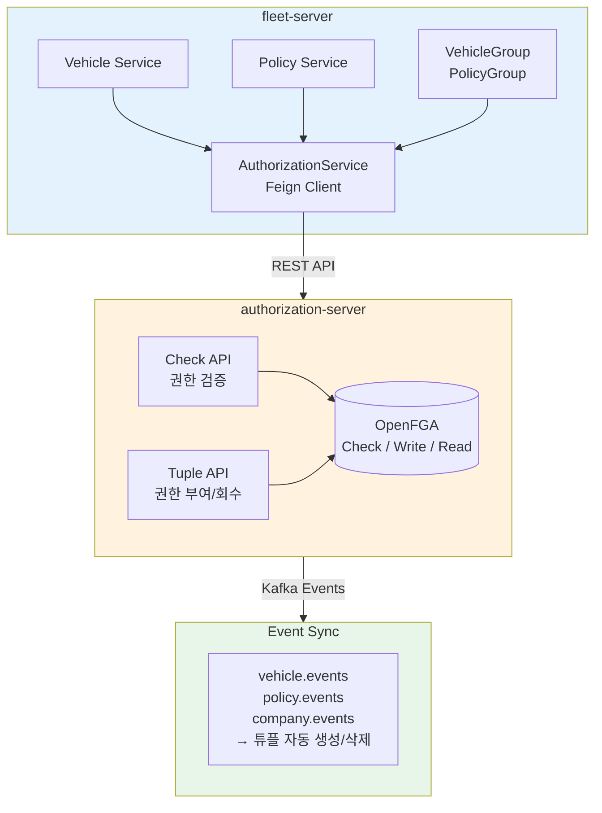
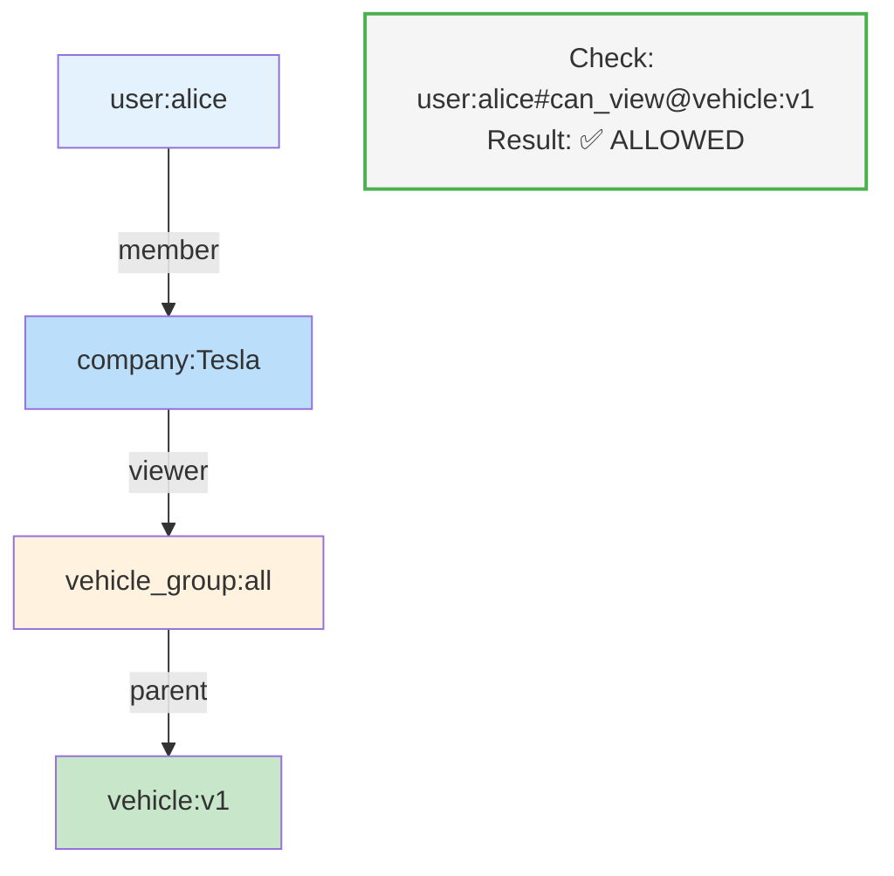
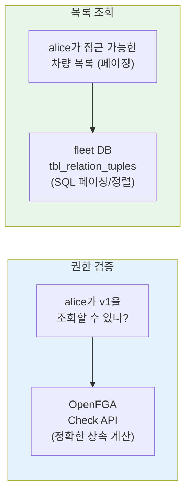

## 배경

Fleet Management System에서 권한 관리가 복잡해졌다.

```
문제 상황:
- 차량 10,000대, 정책 5,000개
- 사용자 500명, 회사 4개
- "Tesla 회사 전체에 모든 차량 조회 권한" 같은 요구사항
```

개별 리소스마다 권한을 부여하면 튜플이 폭발한다.

```
❌ 개별 부여 시
user:alice#viewer@vehicle:v1
user:alice#viewer@vehicle:v2
user:alice#viewer@vehicle:v3
... (10,000개)

user:bob#viewer@vehicle:v1
... (또 10,000개)

→ 500명 × 10,000대 = 5,000,000 튜플
```

**Group 패턴**으로 이 문제를 해결했다.

---

## 아키텍처 개요



---

## OpenFGA 모델 설계

### Subject Types (권한 주체)

```fga
type user

type company
  relations
    define member: [user]
```

회사 멤버십을 `company#member` 관계로 표현한다.

```
company:Tesla#member@user:alice
company:Tesla#member@user:bob
```

### Group Types (벌크 권한)

```fga
type vehicle_group
  relations
    # 역할
    define viewer: [user, company, company#member]
    define operator: [user, company, company#member]
    define admin: [user, company, company#member]

    # 계산된 권한
    define can_view: viewer or operator or admin
    define can_edit: operator or admin
    define can_delete: admin
```

**핵심**: `company#member`를 직접 할당할 수 있다.

```
# Tesla 회사 전체에 모든 차량 조회 권한
vehicle_group:all#viewer@company:Tesla
```

이 한 줄로 Tesla의 모든 멤버가 `vehicle_group:all`의 viewer가 된다.

### Resource Types (개별 리소스)

```fga
type vehicle
  relations
    # 그룹 상속
    define parent: [vehicle_group]

    # 직접 + 상속 권한
    define viewer: [user, company, company#member] or viewer from parent
    define operator: [user, company, company#member] or operator from parent
    define admin: [user, company, company#member] or admin from parent

    # 계산된 권한
    define can_view: viewer or operator or admin
    define can_edit: operator or admin
    define can_delete: admin
```

**상속 메커니즘**: `viewer from parent`

```
# 차량을 그룹에 연결
vehicle:v1#parent@vehicle_group:all

# 결과: vehicle_group:all의 viewer는 vehicle:v1도 조회 가능
```

---

## 권한 상속 흐름



**상속 경로**: alice → Tesla#member → Tesla#viewer@vehicle_group:all → viewer from parent → vehicle:v1#can_view

---

## 튜플 수 비교

### Before (개별 부여)

```
# 500명 × 10,000대 = 5,000,000 튜플
user:alice#viewer@vehicle:v1
user:alice#viewer@vehicle:v2
...
user:bob#viewer@vehicle:v1
...
```

### After (Group 패턴)

```
# 회사 멤버십: 500 튜플
company:Tesla#member@user:alice
company:Tesla#member@user:bob
...

# 그룹 권한: 4 튜플 (회사 4개)
vehicle_group:all#viewer@company:Tesla
vehicle_group:all#viewer@company:Rivian
...

# 리소스-그룹 연결: 10,000 튜플
vehicle:v1#parent@vehicle_group:all
vehicle:v2#parent@vehicle_group:all
...

# 총: 500 + 4 + 10,000 = 10,504 튜플
```

**99.8% 감소** (5,000,000 → 10,504)

---

## Spring Boot 구현

### 권한 체크

```kotlin
@Service
class AuthorizationService(
    private val authorizationApiPort: AuthorizationApiPort
) {
    fun checkPermission(
        userId: UUID,
        companyCode: String,
        resourceType: ResourceType,
        resourceId: String,
        permission: Permission
    ): Boolean {
        // 1. 사용자 직접 권한 체크
        val userHasPermission = authorizationApiPort.check(
            user = "user:$userId",
            relation = permission.name.lowercase(),
            objectType = resourceType.namespace,
            objectId = resourceId
        )
        if (userHasPermission) return true

        // 2. 회사 상속 권한 체크
        return authorizationApiPort.check(
            user = "company:$companyCode",
            relation = permission.name.lowercase(),
            objectType = resourceType.namespace,
            objectId = resourceId
        )
    }
}
```

### 그룹 권한 부여

```kotlin
@Service
class VehicleGroupAuthorizationService(
    private val authorizationApiPort: AuthorizationApiPort
) {
    fun grantGroupPermission(
        groupId: UUID,
        subjectType: SubjectType,
        subjectId: String,
        relation: String
    ) {
        val user = when (subjectType) {
            SubjectType.USER -> "user:$subjectId"
            SubjectType.COMPANY -> "company:$subjectId"
        }

        authorizationApiPort.writeTuple(
            user = user,
            relation = relation,
            objectType = "vehicle_group",
            objectId = groupId.toString()
        )
    }
}
```

### 리소스-그룹 연결 (Kafka 이벤트)

```kotlin
@Component
class VehicleEventConsumer(
    private val openFgaPort: OpenFgaPort
) {
    @KafkaListener(topics = ["vehicle.events"])
    fun consume(record: ConsumerRecord<String, String>) {
        val event = objectMapper.readValue<VehicleEvent>(record.value())

        when (event) {
            is VehicleCreatedEvent -> {
                // 새 차량을 기본 그룹에 연결
                openFgaPort.writeTuple(
                    user = "vehicle_group:all",
                    relation = "parent",
                    objectType = "vehicle",
                    objectId = event.vehicleId
                )
            }
            is VehicleDeletedEvent -> {
                // 차량 삭제 시 모든 관계 제거
                openFgaPort.deleteAllTuples(
                    objectType = "vehicle",
                    objectId = event.vehicleId
                )
            }
        }
    }
}
```

---

## ListObjects 한계 극복: Dual Source 패턴

OpenFGA의 `ListObjects`는 대규모에서 한계가 있다.

```
문제:
- 최대 1,000개 결과
- 페이지네이션 제한적
- 정렬/필터링 불가
```

**해결책**: 권한 인덱스를 별도 DB에 유지한다.



### DB 스키마

```sql
CREATE TABLE tbl_relation_tuples (
    id              BIGSERIAL PRIMARY KEY,
    subject_type    VARCHAR(20) NOT NULL,   -- 'user' | 'company'
    subject_id      VARCHAR(100) NOT NULL,
    subject_relation VARCHAR(20),            -- NULL | 'member'
    relation        VARCHAR(30) NOT NULL,    -- 'viewer' | 'operator' | 'admin'
    resource_type   VARCHAR(30) NOT NULL,    -- 'vehicle' | 'vehicle_group'
    resource_id     VARCHAR(100) NOT NULL,
    created_at      TIMESTAMP DEFAULT NOW(),

    UNIQUE (subject_type, subject_id, subject_relation, relation, resource_type, resource_id)
);

CREATE INDEX idx_subject ON tbl_relation_tuples(subject_type, subject_id, resource_type);
CREATE INDEX idx_resource ON tbl_relation_tuples(resource_type, resource_id);
```

### 목록 조회 구현: 강제 그룹화

핵심 아이디어는 **모든 리소스를 기본 그룹에 강제 소속**시키는 것이다.

```
# 모든 차량이 생성 시 자동으로 all 그룹에 연결됨
vehicle:v1#parent@vehicle_group:all
vehicle:v2#parent@vehicle_group:all
vehicle:v3#parent@vehicle_group:all
... (10,000대 모두)
```

이렇게 하면 목록 조회가 단순해진다.

```kotlin
@Service
class VehicleQueryService(
    private val vehicleRepository: VehicleRepository,
    private val authorizationService: AuthorizationService
) {
    fun getAccessibleVehicles(
        userId: UUID,
        companyCode: String,
        pageable: Pageable
    ): Page<Vehicle> {
        // 1. vehicle_group:all에 viewer 권한 있는지 체크 (1번의 Check 호출)
        val hasAllAccess = authorizationService.checkPermission(
            userId, companyCode,
            ResourceType.VEHICLE_GROUP, "all",
            Permission.CAN_VIEW
        )

        if (hasAllAccess) {
            // 2-A. 전체 접근 → DB에서 바로 페이징 (ListObjects 호출 없음!)
            return vehicleRepository.findAll(pageable)
        } else {
            // 2-B. 개별 권한만 → ListObjects 사용 (드문 케이스)
            val directVehicleIds = authorizationService
                .listAccessibleResources(userId, "can_view", ResourceType.VEHICLE)

            return vehicleRepository.findByIdIn(directVehicleIds, pageable)
        }
    }
}
```

### 강제 그룹화 vs 동적 그룹 조회

| 방식 | 동적 그룹 조회 | 강제 그룹화 |
|------|---------------|------------|
| 그룹 | 여러 그룹 가능 | `all` 그룹 고정 |
| 조회 흐름 | 그룹 조회 → 멤버 조회 → 합치기 | 그룹 권한 체크 → DB 조회 |
| API 호출 | ListObjects 2회+ | Check 1회 |
| 코드 복잡도 | 높음 | 낮음 |

### 동기화 (Kafka)

```kotlin
@Component
class AuthorizationSyncConsumer(
    private val relationTupleRepository: RelationTupleRepository
) {
    @KafkaListener(topics = ["authorization.events"])
    fun sync(event: AuthorizationEvent) {
        when (event.type) {
            "TUPLE_CREATED" -> {
                relationTupleRepository.save(
                    RelationTuple(
                        subjectType = event.subjectType,
                        subjectId = event.subjectId,
                        relation = event.relation,
                        resourceType = event.resourceType,
                        resourceId = event.resourceId
                    )
                )
            }
            "TUPLE_DELETED" -> {
                relationTupleRepository.delete(...)
            }
        }
    }
}
```

---

## 실제 API 예시

### 그룹에 회사 권한 부여

```http
POST /api/v1/authorization/vehicle-groups/all/permissions
Content-Type: application/json

{
  "subjectType": "COMPANY",
  "subjectId": "Tesla",
  "relation": "viewer"
}
```

### 개별 차량에 사용자 권한 부여

```http
POST /api/v1/authorization/vehicles/v1-uuid/permissions
Content-Type: application/json

{
  "subjectType": "USER",
  "subjectId": "alice-uuid",
  "relation": "operator"
}
```

### 권한 체크

```http
GET /api/v1/authorization/check?resourceType=vehicle&resourceId=v1-uuid&permission=can_view

Response:
{
  "allowed": true,
  "resolution": "viewer from parent (vehicle_group:all)"
}
```

### 내 권한 목록

```http
GET /api/v1/authorization/me/permissions

Response:
{
  "direct": [
    { "relation": "operator", "resourceType": "vehicle", "resourceId": "v1-uuid" }
  ],
  "inherited": [
    { "relation": "viewer", "resourceType": "vehicle_group", "resourceId": "all", "via": "company:Tesla" }
  ]
}
```

---

## 개선 효과

| 항목 | Before | After |
|------|--------|-------|
| **튜플 수** | 5,000,000 | 10,504 (99.8%↓) |
| **권한 부여** | 개별 10,000번 API | 그룹 1번 API |
| **신규 차량** | 500명에게 권한 부여 | 자동 상속 |
| **신규 직원** | 10,000대에 권한 부여 | 회사에 추가만 |
| **목록 조회** | ListObjects 한계 | SQL 페이징 |

### 운영 시나리오

**신규 차량 등록**
```
1. 차량 생성 → Kafka 이벤트 발행
2. authorization-server가 parent 튜플 자동 생성
3. 기존 그룹 권한이 자동으로 상속됨
```

**신규 직원 입사**
```
1. 사용자 생성 + 회사 멤버십 설정
2. company:Tesla#member@user:신규직원
3. 회사의 모든 그룹 권한이 자동으로 적용됨
```

---

## 주의사항

### 1. 상속 깊이 제한

OpenFGA는 기본 25 depth까지 지원한다. 너무 깊은 상속은 성능 저하를 유발한다.

```
권장: 2-3 depth
user → company → group → resource
```

### 2. Check vs List 분리

```
Check (단일 권한 검증): OpenFGA 사용
List (목록 조회): DB 사용

→ Dual Source 패턴 필수
```

### 3. 이벤트 순서 보장

Kafka 파티션 키를 리소스 ID로 설정해서 순서를 보장한다.

```kotlin
kafkaTemplate.send(
    "vehicle.events",
    event.vehicleId,  // 파티션 키
    event
)
```

---

## 강제 그룹화의 엔지니어링 이점

모든 리소스를 `all` 그룹에 강제 소속시키면 여러 성능 이점이 생긴다.

### 1. ListObjects 호출 회피

```
동적 그룹 방식:
  1. ListObjects("user:alice", "viewer", "vehicle_group") → [group:a, group:b]
  2. ListObjects("user:alice", "viewer", "vehicle") → [v1, v2]
  3. DB: findByGroupIn([a, b]) → [v3, v4, v5...]
  4. 합치기 + 중복 제거
  → OpenFGA 2회 + DB 1회 + 메모리 연산

강제 그룹화:
  1. Check("user:alice", "viewer", "vehicle_group:all") → true
  2. DB: findAll(pageable)
  → OpenFGA 1회 + DB 1회
```

**OpenFGA 호출 50% 감소**, ListObjects의 1,000개 제한 문제도 회피한다.

### 2. 예측 가능한 응답 시간

```
동적 방식: O(그룹 수) + O(직접 권한 수)
  - 사용자마다 응답 시간이 다름
  - 권한이 많은 사용자일수록 느림

강제 그룹화: O(1) Check + O(1) DB 쿼리
  - 모든 사용자가 동일한 응답 시간
  - SLA 보장 용이
```

| 사용자 | 동적 방식 | 강제 그룹화 |
|--------|----------|------------|
| 신입 (권한 적음) | ~50ms | ~30ms |
| 관리자 (권한 많음) | ~500ms | ~30ms |
| 슈퍼 어드민 | ~2000ms+ | ~30ms |

### 3. DB 인덱스 최대 활용

```sql
-- 동적 방식: IN 쿼리 (인덱스 효율 낮음)
SELECT * FROM vehicles
WHERE id IN (uuid1, uuid2, ..., uuid10000)  -- 최대 10,000개
ORDER BY created_at DESC
LIMIT 20;

-- 강제 그룹화: 단순 쿼리 (인덱스 최적화)
SELECT * FROM vehicles
ORDER BY created_at DESC
LIMIT 20 OFFSET 0;
```

IN 절에 ID가 많아지면 쿼리 플래너가 인덱스를 포기하고 풀스캔할 수 있다.

### 4. 캐싱 효율성

```
동적 방식:
  - 캐시 키: "accessible_vehicles:user:alice"
  - 사용자마다 다른 캐시 → 캐시 히트율 낮음
  - 권한 변경 시 관련 캐시 모두 무효화 필요

강제 그룹화:
  - 캐시 키: "has_all_access:user:alice:vehicle_group:all"
  - Boolean 값 하나만 캐시
  - 목록은 공통 캐시 사용 가능
```

```kotlin
@Cacheable("vehicle_group_access")
fun hasAllAccess(userId: UUID, companyCode: String): Boolean {
    return authorizationService.checkPermission(
        userId, companyCode,
        ResourceType.VEHICLE_GROUP, "all",
        Permission.CAN_VIEW
    )
}
```

### 5. 코드 복잡도 감소

```kotlin
// 동적 방식: 복잡한 합집합 로직
fun getAccessibleVehicles(...): Page<Vehicle> {
    val groups = listAccessibleGroups(...)
    val directIds = listDirectResources(...)
    val groupMemberIds = findMembersByGroups(groups)
    val allIds = (directIds + groupMemberIds).distinct()

    // 페이징 문제: distinct 후 total count가 달라짐
    // 정렬 문제: 두 소스의 정렬 기준이 다름
    // ...복잡한 처리 필요
}

// 강제 그룹화: 단순 분기
fun getAccessibleVehicles(...): Page<Vehicle> {
    return if (hasAllAccess(...)) {
        vehicleRepository.findAll(pageable)  // 끝
    } else {
        vehicleRepository.findByIdIn(listDirect(...), pageable)
    }
}
```

### 6. 권한 변경 영향 최소화

```
시나리오: Tesla 회사에서 신규 직원 100명 입사

동적 방식:
  - 100명의 "접근 가능 목록" 캐시 워밍 필요
  - 각각 ListObjects 호출 발생
  - 콜드 스타트 시 응답 시간 증가

강제 그룹화:
  - company:Tesla#member@user:신규직원 튜플만 추가
  - vehicle_group:all 권한은 이미 Tesla에 있음
  - 추가 처리 없음
```

### 7. 모니터링 단순화

```
동적 방식 메트릭:
  - list_objects_duration_seconds (분포가 넓음)
  - list_objects_result_count (0~10,000)
  - merge_operation_duration_seconds
  - ...

강제 그룹화 메트릭:
  - check_duration_seconds (일정함)
  - db_query_duration_seconds (일정함)
```

P99 레이턴시 관리가 훨씬 쉬워진다.

### 트레이드오프

강제 그룹화가 적합하지 않은 경우도 있다.

| 상황 | 권장 방식 |
|------|----------|
| 대부분 전체 접근 | ✅ 강제 그룹화 |
| 세밀한 그룹 분리 필요 | ❌ 동적 그룹 |
| 그룹이 자주 변경됨 | ❌ 동적 그룹 |
| "내 차량만 보기" 기능 | 🔀 하이브리드 |

하이브리드 방식은 이렇게 구현한다.

```kotlin
fun getVehicles(filter: VehicleFilter, pageable: Pageable): Page<Vehicle> {
    return when (filter) {
        VehicleFilter.ALL -> {
            // 전체 → 강제 그룹화 방식
            if (hasAllAccess()) vehicleRepository.findAll(pageable)
            else throw ForbiddenException()
        }
        VehicleFilter.MY_VEHICLES -> {
            // 내 차량만 → 직접 권한 조회
            val myIds = listDirectResources(userId, "vehicle", "operator")
            vehicleRepository.findByIdIn(myIds, pageable)
        }
    }
}
```

---

## DB 쿼리 최적화: Subquery vs Direct ID List

`WHERE IN (id1, id2, ...)` 쿼리가 왜 비효율적인지 살펴본다.

### PostgreSQL IN 절의 두 가지 형태

**리터럴 리스트 (Direct ID List)**

```sql
SELECT * FROM vehicles WHERE id IN ('v1', 'v2', 'v3', ..., 'v10000');
```

내부적으로 OR 조건으로 변환된다.

```sql
WHERE id = 'v1' OR id = 'v2' OR id = 'v3' ...
```

**Subquery Expression**

```sql
SELECT * FROM vehicles
WHERE id IN (SELECT vehicle_id FROM group_memberships WHERE group_id IN ('g1', 'g2'));
```

Semi-Join으로 최적화된다. Hash Semi Join, Nested Loop Semi Join 등 DB가 최적 전략을 선택한다.

### 실행 계획 비교

700개 ID로 테스트한 결과다.

**Direct ID List**

```
Seq Scan on vehicles  (cost=0.00..1364.00 rows=700 width=32)
  Filter: (id = ANY ('{v1,v2,v3,...}'::text[]))
  actual time=1074.035ms
```

Sequential Scan 발생. 인덱스 미사용.

**Subquery 방식**

```
Hash Semi Join  (cost=18.00..51.08 rows=700 width=32)
  Hash Cond: (vehicles.id = group_memberships.vehicle_id)
  actual time=239.035ms
```

Hash Semi Join 사용. **4.5배 빠르다.**

### 성능 차이 원인

| 방식 | 처리 방법 | 복잡도 |
|------|-----------|--------|
| Direct ID List | 각 값마다 개별 비교 (OR) | O(n×m) |
| Subquery | Hash 테이블 생성 후 조인 | O(n+m) |

### 규모별 권장 방식

| ID 개수 | 권장 방식 | 이유 |
|---------|-----------|------|
| < 128개 | 어느 방식이든 OK | 성능 차이 미미 |
| 128 ~ 1,000개 | Subquery | Hash Join 이점 |
| 1,000 ~ 10,000개 | **반드시 Subquery** | 20배 이상 성능 차이 |
| > 10,000개 | Subquery + Batch | 쿼리 계획 시간 고려 |

### QueryDSL에서의 적용

**권장: Subquery 방식**

```kotlin
val vehicleIdsInGroups = JPAExpressions
    .select(groupMembership.vehicleId)
    .from(groupMembership)
    .where(groupMembership.groupId.`in`(accessibleGroupIds))

predicate.and(QVehicle.vehicle.id.`in`(vehicleIdsInGroups))
```

DB 엔진이 최적의 실행 계획을 선택한다. 네트워크 전송량도 최소화된다.

**비권장: Direct ID List**

```kotlin
val vehicleIds = groupMembershipRepository
    .findAllByGroupIdIn(accessibleGroupIds)
    .map { it.vehicleId }

predicate.and(QVehicle.vehicle.id.`in`(vehicleIds))
```

Application에서 중간 결과를 메모리에 로드하고, 대량의 ID를 SQL로 전송한다.

### Dual Source 패턴과의 연결

앞서 소개한 `tbl_relation_tuples` 테이블을 활용하면 Subquery로 처리할 수 있다.

```kotlin
fun findAccessibleVehicles(
    userId: UUID,
    companyCode: String,
    pageable: Pageable
): Page<Vehicle> {
    // Subquery: 권한 테이블에서 접근 가능한 vehicle ID 조회
    val accessibleVehicleIds = JPAExpressions
        .select(relationTuple.resourceId)
        .from(relationTuple)
        .where(
            relationTuple.resourceType.eq("vehicle")
                .and(
                    relationTuple.subjectType.eq("user")
                        .and(relationTuple.subjectId.eq(userId.toString()))
                ).or(
                    relationTuple.subjectType.eq("company")
                        .and(relationTuple.subjectId.eq(companyCode))
                )
        )

    return jpaQueryFactory
        .selectFrom(vehicle)
        .where(vehicle.id.`in`(accessibleVehicleIds))
        .offset(pageable.offset)
        .limit(pageable.pageSize.toLong())
        .fetch()
}
```

이 방식은 OpenFGA 호출 없이 DB JOIN만으로 권한 필터링을 처리한다.

---

## 정리

Group 패턴은 **벌크 권한 관리의 핵심**이다.

```
개별 부여: O(users × resources)
그룹 부여: O(users + groups + resources)
```

특히 **강제 그룹화**를 적용하면 다음과 같은 효과가 있다.

| 항목 | 효과 |
|------|------|
| API 호출 | ListObjects → Check 1회로 감소 |
| 응답 시간 | 사용자 무관 O(1) |
| 캐싱 | Boolean 캐시로 히트율 극대화 |
| DB 쿼리 | IN 절 없이 단순 페이징 |
| 코드 | 합집합 로직 제거 |

OpenFGA의 `parent` 관계와 `from parent` 상속을 활용하되, **목록 조회는 Check + DB 페이징**으로 단순화하는 것이 실전에서 효과적이다.

---

## 참고 자료

**관련 포스트**
- [ReBAC 환경에서 페이징 구현 전략 가이드](/dev-notes/posts/2025-03-05-rebac-pagination-strategy-guide/) - 5가지 페이징 전략 비교
- [OpenFGA/ReBAC의 실무 한계와 극복 전략](/dev-notes/posts/2025-01-15-openfga-rebac-limitations/) - ListObjects 한계와 대안

**OpenFGA**
- [OpenFGA 공식 문서 - Modeling Guides](https://openfga.dev/docs/modeling)
- [OpenFGA Parent-Child Pattern](https://openfga.dev/docs/modeling/parent-child)
- [Google Zanzibar Paper](https://research.google/pubs/pub48190/)

**PostgreSQL Query Optimization**
- [Subqueries and Performance in PostgreSQL - CYBERTEC](https://www.cybertec-postgresql.com/en/subqueries-and-performance-in-postgresql/)
- [PostgreSQL IN Operator Performance - Stack Overflow](https://stackoverflow.com/questions/40443409/postgresql-in-operator-performance-list-vs-subquery)
- [100x faster Postgres performance by changing 1 line - Datadog](https://www.datadoghq.com/blog/100x-faster-postgres-performance-by-changing-1-line/)
