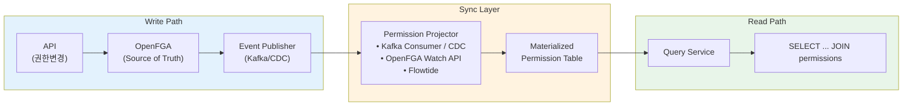
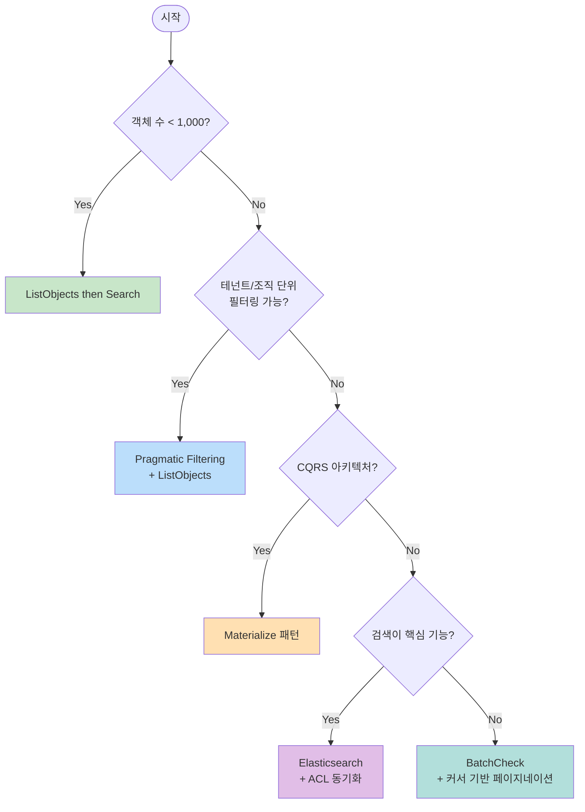
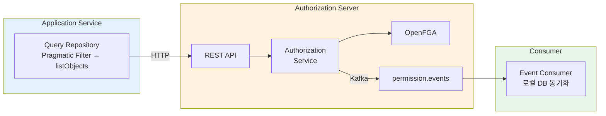

OpenFGA나 SpiceDB 같은 ReBAC(Relationship-Based Access Control) 시스템을 도입하면 권한 관리는 편해지지만, **목록 조회 + 페이징**이 어려워진다. 이 글에서는 실제 프로덕션 환경에서 적용할 수 있는 전략들을 상세히 다룬다.

## 왜 페이징이 어려운가?

전통적인 RBAC에서는 권한 체크가 단순하다.

```sql
-- RBAC: 역할 기반 필터링
SELECT * FROM documents
WHERE tenant_id = :tenantId
  AND (is_public = true OR owner_id = :userId)
ORDER BY created_at DESC
LIMIT 20 OFFSET 0
```

ReBAC에서는 권한이 **관계 그래프**에 있다.

```
user:alice → member → team:engineering → parent → org:acme → viewer → document:doc-123
```

이 관계를 DB 쿼리 하나로 표현할 수 없다. OpenFGA에 물어봐야 한다.

### OpenFGA의 한계

```
ListObjects API 제한:
- 최대 결과: 1,000개 (기본값)
- 타임아웃: 3초 (기본값)
- 정렬 없음 → 페이지네이션 불가
- 필터링 없음 → 검색 조건 적용 불가
```

"내 문서 목록 20개씩 페이징"이라는 단순한 요구사항이 복잡해진다.

## 전략 1: ListObjects then Search

가장 직관적인 방식이다. OpenFGA에서 접근 가능한 ID 목록을 가져온 후, DB에서 해당 ID로 필터링한다.

### 구현

```kotlin
fun getDocuments(userId: UUID, page: Int, size: Int): Page<Document> {
    // 1. OpenFGA에서 접근 가능한 ID 목록 조회
    val accessibleIds = authorizationApi.listObjects(
        user = "user:$userId",
        relation = "viewer",
        objectType = "document"
    )

    // 2. 만능 접근 권한 체크
    if (accessibleIds.contains("*")) {
        return documentRepository.findAll(PageRequest.of(page, size))
    }

    // 3. WHERE IN 절로 필터링 + 페이징
    return documentRepository.findByIdIn(
        accessibleIds.map { UUID.fromString(it) },
        PageRequest.of(page, size)
    )
}
```

### 장점

- 구현이 단순하다
- OpenFGA의 그룹 상속을 자동으로 처리한다
- 권한 계산을 OpenFGA에 위임한다

### 단점

- 접근 가능 객체가 많으면 `WHERE IN (id1, id2, ..., id10000)` 쿼리가 비효율적이다 (아래 [DB 쿼리 최적화](#db-쿼리-최적화-subquery-vs-direct-id-list) 참고)
- OpenFGA `listObjects` 타임아웃 위험이 있다
- 전체 개수 조회가 별도로 필요하다

### 적합한 상황

- 접근 가능 객체가 1,000개 이하
- 단순한 권한 구조
- 빠른 MVP 구현이 필요한 경우

## 전략 2: Search then Check (BatchCheck)

DB에서 먼저 검색하고, 결과에 대해 권한을 체크한다.

### 구현

```kotlin
fun getDocuments(userId: UUID, searchText: String, pageSize: Int, cursor: String?): Page<Document> {
    val results = mutableListOf<Document>()
    var currentCursor = cursor
    var iterations = 0
    val maxIterations = 10  // 무한 루프 방지

    while (results.size < pageSize && iterations < maxIterations) {
        // 1. DB에서 후보 조회 (페이지 크기의 2배)
        val candidates = documentRepository.search(
            searchText = searchText,
            cursor = currentCursor,
            limit = pageSize * 2
        )

        if (candidates.isEmpty()) break

        // 2. BatchCheck로 권한 일괄 확인
        val checkResults = authorizationApi.batchCheck(
            checks = candidates.map { doc ->
                CheckRequest(
                    user = "user:$userId",
                    relation = "viewer",
                    object = "document:${doc.id}"
                )
            }
        )

        // 3. 허용된 결과만 추가
        candidates.forEachIndexed { index, doc ->
            if (checkResults[index].allowed && results.size < pageSize) {
                results.add(doc)
            }
        }

        currentCursor = candidates.lastOrNull()?.id?.toString()
        iterations++
    }

    return Page(
        items = results,
        nextCursor = if (results.size == pageSize) currentCursor else null
    )
}
```

### 핵심 포인트

**같은 revision에서 모든 체크를 실행해야 한다.** 일관성을 보장하는 방법이다.

```kotlin
// SpiceDB/OpenFGA에서 consistency token 사용
val token = authorizationApi.getConsistencyToken()

val checkResults = authorizationApi.batchCheck(
    checks = candidates.map { ... },
    consistency = token  // 모든 체크가 같은 시점의 권한 상태를 본다
)
```

### 장점

- 검색 조건을 자유롭게 적용할 수 있다
- DB 인덱스를 활용한 정렬이 가능하다
- 커서 기반 페이지네이션과 잘 맞는다

### 단점

- 접근 비율이 낮으면 여러 번 반복해야 한다
- 전체 개수를 정확히 알기 어렵다
- BatchCheck 호출 비용이 있다

### 적합한 상황

- 검색 기능이 중요한 서비스
- 접근 비율이 높은 경우 (대부분의 결과가 허용됨)
- 커서 기반 페이지네이션 사용

## 전략 3: Pragmatic Filtering

**OpenFGA 호출 전에** 이미 알고 있는 컨텍스트(테넌트, 조직 등)로 먼저 DB에서 필터링한다.

핵심은 권한 체크 대상을 줄이는 것이다.

### 구현

```kotlin
fun getDocuments(
    userId: UUID,
    tenantId: UUID,  // 로그인 시점에 이미 알고 있는 정보
    searchText: String?,
    page: Int,
    size: Int
): Page<Document> {
    // 1. DB에서 테넌트 단위로 먼저 필터링 (OpenFGA 호출 없음!)
    //    전체 100,000건 → 테넌트 소속 500건으로 축소
    val candidates = documentRepository.findByTenantIdAndSearchText(
        tenantId = tenantId,
        searchText = searchText,
        pageable = PageRequest.of(page, size * 2)  // 여유분 조회
    )

    // 2. 줄어든 후보(500건)에 대해서만 BatchCheck
    val accessibleIds = authorizationApi.batchCheck(
        user = "user:$userId",
        relation = "viewer",
        objects = candidates.map { "document:${it.id}" }
    ).filter { it.allowed }.map { it.objectId }

    // 3. 권한 있는 것만 반환
    return candidates.filter { it.id in accessibleIds }
        .take(size)
        .let { PageImpl(it, PageRequest.of(page, size), it.size.toLong()) }
}
```

### Search then Check와의 차이

```
Search then Check (전략 2):
  1. DB 전체 검색 (100,000건) → 2. 100,000건 권한 체크 (느림)

Pragmatic Filtering:
  1. DB 테넌트 필터 (500건) → 2. 500건 권한 체크 (빠름)
```

**테넌트 필터가 OpenFGA 호출 횟수를 200배 줄인다.**

### 멀티테넌트 환경에서의 활용

```sql
-- 핵심: OpenFGA 호출 전에 DB에서 대폭 필터링
SELECT * FROM documents
WHERE tenant_id = :tenantId  -- 여기서 99%가 걸러짐!
  AND title LIKE :searchText
ORDER BY created_at DESC
LIMIT 100  -- 여유분 조회
-- 이후 100건에 대해서만 BatchCheck 실행
```

### 장점

- 대부분의 실무 환경에서 효과적이다
- OpenFGA 호출 부담을 줄인다
- 기존 인프라를 활용한다

### 단점

- 테넌트 내에서 세밀한 권한이 복잡하면 한계가 있다
- 크로스 테넌트 접근 시 별도 처리가 필요하다

### 적합한 상황

- 멀티테넌트 SaaS
- 조직/팀 단위 권한 구조
- 대부분의 B2B 서비스

## 전략 4: Materialize 패턴

권한을 미리 계산해서 DB에 저장한다. 가장 확장성이 높다.

### 아키텍처



**Materialized Permission Table 구조:**

| user_id | object_type | object_id | relation |
|---------|-------------|-----------|----------|
| alice | document | doc-123 | viewer |
| alice | document | doc-456 | editor |
| bob | folder | folder-1 | viewer |

### 구현: Kafka 기반 동기화

```kotlin
// 1. 권한 변경 시 이벤트 발행 (authorization-server)
@Service
class TupleManagementService(
    private val openFgaClient: OpenFgaClient,
    private val eventPublisher: EventPublisher
) {
    fun writeTuple(tuple: Tuple) {
        // OpenFGA에 저장
        openFgaClient.write(tuple)

        // Kafka로 이벤트 발행
        eventPublisher.publish(
            topic = "permission.events",
            event = PermissionChangedEvent(
                user = tuple.user,
                relation = tuple.relation,
                objectType = tuple.objectType,
                objectId = tuple.objectId,
                operation = "WRITE"
            )
        )
    }
}
```

```kotlin
// 2. 이벤트 수신 및 로컬 테이블 동기화 (query-service)
@KafkaListener(topics = ["permission.events"])
fun handlePermissionChange(event: PermissionChangedEvent) {
    when (event.operation) {
        "WRITE" -> permissionRepository.save(
            Permission(
                userId = event.user.extractId(),
                objectType = event.objectType,
                objectId = event.objectId,
                relation = event.relation
            )
        )
        "DELETE" -> permissionRepository.delete(
            userId = event.user.extractId(),
            objectType = event.objectType,
            objectId = event.objectId,
            relation = event.relation
        )
    }
}
```

```kotlin
// 3. 조회 시 JOIN으로 권한 필터링
@Repository
class DocumentQueryRepository(
    private val jpaQueryFactory: JPAQueryFactory
) {
    fun findDocuments(userId: UUID, searchText: String?, pageable: Pageable): Page<Document> {
        val query = jpaQueryFactory
            .selectFrom(document)
            .join(permission)
                .on(permission.objectId.eq(document.id)
                    .and(permission.objectType.eq("document"))
                    .and(permission.userId.eq(userId))
                    .and(permission.relation.eq("viewer")))
            .where(searchText?.let { document.title.contains(it) })
            .orderBy(document.createdAt.desc())
            .offset(pageable.offset)
            .limit(pageable.pageSize.toLong())

        return PageImpl(query.fetch(), pageable, countQuery.fetchOne() ?: 0)
    }
}
```

### 그룹 상속 처리

문제: OpenFGA는 그룹 상속을 자동 처리하지만, Materialize하면 직접 펼쳐야 한다.

```
user:alice → member → team:engineering → viewer → document:doc-123
```

이 관계를 Materialize하면 다음처럼 저장된다.

```kotlin
// OpenFGA Watch 또는 Flowtide가 관계를 펼쳐서 저장
Permission(userId = "alice", objectId = "doc-123", relation = "viewer")
```

**Flowtide**가 이 작업을 자동화한다. OpenFGA 모델을 분석해서 상속 관계를 펼친 결과를 제공한다.

### 장점

- 조회 성능이 가장 빠르다
- 표준 SQL로 페이징, 정렬, 필터링 가능
- OpenFGA 호출 없이 조회 가능

### 단점

- 인프라 복잡성 증가
- 동기화 지연 (eventual consistency)
- 그룹 변경 시 대량 업데이트 필요

### 적합한 상황

- 10만 개 이상의 대규모 데이터
- 높은 조회 성능이 필요한 경우
- CQRS 아키텍처를 이미 사용 중인 경우

## 전략 5: 검색 인덱스 + ACL 동기화

Elasticsearch나 OpenSearch를 사용한다면, 문서에 ACL 필드를 포함시킨다.

### 구현

```json
// Elasticsearch 문서 구조
{
  "id": "doc-123",
  "title": "Q4 Financial Report",
  "content": "...",
  "created_at": "2025-01-15T10:00:00Z",
  "acl": {
    "users": ["user:alice", "user:bob"],
    "groups": ["team:finance", "team:executive"],
    "public": false
  }
}
```

```kotlin
// 검색 쿼리
fun searchDocuments(userId: UUID, userGroups: List<String>, query: String): SearchResult {
    val searchQuery = QueryBuilders.boolQuery()
        .must(QueryBuilders.matchQuery("content", query))
        .filter(
            QueryBuilders.boolQuery()
                .should(QueryBuilders.termQuery("acl.users", "user:$userId"))
                .should(QueryBuilders.termsQuery("acl.groups", userGroups))
                .should(QueryBuilders.termQuery("acl.public", true))
                .minimumShouldMatch(1)
        )

    return elasticsearchClient.search(
        SearchRequest.of { s ->
            s.index("documents")
                .query(searchQuery)
                .from(0)
                .size(20)
                .sort { sort -> sort.field { f -> f.field("created_at").order(SortOrder.Desc) } }
        }
    )
}
```

### ACL 동기화

```kotlin
@KafkaListener(topics = ["permission.events"])
fun syncToElasticsearch(event: PermissionChangedEvent) {
    val documentId = event.objectId

    // 현재 ACL 조회
    val currentAcl = elasticsearchClient.get(documentId).acl

    // ACL 업데이트
    val updatedAcl = when (event.operation) {
        "WRITE" -> currentAcl.addPermission(event.user, event.relation)
        "DELETE" -> currentAcl.removePermission(event.user, event.relation)
    }

    // 문서 업데이트
    elasticsearchClient.update(documentId) { doc ->
        doc.acl = updatedAcl
    }
}
```

### 그룹 멤버십 변경 처리

그룹에 사용자가 추가/제거되면 해당 그룹 권한을 가진 **모든 문서**를 업데이트해야 한다.

```kotlin
fun handleGroupMembershipChange(userId: UUID, groupId: String, operation: String) {
    // 해당 그룹이 권한을 가진 모든 문서 조회
    val affectedDocuments = elasticsearchClient.search(
        QueryBuilders.termQuery("acl.groups", "group:$groupId")
    )

    // 각 문서의 사용자 목록 업데이트
    affectedDocuments.forEach { doc ->
        when (operation) {
            "ADD" -> doc.acl.users.add("user:$userId")
            "REMOVE" -> doc.acl.users.remove("user:$userId")
        }
        elasticsearchClient.update(doc.id, doc)
    }
}
```

**주의**: 그룹 변경 시 수천~수만 개 문서 업데이트가 발생할 수 있다.

### 장점

- 전문 검색과 권한 필터링을 한 번에 처리
- Elasticsearch의 강력한 검색 기능 활용
- 빠른 응답 속도

### 단점

- 그룹 변경 시 대량 업데이트 필요
- 인덱스 동기화 복잡성
- 저장 공간 증가 (ACL 중복 저장)

### 적합한 상황

- 검색이 핵심 기능인 서비스 (문서 관리, 지식 베이스)
- 그룹 구조가 자주 변경되지 않는 경우
- Elasticsearch를 이미 사용 중인 경우

## 전략 선택 가이드

### 규모별 권장 전략

| 객체 수 | 접근 비율 | 권장 전략 | 비고 |
|---------|----------|----------|------|
| < 1K | 높음 | ListObjects then Search | 가장 단순 |
| < 1K | 낮음 | Search then Check | 검색 우선 |
| 1K - 10K | - | Pragmatic Filtering | 테넌트 필터 활용 |
| 10K - 100K | - | BatchCheck + 커서 | 중간 규모 |
| > 100K | - | Materialize | 최고 확장성 |
| 검색 중심 | - | ES + ACL | 전문 검색 필요 시 |

### 아키텍처 특성별 선택

| 특성 | 권장 전략 |
|------|----------|
| 단순한 권한 구조 | ListObjects then Search |
| 멀티테넌트 SaaS | Pragmatic Filtering |
| CQRS 아키텍처 | Materialize |
| 검색 중심 서비스 | ES + ACL |
| 실시간 권한 반영 필수 | Search then Check |
| 대규모 + 복잡한 상속 | Materialize + Flowtide |

### 의사결정 플로우차트



## 실제 아키텍처 예시

다음은 실제 프로덕션에서 사용 중인 하이브리드 아키텍처다.



**사용 전략 조합**:
1. **Pragmatic Filtering**: 테넌트(회사) 단위로 먼저 필터링
2. **ListObjects then Search**: 접근 가능한 ID 목록 조회 후 WHERE IN
3. **Kafka 기반 동기화**: 권한 변경 이벤트로 로컬 테이블 동기화 (Materialize 준비)

이 구조는 **중규모(1K-100K)**에서 잘 동작하며, 규모가 커지면 Materialize 패턴으로 전환할 수 있는 기반을 갖추고 있다.

## DB 쿼리 최적화: Subquery vs Direct ID List

`WHERE IN (id1, id2, ...)` 쿼리가 왜 비효율적인지, 그리고 어떻게 개선할 수 있는지 살펴본다.

### PostgreSQL IN 절의 두 가지 형태

**리터럴 리스트 (Direct ID List)**

```sql
SELECT * FROM documents WHERE id IN ('d1', 'd2', 'd3', ..., 'd10000');
```

내부적으로 OR 조건으로 변환된다.

```sql
WHERE id = 'd1' OR id = 'd2' OR id = 'd3' ...
```

**Subquery Expression**

```sql
SELECT * FROM documents
WHERE id IN (SELECT document_id FROM folder_documents WHERE folder_id IN ('f1', 'f2'));
```

Semi-Join으로 최적화된다. Hash Semi Join, Nested Loop Semi Join 등 DB가 최적 전략을 선택한다.

### 실행 계획 비교

700개 ID로 테스트한 결과다.

**Direct ID List**

```
Seq Scan on items  (cost=0.00..1364.00 rows=700 width=32)
  Filter: (id = ANY ('{500,501,502,...}'::integer[]))
  actual time=1074.035ms
```

Sequential Scan 발생. 인덱스 미사용.

**Subquery 방식**

```
Hash Semi Join  (cost=18.00..51.08 rows=700 width=32)
  Hash Cond: (items.id = "*VALUES*".column1)
  actual time=239.035ms
```

Hash Semi Join 사용. **4.5배 빠르다.**

### 성능 차이 원인

| 방식 | 처리 방법 | 복잡도 |
|------|-----------|--------|
| Direct ID List | 각 값마다 개별 비교 (OR) | O(n×m) |
| Subquery | Hash 테이블 생성 후 조인 | O(n+m) |

### 규모별 권장 방식

| ID 개수 | 권장 방식 | 이유 |
|---------|-----------|------|
| < 128개 | 어느 방식이든 OK | 성능 차이 미미 |
| 128 ~ 1,000개 | Subquery | Hash Join 이점 |
| 1,000 ~ 10,000개 | **반드시 Subquery** | 20배 이상 성능 차이 |
| > 10,000개 | Subquery + Batch | 쿼리 계획 시간 고려 |

### QueryDSL에서의 적용

**권장: Subquery 방식**

```kotlin
val documentIdsInFolders = JPAExpressions
    .select(folderDocument.documentId)
    .from(folderDocument)
    .where(folderDocument.folderId.`in`(accessibleFolderIds))

predicate.and(QDocumentEntity.documentEntity.id.`in`(documentIdsInFolders))
```

DB 엔진이 최적의 실행 계획을 선택한다. 네트워크 전송량도 최소화된다.

**비권장: Direct ID List**

```kotlin
val documentIds = folderDocumentRepository
    .findAllByFolderIdIn(accessibleFolderIds)
    .map { it.documentId }

predicate.and(QDocumentEntity.documentEntity.id.`in`(documentIds))
```

Application에서 중간 결과를 메모리에 로드하고, 대량의 ID를 SQL로 전송한다.

### ReBAC에서의 적용

OpenFGA `listObjects`로 ID 목록을 가져온 후 DB를 조회하는 "전략 1"의 경우를 보자.

1. **소규모 (< 1,000개)**: Direct ID List도 괜찮다
2. **중규모 이상**: 폴더-문서 매핑 테이블을 만들고 Subquery로 처리

```kotlin
// 폴더 ID만 전달하고, DB에서 Subquery로 문서 조회
fun findDocumentsByFolders(folderIds: List<String>, pageable: Pageable): Page<Document> {
    val documentIdsSubquery = JPAExpressions
        .select(folderDocument.documentId)
        .from(folderDocument)
        .where(folderDocument.folderId.`in`(folderIds))

    return jpaQueryFactory
        .selectFrom(document)
        .where(document.id.`in`(documentIdsSubquery))
        .offset(pageable.offset)
        .limit(pageable.pageSize.toLong())
        .fetch()
}
```

이 방식은 "Materialize 패턴"의 경량 버전이다. 권한 변경 시 `folder_document` 테이블만 동기화하면 된다.

## 정리

ReBAC 환경에서 페이징을 구현하는 "정답"은 없다. 서비스 규모, 권한 구조 복잡도, 기존 아키텍처에 따라 전략을 선택해야 한다.

**핵심 원칙**:
1. 작은 규모에서 시작해서 점진적으로 복잡한 전략으로 전환
2. Pragmatic Filtering을 먼저 시도 (대부분의 경우 충분)
3. 대규모 확장이 예상되면 Materialize 기반 구조 설계
4. 검색이 핵심이면 Elasticsearch + ACL 동기화 고려

### 참고 자료

**ReBAC/Authorization**
- [OpenFGA - Search with Permissions](https://openfga.dev/docs/interacting/search-with-permissions)
- [SpiceDB - Protecting a List Endpoint](https://authzed.com/docs/spicedb/modeling/protecting-a-list-endpoint)
- [AuthZed Materialize](https://authzed.com/docs/authzed/concepts/authzed-materialize)
- [Flowtide OpenFGA Connector](https://koralium.github.io/flowtide/docs/connectors/openfga)
- [Google Zanzibar Paper](https://authzed.com/zanzibar)

**PostgreSQL Query Optimization**
- [Subqueries and Performance in PostgreSQL - CYBERTEC](https://www.cybertec-postgresql.com/en/subqueries-and-performance-in-postgresql/)
- [PostgreSQL IN Operator Performance - Stack Overflow](https://stackoverflow.com/questions/40443409/postgresql-in-operator-performance-list-vs-subquery)
- [SQL Optimizations in PostgreSQL: IN vs EXISTS vs ANY/ALL vs JOIN - Percona](https://www.percona.com/blog/sql-optimizations-in-postgresql-in-vs-exists-vs-any-all-vs-join/)
- [100x faster Postgres performance by changing 1 line - Datadog](https://www.datadoghq.com/blog/100x-faster-postgres-performance-by-changing-1-line/)
