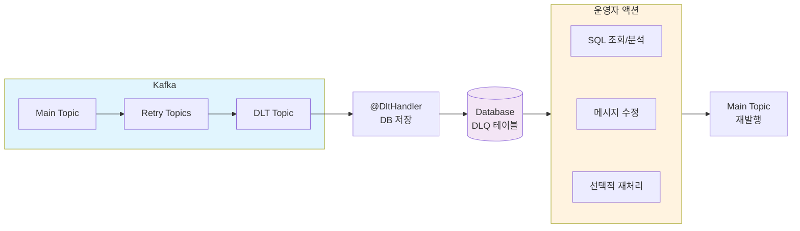
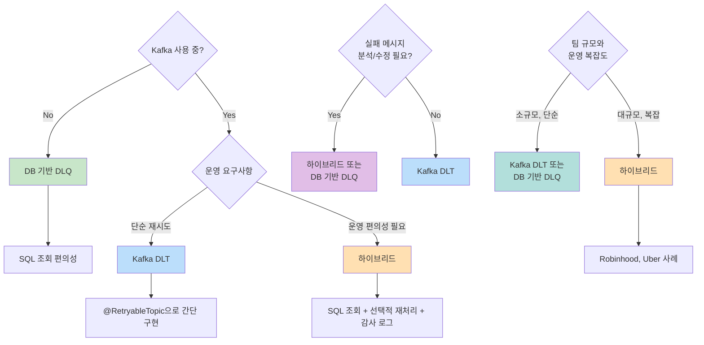

## 왜 DLQ가 필요한가

분산 시스템에서 메시지 처리 실패는 피할 수 없다. 네트워크 지연, 외부 API 오류, 데이터 형식 불일치 등 다양한 이유로 실패가 발생한다.

실패한 메시지를 그냥 버리면 데이터 유실이 발생한다. 무한 재시도하면 시스템이 멈춘다. Dead Letter Queue(DLQ)는 이 문제를 해결한다.

- 처리 실패 메시지를 안전하게 격리
- 메인 처리 흐름 방해 없이 재시도
- 실패 원인 분석 및 디버깅 가능

---

## 세 가지 접근법

| 구분 | Kafka DLT | DB 기반 DLQ | 하이브리드 |
|------|-----------|-------------|------------|
| 저장소 | Kafka Topic | DB 테이블 | DLT → DB → 원본 토픽 |
| 적합한 상황 | 이미 Kafka 사용 중 | 단순한 구조 선호 | 운영 편의성 + Kafka |
| 재처리 방식 | Consumer 재시작 | 스케줄러/배치 | DB에서 원본 토픽으로 재발행 |
| 순서 보장 | 파티션 내 보장 | 명시적 정렬 필요 | 재발행 시점 기준 |
| 모니터링 | Kafka 도구 필요 | SQL로 바로 조회 | SQL + Kafka 모두 가능 |

---

## Kafka DLT (Dead Letter Topic)

Kafka를 이미 사용 중이라면 DLT가 자연스러운 선택이다. Spring Kafka의 `@RetryableTopic`으로 선언적으로 구현한다.

### 구현

```kotlin
@RetryableTopic(
    attempts = "5",
    backoff = Backoff(delay = 5000, multiplier = 2.0),
    dltStrategy = DltStrategy.FAIL_ON_ERROR,
    exclude = [NonRetryableException::class]
)
@KafkaListener(topics = ["vehicle.event"], groupId = "vehicle-service")
fun consume(record: ConsumerRecord<String, String>) {
    val event = objectMapper.readValue(record.value(), VehicleEvent::class.java)
    vehicleService.process(event)
}

@DltHandler
fun handleDlt(
    record: ConsumerRecord<String, String>,
    @Header(KafkaHeaders.EXCEPTION_MESSAGE) errorMessage: String
) {
    log.error("DLT 메시지: ${record.value()}, 오류: $errorMessage")
    alertService.sendAlert("DLT 메시지 발생", errorMessage)
}
```

### 재시도 흐름

```
1차 시도 → 실패 → vehicle.event.retry-0 (5초 후)
2차 시도 → 실패 → vehicle.event.retry-1 (10초 후)
3차 시도 → 실패 → vehicle.event.retry-2 (20초 후)
4차 시도 → 실패 → vehicle.event.retry-3 (40초 후)
5차 시도 → 실패 → vehicle.event.dlt
```

### 장점

- Kafka 인프라 그대로 활용
- Non-blocking 재시도 (메인 토픽 처리 지속)
- 파티션 내 순서 보장

### 단점

- Kafka 의존성 필요
- DLT 메시지 조회가 불편 (별도 Consumer 필요)
- 재처리 시 Consumer 재시작 필요

---

## DB 기반 DLQ

Kafka 없이 단순하게 구현하거나, 실패 메시지를 SQL로 쉽게 조회하고 싶을 때 적합하다. PostgreSQL, MySQL 등 어떤 RDB든 사용 가능하다.

### 테이블 설계

```sql
CREATE TABLE dead_letter_queue (
    id BIGSERIAL PRIMARY KEY,
    message_type VARCHAR(100) NOT NULL,
    message_key VARCHAR(255),
    payload JSONB NOT NULL,
    error_message TEXT,
    retry_count INT DEFAULT 0,
    max_retries INT DEFAULT 5,
    status VARCHAR(20) DEFAULT 'PENDING',  -- PENDING, PROCESSING, COMPLETED, FAILED
    created_at TIMESTAMP DEFAULT NOW(),
    updated_at TIMESTAMP DEFAULT NOW(),
    next_retry_at TIMESTAMP
);

CREATE INDEX idx_dlq_status_next_retry ON dead_letter_queue(status, next_retry_at);
CREATE INDEX idx_dlq_message_type ON dead_letter_queue(message_type);
```

### DLQ 서비스 구현

```kotlin
@Service
class DlqService(
    private val dlqRepository: DlqRepository
) {
    fun save(
        messageType: String,
        messageKey: String?,
        payload: Any,
        error: Exception
    ) {
        val dlq = DeadLetterQueue(
            messageType = messageType,
            messageKey = messageKey,
            payload = objectMapper.writeValueAsString(payload),
            errorMessage = error.message,
            nextRetryAt = calculateNextRetry(retryCount = 0)
        )
        dlqRepository.save(dlq)
        log.warn("DLQ 저장: type=$messageType, key=$messageKey, error=${error.message}")
    }

    private fun calculateNextRetry(retryCount: Int): Instant {
        // 지수 백오프: 5초, 10초, 20초, 40초, 80초
        val delaySeconds = 5L * (1 shl retryCount)
        return Instant.now().plusSeconds(delaySeconds)
    }
}
```

### 메시지 처리에서 DLQ 활용

```kotlin
@Service
class VehicleEventProcessor(
    private val vehicleService: VehicleService,
    private val dlqService: DlqService
) {
    fun process(event: VehicleEvent) {
        try {
            vehicleService.handle(event)
        } catch (e: RetryableException) {
            // DLQ에 저장하고 나중에 재처리
            dlqService.save(
                messageType = "VehicleEvent",
                messageKey = event.vehicleId,
                payload = event,
                error = e
            )
        } catch (e: NonRetryableException) {
            // 재시도 불가능한 오류는 로깅만
            log.error("처리 불가: ${event.vehicleId}", e)
        }
    }
}
```

### 스케줄러로 재처리

```kotlin
@Component
class DlqRetryScheduler(
    private val dlqRepository: DlqRepository,
    private val retryProcessors: Map<String, DlqRetryProcessor>
) {
    @Scheduled(fixedDelay = 10_000)  // 10초마다
    fun retryPendingMessages() {
        val pendingMessages = dlqRepository.findPendingForRetry(
            status = "PENDING",
            nextRetryBefore = Instant.now(),
            limit = 100
        )

        pendingMessages.forEach { dlq ->
            retry(dlq)
        }
    }

    private fun retry(dlq: DeadLetterQueue) {
        val processor = retryProcessors[dlq.messageType]
            ?: return log.warn("Unknown message type: ${dlq.messageType}")

        try {
            dlqRepository.updateStatus(dlq.id, "PROCESSING")

            processor.process(dlq.payload)

            dlqRepository.updateStatus(dlq.id, "COMPLETED")
            log.info("DLQ 재처리 성공: id=${dlq.id}")

        } catch (e: Exception) {
            handleRetryFailure(dlq, e)
        }
    }

    private fun handleRetryFailure(dlq: DeadLetterQueue, e: Exception) {
        val newRetryCount = dlq.retryCount + 1

        if (newRetryCount >= dlq.maxRetries) {
            dlqRepository.updateStatus(dlq.id, "FAILED")
            alertService.sendAlert("DLQ 최대 재시도 초과", dlq)
            log.error("DLQ 최대 재시도 초과: id=${dlq.id}")
        } else {
            dlqRepository.updateForRetry(
                id = dlq.id,
                retryCount = newRetryCount,
                nextRetryAt = calculateNextRetry(newRetryCount),
                errorMessage = e.message
            )
            log.warn("DLQ 재시도 실패, 다음 시도 예정: id=${dlq.id}, count=$newRetryCount")
        }
    }
}
```

### 장점

- SQL로 실패 메시지 바로 조회/분석 가능
- Kafka 없이 독립적으로 운영
- 재처리 로직을 세밀하게 제어 가능

### 단점

- DB 부하 증가 가능
- 별도 스케줄러 구현 필요
- 대량 메시지 처리 시 Kafka보다 불리

---

## 하이브리드: Kafka DLT + Database

Kafka DLT와 Database를 함께 사용하면 각각의 장점을 취할 수 있다. Robinhood, Uber 등 대규모 트래픽을 처리하는 기업들이 채택한 패턴이다.

### 왜 하이브리드인가

Kafka DLT만 사용하면 운영이 불편하다.
- DLT 메시지 조회가 불편 (별도 Consumer 필요)
- 특정 메시지만 선택적 재처리 어려움
- 운영자가 메시지 내용 확인/수정 어려움

Database만 사용하면 성능이 아쉽다.
- Kafka의 순서 보장, 파티셔닝 이점 포기
- 대량 메시지 처리 시 DB 부하

하이브리드는 **Kafka의 처리 성능**과 **Database의 운영 편의성**을 모두 얻는다.

### 아키텍처



### DLT → Database 저장

```kotlin
@DltHandler
fun handleDlt(
    record: ConsumerRecord<String, String>,
    @Header(KafkaHeaders.ORIGINAL_TOPIC) originalTopic: String,
    @Header(KafkaHeaders.ORIGINAL_PARTITION) originalPartition: Int,
    @Header(KafkaHeaders.ORIGINAL_OFFSET) originalOffset: Long,
    @Header(KafkaHeaders.EXCEPTION_MESSAGE) errorMessage: String,
    @Header(KafkaHeaders.EXCEPTION_STACKTRACE) stackTrace: String
) {
    val dlqRecord = DeadLetterRecord(
        originalTopic = originalTopic,
        originalPartition = originalPartition,
        originalOffset = originalOffset,
        messageKey = record.key(),
        payload = record.value(),
        errorMessage = errorMessage,
        stackTrace = stackTrace,
        status = DlqStatus.PENDING,
        createdAt = Instant.now()
    )

    dlqRepository.save(dlqRecord)
    log.error("DLT 메시지 DB 저장: topic=$originalTopic, offset=$originalOffset")

    // 알림 발송
    alertService.sendSlackAlert(
        channel = "#dlq-alerts",
        message = "DLT 메시지 발생: $originalTopic - $errorMessage"
    )
}
```

### Database 테이블 설계

```sql
CREATE TABLE dead_letter_record (
    id BIGSERIAL PRIMARY KEY,

    -- 원본 Kafka 메타데이터
    original_topic VARCHAR(255) NOT NULL,
    original_partition INT NOT NULL,
    original_offset BIGINT NOT NULL,
    message_key VARCHAR(255),

    -- 메시지 내용
    payload JSONB NOT NULL,

    -- 오류 정보
    error_message TEXT,
    stack_trace TEXT,

    -- 재처리 관리
    status VARCHAR(20) DEFAULT 'PENDING',  -- PENDING, PROCESSING, COMPLETED, FAILED, SKIPPED
    retry_count INT DEFAULT 0,
    last_retry_at TIMESTAMP,
    resolved_by VARCHAR(100),  -- 처리한 운영자
    resolution_note TEXT,       -- 처리 메모

    created_at TIMESTAMP DEFAULT NOW(),
    updated_at TIMESTAMP DEFAULT NOW()
);

-- 인덱스
CREATE INDEX idx_dlr_status ON dead_letter_record(status);
CREATE INDEX idx_dlr_topic ON dead_letter_record(original_topic);
CREATE INDEX idx_dlr_created ON dead_letter_record(created_at);
```

### 재처리: Database → 원본 Topic 재발행

```kotlin
@Service
class DlqReprocessService(
    private val dlqRepository: DlqRepository,
    private val kafkaTemplate: KafkaTemplate<String, String>
) {
    /**
     * 선택한 메시지들을 원본 토픽으로 재발행
     */
    @Transactional
    fun reprocess(ids: List<Long>, operatorId: String, note: String) {
        val records = dlqRepository.findAllById(ids)

        records.forEach { record ->
            try {
                // 상태 변경
                record.status = DlqStatus.PROCESSING
                dlqRepository.save(record)

                // 원본 토픽으로 재발행
                kafkaTemplate.send(
                    record.originalTopic,
                    record.messageKey,
                    record.payload
                ).get()  // 동기 전송으로 결과 확인

                // 성공 처리
                record.status = DlqStatus.COMPLETED
                record.resolvedBy = operatorId
                record.resolutionNote = note
                record.lastRetryAt = Instant.now()
                dlqRepository.save(record)

                log.info("DLQ 재처리 성공: id=${record.id}, topic=${record.originalTopic}")

            } catch (e: Exception) {
                record.status = DlqStatus.FAILED
                record.retryCount++
                record.errorMessage = e.message
                dlqRepository.save(record)

                log.error("DLQ 재처리 실패: id=${record.id}", e)
            }
        }
    }

    /**
     * 특정 메시지 건너뛰기 (재처리 불필요한 경우)
     */
    @Transactional
    fun skip(ids: List<Long>, operatorId: String, reason: String) {
        dlqRepository.findAllById(ids).forEach { record ->
            record.status = DlqStatus.SKIPPED
            record.resolvedBy = operatorId
            record.resolutionNote = reason
            dlqRepository.save(record)
        }
    }
}
```

### 운영 API

```kotlin
@RestController
@RequestMapping("/api/dlq")
class DlqController(
    private val dlqRepository: DlqRepository,
    private val reprocessService: DlqReprocessService
) {
    // 목록 조회 (필터링)
    @GetMapping
    fun list(
        @RequestParam status: DlqStatus?,
        @RequestParam topic: String?,
        @RequestParam from: Instant?,
        @RequestParam to: Instant?,
        pageable: Pageable
    ): Page<DeadLetterRecord> {
        return dlqRepository.findByFilters(status, topic, from, to, pageable)
    }

    // 상세 조회
    @GetMapping("/{id}")
    fun get(@PathVariable id: Long): DeadLetterRecord {
        return dlqRepository.findById(id)
            .orElseThrow { NotFoundException("DLQ record not found: $id") }
    }

    // 재처리 요청
    @PostMapping("/reprocess")
    fun reprocess(
        @RequestBody request: ReprocessRequest,
        @AuthenticationPrincipal user: User
    ): ResponseEntity<String> {
        reprocessService.reprocess(request.ids, user.id, request.note)
        return ResponseEntity.ok("Reprocess triggered for ${request.ids.size} records")
    }

    // 건너뛰기
    @PostMapping("/skip")
    fun skip(
        @RequestBody request: SkipRequest,
        @AuthenticationPrincipal user: User
    ): ResponseEntity<String> {
        reprocessService.skip(request.ids, user.id, request.reason)
        return ResponseEntity.ok("Skipped ${request.ids.size} records")
    }
}

data class ReprocessRequest(val ids: List<Long>, val note: String)
data class SkipRequest(val ids: List<Long>, val reason: String)
```

### 장점

- **SQL 조회**: 실패 메시지를 SQL로 즉시 조회/분석
- **선택적 재처리**: 특정 메시지만 골라서 재처리 가능
- **메시지 수정**: payload 수정 후 재발행 가능 (데이터 오류 수정)
- **감사 로그**: 누가 언제 어떻게 처리했는지 기록
- **Kafka 이점 유지**: 재발행 시 원본 토픽의 Consumer가 그대로 처리

### 단점

- 구현 복잡도 증가
- DB와 Kafka 양쪽 관리 필요
- DLT Consumer가 추가로 필요

### 실제 사례

**Robinhood**: Kafka DLT에서 PostgreSQL로 저장 후 CLI 도구로 재처리. 현재는 웹 UI로 발전 중.

**Uber**: Non-blocking retry + DLQ 패턴으로 실시간 트래픽 방해 없이 오류 처리. DB에 메타데이터 저장하여 분석.

---

## 모니터링

### Kafka DLT 모니터링

```kotlin
@Component
class DltMetrics(
    private val meterRegistry: MeterRegistry
) {
    @DltHandler
    fun handleDlt(record: ConsumerRecord<String, String>) {
        meterRegistry.counter("dlt.messages", "topic", record.topic()).increment()
    }
}
```

### PostgreSQL DLQ 모니터링

```sql
-- 상태별 현황
SELECT status, COUNT(*)
FROM dead_letter_queue
GROUP BY status;

-- 메시지 타입별 실패율
SELECT message_type,
       COUNT(*) as total,
       SUM(CASE WHEN status = 'FAILED' THEN 1 ELSE 0 END) as failed
FROM dead_letter_queue
WHERE created_at > NOW() - INTERVAL '1 day'
GROUP BY message_type;

-- 재시도 대기 중인 메시지
SELECT * FROM dead_letter_queue
WHERE status = 'PENDING'
  AND next_retry_at < NOW()
ORDER BY next_retry_at;
```

```kotlin
@Component
class DlqMetrics(
    private val dlqRepository: DlqRepository,
    private val meterRegistry: MeterRegistry
) {
    @Scheduled(fixedRate = 60_000)
    fun recordMetrics() {
        val counts = dlqRepository.countByStatus()
        counts.forEach { (status, count) ->
            meterRegistry.gauge("dlq.messages", listOf(Tag.of("status", status))) { count }
        }
    }
}
```

---

## 어떤 걸 선택할까



---

## 정리

| 전략 | 사용 시점 | 핵심 포인트 |
|------|----------|-------------|
| Kafka DLT | Kafka 인프라 사용, 단순 재시도 | `@RetryableTopic` + `@DltHandler` |
| DB 기반 DLQ | Kafka 미사용, SQL 조회 필요 | JSON 컬럼 + 스케줄러 재처리 |
| 하이브리드 | Kafka + 운영 편의성 | DLT → DB 저장 → 원본 토픽 재발행 |

세 방식 모두 핵심 원칙은 동일하다.

1. **예외 분류**: Retryable vs Non-Retryable 구분
2. **지수 백오프**: 재시도 간격을 점진적으로 증가
3. **최대 재시도 제한**: 무한 루프 방지
4. **모니터링**: 실패 현황 파악 및 알림

---

## 참고 자료

- [Spring Kafka - DLT Strategies](https://docs.spring.io/spring-kafka/reference/retrytopic/dlt-strategies.html)
- [Baeldung - Dead Letter Queue for Kafka With Spring](https://www.baeldung.com/kafka-spring-dead-letter-queue)
- [Confluent - Apache Kafka Dead Letter Queue Guide](https://www.confluent.io/learn/kafka-dead-letter-queue/)
- [Kai Waehner - Error Handling via Dead Letter Queue in Apache Kafka](https://www.kai-waehner.de/blog/2022/05/30/error-handling-via-dead-letter-queue-in-apache-kafka/)
- [Robinhood - Dead Letter Queues for Kafka Consumers (Current 2022)](https://www.slideshare.net/slideshow/dead-letter-queues-for-kafka-consumers-in-robinhood-sreeram-ramji-and-wenlong-xiong-current-2022/253767757)
- [Uber - Building Reliable Reprocessing and Dead Letter Queues with Kafka](https://www.uber.com/blog/reliable-reprocessing/)
- [GitHub - Spring Kafka Non-Blocking Retries and DLT Sample](https://github.com/eugene-khyst/spring-kafka-non-blocking-retries-and-dlt)
