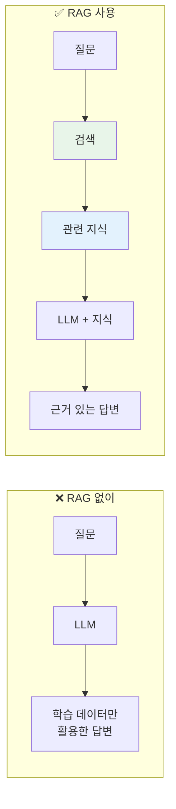
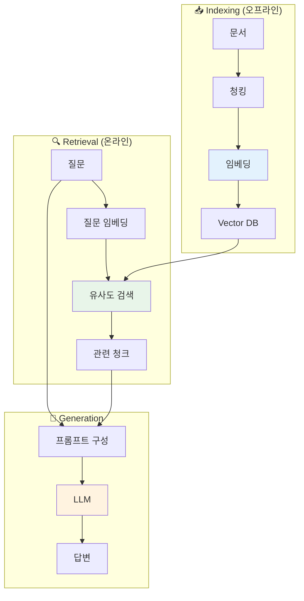
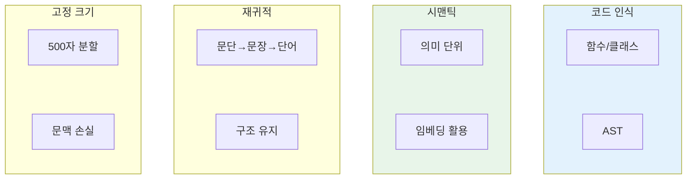
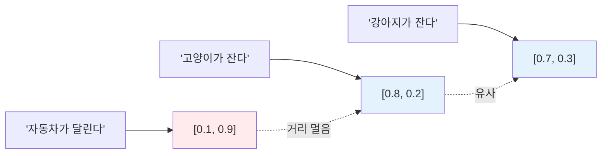
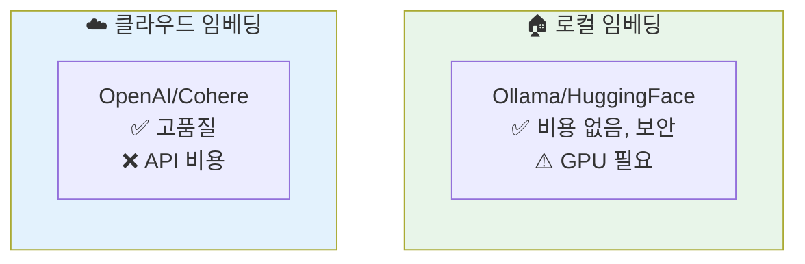
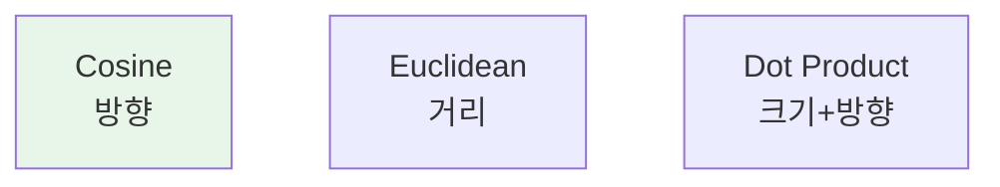
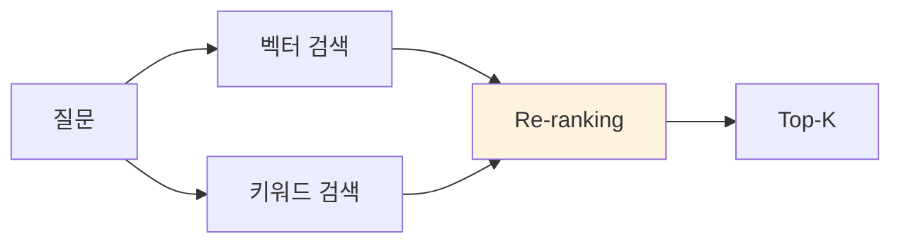
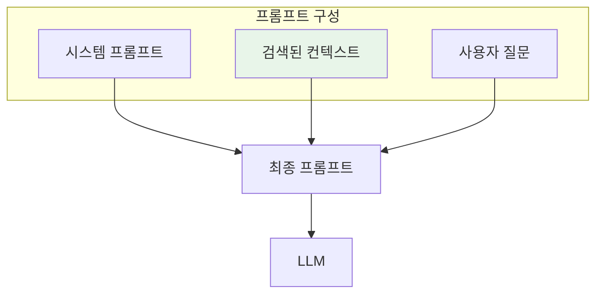
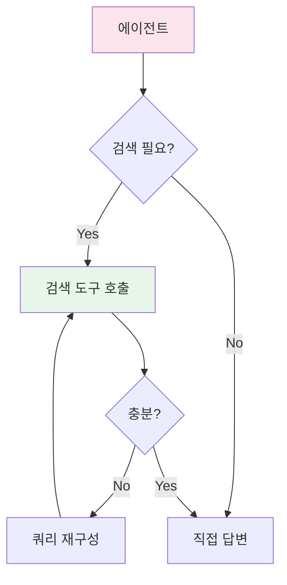
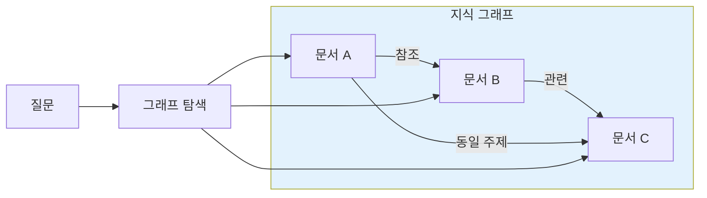

## RAG란 무엇인가

RAG(Retrieval-Augmented Generation)는 **외부 지식을 검색해서 LLM의 응답에 활용**하는 기술이다. LLM의 학습 데이터에 없는 정보(사내 문서, 최신 뉴스, 개인 데이터)를 답변에 포함할 수 있게 한다.

> "RAG is an AI framework for retrieving facts from an external knowledge base to ground large language models on the most accurate, up-to-date information."
> — [IBM What is RAG](https://www.ibm.com/think/topics/retrieval-augmented-generation)



### RAG가 필요한 이유

| 문제 | RAG 없이 | RAG 사용 |
|------|---------|---------|
| 환각(Hallucination) | LLM이 사실 왜곡 | 검증된 출처로 답변 |
| 최신 정보 | 학습 이후 정보 없음 | 실시간 검색 가능 |
| 도메인 지식 | 일반적 답변만 | 사내 문서 활용 |
| 출처 투명성 | 근거 없음 | 참조 문서 명시 |

> "Three converging pressures make RAG essential in 2025: domain-specific accuracy, governance expectations, and the need for source traceability."
> — [RAG in 2025: From Quick Fix to Core Architecture](https://medium.com/@hrk84ya/rag-in-2025-from-quick-fix-to-core-architecture-9a9eb0a42493)

## RAG 아키텍처

RAG는 크게 **Indexing(인덱싱)**과 **Retrieval(검색)** 두 단계로 나뉜다.



## Step 1: 문서 청킹 (Chunking)

문서를 의미 있는 단위로 분할하는 과정이다. 청킹 전략이 RAG 품질의 70%를 결정한다.

> "Chunking is perhaps the most impactful decision in RAG system design. Poor chunking leads to poor retrieval, regardless of how good your embedding model is."
> — [Pinecone Chunking Strategies](https://www.pinecone.io/learn/chunking-strategies/)

### 청킹 전략



| 전략 | 장점 | 단점 | 적합한 상황 |
|------|------|------|------------|
| 고정 크기 | 구현 간단 | 문맥 손실 | 빠른 프로토타입 |
| 재귀적 | 구조 유지 | 불균등 크기 | 일반 문서 |
| 시맨틱 | 의미 보존 | 계산 비용 | 고품질 필요 시 |
| 코드 인식 | 코드 구조 유지 | 언어별 구현 필요 | 코드베이스 |

### 최적의 청크 크기

> "Best practices for RAG in 2025 recommend 400-512 tokens with 10-20% overlap."
> — [Firecrawl RAG Best Practices](https://www.firecrawl.dev/blog/best-chunking-strategies-rag-2025)

| 파라미터 | 권장값 | 이유 |
|----------|--------|------|
| 청크 크기 | 400-512 토큰 | 임베딩 모델 최적 범위 |
| 오버랩 | 10-20% | 청크 경계 문맥 보존 |
| 최소 크기 | 100 토큰 | 의미 없는 조각 필터링 |

## Step 2: 임베딩 (Embedding)

텍스트를 고차원 벡터로 변환하는 과정이다. **의미적으로 유사한 텍스트는 가까운 벡터**가 된다.



### 임베딩 모델 선택

| 모델 | 차원 | 특징 | 비용 |
|------|------|------|------|
| OpenAI text-embedding-3-large | 3072 | 고품질, 다국어 | 유료 |
| Cohere embed-v3 | 1024 | 다국어 강점 | 유료 |
| qwen3-embedding | 1024 | MTEB 1위, 로컬 | 무료 |
| nomic-embed-text | 768 | 가벼움, 로컬 | 무료 |

> "For multilingual use cases, qwen3-embedding ranks #1 on MTEB Multilingual benchmark with 70.58 points."
> — [Ollama qwen3-embedding](https://ollama.com/library/qwen3-embedding)

### 로컬 vs 클라우드



**선택 기준:**

| 상황 | 권장 |
|------|------|
| 사내 코드/문서 | 로컬 (보안) |
| 공개 데이터 | 클라우드 (품질) |
| 비용 민감 | 로컬 |
| 빠른 구축 | 클라우드 |

## Step 3: 벡터 검색 (Vector Search)

질문 벡터와 가장 유사한 문서 벡터를 찾는 과정이다.

### 유사도 측정



| 방식 | 수식 | 특징 | 권장 상황 |
|------|------|------|----------|
| Cosine | cos(θ) | 정규화된 벡터에 적합 | 대부분 |
| Euclidean | √Σ(a-b)² | 크기 차이 반영 | 거리 중요 시 |
| Dot Product | Σ(a×b) | 크기 + 방향 | 비정규화 벡터 |

### 벡터 데이터베이스

| DB | 특징 | 적합한 규모 |
|----|------|------------|
| **Qdrant** | 필터링 강력, Rust 기반 | 중~대규모 |
| **Pinecone** | 관리형, 쉬운 시작 | 모든 규모 |
| **Chroma** | 경량, 임베디드 | 소규모 |
| **Milvus** | 대규모 분산 | 대규모 |
| **pgvector** | PostgreSQL 확장 | 기존 PG 사용 시 |

### 검색 최적화

> "Vector-only retrieval is semantic and can miss exact tokens. Combine dense vectors for semantic recall with sparse/keyword fallback."
> — [RAG Best Practices](https://orkes.io/blog/rag-best-practices/)

**하이브리드 검색:**



| 전략 | 효과 |
|------|------|
| 하이브리드 검색 | 정확한 용어 + 의미 매칭 |
| Re-ranking | 1차 검색 후 정교한 재정렬 |
| 메타데이터 필터 | 범위 축소 (날짜, 카테고리) |
| MMR | 다양성 확보 (중복 제거) |

## Step 4: 프롬프트 구성

검색된 컨텍스트를 LLM 프롬프트에 효과적으로 통합한다.



### 프롬프트 템플릿 예시

```markdown
## 지시사항
아래 컨텍스트를 참고하여 질문에 답변하세요.
컨텍스트에 없는 내용은 "정보가 없습니다"라고 답하세요.

## 컨텍스트
{retrieved_chunks}

## 질문
{user_question}

## 답변
```

### 컨텍스트 윈도우 관리

> "The key challenge in RAG is not finding relevant documents, but fitting them into the context window."
> — [Langchain RAG Tutorial](https://python.langchain.com/docs/tutorials/rag/)

| 전략 | 설명 |
|------|------|
| 토큰 예산 | 컨텍스트에 할당할 최대 토큰 설정 |
| 청크 압축 | 긴 청크를 요약해서 포함 |
| 우선순위 | 유사도 높은 청크 우선 포함 |
| 중복 제거 | 유사한 청크 통합 |

## 고급 RAG 패턴

### 1. Agentic RAG

에이전트가 검색을 도구로 활용한다. 필요할 때만 검색하고, 검색 쿼리도 능동적으로 생성한다.

> "Agentic RAG treats retrieval as a tool that agents can invoke strategically."
> — [LlamaIndex Agentic RAG](https://www.llamaindex.ai/blog/agentic-rag)



### 2. Self-RAG

LLM이 자체적으로 검색 필요성을 판단하고, 검색 결과의 관련성을 평가한다.

| 단계 | 동작 |
|------|------|
| 1. Retrieve? | 검색 필요 여부 판단 |
| 2. Relevant? | 검색 결과 관련성 평가 |
| 3. Supported? | 답변이 검색 결과에 근거하는지 확인 |
| 4. Useful? | 최종 답변 유용성 평가 |

### 3. Graph RAG

문서 간 관계를 그래프로 모델링하여 검색한다.



## RAG 평가 지표

| 지표 | 측정 대상 | 목표 |
|------|----------|------|
| **Precision@K** | 상위 K개 중 관련 문서 비율 | 높을수록 좋음 |
| **Recall@K** | 전체 관련 문서 중 검색된 비율 | 높을수록 좋음 |
| **MRR** | 첫 관련 문서 순위 | 높을수록 좋음 |
| **Faithfulness** | 답변이 컨텍스트에 근거하는지 | 높을수록 좋음 |
| **Answer Relevance** | 답변이 질문에 적절한지 | 높을수록 좋음 |

## 결론

| 핵심 개념 | 요약 |
|----------|------|
| RAG | 외부 지식 검색 + LLM 생성 |
| 청킹 | 품질의 70% 결정, 400-512 토큰 권장 |
| 임베딩 | 의미 기반 벡터 변환 |
| 벡터 검색 | 유사도 기반 문서 검색 |
| 하이브리드 | 벡터 + 키워드 결합 |
| Agentic RAG | 에이전트가 검색을 도구로 활용 |

RAG는 LLM의 가장 큰 약점인 **환각과 지식 한계**를 해결하는 핵심 기술이다. 좋은 RAG 시스템을 만들려면 청킹 전략, 임베딩 모델 선택, 검색 최적화에 충분한 시간을 투자해야 한다.

## 참고 자료

- [What is RAG?](https://www.ibm.com/think/topics/retrieval-augmented-generation) - IBM
- [Chunking Strategies for LLM Applications](https://www.pinecone.io/learn/chunking-strategies/) - Pinecone
- [RAG Best Practices](https://orkes.io/blog/rag-best-practices/) - Orkes
- [Agentic RAG](https://www.llamaindex.ai/blog/agentic-rag) - LlamaIndex
- [RAG in 2025](https://medium.com/@hrk84ya/rag-in-2025-from-quick-fix-to-core-architecture-9a9eb0a42493) - Medium

---

> **이전 글**: [AI Agent 아키텍처의 이해](/dev-notes/posts/2025-10-01-ai-agent-architecture-fundamentals/)
