> 이 글은 Context Engineering의 기초 개념을 다룬다. 실제 구현 사례는 [Claude Flow 시리즈](/dev-notes/posts/2025-11-22-claude-flow-development-story/)에서 확인할 수 있다.

## Context Engineering이란

Context Engineering은 **AI 모델에게 적절한 정보를, 적절한 형식으로, 적절한 타이밍에 제공하는 기술**이다. Prompt Engineering의 진화된 형태로, 단순한 프롬프트 작성을 넘어 전체 정보 흐름을 설계한다.

> "Context engineering is the art and science of dynamically populating the context window with the right information at the right time."
> — Andrej Karpathy, 2025

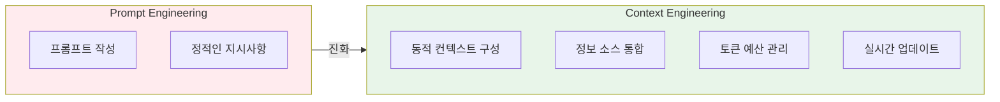

### 왜 Context Engineering인가

| 시대 | 패러다임 | 핵심 |
|------|---------|------|
| 2022 | Prompt Engineering | 좋은 프롬프트 작성 |
| 2023 | RAG | 외부 지식 검색 |
| 2024 | Agentic AI | 도구 사용, 자율 행동 |
| **2025** | **Context Engineering** | **통합 컨텍스트 설계** |

> "We are moving from 'how to ask the model' to 'what information should the model have access to'."
> — Simon Willison, LLM Developer

## Prompt vs Context

**Prompt**는 사용자가 직접 작성하는 텍스트다.
**Context**는 프롬프트를 포함한 LLM이 보는 모든 정보다.

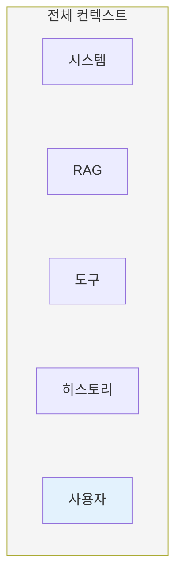

| 구분 | Prompt | Context |
|------|--------|---------|
| 범위 | 사용자 입력 | 모든 입력 정보 |
| 제어 | 사용자 | 시스템 + 사용자 |
| 동적성 | 정적 | 동적 |
| 관리 대상 | 텍스트 | 토큰 예산, 순서, 형식 |

## Context Window의 이해

Context Window는 **LLM이 한 번에 처리할 수 있는 최대 토큰 수**다. 이 제한된 공간을 효율적으로 사용하는 것이 Context Engineering의 핵심이다.

### 주요 모델의 Context Window

| 모델 | Context Window | 참고 |
|------|---------------|------|
| Claude 3.5 Sonnet | 200K 토큰 | ~150,000 단어 |
| GPT-4 Turbo | 128K 토큰 | ~96,000 단어 |
| Gemini 1.5 Pro | 1M 토큰 | ~750,000 단어 |

> "Even with 200K tokens, context window management matters. Not all tokens are equally valuable."
> — [Anthropic Prompt Engineering Guide](https://docs.anthropic.com/en/docs/build-with-claude/prompt-engineering)

### Context Window 구성

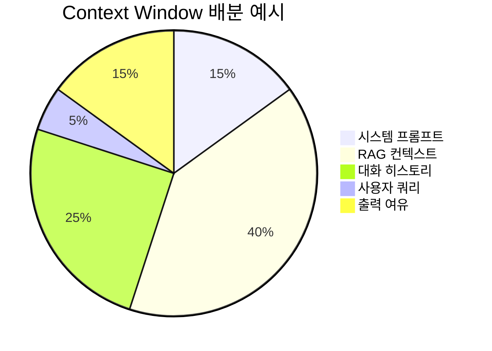

**배분 원칙:**

| 영역 | 권장 비율 | 이유 |
|------|----------|------|
| 시스템 프롬프트 | 10-15% | 일관된 동작 지시 |
| RAG 컨텍스트 | 30-50% | 근거 기반 응답 |
| 대화 히스토리 | 20-30% | 연속성 유지 |
| 사용자 쿼리 | 5-10% | 현재 요청 |
| 출력 여유 | 15-20% | 응답 생성 공간 |

## Context Engineering의 4가지 원칙

### 1. 적시성 (Right Time)

필요한 정보를 필요한 시점에 제공한다.

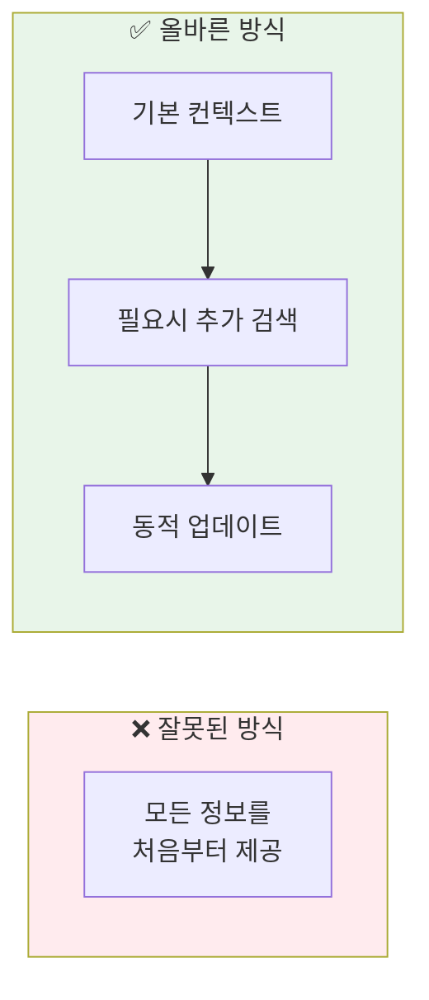

| 전략 | 설명 |
|------|------|
| Lazy Loading | 요청 시점에 정보 로드 |
| Progressive Enrichment | 단계별 컨텍스트 확장 |
| Just-in-Time RAG | 필요할 때만 검색 |

### 2. 적절성 (Right Information)

관련 있는 정보만 포함한다. 노이즈는 성능을 떨어뜨린다.

> "More context is not always better. Irrelevant information can distract the model and degrade performance."
> — [OpenAI Best Practices](https://platform.openai.com/docs/guides/prompt-engineering)

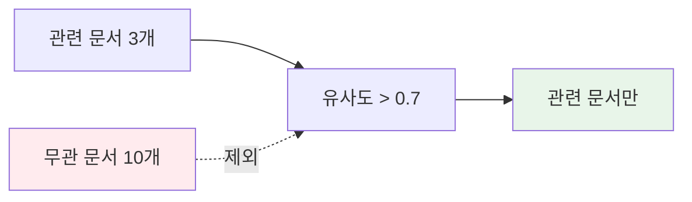

**필터링 전략:**

| 방식 | 임계값 | 용도 |
|------|--------|------|
| 유사도 필터 | 0.7+ | 관련 문서만 포함 |
| 최신성 필터 | 7일 이내 | 시간 민감 정보 |
| 소스 필터 | 신뢰 소스만 | 품질 보장 |

### 3. 적절한 형식 (Right Format)

정보를 LLM이 이해하기 쉬운 구조로 제공한다.

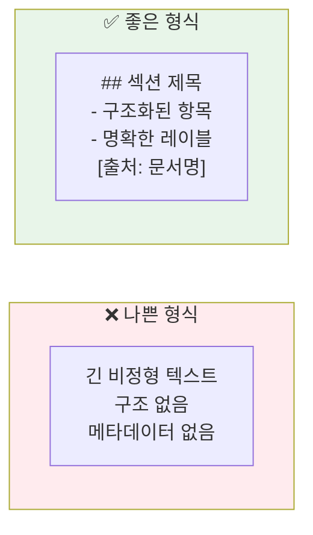

**형식 가이드:**

| 원칙 | 예시 |
|------|------|
| 명확한 구분 | `## 컨텍스트`, `## 질문` 섹션 분리 |
| 메타데이터 포함 | `[출처: 문서명, 날짜]` |
| 계층 구조 | 헤딩, 리스트 활용 |
| 길이 제한 | 청크당 500 토큰 이내 |

### 4. 우선순위 (Right Priority)

중요한 정보가 먼저 오도록 배치한다.

> "LLMs exhibit a 'lost in the middle' phenomenon where information in the middle of long contexts is less likely to be used."
> — [Lost in the Middle Paper](https://arxiv.org/abs/2307.03172)

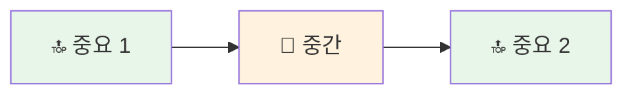

**배치 전략:**

| 위치 | 배치할 내용 |
|------|------------|
| 시작 | 핵심 지시사항, 중요 컨텍스트 |
| 중간 | 보조 정보, 예시 |
| 끝 | 현재 질문, 요약 |

## Context Engineering 패턴

### 패턴 1: Context Enrichment Pipeline

사용자 입력을 받아 자동으로 컨텍스트를 보강하는 파이프라인이다.

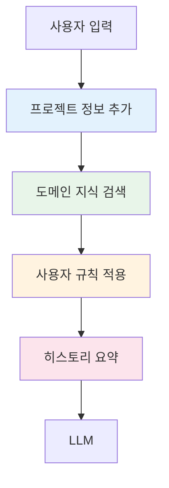

**구성 요소:**

| Enricher | 역할 | 우선순위 |
|----------|------|----------|
| Project Context | 프로젝트 경로, 기술 스택 | 높음 |
| Domain Knowledge | RAG로 검색한 문서 | 높음 |
| User Rules | 개인 선호도, 코딩 스타일 | 중간 |
| History Summary | 이전 대화 요약 | 낮음 |

### 패턴 2: Adaptive Context

상황에 따라 컨텍스트를 동적으로 조절한다.

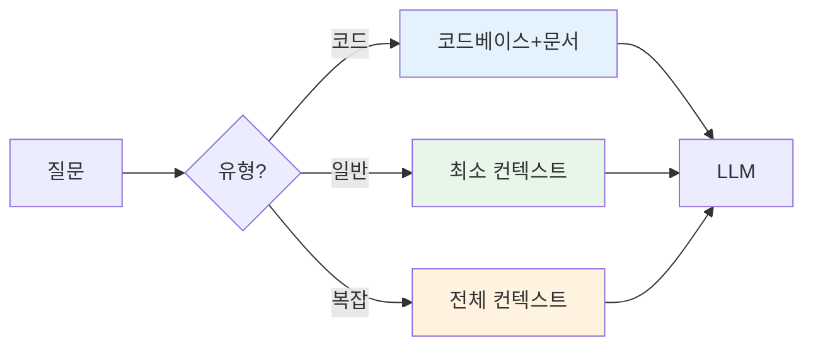

### 패턴 3: Context Compression

긴 컨텍스트를 압축하여 토큰을 절약한다.

| 기법 | 설명 | 압축률 |
|------|------|--------|
| 요약 | LLM으로 긴 텍스트 요약 | 70-80% |
| 추출 | 핵심 문장만 추출 | 50-70% |
| 참조 | 전체 대신 포인터 저장 | 90%+ |

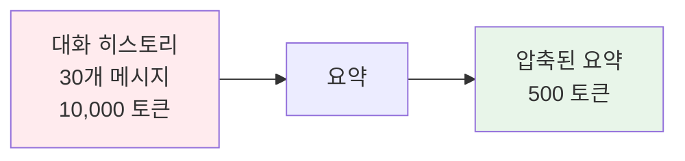

## 프롬프트 캐싱

동일한 컨텍스트를 반복 사용할 때 비용과 레이턴시를 줄이는 기술이다.

> "Cached tokens are 90% cheaper than regular input tokens."
> — [Anthropic Prompt Caching](https://www.anthropic.com/news/prompt-caching)

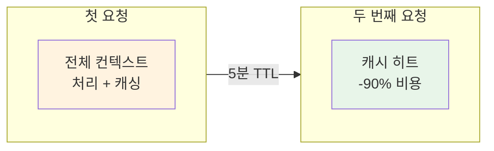

**캐싱 전략:**

| 부분 | 캐시 여부 | 이유 |
|------|----------|------|
| 시스템 프롬프트 | ✅ | 변하지 않음 |
| RAG 컨텍스트 | ⚠️ | 쿼리마다 다름 |
| 대화 히스토리 | ✅ | 누적됨 |
| 사용자 쿼리 | ❌ | 매번 다름 |

## 실전 예시: 코드 리뷰 컨텍스트

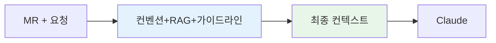

**컨텍스트 구성:**

```markdown
## 시스템 지시사항
당신은 시니어 코드 리뷰어입니다. 아래 컨텍스트를 참고하여 MR을 리뷰하세요.

## 프로젝트 규칙
- Kotlin 코드 스타일 가이드 준수
- 테스트 커버리지 80% 이상 필수
- 보안 민감 정보 하드코딩 금지

## 관련 코드베이스
[RAG로 검색된 유사 코드 3개]

## MR 변경사항
[GitLab API에서 가져온 Diff]

## 리뷰 요청
이 MR을 리뷰하고 개선점을 알려주세요.
```

## 결론

| 핵심 원칙 | 설명 |
|----------|------|
| 적시성 | 필요한 시점에 정보 제공 |
| 적절성 | 관련 있는 정보만 포함 |
| 적절한 형식 | 구조화된 형태로 제공 |
| 우선순위 | 중요한 정보를 시작/끝에 배치 |

Context Engineering은 **LLM의 성능을 결정하는 핵심 요소**다. 좋은 프롬프트보다 좋은 컨텍스트가 더 중요하다. AI 시스템을 설계할 때 "어떤 정보를 어떻게 제공할 것인가"를 가장 먼저 고민해야 한다.

## 참고 자료

- [Prompt Engineering Guide](https://docs.anthropic.com/en/docs/build-with-claude/prompt-engineering) - Anthropic
- [Lost in the Middle](https://arxiv.org/abs/2307.03172) - arXiv
- [Prompt Caching](https://www.anthropic.com/news/prompt-caching) - Anthropic
- [Context Window Optimization](https://www.pinecone.io/learn/context-window/) - Pinecone

---

> **이전 글**: [RAG 시스템 설계 가이드](/dev-notes/posts/2025-10-05-rag-system-design-guide/)
> **다음 글**: [Claude Flow 개발기](/dev-notes/posts/2025-11-22-claude-flow-development-story/) - 실제 구현 사례
