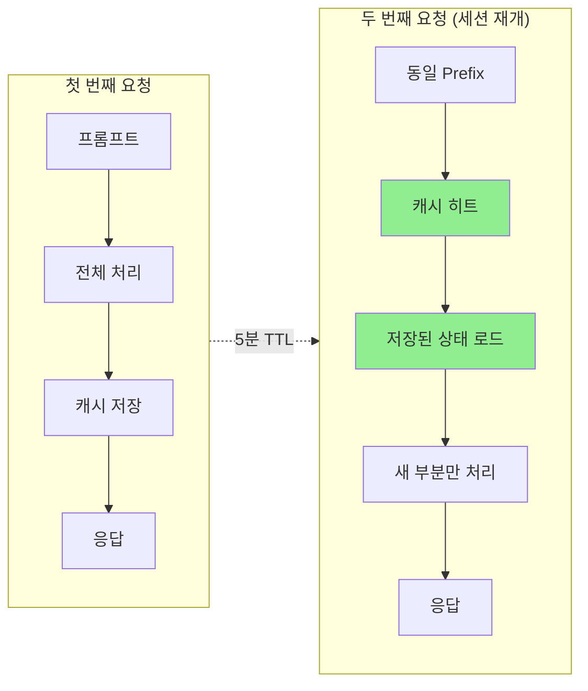
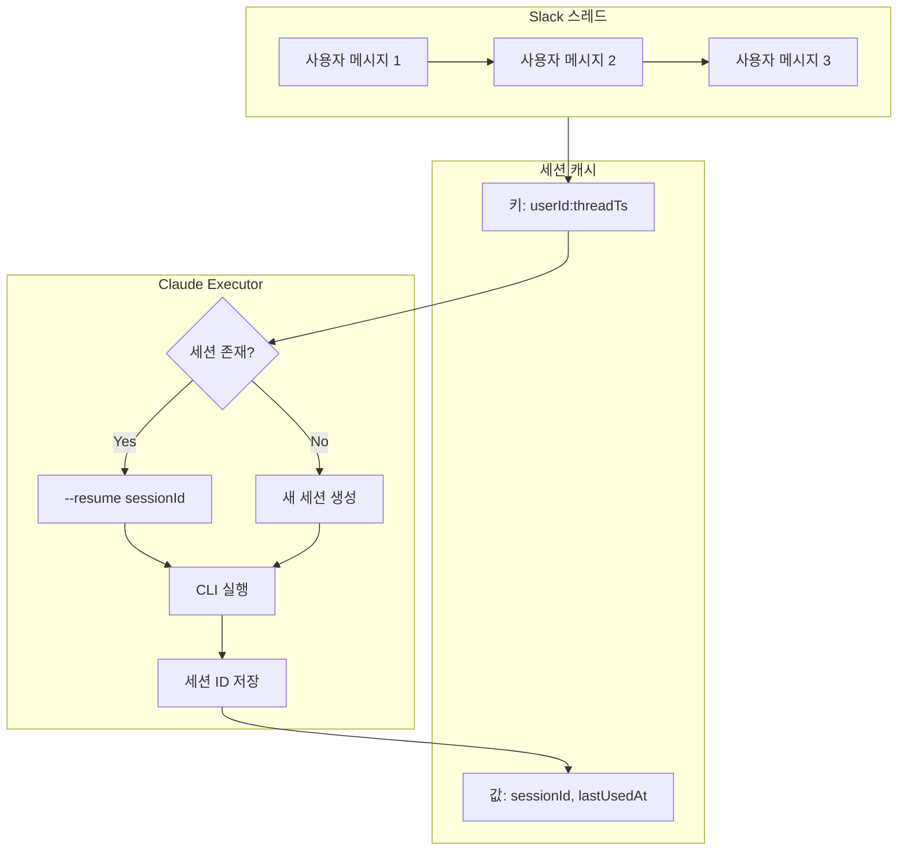

> 이 글은 [Claude Flow](https://github.com/Gyeom/claude-flow) 프로젝트를 개발하면서 정리한 내용이다. 전체 아키텍처는 [개발기](/dev-notes/posts/2024-12-22-claude-flow-development-story/)에서 확인할 수 있다.

## 왜 세션 관리가 중요한가

Claude Code로 개발할 때 매번 새 세션을 시작하면 같은 컨텍스트를 반복해서 전달하게 된다. 프로젝트 구조, 코딩 컨벤션, 이전 대화 내용을 매번 다시 입력하면 토큰 낭비가 심하다.

세션을 재개(resume)하면 이전 대화 히스토리와 컨텍스트를 그대로 유지하면서 작업을 이어갈 수 있다.

## 프롬프트 캐싱: 핵심 메커니즘

### 동작 원리

세션 재개가 효과적인 이유는 **프롬프트 캐싱** 덕분이다.

> The model doesn't just store the raw text—it preserves its entire internal state after processing the cached portion. When processing text, each layer generates activation patterns and state vectors. With caching, the model saves all these attention patterns and hidden states (specifically, the K and V tensors). — [Claude Prompt Caching](https://claude.com/blog/prompt-caching)



LLM은 트랜스포머 아키텍처를 사용하며, 각 레이어에서 Attention 패턴과 상태 벡터(K, V 텐서)를 생성한다. 캐싱은 이 모든 계산 결과를 GPU 메모리에 저장해두고, 동일한 프리픽스가 들어오면 저장된 상태를 로드한다.

### 비용 구조

> Cached tokens are 90% cheaper than regular input tokens. While caching prompts initially costs 25% more than standard API usage, subsequent uses are 90% cheaper. — [Anthropic Prompt Caching](https://www.anthropic.com/news/prompt-caching)

| 토큰 타입 | 비용 (Claude 3.5 Sonnet 기준) |
|----------|------------------------------|
| 일반 입력 | $3 / 1M 토큰 |
| 캐시 쓰기 | $3.75 / 1M 토큰 (+25%) |
| 캐시 읽기 | $0.30 / 1M 토큰 (-90%) |

캐시는 기본 5분 TTL이며, 사용할 때마다 무료로 갱신된다.

## 세션 재개 사용법

### CLI 옵션

```bash
# 가장 최근 대화 계속
claude -c

# 특정 세션 ID로 재개
claude --resume abc123

# 대화 목록에서 선택
claude --resume
```

### 자동화 환경

스크립트나 CI/CD에서는 세션 ID를 명시한다.

```bash
claude --resume session-abc123 --print "다음 단계 진행해줘"
```

## 세션 관리 아키텍처

Claude Flow에서는 Slack 스레드 기반으로 세션을 관리한다.



### 핵심 설계

**세션 키**: `userId:threadTs` 조합으로 사용자와 대화 컨텍스트를 식별한다.

**TTL 관리**: 30분 동안 활동이 없으면 세션이 만료된다. Claude의 5분 캐시 TTL보다 길게 설정하여, 캐시가 갱신될 기회를 충분히 준다.

**크기 제한**: 최대 1,000개 세션을 유지하고, 초과 시 가장 오래된 세션부터 제거한다.

> 전체 구현은 [GitHub](https://github.com/Gyeom/claude-flow)에서 확인할 수 있다.

## 토큰 절감 효과

### 실제 벤치마크

Anthropic의 공식 벤치마크에 따르면:

| 사용 사례 | 레이턴시 감소 | 비용 감소 |
|----------|-------------|----------|
| 100K 토큰 문서 채팅 | 79% | 90% |
| 10K 토큰 Few-shot 프롬프팅 | 31% | 86% |
| 10턴 대화 (긴 시스템 프롬프트) | 75% | 53% |

> Chat with a Book: 79% reduction in latency and 90% cost reduction for a 100,000 token cached prompt. — [Prompt Caching with Claude](https://www.anthropic.com/news/prompt-caching)

### Claude Flow 적용 결과

CLAUDE.md 최적화와 세션 재개를 결합하면:

- 세션당 약 1,300 토큰 절감
- 시작 시 토큰: 약 800 토큰으로 감소
- 전체적으로 **30-40% 토큰 절감**

## 베스트 프랙티스

### 1. CLAUDE.md 최적화

> Claude loads CLAUDE.md automatically at session start. — [Practical Workflow for Token Usage](https://gist.github.com/artemgetmann/74f28d2958b53baf50597b669d4bce43)

```markdown
# 프로젝트 개요
Slack 기반 Claude Code 봇

## 아키텍처
- ClaudeExecutor: CLI 실행 및 세션 관리
- SessionManager: 대화 히스토리 추적

## 코딩 컨벤션
- Kotlin 코루틴 사용
- 테스트는 Kotest BehaviorSpec
```

**5,000 토큰 이하**로 유지하면 캐시 효율이 좋다.

### 2. Document & Clear 패턴

대규모 작업에서는 자동 compaction보다 명시적 정리가 안정적이다.

```mermaid
flowchart LR
    A[작업 진행] --> B[계획/진행 상황을<br/>.md로 작성]
    B --> C[/clear로<br/>세션 초기화]
    C --> D[새 세션에서<br/>.md 읽고 계속]
```

1. Claude에게 계획과 진행 상황을 .md 파일로 작성하게 한다
2. `/clear`로 세션을 초기화한다
3. 새 세션에서 .md를 읽고 작업을 계속한다

### 3. 세션 요약 활용

오래된 세션을 재개할 때 이전 경험을 물어보고 CLAUDE.md에 반영하면 같은 실수를 줄일 수 있다.

```bash
# 며칠 전 세션 재개
claude --resume old-session-123

# 질문
"이 세션에서 API 인증 에러를 어떻게 해결했어?"

# 답변을 CLAUDE.md에 추가
```

## 결론

세션 재개는 단순한 편의 기능이 아니라 **비용 최적화의 핵심**이다.

| 전략 | 효과 |
|------|------|
| 세션 재개 (`--resume`) | 컨텍스트 재사용 |
| 프롬프트 캐싱 | 90% 비용 절감 (캐시 히트 시) |
| CLAUDE.md 최적화 | 시작 토큰 최소화 |
| TTL 관리 (30분) | 캐시 갱신 기회 확보 |

이 조합으로 **30-40% 이상 토큰을 절감**할 수 있다.

## 참고 자료

- [Prompt caching with Claude](https://www.anthropic.com/news/prompt-caching) - Anthropic 공식 블로그
- [Prompt caching - Claude Docs](https://docs.claude.com/en/docs/build-with-claude/prompt-caching) - 공식 문서
- [Practical workflow for reducing token usage](https://gist.github.com/artemgetmann/74f28d2958b53baf50597b669d4bce43) - 실용적 가이드
- [Supercharge your development with Claude Code and Amazon Bedrock prompt caching](https://aws.amazon.com/blogs/machine-learning/supercharge-your-development-with-claude-code-and-amazon-bedrock-prompt-caching/) - AWS 블로그
- [Token-saving updates on the Anthropic API](https://claude.com/blog/token-saving-updates) - 2025년 토큰 절약 업데이트
