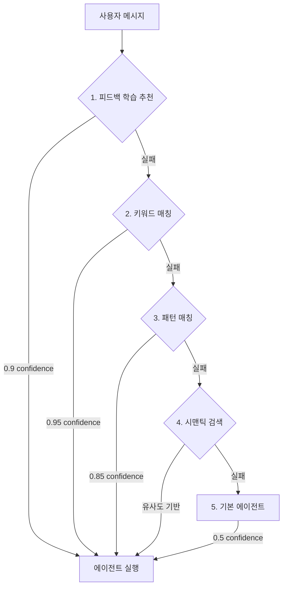

> 이 글은 [Claude Flow](https://github.com/Gyeom/claude-flow) 프로젝트를 개발하면서 정리한 내용이다. 전체 아키텍처는 [개발기](/dev-notes/posts/2024-12-22-claude-flow-development-story/)에서 확인할 수 있다.

## 개요

멀티 에이전트 시스템에서 사용자 요청을 적절한 에이전트로 라우팅하는 것은 전체 시스템의 품질을 결정한다. 잘못된 라우팅은 사용자 경험을 해치고, 불필요한 컴퓨팅 리소스를 낭비한다. 이 글에서는 Claude Flow 프로젝트에서 구현한 5단계 다단계 라우팅 파이프라인을 소개한다.

## 라우팅 파이프라인 아키텍처

라우팅은 빠르고 정확한 방법부터 느리지만 유연한 방법까지 순차적으로 시도하는 폭포수(waterfall) 구조로 설계했다. 각 단계는 서로 다른 confidence score를 가지며, 이는 라우팅 결과의 신뢰도를 나타낸다.



### 1단계: 피드백 학습 기반 추천 (Confidence: 0.9)

사용자의 과거 피드백을 학습하여 유사한 쿼리에 대해 선호하는 에이전트를 추천한다. 이는 개인화된 라우팅을 가능하게 한다.

```kotlin
private fun feedbackLearningMatch(
    message: String,
    userId: String,
    agents: List<Agent>
): AgentMatch? {
    val recommendation = feedbackLearningService?.recommendAgentFromSimilar(
        query = message,
        userId = userId,
        topK = 5
    ) ?: return null

    // 높은 신뢰도 (0.8 이상)만 사용
    if (recommendation.confidence < 0.8f) return null

    val agent = agents.find { it.id == recommendation.agentId } ?: return null

    return AgentMatch(
        agent = agent,
        confidence = recommendation.confidence.toDouble().coerceAtMost(0.9),
        matchedKeyword = recommendation.reason,
        method = RoutingMethod.FEEDBACK_LEARNING
    )
}
```

**설계 근거**:
- 사용자별 선호도를 학습하면 반복적인 작업에서 정확도가 높아진다
- 0.9로 제한한 이유: 피드백은 과거 데이터이므로 현재 의도와 다를 수 있어 100% 신뢰하지 않는다
- 0.8 threshold: 충분히 유사한 쿼리만 사용하여 오매칭을 방지한다

### 2단계: 키워드 매칭 (Confidence: 0.95)

가장 빠르고 직관적인 방법이다. 각 에이전트는 키워드 리스트를 가지며, 메시지에 키워드가 포함되면 즉시 매칭된다.

```kotlin
private fun keywordMatch(message: String, agents: List<Agent>): AgentMatch? {
    for (agent in agents) {
        for (keyword in agent.keywords) {
            if (message.contains(keyword.lowercase())) {
                return AgentMatch(
                    agent = agent,
                    confidence = 0.95,
                    matchedKeyword = keyword,
                    method = RoutingMethod.KEYWORD
                )
            }
        }
    }
    return null
}
```

**설계 근거**:
- 명확한 키워드("리뷰", "버그", "수정")는 사용자 의도를 정확히 반영한다
- 0.95로 설정한 이유: 가장 높은 신뢰도이지만, 동음이의어나 맥락 오해 가능성을 고려해 100%는 아니다
- O(n*m) 복잡도이지만 키워드 개수가 적어 충분히 빠르다 (보통 1ms 이하)

### 3단계: 정규식 패턴 매칭 (Confidence: 0.85)

복잡한 패턴을 인식한다. 예를 들어 "MR #123" 같은 이슈 참조나 "NullPointerException" 같은 특정 에러 타입을 감지한다.

```kotlin
private fun patternMatch(message: String, agents: List<Agent>): AgentMatch? {
    val patterns = mapOf(
        Regex("(mr|merge request|pull request|pr)\\s*(#?\\d+)?", RegexOption.IGNORE_CASE) to "code-reviewer",
        Regex("(버그|bug|에러|error|오류|exception|crash)", RegexOption.IGNORE_CASE) to "bug-fixer",
        Regex("(리뷰|review|검토|코드\\s*리뷰)", RegexOption.IGNORE_CASE) to "code-reviewer",
        Regex("(수정|fix|고쳐|patch|debug)", RegexOption.IGNORE_CASE) to "bug-fixer",
        Regex("(설명|explain|뭐야|무엇|어떻게|how|what|why)", RegexOption.IGNORE_CASE) to "general"
    )

    for ((pattern, agentId) in patterns) {
        if (pattern.containsMatchIn(message)) {
            val agent = agents.find { it.id == agentId }
            if (agent != null) {
                return AgentMatch(
                    agent = agent,
                    confidence = 0.85,
                    matchedKeyword = pattern.pattern,
                    method = RoutingMethod.PATTERN
                )
            }
        }
    }
    return null
}
```

**설계 근거**:
- 키워드보다 유연하지만, 정규식 복잡도에 따라 오탐 가능성이 있어 0.85로 설정했다
- 한글/영어 동시 지원으로 다국어 환경에서 유용하다
- 패턴 개수가 적어 성능 저하가 없다 (보통 2-3ms)

### 4단계: 시맨틱 검색 (Confidence: 유사도 기반)

벡터 임베딩을 사용한 의미 기반 검색이다. 키워드나 패턴으로 매칭되지 않는 자연어 쿼리를 처리한다.

```kotlin
// 시맨틱 검색 (벡터 유사도, 선택적)
semanticRouter?.classify(message, enabledAgents)?.let { match ->
    val adjustedMatch = adjustMatchWithFeedback(match, userId)
    logger.debug { "Semantic match: ${adjustedMatch.agent.id}" }
    return adjustedMatch
}
```

시맨틱 라우터는 선택적 컴포넌트다. 임베딩 모델과 벡터 DB가 필요하므로, 빠른 응답이 중요한 환경에서는 비활성화할 수 있다.

**우선순위 보정**:
각 에이전트는 priority 값을 가지며, 이는 시맨틱 점수에 가중치로 작용한다.

```kotlin
/**
 * 시맨틱 점수에 priority 보정 적용
 * 우선순위 점수 보정 공식: score * (1.0 + priority/1000.0)
 */
fun adjustSemanticScore(rawScore: Double, priority: Int): Double {
    val bonus = priority.coerceIn(0, 1000) / 1000.0
    return rawScore * (1.0 + bonus)
}
```

예를 들어, "코드 정리해줘"라는 요청에 대해:
- `refactor` 에이전트: 유사도 0.7, priority 150 → 조정된 점수 = 0.7 * 1.15 = 0.805
- `general` 에이전트: 유사도 0.75, priority 0 → 조정된 점수 = 0.75 * 1.0 = 0.75

결과적으로 더 전문화된 에이전트가 선택된다.

### 5단계: 기본 에이전트 폴백 (Confidence: 0.5)

모든 매칭이 실패하면 기본 에이전트(general)로 폴백한다. 이는 항상 동작을 보장하지만, 낮은 confidence로 결과 품질을 알린다.

```kotlin
// 기본 에이전트로 폴백
val defaultAgent = enabledAgents.find { it.id == "general" }
    ?: enabledAgents.firstOrNull()
    ?: Agent.GENERAL

logger.debug { "Fallback to default: ${defaultAgent.id}" }
return AgentMatch(
    agent = defaultAgent,
    confidence = 0.5,
    matchedKeyword = null
)
```

**설계 근거**:
- 0.5로 설정한 이유: 시스템이 불확실하다는 신호를 명확히 한다
- UI에서 이를 활용하여 "이 응답이 도움이 되었나요?" 같은 피드백을 수집할 수 있다

## 한국어 최적화

한국어는 조사, 동의어, 초성 검색 등 특수한 처리가 필요하다. `KoreanOptimizedRouter`는 이를 지원한다.

### 조사 제거

"리뷰를", "리뷰가", "리뷰는" → "리뷰"

```kotlin
private fun removeJosa(text: String): String {
    var result = text
    for (josa in josaList.sortedByDescending { it.length }) {
        result = result.replace(Regex("(\\S+)$josa(?=\\s|$)")) { matchResult ->
            matchResult.groupValues[1]
        }
    }
    return result
}
```

### 초성 검색

"ㅋㄷㄹㅂ" → "코드 리뷰"

```kotlin
fun extractChoseong(text: String): String {
    return text.map { char ->
        if (char in '가'..'힣') {
            val index = (char.code - 0xAC00) / 28 / 21
            choseong[index]
        } else {
            char
        }
    }.joinToString("")
}
```

이를 통해 빠른 타이핑을 지원한다. 모바일이나 메신저 환경에서 유용하다.

### 동의어 확장

"검토" → "리뷰", "봐줘" → "리뷰"

```kotlin
private val synonyms = mapOf(
    "리뷰" to listOf("검토", "검수", "확인", "봐줘", "체크"),
    "코드" to listOf("소스", "프로그램", "스크립트"),
    "버그" to listOf("오류", "에러", "결함", "이슈", "문제")
)
```

### 오타 교정

Levenshtein 거리를 사용하여 "리뷔" → "리뷰" 같은 오타를 자동 보정한다.

```kotlin
private fun matchWithTypoCorrection(keywords: List<String>, targetKeyword: String): String? {
    for (keyword in keywords) {
        if (keyword.length >= 2 && targetKeyword.length >= 2) {
            val distance = levenshteinDistance(keyword, targetKeyword)
            if (distance <= typoThreshold && distance < keyword.length / 2) {
                return keyword
            }
        }
    }
    return null
}
```

## Confidence Score 설계 철학

각 단계의 confidence score는 다음 원칙으로 설정했다:

1. **명확성**: 사용자 의도가 명확할수록 높다 (키워드 0.95 > 패턴 0.85)
2. **직접성**: 직접적인 매칭일수록 높다 (키워드 0.95 > 시맨틱 유사도 기반)
3. **학습 기반**: 피드백 학습은 개인화되지만 과거 데이터이므로 0.9로 제한
4. **폴백 신호**: 기본 폴백은 0.5로 설정하여 "확실하지 않음"을 명시

이 점수는 단순히 라우팅에만 쓰이지 않는다. 애플리케이션 레벨에서 다음과 같이 활용할 수 있다:

```kotlin
val match = router.route(userMessage, userId)

when {
    match.confidence >= 0.9 -> {
        // 높은 신뢰도: 바로 실행
        executeAgent(match.agent)
    }
    match.confidence >= 0.7 -> {
        // 중간 신뢰도: 확인 후 실행
        askConfirmation("${match.agent.name}(으)로 처리할까요?")
    }
    else -> {
        // 낮은 신뢰도: 선택지 제공
        showAgentOptions(agents)
    }
}
```

## 피드백 루프

라우팅 결과에 대한 사용자 피드백을 수집하여 1단계(피드백 학습)의 정확도를 높인다.

```kotlin
// 사용자가 👍 또는 👎 피드백을 주면
feedbackLearningService.recordFeedback(
    userId = userId,
    query = userMessage,
    agentId = match.agent.id,
    wasHelpful = true  // 또는 false
)

// 향후 유사한 쿼리에서 이 정보를 활용
val recommendation = feedbackLearningService.recommendAgentFromSimilar(
    query = newMessage,
    userId = userId,
    topK = 5
)
```

이는 시스템이 사용자와 함께 성장하는 구조다. 초기에는 키워드/패턴 매칭에 의존하지만, 시간이 지나면서 피드백 학습이 주도적인 라우팅 메커니즘이 된다.

## 성능 최적화

### 단락 평가 (Short-circuit Evaluation)

각 단계는 성공 시 즉시 반환한다. 대부분의 경우 2단계(키워드 매칭)에서 종료되므로 평균 응답 시간은 1-2ms다.

```kotlin
// 0. 피드백 학습 (선택적)
feedbackLearningMatch(...)?.let { return it }

// 1. 키워드 매칭 (대부분 여기서 종료)
keywordMatch(...)?.let { return it }

// 2. 패턴 매칭
patternMatch(...)?.let { return it }

// 3. 시맨틱 검색 (느림, 선택적)
semanticRouter?.classify(...)?.let { return it }

// 4. 폴백 (항상 성공)
return defaultMatch()
```

### 캐싱 전략

동일한 메시지에 대한 반복 요청을 캐싱하여 불필요한 연산을 제거할 수 있다.

```kotlin
private val routingCache = ConcurrentHashMap<String, AgentMatch>()

fun route(message: String, userId: String? = null): AgentMatch {
    val cacheKey = "$userId:$message"
    routingCache[cacheKey]?.let { cached ->
        return cached.copy(method = RoutingMethod.CACHE)
    }

    val match = performRouting(message, userId)
    routingCache[cacheKey] = match
    return match
}
```

## 멀티 에이전트 시스템 트렌드

2025년 현재, 에이전트 라우팅은 AI 오케스트레이션의 핵심 과제다. 주요 트렌드는 다음과 같다:

### 1. Confidence Score 기반 의사결정

높은 신뢰도(>90%)는 자동 실행, 중간(70-90%)은 확인 후 실행, 낮은 신뢰도(<70%)는 옵션 제공 방식이 표준화되고 있다. 이는 사용자 경험과 자동화의 균형을 맞춘다.

### 2. Semantic Router의 부상

[Aurelio Labs의 Semantic Router](https://github.com/aurelio-labs/semantic-router)는 벡터 공간을 활용한 초고속 의사결정을 제공한다. LLM을 거치지 않고 라우팅 결정을 내려 레이턴시를 크게 줄인다.

### 3. 하이브리드 접근법

키워드(빠름) + 시맨틱(유연함)을 결합한 하이브리드 방식이 주류다. 이는 우리가 구현한 다단계 파이프라인과 같은 방향이다.

### 4. Self-Correcting 시스템

[Gemini 기반 Self-Correcting Multi-Agent AI](https://www.marktechpost.com/2025/12/15/how-to-design-a-gemini-powered-self-correcting-multi-agent-ai-system-with-semantic-routing-symbolic-guardrails-and-reflexive-orchestration/)처럼, 라우팅 결과를 검증하고 자동으로 수정하는 시스템이 등장했다.

### 5. 플랫폼 통합

Microsoft는 2025년 10월 AutoGen과 Semantic Kernel을 Microsoft Agent Framework로 통합했다. LangChain, CrewAI 등도 라우팅을 핵심 기능으로 지원한다.

## 테스트 전략

라우팅 정확도를 검증하기 위한 테스트 예시다.

```kotlin
class AgentRouterTest : BehaviorSpec({
    Given("코드 리뷰 관련 메시지가 주어졌을 때") {
        val router = AgentRouter()

        When("'코드 리뷰 해줘' 메시지로 라우팅하면") {
            val match = router.route("코드 리뷰 해줘")

            Then("code-reviewer 에이전트가 선택되어야 한다") {
                match.agent.id shouldBe "code-reviewer"
            }

            Then("confidence가 높아야 한다") {
                match.confidence shouldBeGreaterThan 0.8
            }
        }

        When("'MR 좀 봐줘' 메시지로 라우팅하면") {
            val match = router.route("MR 좀 봐줘")

            Then("code-reviewer 에이전트가 선택되어야 한다") {
                match.agent.id shouldBe "code-reviewer"
            }
        }
    }

    Given("매칭되는 키워드가 없는 메시지로 라우팅하면") {
        val router = AgentRouter()
        val match = router.route("안녕하세요")

        Then("general 에이전트로 폴백되어야 한다") {
            match.agent.id shouldBe "general"
        }

        Then("confidence가 낮아야 한다") {
            match.confidence shouldBe 0.5
        }
    }
})
```

실제 사용자 쿼리를 수집하여 정확도를 측정하는 것도 중요하다. 목표는 95% 이상의 정확도다 (상위 3단계 안에 정답이 있는 비율).

## 확장 가능성

### 동적 에이전트 추가

```kotlin
val customAgent = Agent(
    id = "test-agent",
    name = "Test Agent",
    description = "테스트 자동화 에이전트",
    keywords = listOf("테스트", "test", "검증"),
    systemPrompt = "You are a testing expert..."
)

router.addAgent(customAgent)

// 즉시 라우팅 가능
val match = router.route("테스트 해줘")
// match.agent.id == "test-agent"
```

### 에이전트 우선순위 조정

```kotlin
router.updateAgent("refactor", AgentUpdate(
    priority = 200  // 더 높은 우선순위
))
```

### 프로젝트별 에이전트

특정 프로젝트에서만 활성화되는 전문 에이전트를 만들 수 있다.

```kotlin
val projectAgent = Agent(
    id = "kotlin-expert",
    name = "Kotlin Expert",
    description = "Kotlin 코드 분석 전문가",
    keywords = listOf("kotlin", "코루틴", "coroutine"),
    systemPrompt = "...",
    projectId = "my-kotlin-project"
)
```

## 결론

다단계 라우팅 파이프라인은 속도와 정확도, 유연성을 모두 달성한다. 핵심은 다음과 같다:

1. **빠른 경로 우선**: 대부분의 경우 키워드 매칭으로 1-2ms 내 처리
2. **점진적 폴백**: 복잡한 쿼리는 시맨틱 검색으로 유연하게 대응
3. **명확한 신뢰도**: Confidence score로 결과 품질을 정량화
4. **피드백 학습**: 사용자와 함께 성장하는 시스템
5. **한국어 최적화**: 조사, 초성, 동의어, 오타 교정 지원

이 구조는 멀티 에이전트 시스템의 핵심 과제인 "올바른 에이전트 선택"을 체계적으로 해결한다. Confidence score는 단순한 내부 지표가 아니라, 사용자 경험과 자동화 수준을 조정하는 인터페이스가 된다.

## 참고 자료

- [A Taxonomy of Hierarchical Multi-Agent Systems](https://arxiv.org/html/2508.12683)
- [Developer's guide to multi-agent patterns in ADK](https://developers.googleblog.com/developers-guide-to-multi-agent-patterns-in-adk/)
- [AI Agent Routing: Tutorial & Best Practices](https://www.patronus.ai/ai-agent-development/ai-agent-routing)
- [LLM Semantic Router: Intelligent request routing](https://developers.redhat.com/articles/2025/05/20/llm-semantic-router-intelligent-request-routing)
- [Semantic Router by Aurelio Labs](https://github.com/aurelio-labs/semantic-router)
- [Gemini Self-Correcting Multi-Agent AI System](https://www.marktechpost.com/2025/12/15/how-to-design-a-gemini-powered-self-correcting-multi-agent-ai-system-with-semantic-routing-symbolic-guardrails-and-reflexive-orchestration/)
- [The AI Agent Framework Landscape in 2025](https://medium.com/@hieutrantrung.it/the-ai-agent-framework-landscape-in-2025-what-changed-and-what-matters-3cd9b07ef2c3)
