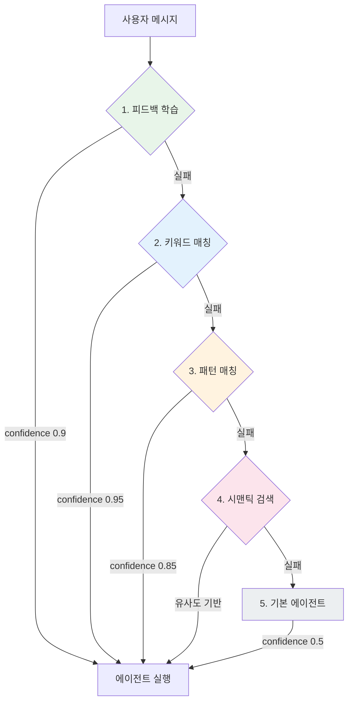
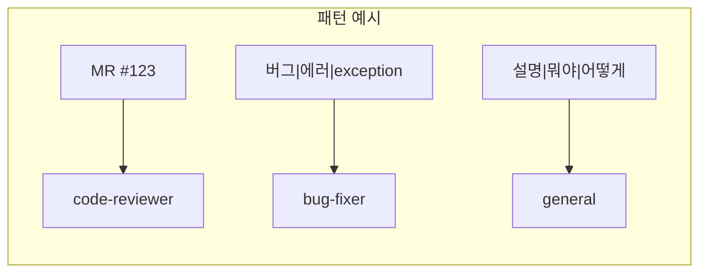
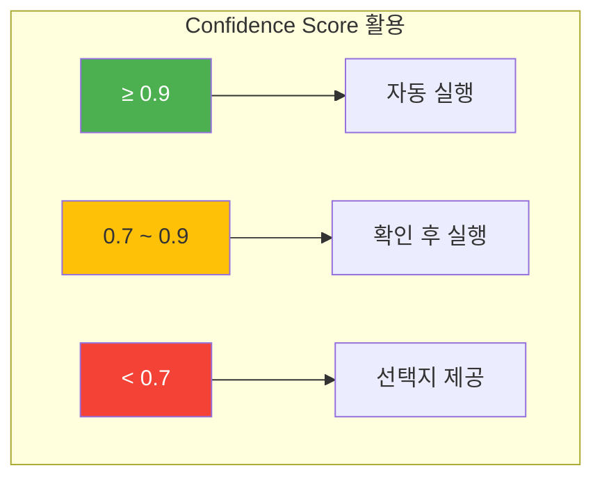
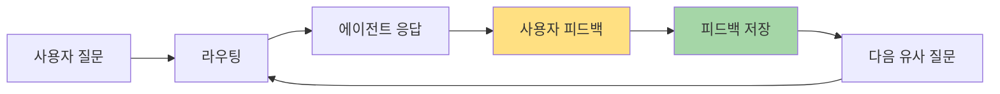

> 이 글은 [Claude Flow](https://github.com/Gyeom/claude-flow) 프로젝트를 개발하면서 정리한 내용이다. 전체 아키텍처는 [개발기](/dev-notes/posts/2025-11-22-claude-flow-development-story/)에서 확인할 수 있다.
>
> **관련 개념**: [AI Agent 아키텍처의 이해](/dev-notes/posts/2025-10-01-ai-agent-architecture-fundamentals/) - Router 패턴과 멀티 에이전트 시스템의 기초

## 개요

멀티 에이전트 시스템에서 사용자 요청을 적절한 에이전트로 라우팅하는 것은 전체 시스템의 품질을 결정한다. 잘못된 라우팅은 사용자 경험을 해치고, 불필요한 컴퓨팅 리소스를 낭비한다.

> Cramming agent tools into the limited context window is expensive, slow, and fundamentally limited. — [Aurelio AI Semantic Router](https://www.aurelio.ai/semantic-router)

## 라우팅 파이프라인 아키텍처

빠르고 정확한 방법부터 느리지만 유연한 방법까지 순차적으로 시도하는 폭포수(waterfall) 구조다.



## 5단계 라우팅 전략

### 1단계: 피드백 학습 기반 추천 (Confidence: 0.9)

과거에 유사한 질문에서 사용자가 긍정적 피드백을 준 에이전트를 추천한다.

**설계 근거:**
- 사용자별 선호도를 학습하면 반복적인 작업에서 정확도가 높아진다
- 0.9로 제한: 피드백은 과거 데이터이므로 현재 의도와 다를 수 있다
- 0.8 threshold: 충분히 유사한 쿼리만 사용하여 오매칭을 방지한다

### 2단계: 키워드 매칭 (Confidence: 0.95)

가장 빠르고 직관적인 방법이다. 메시지에 명확한 키워드("리뷰", "버그", "수정")가 포함되면 즉시 매칭된다.

**설계 근거:**
- 명확한 키워드는 사용자 의도를 정확히 반영한다
- 0.95: 가장 높은 신뢰도이지만 동음이의어 가능성을 고려해 100%는 아니다
- O(n*m) 복잡도이지만 키워드 개수가 적어 1ms 이하로 처리된다

### 3단계: 정규식 패턴 매칭 (Confidence: 0.85)

"MR #123", "NullPointerException" 같은 복잡한 패턴을 인식한다.



**설계 근거:**
- 키워드보다 유연하지만 정규식 복잡도에 따라 오탐 가능성이 있어 0.85로 설정
- 한글/영어 동시 지원으로 다국어 환경에서 유용하다

### 4단계: 시맨틱 검색 (Confidence: 유사도 기반)

> Semantic Router swaps slow LLM calls for superfast route decisions. Rather than waiting for slow LLM generations to make tool-use decisions, it uses the magic of semantic vector space. — [Aurelio Labs](https://github.com/aurelio-labs/semantic-router)

벡터 임베딩을 사용한 의미 기반 검색이다. 키워드나 패턴으로 매칭되지 않는 자연어 쿼리를 처리한다.

**우선순위 보정 공식:**
```
adjustedScore = rawScore × (1.0 + priority/1000)
```

예: "코드 정리해줘" 요청 시
- `refactor` 에이전트: 유사도 0.7, priority 150 → **0.805**
- `general` 에이전트: 유사도 0.75, priority 0 → 0.75

→ 더 전문화된 에이전트가 선택된다.

### 5단계: 기본 에이전트 폴백 (Confidence: 0.5)

모든 매칭이 실패하면 기본 에이전트(general)로 폴백한다.

> Implement a default or fall-back path to handle ambiguous queries that do not precisely fall into defined routes. — [Patronus AI](https://www.patronus.ai/ai-agent-development/ai-agent-routing)

0.5로 설정한 이유: 시스템이 불확실하다는 신호를 명확히 하고, UI에서 "이 응답이 도움이 되었나요?" 같은 피드백을 수집할 수 있다.

## Confidence Score 설계 철학



> High confidence (>90%) routes to automatic execution, medium (70-90%) to confirmation, low confidence (<70%) to option presentation. — [Botpress AI Agent Routing](https://botpress.com/blog/ai-agent-routing)

이 점수는 단순히 라우팅에만 쓰이지 않는다:

| Confidence | 동작 |
|------------|------|
| ≥ 0.9 | 바로 실행 |
| 0.7 ~ 0.9 | "code-reviewer로 처리할까요?" 확인 |
| < 0.7 | 에이전트 선택지 제공 |

## 한국어 최적화

한국어는 조사, 동의어, 초성 검색 등 특수한 처리가 필요하다.

| 기능 | 예시 |
|------|------|
| 조사 제거 | "리뷰를", "리뷰가", "리뷰는" → "리뷰" |
| 초성 검색 | "ㅋㄷㄹㅂ" → "코드 리뷰" |
| 동의어 확장 | "검토", "봐줘" → "리뷰" |
| 오타 교정 | "리뷔" → "리뷰" (Levenshtein 거리) |

모바일이나 메신저 환경에서 빠른 타이핑을 지원한다.

## 피드백 루프

라우팅 결과에 대한 사용자 피드백(👍/👎)을 수집하여 1단계(피드백 학습)의 정확도를 높인다.



시스템이 사용자와 함께 성장하는 구조다. 초기에는 키워드/패턴 매칭에 의존하지만, 시간이 지나면서 피드백 학습이 주도적인 라우팅 메커니즘이 된다.

## 성능 최적화

### 단락 평가 (Short-circuit Evaluation)

각 단계는 성공 시 즉시 반환한다. 대부분의 경우 2단계(키워드 매칭)에서 종료되므로 **평균 응답 시간은 1-2ms**다.

### 캐싱

동일한 메시지에 대한 반복 요청을 캐싱하여 불필요한 연산을 제거할 수 있다.

> 전체 구현은 [GitHub](https://github.com/Gyeom/claude-flow)에서 확인할 수 있다.

## 2025년 멀티 에이전트 라우팅 트렌드

### 1. 하이브리드 접근법

> A dedicated router (whether ML-based, rule-based, or embedding-based) often yields more robust and efficient routing for larger, production systems. — [Patronus AI](https://www.patronus.ai/ai-agent-development/ai-agent-routing)

키워드(빠름) + 시맨틱(유연함)을 결합한 하이브리드 방식이 주류다. 이는 우리가 구현한 다단계 파이프라인과 같은 방향이다.

### 2. Semantic Router의 부상

[Aurelio Labs의 Semantic Router](https://github.com/aurelio-labs/semantic-router)는 벡터 공간을 활용한 초고속 의사결정을 제공한다. LLM을 거치지 않고 라우팅 결정을 내려 레이턴시를 크게 줄인다.

### 3. Auction-Based Routing

> Auction-based routing is where more than one agent "bids" a score based on their confidence level in handling the given query. It's a "may the best agent win" approach. — [Patronus AI](https://www.patronus.ai/ai-agent-development/ai-agent-routing)

여러 에이전트가 confidence로 경쟁하는 방식. 법률 도메인처럼 전문 영역이 교차하는 경우에 유용하다.

### 4. 라우트 수 제한

> Keep in mind the best practice of striving for 20-25 routes. A very large number of routes might exceed the LLM's context window. — [Patronus AI](https://www.patronus.ai/ai-agent-development/ai-agent-routing)

너무 많은 라우트는 성능 저하를 일으킨다. 20-25개 이내가 권장된다.

## 결론

다단계 라우팅 파이프라인은 속도와 정확도, 유연성을 모두 달성한다.

| 원칙 | 구현 |
|------|------|
| 빠른 경로 우선 | 키워드 매칭 1-2ms 내 처리 |
| 점진적 폴백 | 복잡한 쿼리는 시맨틱 검색으로 대응 |
| 명확한 신뢰도 | Confidence score로 결과 품질 정량화 |
| 피드백 학습 | 사용자와 함께 성장하는 시스템 |
| 한국어 최적화 | 조사, 초성, 동의어, 오타 교정 |

이 구조는 멀티 에이전트 시스템의 핵심 과제인 "올바른 에이전트 선택"을 체계적으로 해결한다.

## 참고 자료

- [AI Agent Routing: Tutorial & Best Practices](https://www.patronus.ai/ai-agent-development/ai-agent-routing) - Patronus AI
- [Ultimate Guide to AI Agent Routing (2025)](https://botpress.com/blog/ai-agent-routing) - Botpress
- [Semantic Router](https://github.com/aurelio-labs/semantic-router) - Aurelio Labs
- [Semantic Router and Its Role in Designing Agentic Workflows](https://thenewstack.io/semantic-router-and-its-role-in-designing-agentic-workflows/) - The New Stack
- [A Taxonomy of Hierarchical Multi-Agent Systems](https://arxiv.org/html/2508.12683) - arXiv
- [Developer's guide to multi-agent patterns in ADK](https://developers.googleblog.com/developers-guide-to-multi-agent-patterns-in-adk/) - Google Developers Blog

---

> **시리즈**: [Claude Flow 개발기](/dev-notes/posts/2025-11-22-claude-flow-development-story/) | **이전 글**: [Session Resume로 토큰 비용 절감](/dev-notes/posts/2025-11-05-claude-code-session-resume/) | **다음 글**: [RAG 기반 에이전트 라우팅](/dev-notes/posts/2025-11-12-rag-agent-routing/)
