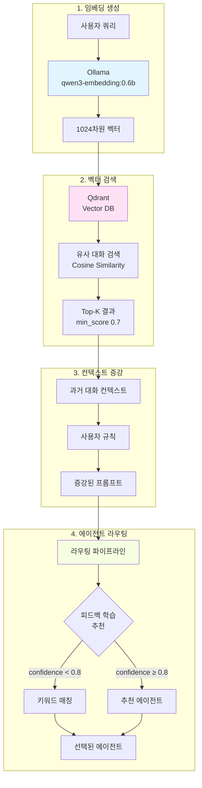

> 이 글은 [Claude Flow](https://github.com/Gyeom/claude-flow) 프로젝트를 개발하면서 정리한 내용이다. 전체 아키텍처는 [개발기](/dev-notes/posts/2024-12-22-claude-flow-development-story/)에서 확인할 수 있다.

## RAG가 필요한 이유

기존 키워드 기반 에이전트 라우팅은 명확한 단어가 포함된 질문("버그 수정해줘")에는 잘 작동하지만, 문맥을 이해해야 하는 질문("이전에 했던 그거랑 비슷하게 해줘")에는 한계가 있다. 이런 문제를 해결하기 위해 RAG(Retrieval-Augmented Generation) 시스템을 도입했다.

RAG는 벡터 검색으로 과거 유사한 대화를 찾아내고, 그 맥락을 현재 요청에 추가하여 더 정확한 에이전트 선택을 가능하게 한다.

## 전체 아키텍처



## 1단계: 임베딩 생성

### Ollama 임베딩 모델 선택

qwen3-embedding:0.6b를 선택한 이유는 다음과 같다.

- **MTEB Multilingual 1위**: 다국어 성능 70.58점으로 최상위
- **긴 컨텍스트 지원**: 32K 토큰까지 처리 (nomic-embed-text는 8K)
- **적절한 차원**: 1024차원으로 정확도와 성능 균형

```kotlin
class EmbeddingService(
    private val ollamaUrl: String = "http://localhost:11434",
    private val model: String = "qwen3-embedding:0.6b",
    private val cache: EmbeddingCache? = null
) {
    companion object {
        val MODEL_DIMENSIONS = mapOf(
            "qwen3-embedding:0.6b" to 1024,
            "nomic-embed-text" to 768,
            "bge-m3" to 1024
        )
    }

    fun embed(text: String): FloatArray? {
        // 캐시 확인
        cache?.get(text)?.let { return it }

        return try {
            val embedding = requestEmbedding(text)
            embedding?.let { cache?.put(text, it) }
            embedding
        } catch (e: Exception) {
            logger.error(e) { "Failed to get embedding" }
            null
        }
    }
}
```

임베딩 캐시를 사용하여 동일한 텍스트에 대한 중복 요청을 방지한다. 10,000개 항목을 60분간 캐시하여 응답 속도를 크게 개선했다.

## 2단계: 벡터 검색

### Qdrant 컬렉션 설정

```kotlin
class ConversationVectorService(
    private val embeddingService: EmbeddingService,
    private val qdrantUrl: String = "http://localhost:6333",
    private val collectionName: String = "claude-flow-conversations"
) {
    companion object {
        const val DEFAULT_MIN_SCORE = 0.6f
        const val DEFAULT_TOP_K = 5
    }

    private fun createCollection(): Boolean {
        val requestBody = mapOf(
            "vectors" to mapOf(
                "size" to embeddingService.dimension,  // 1024
                "distance" to "Cosine"
            ),
            "optimizers_config" to mapOf(
                "default_segment_number" to 2
            )
        )
        // Qdrant REST API 호출
    }
}
```

Cosine 유사도를 선택한 이유는 qwen3-embedding 모델이 정규화된 벡터를 생성하기 때문이다. Qdrant는 내부적으로 벡터를 자동 정규화하여 일관성을 보장한다.

### 유사 대화 검색

```kotlin
fun findSimilarConversations(
    query: String,
    userId: String? = null,
    topK: Int = DEFAULT_TOP_K,
    minScore: Float = DEFAULT_MIN_SCORE
): List<SimilarConversation> {
    val queryEmbedding = embeddingService.embed(query) ?: return emptyList()

    val requestBody = buildMap {
        put("vector", queryEmbedding.toList())
        put("limit", topK)
        put("score_threshold", minScore)  // 0.6 이하 필터링
        put("with_payload", true)
        userId?.let {
            put("filter", mapOf(
                "must" to listOf(
                    mapOf("key" to "user_id", "match" to mapOf("value" to it))
                )
            ))
        }
    }

    // Qdrant 검색 실행
    val response = httpClient.send(request, HttpResponse.BodyHandlers.ofString())
    return parseSearchResults(response.body())
}
```

`score_threshold`는 검색 품질을 결정하는 핵심 파라미터다.

## 3단계: 컨텍스트 증강

### 증강된 시스템 프롬프트 생성

```kotlin
class ContextAugmentationService(
    private val conversationVectorService: ConversationVectorService,
    private val userContextRepository: UserContextRepository? = null,
    private val userRuleRepository: UserRuleRepository? = null
) {
    fun buildAugmentedContext(
        userId: String,
        message: String,
        options: AugmentationOptions = AugmentationOptions()
    ): AugmentedContext {
        // 1. 유사 대화 검색
        val similarConversations = conversationVectorService.findSimilarConversations(
            query = message,
            userId = if (options.userScopedSearch) userId else null,
            topK = options.maxSimilarConversations,
            minScore = options.minSimilarityScore
        )

        // 2. 사용자 규칙 조회
        val userRules = userRuleRepository?.findByUserId(userId) ?: emptyList()

        // 3. 시스템 프롬프트 구성
        val systemPrompt = buildSystemPrompt(
            similarConversations = similarConversations,
            userRules = userRules,
            userSummary = userContextRepository?.findById(userId)?.summary
        )

        return AugmentedContext(
            systemPrompt = systemPrompt,
            relevantConversations = similarConversations.map { ... },
            metadata = AugmentationMetadata(...)
        )
    }
}
```

증강 옵션으로 검색 범위를 조절한다.

```kotlin
data class AugmentationOptions(
    val includeSimilarConversations: Boolean = true,
    val includeUserRules: Boolean = true,
    val includeUserSummary: Boolean = true,
    val maxSimilarConversations: Int = 3,
    val minSimilarityScore: Float = 0.65f,
    val userScopedSearch: Boolean = false  // 사용자별 격리
)
```

- `maxSimilarConversations: 3` - 너무 많은 컨텍스트는 노이즈가 된다
- `minSimilarityScore: 0.65` - 기본값보다 약간 높게 설정하여 품질 보장

### Re-ranking으로 정밀도 향상

```kotlin
fun rerankResults(
    results: List<SimilarConversation>,
    currentAgentId: String? = null,
    boostRecent: Boolean = true
): List<SimilarConversation> {
    return results.map { conv ->
        var adjustedScore = conv.score

        // 동일 에이전트 보너스 (10%)
        if (currentAgentId != null && conv.agentId == currentAgentId) {
            adjustedScore *= 1.1f
        }

        // 최근 대화 보너스
        if (boostRecent) {
            val hoursSince = Duration.between(
                Instant.parse(conv.createdAt),
                Instant.now()
            ).toHours()
            val recencyBoost = when {
                hoursSince < 1 -> 1.2f    // 1시간 이내 20% 증폭
                hoursSince < 24 -> 1.1f   // 1일 이내 10% 증폭
                hoursSince < 168 -> 1.05f // 1주일 이내 5% 증폭
                else -> 1.0f
            }
            adjustedScore *= recencyBoost
        }

        conv.copy(score = adjustedScore.coerceAtMost(1.0f))
    }.sortedByDescending { it.score }
}
```

Re-ranking은 단순 벡터 유사도만으로는 포착하기 어려운 시간적 맥락과 에이전트 특성을 반영한다.

## 4단계: 피드백 학습 기반 라우팅

### 다단계 라우팅 파이프라인

```kotlin
class AgentRouter(
    initialAgents: List<Agent> = defaultAgents(),
    private val semanticRouter: SemanticRouter? = null,
    private val feedbackLearningService: FeedbackLearningService? = null
) {
    fun route(message: String, userId: String? = null): AgentMatch {
        val normalizedMessage = message.lowercase()
        val enabledAgents = agents.filter { it.enabled }

        // 0. 피드백 학습 기반 추천 (confidence 0.9)
        if (userId != null && feedbackLearningService != null) {
            feedbackLearningMatch(message, userId, enabledAgents)?.let {
                logger.debug { "Feedback learning match: ${it.agent.id}" }
                return it
            }
        }

        // 1. 키워드 매칭 (confidence 0.95)
        keywordMatch(normalizedMessage, enabledAgents)?.let { match ->
            return adjustMatchWithFeedback(match, userId)
        }

        // 2. 정규식 패턴 매칭 (confidence 0.85)
        patternMatch(normalizedMessage, enabledAgents)?.let { match ->
            return adjustMatchWithFeedback(match, userId)
        }

        // 3. 시맨틱 검색 (벡터 유사도)
        semanticRouter?.classify(message, enabledAgents)?.let { match ->
            return adjustMatchWithFeedback(match, userId)
        }

        // 4. 기본 에이전트 폴백 (confidence 0.5)
        return AgentMatch(agent = Agent.GENERAL, confidence = 0.5)
    }
}
```

### 피드백 학습 메커니즘

```kotlin
class FeedbackLearningService(
    private val feedbackRepository: FeedbackRepository,
    private val conversationVectorService: ConversationVectorService?
) {
    fun recommendAgentFromSimilar(
        query: String,
        userId: String?,
        topK: Int = 5
    ): AgentRecommendation? {
        // 유사 대화 검색 (높은 임계값 0.7)
        val similar = conversationVectorService?.findSimilarConversations(
            query = query,
            userId = userId,
            topK = topK * 2,
            minScore = 0.7f  // 높은 유사도만 사용
        ) ?: return null

        if (similar.isEmpty()) return null

        // 피드백 기반 에이전트 점수 계산
        val agentScores = mutableMapOf<String, AgentScoreAccumulator>()

        for (conv in similar) {
            val feedback = feedbackRepository.findByExecutionId(conv.executionId)
            val positive = feedback.count { it.isPositive }
            val negative = feedback.count { it.isNegative }

            agentScores.getOrPut(conv.agentId) {
                AgentScoreAccumulator()
            }.addSample(conv.score, positive, negative)
        }

        // 최소 2개 샘플, 최고 점수 선택
        val best = agentScores.entries
            .filter { it.value.sampleCount >= 2 }
            .maxByOrNull { it.value.combinedScore }
            ?: return null

        return AgentRecommendation(
            agentId = best.key,
            confidence = best.value.combinedScore,
            reason = "유사 질문 ${best.value.sampleCount}개 분석 결과"
        )
    }
}

private class AgentScoreAccumulator {
    var sampleCount = 0
    var totalSimilarity = 0f
    var positiveCount = 0
    var negativeCount = 0

    val successRate: Float
        get() = if (positiveCount + negativeCount > 0) {
            positiveCount.toFloat() / (positiveCount + negativeCount)
        } else 0.5f

    val combinedScore: Float
        get() {
            val avgSimilarity = if (sampleCount > 0) totalSimilarity / sampleCount else 0f
            return avgSimilarity * 0.3f + successRate * 0.7f
        }
}
```

`combinedScore`는 벡터 유사도(30%)와 피드백 성공률(70%)을 결합한다. 피드백에 더 높은 가중치를 주어 실제 사용자 만족도를 우선시한다.

## 하이퍼파라미터 설정 근거

### min_score 임계값 설정

| 환경 | min_score | 근거 |
|------|-----------|------|
| DEVELOPMENT | 0.5 | 더 많은 후보를 보여 개발 중 디버깅 용이 |
| DEFAULT | 0.65 | 품질과 재현율 균형 |
| PRODUCTION | 0.7 | 높은 정밀도 우선, 잘못된 추천 최소화 |

Qdrant의 Cosine 유사도는 0~1 범위이며, 0.7 이상이면 명확히 관련 있는 문서로 판단할 수 있다.

### 피드백 학습 임계값

```kotlin
private fun feedbackLearningMatch(
    message: String,
    userId: String,
    agents: List<Agent>
): AgentMatch? {
    val recommendation = feedbackLearningService?.recommendAgentFromSimilar(
        query = message,
        userId = userId,
        topK = 5
    ) ?: return null

    // 높은 신뢰도 (0.8 이상)만 사용
    if (recommendation.confidence < 0.8f) return null

    val agent = agents.find { it.id == recommendation.agentId } ?: return null

    return AgentMatch(
        agent = agent,
        confidence = recommendation.confidence.toDouble().coerceAtMost(0.9),
        method = RoutingMethod.FEEDBACK_LEARNING
    )
}
```

- `topK = 5` - 충분한 샘플로 통계적 신뢰도 확보
- `minScore = 0.7` - 유사도가 낮으면 피드백이 무의미
- `confidence < 0.8` - 확실한 경우만 피드백 추천 사용
- `sampleCount >= 2` - 최소 2개 샘플로 편향 방지

### 캐시 설정

```kotlin
data class RagConfig(
    val embeddingCacheSize: Long = 10_000,
    val embeddingCacheExpireMinutes: Long = 60
)
```

- 10,000개 캐시 - 일반적인 대화 세션에서 중복 쿼리 대부분 커버
- 60분 만료 - 세션 내 재사용은 허용하되 메모리 과다 사용 방지

## 성능 최적화

### 병렬 검색 파이프라인

```kotlin
fun buildAugmentedContext(
    userId: String,
    message: String,
    options: AugmentationOptions
): AugmentedContext {
    val startTime = System.currentTimeMillis()

    // 비동기 검색 (코루틴 사용 시)
    val similarConversations = async {
        conversationVectorService.findSimilarConversations(...)
    }
    val userRules = async {
        userRuleRepository?.findByUserId(userId) ?: emptyList()
    }
    val userContext = async {
        userContextRepository?.findById(userId)
    }

    val totalTimeMs = System.currentTimeMillis() - startTime
    logger.debug { "Context augmentation completed in ${totalTimeMs}ms" }
}
```

검색과 데이터 조회를 병렬로 수행하여 지연 시간을 최소화한다.

### 인덱스 최적화

```kotlin
private fun createIndexes() {
    createFieldIndex("user_id", "keyword")
    createFieldIndex("agent_id", "keyword")
    createFieldIndex("created_at", "datetime")
}
```

자주 필터링하는 필드에 인덱스를 생성하여 검색 속도를 개선한다.

## 실전 사례

### 사례 1: 모호한 참조 해결

**사용자 쿼리**: "어제 했던 거랑 비슷하게 해줘"

1. 벡터 검색으로 어제 대화 검색 (시간 필터 + 유사도)
2. 과거 대화: "버그 수정 요청" (agent: bug-fixer, score: 0.85)
3. Re-ranking으로 최근성 보너스 20% 적용
4. 피드백 학습: bug-fixer에 대한 긍정 피드백 3개 확인
5. 결과: bug-fixer 선택 (confidence: 0.9)

### 사례 2: 새로운 표현 학습

**사용자 쿼리**: "코드가 이상해요"

1. 키워드 매칭 실패 ("버그", "에러" 등 명시적 단어 없음)
2. 벡터 검색으로 유사 쿼리 "코드가 잘못된 것 같아요" 발견 (score: 0.78)
3. 해당 대화에서 bug-fixer 사용 + 긍정 피드백 확인
4. 피드백 학습 추천: bug-fixer (confidence: 0.85)

다음번 "코드가 이상해요" 쿼리에서는 학습된 패턴으로 더 빠르게 라우팅된다.

## 결론

RAG 기반 에이전트 라우팅은 다음 장점을 제공한다.

1. **문맥 이해** - 키워드가 없어도 유사한 과거 대화로 의도 파악
2. **지속 학습** - 피드백이 쌓일수록 정확도 향상
3. **사용자별 최적화** - 개인 선호도와 과거 이력 반영
4. **확장성** - 새로운 에이전트 추가 시 예시만 제공하면 자동 학습

핵심은 적절한 임계값 설정이다. 너무 낮으면 노이즈가 많고, 너무 높으면 검색 실패가 잦다. 프로덕션에서는 min_score 0.7, 피드백 신뢰도 0.8 이상을 권장한다.

RAG는 단순한 검색 도구가 아니라 에이전트 시스템의 핵심 두뇌가 되고 있다.

---

## 참고 자료

### RAG 아키텍처
- [The 2025 Guide to Retrieval-Augmented Generation (RAG)](https://www.edenai.co/post/the-2025-guide-to-retrieval-augmented-generation-rag)
- [RAG, or Retrieval Augmented Generation: Revolutionizing AI in 2025](https://www.glean.com/blog/rag-retrieval-augmented-generation)
- [RAG Architecture Explained: A Comprehensive Guide [2025]](https://orq.ai/blog/rag-architecture)
- [RAG in 2025: From Quick Fix to Core Architecture](https://medium.com/@hrk84ya/rag-in-2025-from-quick-fix-to-core-architecture-9a9eb0a42493)

### Qdrant 벡터 데이터베이스
- [What is Vector Similarity? Understanding its Role in AI Applications](https://qdrant.tech/blog/what-is-vector-similarity/)
- [Vector Search Resource Optimization Guide](https://qdrant.tech/articles/vector-search-resource-optimization/)
- [Qdrant Search Documentation](https://qdrant.tech/documentation/concepts/search/)

### Ollama 임베딩 모델
- [13 Best Embedding Models in 2025: Complete Guide + Pricing & Performance](https://elephas.app/blog/best-embedding-models)
- [qwen3-embedding](https://ollama.com/library/qwen3-embedding)
- [nomic-embed-text](https://ollama.com/library/nomic-embed-text)
- [Best Ollama Embedding Models: A Guide for RAG Applications](https://www.arsturn.com/blog/picking-the-perfect-partner-a-guide-to-choosing-the-best-embedding-models-in-ollama)
