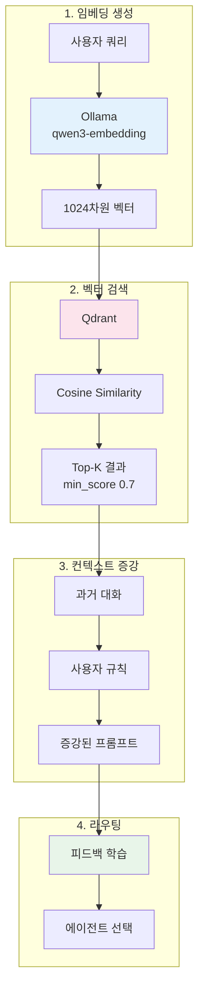
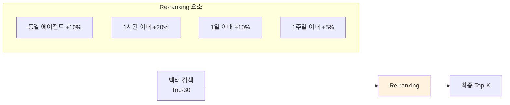
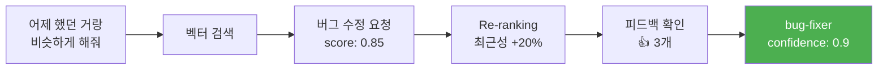

> 이 글은 [Claude Flow](https://github.com/Gyeom/claude-flow) 프로젝트를 개발하면서 정리한 내용이다. 전체 아키텍처는 [개발기](/dev-notes/posts/2024-12-22-claude-flow-development-story/)에서 확인할 수 있다.

## RAG가 필요한 이유

기존 키워드 기반 에이전트 라우팅은 명확한 단어가 포함된 질문("버그 수정해줘")에는 잘 작동하지만, 문맥을 이해해야 하는 질문("이전에 했던 그거랑 비슷하게 해줘")에는 한계가 있다.

> Three converging pressures make RAG essential in 2025. Models alone can't safely answer domain-specific or time-sensitive questions; grounding fills that gap. Governance expectations have risen — leaders now demand source traceability and policy enforcement. — [RAG in 2025: From Quick Fix to Core Architecture](https://medium.com/@hrk84ya/rag-in-2025-from-quick-fix-to-core-architecture-9a9eb0a42493)

RAG는 벡터 검색으로 과거 유사한 대화를 찾아내고, 그 맥락을 현재 요청에 추가하여 더 정확한 에이전트 선택을 가능하게 한다.

## 전체 아키텍처



## 임베딩 모델 선택

**qwen3-embedding:0.6b**를 선택한 이유:

| 기준 | qwen3-embedding | nomic-embed-text |
|------|-----------------|------------------|
| MTEB Multilingual | **1위 (70.58점)** | - |
| 컨텍스트 | **32K 토큰** | 8K 토큰 |
| 차원 | 1024 | 768 |
| 한국어 | **100+ 언어 지원** | 제한적 |

임베딩 캐시(10,000개, 60분 TTL)를 사용하여 동일한 텍스트에 대한 중복 요청을 방지한다.

## 벡터 검색 전략

### Cosine 유사도

qwen3-embedding 모델이 정규화된 벡터를 생성하기 때문에 Cosine 유사도를 선택했다. Qdrant는 내부적으로 벡터를 자동 정규화하여 일관성을 보장한다.

### min_score 임계값 설정

| 환경 | min_score | 근거 |
|------|-----------|------|
| DEVELOPMENT | 0.5 | 더 많은 후보를 보여 디버깅 용이 |
| DEFAULT | 0.65 | 품질과 재현율 균형 |
| PRODUCTION | 0.7 | 높은 정밀도 우선, 오매칭 최소화 |

> Vector-only retrieval is semantic and can miss exact tokens and rare strings. Combine dense vectors for semantic recall with sparse/keyword fallback for exact terms. — [RAG Best Practices](https://orkes.io/blog/rag-best-practices/)

## 컨텍스트 증강

### 증강 옵션

| 파라미터 | 기본값 | 설명 |
|----------|--------|------|
| maxSimilarConversations | 3 | 너무 많은 컨텍스트는 노이즈가 된다 |
| minSimilarityScore | 0.65 | 기본값보다 약간 높게 설정하여 품질 보장 |
| userScopedSearch | false | 사용자별 격리 여부 |

### Re-ranking

> Instead of trusting the top-k results from the vector store, over-fetch (for example, the top 30) and hand them off to a reranker. This model scores each chunk by how well it actually matches the query. — [Improving Retrieval in RAG with Reranking](https://unstructured.io/blog/improving-retrieval-in-rag-with-reranking)



Re-ranking은 단순 벡터 유사도만으로는 포착하기 어려운 시간적 맥락과 에이전트 특성을 반영한다.

## 피드백 학습 통합

### 점수 계산 공식

```
combinedScore = 벡터유사도 × 0.3 + 피드백성공률 × 0.7
```

피드백에 더 높은 가중치를 주어 **실제 사용자 만족도를 우선**시한다.

### 피드백 학습 임계값

| 파라미터 | 값 | 근거 |
|----------|-----|------|
| topK | 5 | 충분한 샘플로 통계적 신뢰도 확보 |
| minScore | 0.7 | 유사도가 낮으면 피드백이 무의미 |
| confidence threshold | 0.8 | 확실한 경우만 피드백 추천 사용 |
| sampleCount | ≥ 2 | 최소 2개 샘플로 편향 방지 |

## 실전 사례

### 사례 1: 모호한 참조 해결

**사용자 쿼리**: "어제 했던 거랑 비슷하게 해줘"



### 사례 2: 새로운 표현 학습

**사용자 쿼리**: "코드가 이상해요"

1. 키워드 매칭 실패 ("버그", "에러" 등 명시적 단어 없음)
2. 벡터 검색: "코드가 잘못된 것 같아요" 발견 (score: 0.78)
3. 해당 대화에서 bug-fixer 사용 + 긍정 피드백 확인
4. 피드백 학습 추천: bug-fixer (confidence: 0.85)

→ 다음번 유사 쿼리에서는 학습된 패턴으로 더 빠르게 라우팅된다.

## 성능 최적화

### 병렬 검색

검색, 사용자 규칙 조회, 사용자 컨텍스트 조회를 **병렬로 수행**하여 지연 시간을 최소화한다.

### 인덱스 최적화

자주 필터링하는 필드에 인덱스를 생성한다:
- `user_id` (keyword)
- `agent_id` (keyword)
- `created_at` (datetime)

> 전체 구현은 [GitHub](https://github.com/Gyeom/claude-flow)에서 확인할 수 있다.

## 결론

RAG 기반 에이전트 라우팅의 장점:

| 장점 | 설명 |
|------|------|
| 문맥 이해 | 키워드 없어도 유사한 과거 대화로 의도 파악 |
| 지속 학습 | 피드백이 쌓일수록 정확도 향상 |
| 사용자별 최적화 | 개인 선호도와 과거 이력 반영 |
| 확장성 | 새 에이전트 추가 시 예시만 제공하면 자동 학습 |

핵심은 적절한 임계값 설정이다. 너무 낮으면 노이즈가 많고, 너무 높으면 검색 실패가 잦다. 프로덕션에서는 **min_score 0.7, 피드백 신뢰도 0.8 이상**을 권장한다.

## 참고 자료

- [RAG in 2025: From Quick Fix to Core Architecture](https://medium.com/@hrk84ya/rag-in-2025-from-quick-fix-to-core-architecture-9a9eb0a42493) - Medium
- [Improving Retrieval in RAG with Reranking](https://unstructured.io/blog/improving-retrieval-in-rag-with-reranking) - Unstructured
- [Best Practices for Production-Scale RAG Systems](https://orkes.io/blog/rag-best-practices/) - Orkes
- [Best Chunking Strategies for RAG in 2025](https://www.firecrawl.dev/blog/best-chunking-strategies-rag-2025) - Firecrawl
- [Vector Search Resource Optimization Guide](https://qdrant.tech/articles/vector-search-resource-optimization/) - Qdrant
- [qwen3-embedding](https://ollama.com/library/qwen3-embedding) - Ollama
