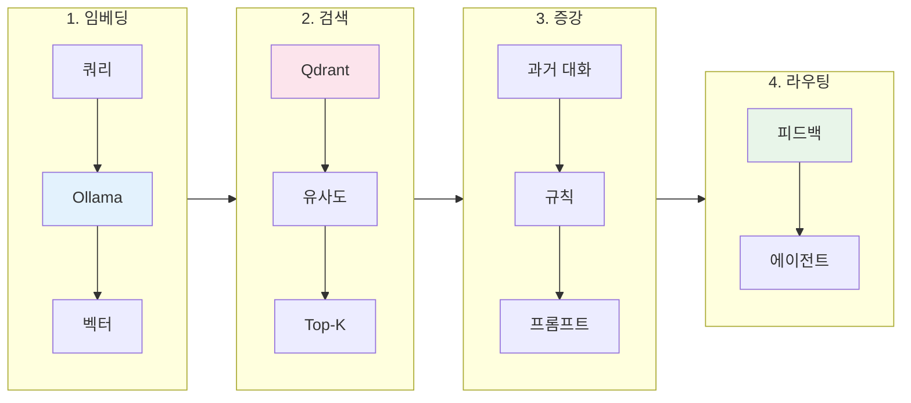

> 이 글은 [Claude Flow](https://github.com/Gyeom/claude-flow) 프로젝트를 개발하면서 정리한 내용이다. 전체 아키텍처는 [개발기](/dev-notes/posts/2025-11-22-claude-flow-development-story/)와 [설계기](/dev-notes/posts/2025-12-28-claude-flow-ai-agent-platform/)에서 확인할 수 있다.
>
> **관련 개념**: [RAG 시스템 설계 가이드](/dev-notes/posts/2025-10-05-rag-system-design-guide/) - 벡터 검색, 임베딩, Re-ranking의 원리

## RAG가 필요한 이유

기존 키워드 기반 에이전트 라우팅은 명확한 단어가 포함된 질문("버그 수정해줘")에는 잘 작동하지만, 문맥을 이해해야 하는 질문("이전에 했던 그거랑 비슷하게 해줘")에는 한계가 있다.

> Three converging pressures make RAG essential in 2025. Models alone can't safely answer domain-specific or time-sensitive questions; grounding fills that gap. Governance expectations have risen — leaders now demand source traceability and policy enforcement. — [RAG in 2025: From Quick Fix to Core Architecture](https://medium.com/@hrk84ya/rag-in-2025-from-quick-fix-to-core-architecture-9a9eb0a42493)

RAG는 벡터 검색으로 과거 유사한 대화를 찾아내고, 그 맥락을 현재 요청에 추가하여 더 정확한 에이전트 선택을 가능하게 한다.

## 전체 아키텍처



사용자 쿼리가 들어오면 Ollama의 qwen3-embedding 모델이 1024차원 벡터로 변환한다. 이 벡터를 Qdrant에서 검색하여 유사도가 높은 과거 대화를 찾는다. 검색된 대화와 사용자별 규칙을 현재 프롬프트에 붙여 컨텍스트를 증강하고, 피드백 학습 결과를 참고하여 최종 에이전트를 선택한다.

## 임베딩 모델 선택

에이전트 라우팅에서 임베딩 모델은 사용자 의도를 얼마나 정확히 파악하느냐를 결정한다. 특히 한국어 환경에서는 다국어 지원이 핵심이다. "버그 수정해줘"와 "오류 고쳐줘"가 같은 의미임을 모델이 이해해야 한다.

**qwen3-embedding:0.6b**를 선택한 이유:

| 기준 | qwen3-embedding | nomic-embed-text |
|------|-----------------|------------------|
| MTEB Multilingual | **1위 (70.58점)** | - |
| 컨텍스트 | **32K 토큰** | 8K 토큰 |
| 차원 | 1024 | 768 |
| 한국어 | **100+ 언어 지원** | 제한적 |

임베딩 생성은 매 요청마다 수십 밀리초가 소요된다. 같은 질문이 반복되는 경우가 많아서 캐시(10,000개, 60분 TTL)를 도입했다. 특히 슬랙 봇처럼 여러 사용자가 비슷한 질문을 하는 환경에서 효과적이다.

## 벡터 검색 전략

### Cosine 유사도

벡터 유사도 측정에는 Cosine, Euclidean, Dot Product 등이 있다. qwen3-embedding 모델이 정규화된 벡터를 생성하기 때문에 Cosine 유사도를 선택했다. 정규화된 벡터에서는 Cosine과 Dot Product가 동일한 결과를 내지만, Cosine이 의미적으로 더 직관적이다. Qdrant는 내부적으로 벡터를 자동 정규화하여 일관성을 보장한다.

### min_score 임계값 설정

임계값이 낮으면 관련 없는 결과가 섞이고, 높으면 유용한 결과를 놓친다. 환경에 따라 다르게 설정하는 이유는 개발 중에는 "왜 이 결과가 나왔는지" 디버깅이 중요하고, 프로덕션에서는 오매칭으로 인한 사용자 경험 저하가 더 치명적이기 때문이다.

| 환경 | min_score | 근거 |
|------|-----------|------|
| DEVELOPMENT | 0.5 | 더 많은 후보를 보여 디버깅 용이 |
| DEFAULT | 0.65 | 품질과 재현율 균형 |
| PRODUCTION | 0.7 | 높은 정밀도 우선, 오매칭 최소화 |

> Vector-only retrieval is semantic and can miss exact tokens and rare strings. Combine dense vectors for semantic recall with sparse/keyword fallback for exact terms. — [RAG Best Practices](https://orkes.io/blog/rag-best-practices/)

## 컨텍스트 증강

벡터 검색으로 찾은 과거 대화를 현재 프롬프트에 붙여 LLM에게 맥락을 제공한다. 다만 너무 많은 컨텍스트를 붙이면 오히려 노이즈가 된다. "어제 버그 수정했던 것처럼"이라는 질문에 3개월 전 대화까지 붙이면 혼란만 가중된다.

### 증강 옵션

| 파라미터 | 기본값 | 설명 |
|----------|--------|------|
| maxSimilarConversations | 3 | 너무 많은 컨텍스트는 노이즈가 된다 |
| minSimilarityScore | 0.65 | 기본값보다 약간 높게 설정하여 품질 보장 |
| userScopedSearch | false | 사용자별 격리 여부 |

### Re-ranking

벡터 유사도만으로는 "최근 대화"와 "오래된 대화"를 구분할 수 없다. 의미가 비슷하면 3개월 전 대화도 높은 점수를 받는다. Re-ranking은 이 한계를 보완한다. 벡터 검색으로 후보군(Top-30)을 넓게 가져온 뒤, 시간과 에이전트 특성을 고려해 다시 정렬한다.

> Instead of trusting the top-k results from the vector store, over-fetch (for example, the top 30) and hand them off to a reranker. This model scores each chunk by how well it actually matches the query. — [Improving Retrieval in RAG with Reranking](https://unstructured.io/blog/improving-retrieval-in-rag-with-reranking)


최근 대화에 높은 가중치를 주는 이유는 사용자가 "아까 그거"라고 말할 때 대부분 최근 대화를 의미하기 때문이다. 동일 에이전트 보너스는 같은 작업을 반복하는 패턴을 반영한다.

## 피드백 학습 통합

RAG로 찾은 과거 대화에서 사용자가 만족했는지(👍/👎)를 확인한다. 의미가 비슷해도 사용자가 불만족했던 에이전트 선택은 피해야 한다.

### 점수 계산 공식

```
combinedScore = 벡터유사도 × 0.3 + 피드백성공률 × 0.7
```

피드백에 0.7, 벡터 유사도에 0.3의 가중치를 준다. 유사도가 높아도 과거에 실패한 패턴이면 낮은 점수를 받는다. 반대로 유사도가 약간 낮아도 피드백이 좋았다면 우선 선택된다. **"이론적으로 맞는 답"보다 "실제로 효과가 있었던 답"**을 우선하는 철학이다.

### 피드백 학습 임계값

| 파라미터 | 값 | 근거 |
|----------|-----|------|
| topK | 5 | 충분한 샘플로 통계적 신뢰도 확보 |
| minScore | 0.7 | 유사도가 낮으면 피드백이 무의미 |
| confidence threshold | 0.8 | 확실한 경우만 피드백 추천 사용 |
| sampleCount | ≥ 2 | 최소 2개 샘플로 편향 방지 |

confidence threshold를 0.8로 높게 잡은 이유는, 불확실한 피드백 추천이 오히려 사용자 경험을 해치기 때문이다. 확신이 없으면 피드백 학습을 건너뛰고 다음 단계(키워드/패턴 매칭)로 넘긴다.

## 실전 사례

### 사례 1: 모호한 참조 해결

**사용자 쿼리**: "어제 했던 거랑 비슷하게 해줘"


### 사례 2: 새로운 표현 학습

**사용자 쿼리**: "코드가 이상해요"

1. 키워드 매칭 실패 ("버그", "에러" 등 명시적 단어 없음)
2. 벡터 검색: "코드가 잘못된 것 같아요" 발견 (score: 0.78)
3. 해당 대화에서 bug-fixer 사용 + 긍정 피드백 확인
4. 피드백 학습 추천: bug-fixer (confidence: 0.85)

→ 다음번 유사 쿼리에서는 학습된 패턴으로 더 빠르게 라우팅된다.

## 성능 최적화

RAG 파이프라인은 임베딩 생성, 벡터 검색, Re-ranking 등 여러 단계를 거친다. 각 단계가 순차적으로 실행되면 응답 시간이 길어진다.

### 병렬 검색

벡터 검색, 사용자 규칙 조회, 사용자 컨텍스트 조회는 서로 의존하지 않는다. 이 세 가지를 **병렬로 수행**하면 가장 느린 작업의 시간만큼만 대기하면 된다.

### 인덱스 최적화

Qdrant에서 필터링 성능을 높이려면 자주 사용하는 필드에 인덱스를 생성해야 한다. 인덱스 없이 필터링하면 전체 벡터를 스캔한다.

- `user_id` (keyword): 사용자별 대화 격리
- `agent_id` (keyword): 특정 에이전트 대화만 검색
- `created_at` (datetime): 시간 범위 필터링

> 전체 구현은 [GitHub](https://github.com/Gyeom/claude-flow)에서 확인할 수 있다.

## 결론

RAG 기반 에이전트 라우팅의 장점:

| 장점 | 설명 |
|------|------|
| 문맥 이해 | 키워드 없어도 유사한 과거 대화로 의도 파악 |
| 지속 학습 | 피드백이 쌓일수록 정확도 향상 |
| 사용자별 최적화 | 개인 선호도와 과거 이력 반영 |
| 확장성 | 새 에이전트 추가 시 예시만 제공하면 자동 학습 |

핵심은 적절한 임계값 설정이다. 너무 낮으면 노이즈가 많고, 너무 높으면 검색 실패가 잦다. 프로덕션에서는 **min_score 0.7, 피드백 신뢰도 0.8 이상**을 권장한다.

## 참고 자료

- [RAG in 2025: From Quick Fix to Core Architecture](https://medium.com/@hrk84ya/rag-in-2025-from-quick-fix-to-core-architecture-9a9eb0a42493) - Medium
- [Improving Retrieval in RAG with Reranking](https://unstructured.io/blog/improving-retrieval-in-rag-with-reranking) - Unstructured
- [Best Practices for Production-Scale RAG Systems](https://orkes.io/blog/rag-best-practices/) - Orkes
- [Best Chunking Strategies for RAG in 2025](https://www.firecrawl.dev/blog/best-chunking-strategies-rag-2025) - Firecrawl
- [Vector Search Resource Optimization Guide](https://qdrant.tech/articles/vector-search-resource-optimization/) - Qdrant
- [qwen3-embedding](https://ollama.com/library/qwen3-embedding) - Ollama

---

> **시리즈**: [Claude Flow 개발기](/dev-notes/posts/2025-11-22-claude-flow-development-story/) | **이전 글**: [다단계 에이전트 라우팅](/dev-notes/posts/2025-11-08-multi-stage-agent-routing/) | **다음 글**: [피드백 학습으로 라우팅 개선](/dev-notes/posts/2025-11-15-feedback-learning-agent/)
