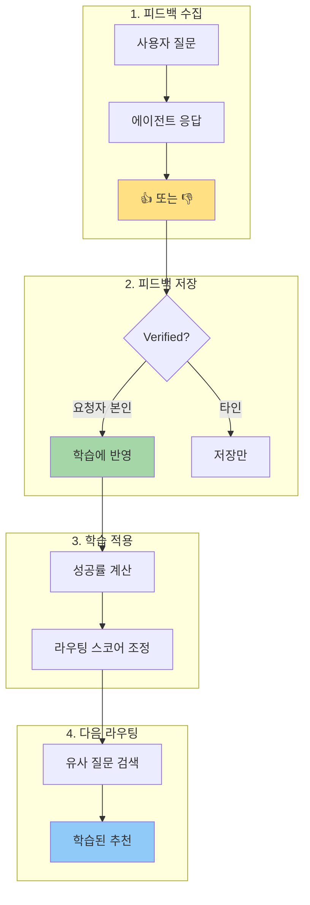
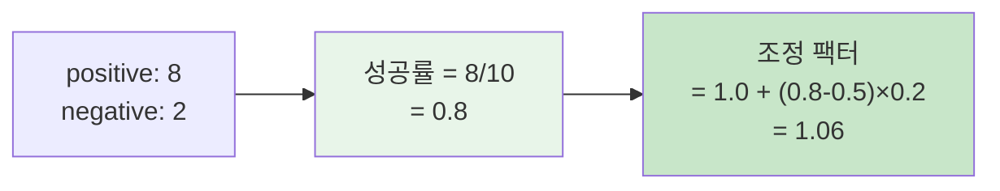
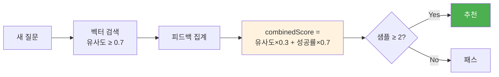
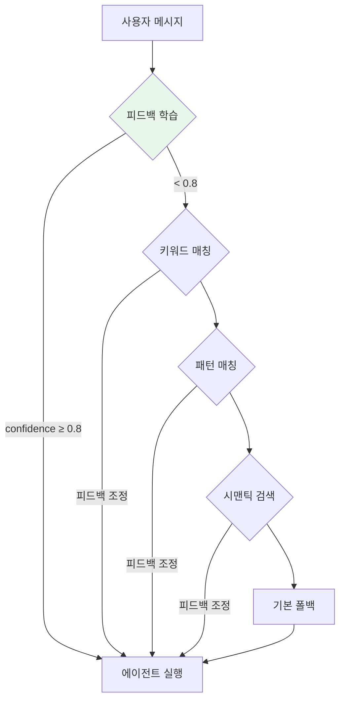

> 이 글은 [Claude Flow](https://github.com/Gyeom/claude-flow) 프로젝트를 개발하면서 정리한 내용이다. 전체 아키텍처는 [개발기](/dev-notes/posts/2025-11-22-claude-flow-development-story/)와 [설계기](/dev-notes/posts/2025-12-28-claude-flow-ai-agent-platform/)에서 확인할 수 있다.
>
> **관련 개념**: [AI Agent 아키텍처의 이해](/dev-notes/posts/2025-10-01-ai-agent-architecture-fundamentals/) - 에이전트의 학습과 적응 메커니즘

## 문제 정의

다중 에이전트 시스템에서 사용자 질문에 가장 적합한 에이전트를 선택하는 것은 중요하다. 키워드 매칭이나 정규식 패턴만으로는 한계가 있다. 같은 질문이라도 사용자마다 선호하는 에이전트가 다를 수 있고, 시간이 지나면서 에이전트 성능도 변한다.

> RLHF is a popular technique used to align AI systems with human preferences by training them using feedback from people, rather than relying solely on predefined reward functions. — [RLHF for LLM](https://www.superannotate.com/blog/rlhf-for-llm)

Claude Flow에서는 이 문제를 **피드백 학습**으로 해결한다. Slack 리액션(👍/👎)을 수집하여 에이전트별 성공률을 계산하고, 이를 라우팅 스코어에 반영한다.

## 전체 흐름



## Verified Feedback

모든 사용자의 피드백을 동일하게 취급하면 노이즈가 섞인다. 실제 질문한 사람(requester)의 피드백만 **verified**로 처리한다.

| 피드백 유형 | 저장 | 학습 반영 |
|------------|------|----------|
| 요청자 본인 피드백 | ✅ | ✅ |
| 타인의 피드백 | ✅ | ❌ |

이를 통해 **신호 대비 노이즈 비율(Signal-to-Noise Ratio)**을 높인다.

## 리액션 분류

모든 리액션이 피드백은 아니다. 리액션을 3가지 카테고리로 분류한다:

| 카테고리 | 리액션 예시 | 용도 |
|----------|------------|------|
| feedback | 👍, 👎, ❤️, 🎉 | 응답 품질 평가 (학습에 사용) |
| trigger | jira, ticket, bug | 외부 시스템 연동 트리거 |
| action | ✅, ❌, 1️⃣, 2️⃣ | 선택지 응답 |

## 성공률 계산



### 조정 공식

| 성공률 | 조정 팩터 | 효과 |
|--------|----------|------|
| > 0.7 | 1.0 + (성공률 - 0.5) × 0.2 | 최대 +10% 부스트 |
| < 0.3 | 1.0 - (0.5 - 성공률) × 0.3 | 최대 -15% 페널티 |
| 0.3 ~ 0.7 | 1.0 | 조정 없음 |

극단적 변화를 방지하면서도 충분한 피드백이 쌓인 경우 유의미한 영향을 준다.

## 유사 쿼리 기반 추천

과거에 유사한 질문에서 높은 피드백을 받은 에이전트를 추천한다.



**combinedScore** = 벡터유사도 30% + 피드백성공률 70%

벡터 유사도보다 **실제 사용자 만족도**를 더 중시한다.

## 라우팅 파이프라인 통합



피드백 학습이 신뢰도 0.8 이상이면 최우선 적용. 그 외 단계에서도 피드백으로 스코어를 조정한다.

## 피드백 루프 문제와 대응

추천 시스템에서 피드백 루프는 잘 알려진 문제다.

> Navigating the Feedback Loop in Recommender Systems highlights that if the system frequently recommends a particular agent, that agent accumulates more feedback, leading to even more recommendations — a self-reinforcing cycle. — [ACM RecSys 2023](https://dl.acm.org/doi/10.1145/3604915.3610246)

**대응 전략:**

| 전략 | 구현 |
|------|------|
| 조정 팩터 제한 | 최대 ±15% |
| 최소 샘플 요구 | 2개 이상 |
| 신뢰도 임계값 | 0.8 이상만 |
| 캐시 만료 | 30분 |
| Verified Feedback | 요청자만 학습 반영 |

이런 메커니즘이 없으면 인기 편향(popularity bias)이 심화되고, 소수 에이전트가 독점하게 된다.

## 온라인 학습의 이점

> Other methods tried to incorporate the feedback through more direct training, but an RLHF-based approach would likely perform better due to the online sample generation used during updates. — [RLHF Book](https://rlhfbook.com/)

이 시스템은 전형적인 **온라인 학습(Online Learning)** 패턴이다.

| 장점 | 단점 |
|------|------|
| 빠른 적응: 새 피드백 즉시 반영 | 노이즈 민감: 잘못된 피드백 영향 즉시 |
| 메모리 효율: 전체 데이터 불필요 | 안정성: 모델 안정화까지 시간 필요 |
| 지속적 개선: 사용할수록 향상 | 피드백 루프: 부정 피드백 루프 가능 |

Claude Flow는 **하이브리드 접근**을 사용한다. 키워드/패턴 매칭으로 안정성을 확보하고, 피드백 학습으로 정확도를 개선한다.

## 실전 적용 예시

### 시나리오 1: 버그 수정 요청

```
사용자: "로그인 API 에러 고쳐줘"
```

1. 키워드 매칭: "에러", "고쳐" → bug-fixer (confidence: 0.95)
2. 피드백 조정: 이 사용자가 bug-fixer에 80% 성공률 → 0.95 × 1.06 = **1.0**
3. 최종 선택: **bug-fixer**

### 시나리오 2: 성능 저하 에이전트 패널티

```
사용자: "코드 리뷰해줘"
```

1. 키워드 매칭: "리뷰" → code-reviewer (confidence: 0.95)
2. 피드백 조정: 최근 👎 많음 (25% 성공률) → 0.95 × 0.925 = **0.879**
3. 대안 검색: refactor 에이전트가 유사 쿼리에서 높은 피드백
4. 최종 선택: **refactor** (대안 추천)

## RLHF와의 비교

> In RLHF, two different models are trained: a reward model and a reinforcement learning (RL) policy. The reward model learns to determine what behavior is desirable based on human feedback. — [CMU RLHF Tutorial](https://blog.ml.cmu.edu/2025/06/01/rlhf-101-a-technical-tutorial-on-reinforcement-learning-from-human-feedback/)

이 방식은 RLHF와 유사하지만 훨씬 단순하다.

| 구분 | RLHF | 피드백 학습 |
|------|------|------------|
| 학습 대상 | Reward Model + RL Policy | 통계 기반 스코어 |
| 복잡도 | 높음 (PPO, DPO 등) | 낮음 (단순 연산) |
| 재학습 | 필요 | 불필요 |
| 실시간 반영 | 어려움 | 즉시 |

모델 재학습 없이 간단한 통계 계산만으로 실시간 개선이 가능하다.

> 전체 구현은 [GitHub](https://github.com/Gyeom/claude-flow)에서 확인할 수 있다.

## 결론

피드백 학습은 규칙 기반 라우팅의 한계를 보완한다.

| 핵심 원칙 | 구현 |
|----------|------|
| Verified Feedback | 신호 대비 노이즈 최적화 |
| 점진적 조정 | ±15% 제한으로 극단적 변화 방지 |
| 하이브리드 접근 | 규칙 기반 + 학습 기반 결합 |
| 실시간 학습 | 메모리 캐시로 즉각 반영 |
| 피드백 루프 완화 | 최소 샘플, 신뢰도 임계값 |

키워드 매칭이 빠르고 예측 가능하다면, 피드백 학습은 **사용자별 맞춤화**와 **지속적 개선**을 제공한다.

## 참고 자료

- [RLHF 101: A Technical Tutorial](https://blog.ml.cmu.edu/2025/06/01/rlhf-101-a-technical-tutorial-on-reinforcement-learning-from-human-feedback/) - CMU Machine Learning Blog
- [RLHF Book](https://rlhfbook.com/) - Nathan Lambert
- [Navigating the Feedback Loop in Recommender Systems](https://dl.acm.org/doi/10.1145/3604915.3610246) - ACM RecSys 2023
- [RLHF for LLM](https://www.superannotate.com/blog/rlhf-for-llm) - SuperAnnotate
- [Feedback Loop and Bias Amplification in Recommender Systems](https://arxiv.org/pdf/2007.13019) - arXiv

---

> **시리즈**: [Claude Flow 개발기](/dev-notes/posts/2025-11-22-claude-flow-development-story/) | **이전 글**: [RAG 기반 에이전트 라우팅](/dev-notes/posts/2025-11-12-rag-agent-routing/) | **다음 글**: [SQLite WAL 모드로 고처리량 달성](/dev-notes/posts/2025-11-18-sqlite-wal-high-throughput/)
