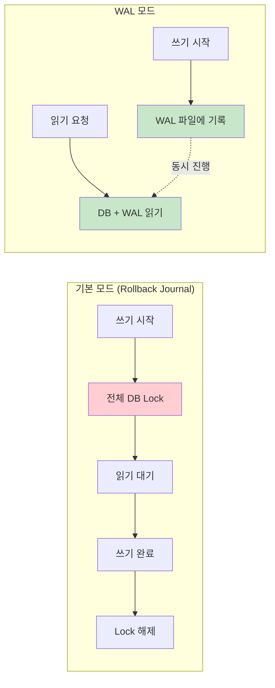
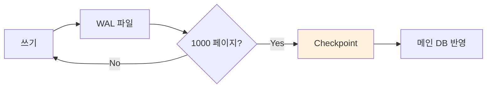
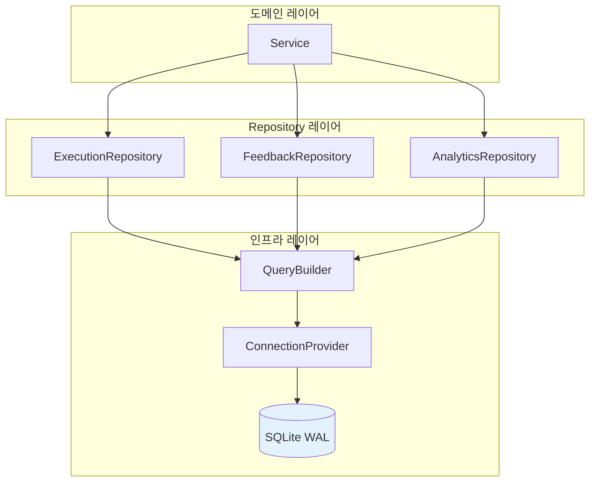
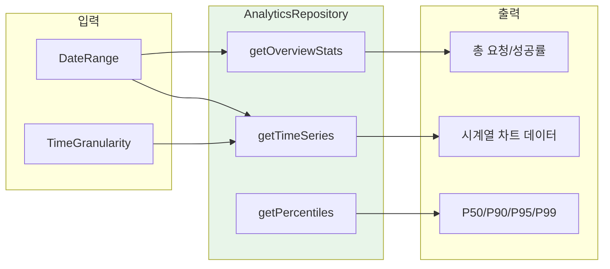

> 이 글은 [Claude Flow](https://github.com/Gyeom/claude-flow) 프로젝트를 개발하면서 정리한 내용이다. 전체 아키텍처는 [개발기](/dev-notes/posts/2025-11-22-claude-flow-development-story/)와 [설계기](/dev-notes/posts/2025-12-28-claude-flow-ai-agent-platform/)에서 확인할 수 있다.

## 왜 SQLite인가

AI 에이전트 플랫폼에서 실행 이력, 피드백, 분석 데이터를 저장해야 했다. PostgreSQL 대신 SQLite를 선택한 이유가 있다.

| 기준 | PostgreSQL | SQLite |
|------|-----------|--------|
| 배포 복잡도 | DB 서버 별도 운영 | 단일 파일 |
| 백업 | pg_dump 필요 | 파일 복사 |
| 동시성 | 높음 | WAL 모드로 충분 |
| 적합 환경 | 분산/대규모 | 단일 서버/임베디드 |

> SQLite is not directly comparable to client/server SQL database engines such as PostgreSQL. SQLite is an embedded SQL database engine. — [SQLite When to Use](https://sqlite.org/whentouse.html)

단일 서버 환경에서는 SQLite가 더 단순하고 효율적이다. 다만 기본 SQLite는 쓰기 작업 시 전체 DB를 잠근다. 이 문제를 WAL(Write-Ahead Logging) 모드로 해결했다.

## WAL 모드의 동작 원리

### Rollback Journal vs WAL



> WAL provides more concurrency as readers do not block writers and a writer does not block readers. Reading and writing can proceed concurrently. — [SQLite WAL](https://sqlite.org/wal.html)

| 특성 | Rollback Journal | WAL |
|------|-----------------|-----|
| 읽기/쓰기 동시성 | ❌ 쓰기 시 읽기 차단 | ✅ 동시 진행 |
| 다중 읽기 | ✅ | ✅ |
| 다중 쓰기 | ❌ | ❌ (SQLite 제약) |
| 파일 구조 | DB + Journal | DB + WAL + SHM |

### Checkpoint 메커니즘

WAL 파일이 커지면 주기적으로 Checkpoint가 실행되어 내용을 메인 DB로 옮긴다.



| Checkpoint 모드 | 동작 | 사용 시점 |
|----------------|------|----------|
| PASSIVE | 읽기와 충돌 없이 실행 | 일반적 상황 |
| FULL | 가능한 모든 WAL 이동 | 디스크 공간 확보 |
| RESTART | WAL을 0부터 재시작 | 장기 트랜잭션 후 |
| TRUNCATE | WAL 파일 크기 최소화 | 배포/백업 전 |

## WAL 모드 설정

```sql
PRAGMA journal_mode=WAL;
PRAGMA synchronous=NORMAL;
PRAGMA busy_timeout=5000;
```

| PRAGMA | 값 | 설명 |
|--------|-----|------|
| journal_mode | WAL | WAL 모드 활성화 |
| synchronous | NORMAL | WAL에서는 FULL 대신 NORMAL로 충분 |
| busy_timeout | 5000 | 쓰기 경합 시 대기 시간 (ms) |

> In WAL mode, synchronous=NORMAL is safe and provides good performance. The chance of corruption is reduced because the write-ahead log is synced before each transaction is committed. — [SQLite Pragma](https://sqlite.org/pragma.html#pragma_synchronous)

## Repository Pattern 설계

SQLite를 직접 다루는 대신 Repository 패턴으로 추상화했다. SQL을 비즈니스 로직에서 분리하면 테스트와 유지보수가 쉬워진다.



### 설계 원칙

| 원칙 | 구현 | 효과 |
|------|------|------|
| ConnectionProvider 주입 | 테스트 시 Mock 연결 사용 | 단위 테스트 용이 |
| QueryBuilder 사용 | SQL 문자열 대신 fluent API | SQL Injection 방지 |
| Row Mapper 분리 | ResultSet → 도메인 객체 변환 | 관심사 분리 |
| 도메인별 Repository | Execution, Feedback, Analytics | 단일 책임 원칙 |

### Repository 역할 분리

| Repository | 역할 | 주요 메서드 |
|------------|------|------------|
| ExecutionRepository | AI 실행 기록 CRUD | save, findRecent, findByDateRange |
| FeedbackRepository | 사용자 피드백 관리 | save, findByExecution |
| AnalyticsRepository | 집계/분석 쿼리 | getOverviewStats, getTimeSeries |

## 분석 쿼리 설계

AnalyticsRepository는 여러 Repository를 조합하여 집계 쿼리를 수행한다.



### 집계 쿼리 패턴

| 쿼리 유형 | SQLite 기능 | 사용 사례 |
|----------|------------|----------|
| 시계열 집계 | `strftime()` + GROUP BY | 시간별/일별/주별 통계 |
| 비교 분석 | 이전 기간 서브쿼리 | 전주 대비 변화율 |
| Percentile | 정렬 후 인덱스 계산 | P50, P90, P95, P99 |
| 조건부 집계 | `CASE WHEN` + SUM | 성공/실패 카운트 |

WAL 모드 덕분에 이런 집계 쿼리가 실행 중에도 새로운 데이터 삽입이 가능하다.

## 성능 최적화

### 인덱스 전략

```sql
CREATE INDEX idx_executions_created ON executions(created_at);
CREATE INDEX idx_executions_user ON executions(user_id);
CREATE INDEX idx_executions_channel ON executions(channel);
```

| 인덱스 대상 | 쿼리 패턴 | 효과 |
|-----------|----------|------|
| created_at | 날짜 범위 검색 | 시계열 쿼리 최적화 |
| user_id | 사용자별 조회 | 피드백 분석 |
| channel | 채널별 집계 | 채널 통계 |

WAL 모드에서는 인덱스 업데이트도 WAL 파일에 기록되므로 쓰기 성능 저하가 적다.

### 쿼리 최적화 원칙

| 원칙 | 구현 | 효과 |
|------|------|------|
| 단일 쿼리 집계 | 여러 통계를 한 쿼리로 | 라운드트립 감소 |
| Pagination | LIMIT + OFFSET | 메모리 사용 제한 |
| 필요한 컬럼만 | SELECT 명시 | I/O 감소 |

## WAL 모드 운영 고려사항

### 장단점 비교

| 장점 | 제약사항 |
|------|---------|
| 읽기/쓰기 동시 진행 | 네트워크 파일시스템 불가 |
| 대부분 기본 모드보다 빠름 | 동시에 하나의 쓰기만 가능 |
| 쓰기 중단 시 데이터 무결성 보장 | Checkpoint 없으면 WAL 파일 증가 |

> WAL mode is always consistent. However, all processes using a WAL-mode database must be on the same host computer. — [SQLite WAL](https://sqlite.org/wal.html)

### Checkpoint 관리

장시간 실행되는 읽기 트랜잭션이 있으면 Checkpoint가 차단된다. 해결 방법이 있다.

| 전략 | 구현 | 효과 |
|------|------|------|
| 주기적 Checkpoint | 1분마다 PASSIVE 실행 | WAL 크기 제어 |
| 읽기 타임아웃 | queryTimeout 설정 | Reader Gap 생성 |
| WAL 크기 제한 | PRAGMA wal_autocheckpoint | 자동 트리거 |

> 전체 구현은 [GitHub](https://github.com/Gyeom/claude-flow)에서 확인할 수 있다.

## 결론

| 핵심 원칙 | 구현 |
|----------|------|
| 간단한 배포 | 단일 파일 DB, 별도 서버 불필요 |
| 높은 동시성 | WAL 모드로 읽기/쓰기 분리 |
| 타입 안전성 | QueryBuilder로 SQL Injection 방지 |
| 유지보수성 | Repository 패턴으로 관심사 분리 |

단일 서버 환경에서 분석 데이터를 저장해야 한다면, PostgreSQL 같은 무거운 DB 대신 SQLite WAL 모드가 좋은 선택이다.

## 참고 자료

- [Write-Ahead Logging](https://sqlite.org/wal.html) - SQLite 공식 문서
- [How SQLite Scales Read Concurrency](https://fly.io/blog/sqlite-internals-wal/) - Fly.io Blog
- [WAL mode](https://highperformancesqlite.com/watch/wal-mode) - High Performance SQLite
- [SQLite When to Use](https://sqlite.org/whentouse.html) - SQLite 공식 문서

---

> **시리즈**: [Claude Flow 개발기](/dev-notes/posts/2025-11-22-claude-flow-development-story/) | **이전 글**: [피드백 학습으로 라우팅 개선](/dev-notes/posts/2025-11-15-feedback-learning-agent/) | **다음 글**: [코드 임베딩으로 MR 리뷰 컨텍스트 구축](/dev-notes/posts/2025-11-20-code-embedding-mr-review/)
