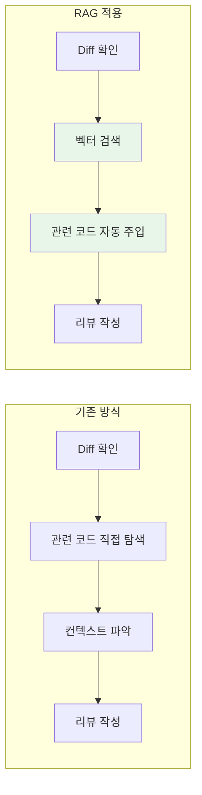
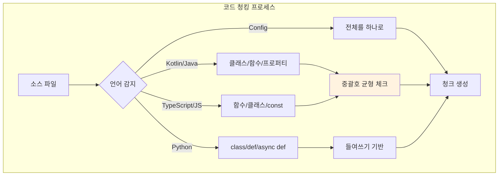
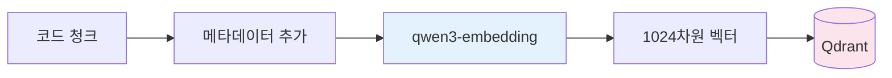
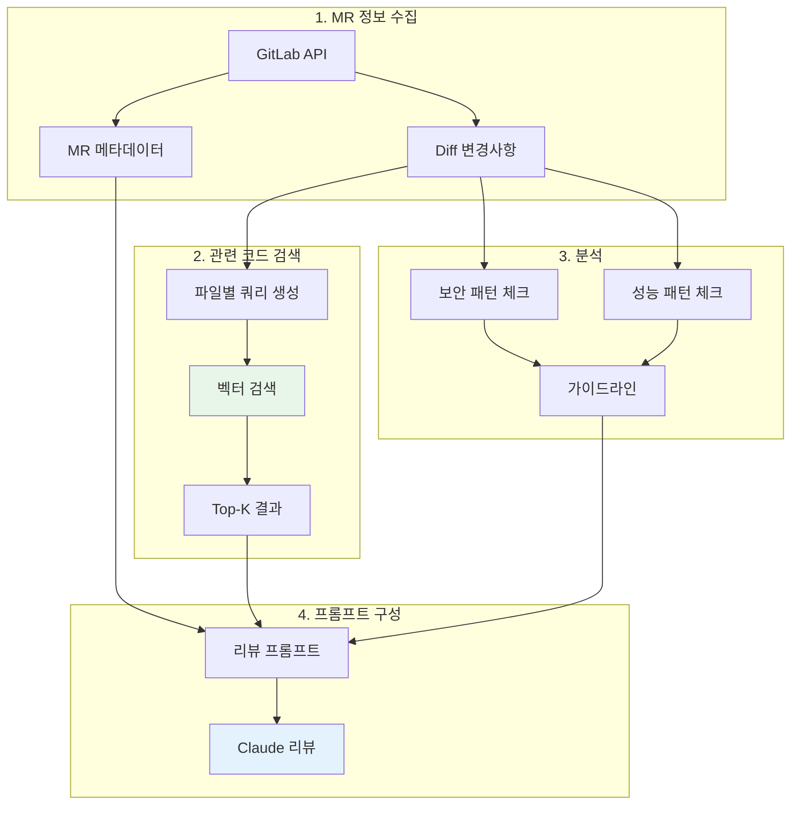

> 이 글은 [Claude Flow](https://github.com/Gyeom/claude-flow) 프로젝트를 개발하면서 정리한 내용이다. 전체 아키텍처는 [개발기](/dev-notes/posts/2024-12-22-claude-flow-development-story/)에서 확인할 수 있다.

## 문제 정의

MR 리뷰를 할 때 변경된 코드만 보면 전체 맥락을 파악하기 어렵다. 리뷰어는 관련 코드를 직접 찾아가며 확인해야 한다.



> Code search enables developers to find relevant examples in a codebase. Vector embeddings capture semantic similarity between code snippets. — [Qdrant Code Search Tutorial](https://qdrant.tech/documentation/advanced-tutorials/code-search/)

## 코드 청킹 전략

코드는 일반 텍스트와 다르게 함수, 클래스 등 명확한 구조를 가진다. 이를 활용한 **언어별 청킹 전략**이 핵심이다.

> For code, chunk boundaries should align with logical units like functions, classes, or modules rather than arbitrary character counts. — [Pinecone Chunking Strategies](https://www.pinecone.io/learn/chunking-strategies/)



### 언어별 청킹 단위

| 언어 | 청킹 단위 | 블록 경계 |
|------|----------|----------|
| Kotlin/Java | class, interface, fun | 중괄호 균형 |
| TypeScript/JS | function, class, const | 중괄호 균형 |
| Python | class, def, async def | 들여쓰기 |
| YAML/JSON | 전체 파일 | - |

### 청크 크기 설정

| 파라미터 | 값 | 근거 |
|----------|-----|------|
| maxChunkSize | 1500자 | 임베딩 모델 컨텍스트 제한 |
| minChunkSize | 100자 | 의미 없는 작은 조각 필터링 |
| overlapSize | 100자 | 청크 간 컨텍스트 보존 |

> Best practices for RAG in 2025 recommend 400-512 tokens with 10-20% overlap. — [Firecrawl RAG Best Practices](https://www.firecrawl.dev/blog/best-chunking-strategies-rag-2025)

## 벡터화와 인덱싱

### 임베딩 모델 선택



**qwen3-embedding:0.6b** 모델 선택 이유:

| 기준 | 값 |
|------|-----|
| MTEB Multilingual | 1위 |
| MTEB Code | 1위 |
| 차원 | 1024 |
| 언어 지원 | 100+ (한국어 포함) |
| 실행 환경 | 로컬 (API 비용 없음) |

### 임베딩 텍스트 구성

단순히 코드만 임베딩하지 않고 **메타데이터를 포함**한다.

```
File: src/service/UserService.kt
Type: class
class UserService(private val repository: UserRepository) { ... }
```

파일 경로와 청크 타입을 포함하면 "UserService의 save 함수" 같은 쿼리에 더 정확하게 매칭된다.

### Qdrant 페이로드 구조

| 필드 | 타입 | 용도 |
|------|------|------|
| project_id | keyword | 프로젝트 필터링 |
| file_path | text | 파일 검색 |
| start_line, end_line | integer | 코드 위치 표시 |
| language | keyword | 언어 필터링 |
| chunk_type | keyword | class/function/config |
| content_preview | text | 결과 미리보기 |

## MR 리뷰 파이프라인

### 전체 흐름



### 벡터 검색 파라미터

| 파라미터 | 값 | 설명 |
|----------|-----|------|
| topK | 3-5 | 파일당 관련 코드 수 |
| minScore | 0.5-0.6 | 유사도 임계값 |
| filter | project_id | 동일 프로젝트만 검색 |

### 자동 리뷰 가이드라인

Diff에서 보안, 성능 패턴을 휴리스틱 기반으로 탐지한다.

| 카테고리 | 패턴 | 심각도 |
|----------|------|--------|
| security | password, secret, token, api.key | 🚨 error |
| performance | N+1, sleep, busy wait | ⚠️ warning |
| style | TODO, FIXME, console.log | ℹ️ info |

### 리뷰 프롬프트 구성

```
## MR 리뷰 요청
- 제목: {MR 제목}
- 브랜치: feature → main

## 자동 검출된 리뷰 포인트
🚨 [security] 하드코딩된 비밀번호 주의

## 관련 코드베이스 (RAG)
- src/service/UserService.kt:15-42 (유사도: 0.78)
- src/repository/UserRepository.kt:8-25 (유사도: 0.72)

## 변경된 파일 목록
[수정] src/service/AuthService.kt
[신규] src/dto/LoginRequest.kt
```

Claude는 이 프롬프트를 받아 관련 코드베이스와 가이드라인을 참고하여 리뷰한다.

## 프로젝트 인덱싱

### 지원 파일 타입

| 카테고리 | 확장자 |
|----------|--------|
| 코드 | kt, java, ts, tsx, js, py, go, rs |
| 설정 | yaml, yml, json, toml |
| 문서 | md, sql |

**제외 디렉토리**: node_modules, .git, build, dist, target, .gradle, __pycache__

### 사용 예시

```bash
# 프로젝트 인덱싱
/gitlab index-project my-project main
→ 87개 파일, 342개 청크 인덱싱 완료

# MR 리뷰
/gitlab mr-review my-project 123
→ 3개 가이드라인, 8개 관련 코드 발견

# 통계 조회
/gitlab knowledge-stats my-project
→ 342개 청크, 마지막 업데이트: 2024-12-22
```

## 성능 최적화

| 전략 | 구현 | 효과 |
|------|------|------|
| 임베딩 캐시 | LRU 10,000개 | 중복 임베딩 방지 |
| topK 제한 | 3-5개 | 노이즈 감소 |
| minScore | 0.5-0.6 | 관련 없는 코드 필터링 |
| 프로젝트 필터 | Qdrant filter | 검색 범위 제한 |

## 향후 개선 방향

| 개선안 | 설명 | 기대 효과 |
|--------|------|----------|
| Late Chunking | 전체 문서 임베딩 후 청킹 | 10-12% 정확도 향상 |
| 하이브리드 검색 | 벡터 + 키워드 결합 | 정확한 함수명 매칭 |
| LLM 가이드라인 | Diff를 LLM으로 분석 | 정교한 리뷰 포인트 |
| Re-ranking | 수정 날짜, 참조 빈도 반영 | 관련성 높은 결과 우선 |

> 전체 구현은 [GitHub](https://github.com/Gyeom/claude-flow)에서 확인할 수 있다.

## 결론

| 핵심 원칙 | 구현 |
|----------|------|
| 언어별 청킹 | 함수/클래스 단위 분할 |
| 메타데이터 활용 | 파일 경로, 청크 타입 포함 |
| 로컬 실행 | Ollama + Qdrant |
| 자동 리뷰 | 보안/성능 패턴 탐지 |

코드베이스 임베딩은 MR 리뷰뿐만 아니라 코드 검색, 중복 코드 탐지, 리팩토링 후보 발견 등 다양하게 활용할 수 있다.

## 참고 자료

- [Chunking Strategies for LLM Applications](https://www.pinecone.io/learn/chunking-strategies/) - Pinecone
- [Best Chunking Strategies for RAG in 2025](https://www.firecrawl.dev/blog/best-chunking-strategies-rag-2025) - Firecrawl
- [Search Through Your Codebase](https://qdrant.tech/documentation/advanced-tutorials/code-search/) - Qdrant
- [Building a Semantic Code Search Agent](https://mihirinamdar.medium.com/building-a-semantic-code-search-agent-with-qdrant-a-modern-approach-to-code-metadata-indexing-ac3a53ded594) - Medium
