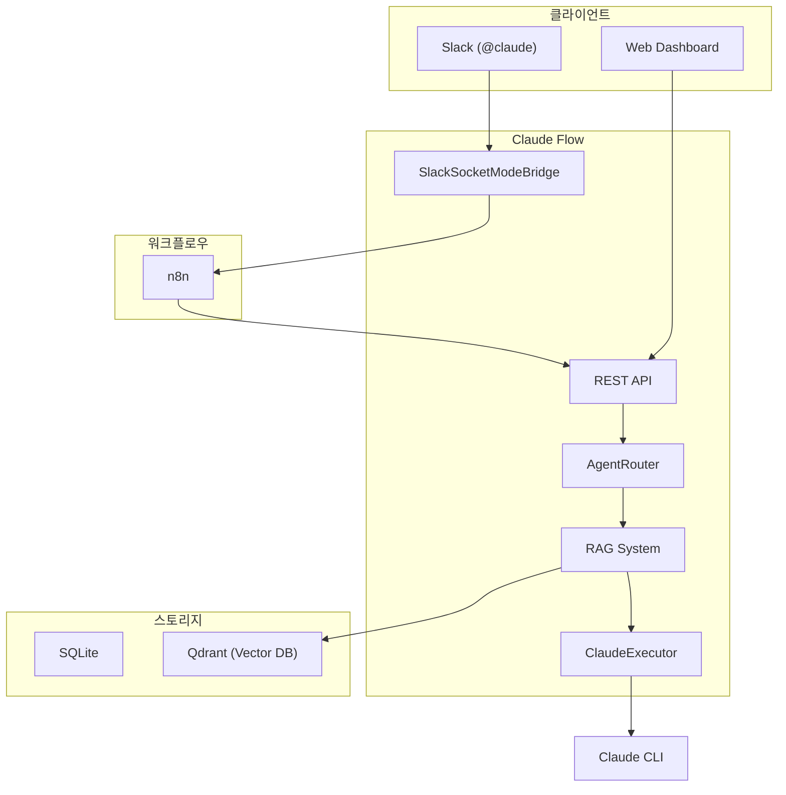

## 문제

Claude API를 팀에서 쓰면 토큰당 과금이다. 코드 리뷰 한 번에 수만 토큰, 팀원 10명이 하루 10번씩 쓰면 월 수백만원이 나간다.

그런데 **Claude Code Max**는 다르다. 월정액만 내면 CLI를 무제한으로 쓸 수 있다.

보통 자동화에서는 API 키를 쓴다. CI/CD도, Slack 봇도 다 그렇다. CLI를 래핑할 생각은 잘 안 한다. 하지만 Max의 무제한 사용을 활용하려면 CLI를 써야 한다.

## 해결 방향

### CLI를 래핑한다

Claude CLI를 서버에서 실행하고, Slack과 웹 대시보드를 인터페이스로 붙인다. `@claude 리뷰해줘` 한 마디면 CLI가 동작하고, 대화가 채널에 남는다.

### 로컬 인프라로 통일한다

CLI를 래핑하기로 했으니, 나머지 인프라도 로컬로 통일했다. Pinecone이나 OpenAI Embedding API를 쓰면 결국 요청당 과금이다. 더 중요한 건 보안이다. MR 리뷰를 위해 사내 코드를 벡터화해야 하는데, 이게 외부 서비스로 나가면 곤란하다.

### 워크플로우는 n8n에 위임한다

Slack 이벤트를 받아서 분류하고, GitLab API를 호출하고, 결과를 다시 Slack에 보내는 흐름이 있다. 이걸 코드로 직접 구현하면 로직을 바꿀 때마다 배포해야 한다. n8n을 쓰면 워크플로우를 시각적으로 수정할 수 있고, 배포 없이 즉시 반영된다.

## 만든 것

### Slack 연동

```
@claude 이 코드 뭐가 문제야?
@claude authorization-server !42 리뷰해줘
@claude PROJ-123 이슈 분석해줘
```

멘션 한 번에 Claude Code가 동작한다. 응답은 실시간 스트리밍으로 표시된다.

### GitLab MR 리뷰

프로젝트 코드를 벡터 DB에 인덱싱해두면, MR 리뷰 시 관련 코드를 자동으로 찾아서 컨텍스트로 제공한다. 단순히 diff만 보는 게 아니라, 기존 코드베이스의 패턴과 컨벤션을 이해한 상태에서 리뷰한다.

### 지능형 라우팅

같은 질문이라도 상황에 따라 다른 에이전트가 더 적합할 수 있다.

```
사용자 메시지 → 피드백 학습 → 키워드 매칭 → 시맨틱 검색 → 기본 폴백
```

5단계 라우팅 파이프라인이 최적의 에이전트를 선택한다. 사용자의 👍/👎 피드백을 학습해서 점점 정확해진다.

### 대시보드

Slack은 일상적인 사용, 대시보드는 관리와 분석이다.

| 기능 | 설명 |
|------|------|
| **실시간 통계** | 요청 수, 성공률, 응답 시간, 토큰 비용 |
| **웹 채팅** | Slack 없이 대시보드에서 직접 대화 |
| **피드백 분석** | 👍/👎 추이, 만족도 점수 |
| **에이전트 관리** | 에이전트 on/off, 우선순위 설정 |
| **Jira 통합** | 이슈 검색, AI 분석, 자연어→JQL 변환 |

## 어떻게 만들었나

### 아키텍처



Slack 이벤트는 n8n을 거쳐서 Claude Flow API로 들어온다. n8n이 메시지를 분류하고(명령어인지, MR 리뷰인지, 일반 질문인지), 필요하면 GitLab API를 호출해서 MR 정보를 붙인 다음 Claude Flow로 넘긴다.

### 기술 스택

| 기술 | 선택 이유 |
|------|----------|
| **Kotlin + Spring Boot** | 코루틴으로 비동기 처리가 깔끔하다 |
| **SQLite (WAL 모드)** | 별도 DB 서버 없이 파일 하나로 배포 |
| **Qdrant** | 사내 코드 벡터가 외부로 나가지 않음 |
| **Ollama** | 임베딩 API 비용 제로, 오프라인 작동 |
| **n8n** | 워크플로우를 코드 없이 수정. 배포 없이 즉시 반영 |

### 배포

```bash
./start.sh  # Docker Compose로 모든 서비스를 한 번에 띄운다
```

Kubernetes도, 외부 DB 서버도 필요 없다. 서버 한 대면 충분하다.

## 회고

### 피드백 루프가 생각보다 강력하다

처음에는 키워드 매칭만으로 라우팅했다. 정확도가 70% 정도였다. 피드백 학습을 추가하니 90%까지 올라갔다. 사용자가 쓰면 쓸수록 좋아지는 시스템이 됐다.

### n8n 도입이 개발 속도를 바꿨다

"MR 리뷰 요청 시 GitLab에서 diff를 먼저 가져오자"는 요구사항이 들어왔을 때, 코드를 건드리지 않고 n8n 워크플로우만 수정해서 30분 만에 배포했다. 이벤트 처리 로직을 n8n에 위임한 게 좋은 선택이었다.

### CLI 래핑의 한계도 있다

프로세스 기반이라 스케일 아웃이 까다롭다. 에러 핸들링도 CLI 출력을 파싱해야 해서 깔끔하지 않다. 현재 규모에서는 문제없지만, 팀이 커지면 다른 방법을 고민해야 할 수도 있다.

## 마무리

Claude Flow는 현재 팀 내에서 실제로 사용 중이다. 하루 수백 건의 요청을 처리하고, MR 리뷰 시간을 체감상 절반 이상 줄여줬다.

코드는 GitHub에 공개했다.

**GitHub**: [github.com/Gyeom/claude-flow](https://github.com/Gyeom/claude-flow)

---

## 시리즈 포스트

개발 과정에서 깊이 다룬 기술들을 별도 포스트로 정리했다.

| 주제 | 내용 |
|------|------|
| [Session Resume로 토큰 비용 절감](/dev-notes/posts/2025-11-05-claude-code-session-resume/) | `--resume` 플래그로 컨텍스트 재사용 |
| [다단계 에이전트 라우팅](/dev-notes/posts/2025-11-08-multi-stage-agent-routing/) | 5단계 라우팅 파이프라인 설계 |
| [RAG 기반 에이전트 라우팅](/dev-notes/posts/2025-11-12-rag-agent-routing/) | Qdrant + Ollama로 시맨틱 검색 |
| [피드백 학습으로 라우팅 개선](/dev-notes/posts/2025-11-15-feedback-learning-agent/) | 👍/👎 피드백을 라우팅에 반영 |
| [SQLite WAL 모드로 고처리량 달성](/dev-notes/posts/2025-11-18-sqlite-wal-high-throughput/) | 읽기/쓰기 동시 처리 |
| [코드 임베딩으로 MR 리뷰 컨텍스트 구축](/dev-notes/posts/2025-11-20-code-embedding-mr-review/) | 코드베이스 벡터화 |
