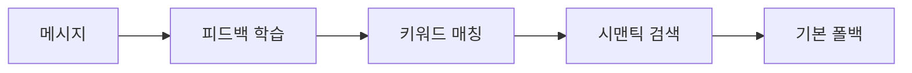
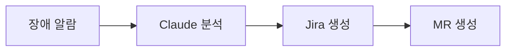

## 개발 배경

**Claude Code Max**는 월정액만 내면 CLI를 무제한으로 쓸 수 있다. 사용량이 아무리 많아도 추가 비용이 없다.

보통 자동화에서는 API를 쓴다. CI/CD도, Slack 봇도 그렇다. 하지만 API는 토큰당 과금이라 팀 전체가 쓰기엔 부담이 크다. CLI는 다르다. 월정액 하나면 된다.

그래서 생각했다. **로컬 서버에 CLI를 설치해두고 항상 켜두면 어떨까?**

- 팀원들은 CLI를 직접 설치하지 않아도 된다
- Slack Socket Mode로 로컬 서버와 Slack이 양방향 통신한다
- `@claude` 멘션 한 번이면 서버의 CLI가 실행된다
- 코드 리뷰는 n8n 스케줄러가 5분마다 자동으로 돌린다

한 대의 로컬 서버에서 CLI를 공유하는 것이다.

---

## 설계 원칙

### CLI 래핑

Claude CLI를 서버에서 실행하고, Slack과 웹 대시보드를 인터페이스로 붙인다. `@claude 리뷰해줘` 한 마디면 CLI가 동작하고, 대화가 채널에 남는다.

### 로컬 인프라

CLI를 래핑하기로 했으니, 나머지 인프라도 로컬로 통일했다. MR 리뷰를 위해 사내 코드를 벡터화해야 하는데, 외부 서비스로 나가면 보안 이슈가 된다.

| 구성요소 | 외부 서비스 | 로컬 대체 |
|----------|------------|----------|
| 임베딩 | OpenAI API | Ollama |
| 벡터 DB | Pinecone | Qdrant |
| 데이터베이스 | PostgreSQL | SQLite |

사내 코드가 외부로 나가지 않는다.

### 워크플로우 분리

Slack 이벤트 분류, GitLab API 호출, 결과 전송 같은 흐름은 자주 바뀐다. 코드로 구현하면 변경마다 재배포가 필요하다. n8n으로 분리하면 UI에서 수정하고 즉시 반영된다

---

## 아키텍처

### 전체 구조


### 데이터 흐름

1. Slack 멘션 → n8n이 이벤트 수신 및 분류
2. n8n → Claude Flow API로 요청 전달
3. AgentRouter가 최적 에이전트 선택
4. RAG System이 관련 코드 검색
5. ClaudeExecutor가 CLI 실행
6. 응답을 Slack으로 스트리밍

### 기술 스택 선택 이유

| 기술 | 선택 이유 |
|------|----------|
| **Kotlin + Spring Boot** | 코루틴으로 CLI 비동기 처리가 깔끔하다 |
| **SQLite (WAL 모드)** | 별도 DB 서버 없이 배포가 단순하다 |
| **Qdrant** | 로컬 실행으로 사내 코드 외부 유출을 차단한다 |
| **Ollama** | 임베딩 API 비용이 없고, 오프라인에서도 작동한다 |
| **n8n** | 워크플로우 변경 시 재배포가 필요 없다 |

### 배포

```bash
/start  # Docker Compose로 모든 서비스를 한 번에 띄운다
```

Kubernetes도, 외부 DB 서버도 필요 없다. 서버 한 대면 충분하다.

---

## 핵심 기능

### Slack 통합

```
@claude 이 코드 뭐가 문제야?
@claude authorization-server !42 리뷰해줘
@claude PROJ-123 이슈 분석해줘
```

멘션 한 번에 Claude Code가 동작한다. 응답은 실시간 스트리밍으로 표시된다.

**가치**: 기존 협업 도구에서 바로 사용한다. 별도 학습 비용이 없다.

### 자동 MR 리뷰

5분마다 GitLab MR을 자동으로 리뷰한다. `develop` 브랜치로 향하는 MR 중 `ai-review::done`, `ai-review::skip` 라벨이 없는 것만 대상이다.

**가치**: 시니어 개발자의 리뷰 대기 시간을 제거한다. 초기 피드백을 즉시 제공한다.

### 지능형 라우팅

사용자의 👍/👎 피드백을 학습해서 최적 에이전트를 선택한다.



**가치**: 사용할수록 정확해진다. 초기 70%에서 현재 90% 정확도로 향상됐다.

### 서브에이전트 시스템

복합 작업은 전문 에이전트가 나눠서 처리한다.

| 에이전트 | 역할 | 모델 |
|---------|------|------|
| `general` | 일반 질문, 설명 | Sonnet |
| `code-reviewer` | 코드 리뷰, MR 분석 | Opus |
| `bug-fixer` | 버그 분석 및 수정 | Opus |
| `refactor` | 코드 리팩토링 | Sonnet |

**가치**: 작업 복잡도에 따라 적절한 모델을 자동 선택한다.

### 대시보드

| 기능 | 설명 |
|------|------|
| **실시간 통계** | 요청 수, 성공률, 응답 시간 |
| **피드백 분석** | 👍/👎 추이, 만족도 점수 |
| **에이전트 관리** | 에이전트 on/off, 우선순위 설정 |

**가치**: 사용 현황 파악, 품질 모니터링이 가능하다.

### 장애 알람 자동화

Sentry, DataDog 등의 알람이 Slack에 오면, 분석부터 MR 생성까지 처리한다.



사람이 버튼만 누르면 나머지는 n8n 워크플로우가 처리한다.

---

## 결과

### 성과

| 지표 | 결과 |
|------|------|
| MR 리뷰 시간 | 체감 50% 단축 |
| 라우팅 정확도 | 70% → 90% (피드백 학습) |

### 정성적 성과

- n8n 도입으로 워크플로우 변경이 30분 내 가능하다
- 피드백 루프가 예상보다 강력하다. 사용자가 쓸수록 좋아진다

---

## 한계

### CLI 래핑의 제약

- 프로세스 기반이라 스케일 아웃이 까다롭다
- 에러 핸들링이 CLI 출력 파싱에 의존한다
- 현재 규모에서는 문제없지만, 팀이 커지면 재검토가 필요하다

### 적합한 상황

| 상황 | 권장 |
|------|------|
| 소규모 팀, 비용 민감 | ✅ Claude Flow |
| 대규모 조직, 엔터프라이즈 거버넌스 필요 | ⚠️ Amazon Bedrock 연동 검토 |

대규모 조직에서 IAM 권한 관리, CloudTrail 감사, PrivateLink 같은 엔터프라이즈 기능이 필요하다면 [Amazon Bedrock과 Claude Code 연동](https://aws.amazon.com/ko/blogs/tech/bedrock-with-claude-code/)을 검토한다.

---

## 결론

Claude Flow는 "API 대신 CLI를 감싸면 어떨까"라는 질문에서 시작했다.

**핵심 인사이트**:
- 월정액 CLI를 래핑하면 팀 전체가 무제한 사용 가능하다
- 로컬 인프라로 통일하면 비용과 보안을 동시에 해결한다
- n8n으로 워크플로우를 분리하면 재배포 없이 수정 가능하다

현재 팀 내에서 하루 50건 이상의 요청을 처리하고 있다.

**GitHub**: [github.com/Gyeom/claude-flow](https://github.com/Gyeom/claude-flow)
