> **시리즈**: AI 자동화 블로그 만들기
> 1. [Hugo + GitHub Pages 구축](/dev-notes/posts/2024-11-29-hugo-github-pages-auto-blog/)
> 2. **Claude Code로 이슈 기반 자동 포스팅** ← 현재 글

---

## 개요

[이전 글](/dev-notes/posts/2024-11-29-hugo-github-pages-auto-blog/)에서 Hugo 블로그와 GitHub Pages 자동 배포를 구축했다. 이번에는 GitHub 이슈에서 `@claude`를 멘션하면 Claude가 포스트를 작성하고 PR까지 자동 생성하는 워크플로우를 추가한다.

코드 작성, 문서 생성, 버그 수정 등 다양한 작업을 이슈 하나로 요청할 수 있다. 리뷰 프로세스를 유지하면서도 반복적인 작업을 자동화할 수 있어 생산성이 크게 향상된다.

## 완성된 워크플로우

최종 흐름은 다음과 같다.

```mermaid
flowchart TD
    A[이슈에 @claude 멘션] --> B[GitHub Actions 트리거]
    B --> C[Claude Code 실행]
    C --> D{파일 변경?}
    D -->|Yes| E[브랜치 생성 + 커밋]
    D -->|No| F[결과 코멘트만 작성]
    E --> G[PR 자동 생성]
    G --> H[리뷰 후 머지]
    H --> I[GitHub Pages 배포]
    I --> J[이슈 자동 Close]
```



---

## 1. 사전 준비

### Anthropic API 키 등록

Claude API를 사용하려면 Anthropic API 키가 필요하다. [Anthropic Console](https://console.anthropic.com/)에서 발급받을 수 있다.

GitHub 저장소 Settings > Secrets and variables > Actions에서 `ANTHROPIC_API_KEY`를 등록한다.

```bash
gh secret set ANTHROPIC_API_KEY --repo username/repo-name
```

### Actions 권한 설정

GitHub Actions가 PR을 생성하려면 쓰기 권한이 필요하다. 기본적으로 읽기 전용이므로 별도로 설정해야 한다.

```bash
gh api repos/username/repo-name/actions/permissions/workflow \
  -X PUT \
  -f default_workflow_permissions="write" \
  -F can_approve_pull_request_reviews=true
```

---

## 2. 워크플로우 파일 작성

핵심이 되는 워크플로우 파일이다. 이슈 이벤트를 감지하고, Claude Code를 설치해 실행한 뒤, 변경사항이 있으면 PR을 생성한다.

`.github/workflows/claude.yml`:

```yaml
name: Claude AI Assistant

on:
  issue_comment:
    types: [created]
  pull_request_review_comment:
    types: [created]
  issues:
    types: [opened, assigned]

jobs:
  claude-response:
    if: contains(github.event.comment.body, '@claude') || contains(github.event.issue.body, '@claude')
    runs-on: ubuntu-latest

    permissions:
      contents: write
      issues: write
      pull-requests: write

    steps:
      - name: Checkout
        uses: actions/checkout@v4
        with:
          fetch-depth: 0

      - name: Setup Git
        run: |
          git config user.name "github-actions[bot]"
          git config user.email "github-actions[bot]@users.noreply.github.com"

      - name: Setup Node.js
        uses: actions/setup-node@v4
        with:
          node-version: '20'

      - name: Install Claude Code
        run: npm install -g @anthropic-ai/claude-code

      - name: Run Claude
        env:
          ANTHROPIC_API_KEY: ${{ secrets.ANTHROPIC_API_KEY }}
          GITHUB_TOKEN: ${{ secrets.GITHUB_TOKEN }}
          ISSUE_NUMBER: ${{ github.event.issue.number }}
        run: |
          COMMENT_BODY="${{ github.event.comment.body || github.event.issue.body }}"
          PROMPT=$(echo "$COMMENT_BODY" | sed 's/.*@claude//')

          RESPONSE=$(claude -p "$PROMPT" --max-turns 20 2>&1) || true

          if [ -n "$(git status --porcelain)" ]; then
            BRANCH_NAME="claude/issue-${ISSUE_NUMBER}-$(date +%Y%m%d%H%M%S)"
            git checkout -b "$BRANCH_NAME"

            git add .
            git commit -m "feat: Claude가 이슈 #${ISSUE_NUMBER} 요청 처리"
            git push -u origin "$BRANCH_NAME"

            PR_URL=$(gh pr create \
              --title "Claude: 이슈 #${ISSUE_NUMBER} 요청 처리" \
              --body "Closes #${ISSUE_NUMBER}" \
              --base main \
              --head "$BRANCH_NAME")

            RESULT_MSG="PR 생성됨: $PR_URL"
          else
            RESULT_MSG="파일 변경사항 없음"
          fi

          gh issue comment ${ISSUE_NUMBER} --body "## Claude 응답

          $RESPONSE

          ---
          $RESULT_MSG"
```

### 핵심 포인트

| 항목 | 설명 |
|------|------|
| `GITHUB_TOKEN` | GitHub이 자동 제공, 별도 설정 불필요 |
| `permissions` | contents, issues, pull-requests 쓰기 권한 |
| `--max-turns 20` | 복잡한 작업을 위해 충분한 턴 수 확보 |
| 브랜치 명명 | `claude/issue-{번호}-{타임스탬프}` 형식 |

워크플로우는 `@claude` 멘션이 포함된 이슈나 코멘트에만 반응한다. 멘션 뒤의 텍스트를 프롬프트로 추출해 Claude에게 전달하고, 파일 변경이 발생하면 새 브랜치를 만들어 PR을 생성한다.

---

## 3. 실제 사용 예시

실제로 이 워크플로우를 사용해 블로그 포스트를 자동 생성한 과정이다.

### 이슈 생성


이슈를 생성하고 본문에 `@claude`를 멘션한다. 멘션 뒤에 원하는 작업을 자연어로 설명하면 된다.

```
@claude OpenFGA와 ReBAC(Relationship-Based Access Control)에 대한 포스트를 content/posts/ 폴더에 작성해줘.

주요 내용:
- ReBAC 개념과 기존 RBAC와의 차이점
- OpenFGA 소개 및 아키텍처
- 스키마 정의 방법 (DSL)
- 관계 튜플과 권한 체크 방식
- Spring Boot 연동 예시
- 실제 사용 사례 (Google Drive, GitHub 등)
```

### Claude 응답 및 PR 생성

이슈가 생성되면 GitHub Actions가 트리거되고, Claude Code가 요청을 처리한다. 파일 생성이 완료되면 자동으로 PR이 만들어진다.


### PR 상세


PR 본문에 `Closes #9`가 포함되어 있어 머지 시 원본 이슈가 자동으로 닫힌다. 이렇게 이슈와 PR이 연결되어 작업 추적이 용이하다.

### 워크플로우 실행 로그


Actions 탭에서 워크플로우 실행 상태와 로그를 확인할 수 있다. 성공 여부, 실행 시간, 각 단계별 출력을 볼 수 있어 디버깅에 유용하다.

---

## 4. GITHUB_TOKEN 동작 원리

워크플로우에서 `${{ secrets.GITHUB_TOKEN }}`을 별도 설정 없이 사용할 수 있다. 이 토큰이 어떻게 동작하는지 알아보자.

### 자동 생성 메커니즘

1. 워크플로우 실행 시 GitHub이 임시 토큰 발급
2. 해당 저장소에 대한 권한만 부여
3. 워크플로우 종료 시 토큰 자동 폐기

### PAT vs GITHUB_TOKEN

| 구분 | GITHUB_TOKEN | PAT |
|------|--------------|-----|
| 범위 | 해당 저장소만 | 여러 저장소 |
| 수명 | 워크플로우 실행 중만 | 수동 관리 |
| 설정 | 자동 | 수동 등록 필요 |

---

## 5. 활용 사례

### 포스트 작성 요청

```
@claude Docker Compose 로컬 개발 환경 구성 가이드 포스트를 작성해줘.
Spring Boot + PostgreSQL + Redis 조합으로.
```

### 버그 수정 요청

```
@claude 이 파일의 타입 에러 수정해줘.
src/utils/date.ts
```

### 문서 개선 요청

```
@claude README에 설치 방법과 사용법 섹션 추가해줘.
```

---

## 6. 주의사항

### max-turns 설정

복잡한 작업은 기본 턴 수로 부족할 수 있다. `--max-turns 20` 이상 권장.

### Actions 권한

PR 생성 시 `GitHub Actions is not permitted to create pull requests` 에러가 발생하면 저장소 설정에서 권한을 추가해야 한다.

### 비용

Claude API 호출 비용이 발생한다. 복잡한 요청일수록 토큰 사용량이 증가한다.

---

## 7. 배포 결과

PR을 머지하면 GitHub Pages 배포 워크플로우가 자동 실행된다. 빌드가 완료되면 블로그에 새 포스트가 게시된다.


Claude가 작성한 "OpenFGA와 ReBAC로 구현하는 관계 기반 권한 제어" 포스트가 블로그에 게시됐다. PR 본문에 `Closes #9`가 포함되어 있었기 때문에 머지와 동시에 원본 이슈도 자동으로 닫힌다.

---

## 결과

이슈에서 `@claude`를 멘션하는 것만으로 코드 생성부터 배포까지 전체 파이프라인이 자동화됐다.

```mermaid
flowchart LR
    A[이슈 생성] --> B[Claude 실행] --> C[PR 생성] --> D[리뷰/머지] --> E[배포] --> F[이슈 Close]
```



**장점**
- 반복적인 작업 자동화
- 코드 리뷰 프로세스 유지
- 이슈 트래킹과 자연스럽게 연동
- 머지만 하면 배포까지 완료

**확장 가능성**
- PR 코멘트에서도 `@claude` 멘션으로 코드 수정 요청
- 라벨 기반 자동 할당
- 특정 조건에서만 Claude 실행

이 워크플로우를 기반으로 다양한 자동화를 구축할 수 있다.

---

## 시리즈 마무리

이 시리즈에서 구축한 전체 시스템 구조다.

```mermaid
flowchart TB
    subgraph "Part 1: 블로그 구축"
        H[Hugo + PaperMod] --> G[GitHub Pages]
        G --> D1[deploy.yml]
    end

    subgraph "Part 2: AI 자동화"
        I[GitHub 이슈] --> C[Claude Code]
        C --> PR[Pull Request]
        PR --> D1
    end

    D1 --> B[블로그 배포]
```



👈 [Part 1: Hugo + GitHub Pages 구축](/dev-notes/posts/2024-11-29-hugo-github-pages-auto-blog/)
