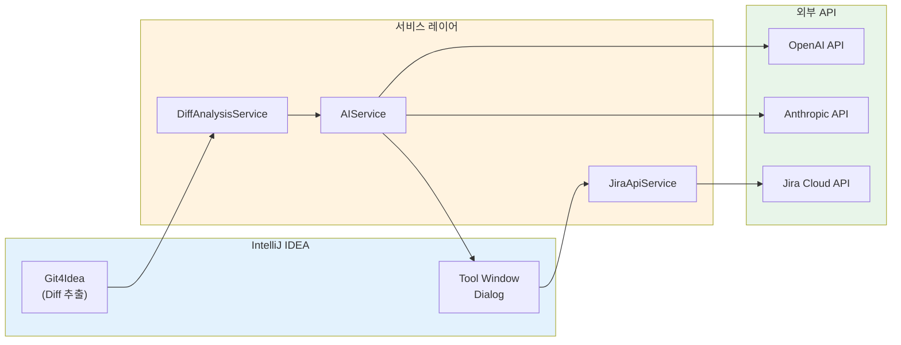

긴급 핫픽스 상황에서 코드 수정 후 Jira 티켓까지 빠르게 생성하고 싶었다. Git diff에 변경 내용이 다 있으니, AI가 이를 분석해서 티켓을 자동 생성하면 효율적이겠다고 생각했다.

## 사용 흐름


IntelliJ 오른쪽 Tool Window에서 "Create from Code Changes" 버튼을 클릭하면 현재 uncommitted 변경사항을 AI가 분석한다.


AI가 생성한 제목과 설명을 확인하고, 필요하면 수정한다. Project, Issue Type, Priority를 선택하고 Create를 누르면 Jira 티켓이 생성된다.


Settings에서 Jira 연결 정보와 AI 프로바이더(OpenAI/Claude)를 설정한다. 출력 언어도 한국어, 영어 등 8개 언어를 지원한다.

---

## 아키텍처



핵심은 세 개의 서비스다.

| 서비스 | 역할 |
|--------|------|
| **DiffAnalysisService** | Git4Idea로 uncommitted changes 추출 |
| **AIService** | OpenAI/Claude API로 티켓 내용 생성 |
| **JiraApiService** | Jira Cloud REST API로 이슈 생성 |

---

## Git Diff 분석

IntelliJ의 `Git4Idea` 플러그인은 VCS 기능을 제공한다. 이걸 활용해서 변경사항을 추출한다.

```kotlin
@Service(Service.Level.PROJECT)
class DiffAnalysisService(private val project: Project) {

    data class DiffAnalysisResult(
        val filesChanged: Int,
        val linesAdded: Int,
        val linesDeleted: Int,
        val fileList: List<String>,
        val diffContent: String,
        val branchName: String?
    )

    fun analyzeUncommittedChanges(): DiffAnalysisResult? {
        val changeListManager = ChangeListManager.getInstance(project)
        val changes = changeListManager.allChanges

        if (changes.isEmpty()) return null

        return analyzeChanges(changes.toList(), getCurrentBranch())
    }

    fun analyzeChanges(changes: List<Change>, branchName: String?): DiffAnalysisResult {
        var linesAdded = 0
        var linesDeleted = 0
        val fileList = mutableListOf<String>()
        val diffContentBuilder = StringBuilder()

        for (change in changes) {
            val filePath = getFilePath(change)
            fileList.add(filePath)

            val beforeContent = change.beforeRevision?.content ?: ""
            val afterContent = change.afterRevision?.content ?: ""

            val diff = computeDiff(beforeContent, afterContent)
            linesAdded += diff.added
            linesDeleted += diff.deleted

            diffContentBuilder.append("File: $filePath\n")
            diffContentBuilder.append(diff.content)
            diffContentBuilder.append("\n---\n\n")
        }

        return DiffAnalysisResult(
            filesChanged = fileList.size,
            linesAdded = linesAdded,
            linesDeleted = linesDeleted,
            fileList = fileList,
            diffContent = diffContentBuilder.toString(),
            branchName = branchName
        )
    }
}
```

`ChangeListManager`가 현재 uncommitted changes를 반환하고, 각 `Change`에서 before/after 내용을 비교한다.

---

## 프롬프트 엔지니어링

AI에게 좋은 티켓을 생성하게 하려면 프롬프트가 중요하다.

```kotlin
const val DEFAULT_PROMPT_TEMPLATE = """Given the following code changes, generate a Jira ticket in {{LANGUAGE}}.

{{DIFF_SUMMARY}}

Detailed Changes:
{{DIFF_CONTENT}}

Please generate:
1. A concise Jira ticket title (max 100 characters, in {{LANGUAGE}})
   - Should clearly describe what was changed
   - Format: Brief description
   - Example (Korean): 사용자 인증 로직 구현
   - Example (English): Implement user authentication

2. A detailed description (in {{LANGUAGE}}) with the following sections:
   - **What was changed**: Specific changes made to the code
   - **Why it was changed**: Reasoning and motivation behind the changes
   - **Impact**: Potential effects on the system, dependencies, or users
   - **Technical details**: Any important implementation notes

Format your response EXACTLY as JSON:
{
  "title": "your title here",
  "description": "## What was changed\n...\n\n## Why it was changed\n...\n\n## Impact\n...\n\n## Technical details\n..."
}

Important:
- Use {{LANGUAGE}} for all text
- Keep the title under 100 characters
- Use markdown formatting in the description
- Be specific and concise"""
```

### 프롬프트 설계 포인트

1. **구조화된 출력**: JSON 형식을 명시해서 파싱을 쉽게 한다
2. **언어 지원**: `{{LANGUAGE}}` 변수로 8개 언어 지원
3. **섹션 가이드**: What/Why/Impact/Technical 구조를 제시
4. **예시 제공**: 한국어/영어 예시로 기대 형식을 보여줌
5. **제약 조건**: 제목 100자 제한, 마크다운 사용 등

### Diff 크기 제한

토큰 오버플로우를 방지하기 위해 diff를 잘라낸다.

```kotlin
private fun buildPrompt(
    diffSummary: String,
    diffContent: String,
    language: OutputLanguage
): String {
    // 3000자로 제한
    val truncatedDiff = if (diffContent.length > 3000) {
        diffContent.substring(0, 3000) + "\n... (truncated)"
    } else {
        diffContent
    }

    return DEFAULT_PROMPT_TEMPLATE
        .replace("{{LANGUAGE}}", language.displayName)
        .replace("{{DIFF_SUMMARY}}", diffSummary)
        .replace("{{DIFF_CONTENT}}", truncatedDiff)
}
```

---

## AI 프로바이더 통합

OpenAI와 Anthropic 두 가지 프로바이더를 지원한다.

```kotlin
fun generateTicketFromDiff(
    diffSummary: String,
    diffContent: String,
    language: OutputLanguage
): Result<GeneratedTicket> {
    val state = settings.state

    if (state.aiApiKey.isEmpty()) {
        return Result.failure(Exception("AI API key not configured"))
    }

    return when (state.aiProvider.lowercase()) {
        "openai" -> generateWithOpenAI(diffSummary, diffContent, language)
        "anthropic" -> generateWithAnthropic(diffSummary, diffContent, language)
        else -> Result.failure(Exception("Unsupported AI provider"))
    }
}
```

### OpenAI 호출

```kotlin
private fun generateWithOpenAIPrompt(prompt: String): Result<GeneratedTicket> {
    val requestJson = JsonObject().apply {
        addProperty("model", state.aiModel)
        add("messages", gson.toJsonTree(listOf(
            mapOf("role" to "system", "content" to "You are a helpful assistant that creates Jira tickets from code changes."),
            mapOf("role" to "user", "content" to prompt)
        )))
        addProperty("temperature", 0.7)
        addProperty("max_tokens", 1500)
    }

    val request = Request.Builder()
        .url("https://api.openai.com/v1/chat/completions")
        .addHeader("Authorization", "Bearer ${state.aiApiKey}")
        .addHeader("Content-Type", "application/json")
        .post(requestJson.toString().toRequestBody("application/json".toMediaType()))
        .build()

    return client.newCall(request).execute().use { response ->
        if (response.isSuccessful) {
            val content = parseOpenAIResponse(response.body?.string())
            parseGeneratedTicket(content)
        } else {
            Result.failure(Exception("OpenAI API error: ${response.code}"))
        }
    }
}
```

### Anthropic 호출

```kotlin
private fun generateWithAnthropicPrompt(prompt: String): Result<GeneratedTicket> {
    val requestJson = JsonObject().apply {
        addProperty("model", state.aiModel)
        addProperty("max_tokens", 1500)
        add("messages", gson.toJsonTree(listOf(
            mapOf("role" to "user", "content" to prompt)
        )))
    }

    val request = Request.Builder()
        .url("https://api.anthropic.com/v1/messages")
        .addHeader("x-api-key", state.aiApiKey)
        .addHeader("anthropic-version", "2023-06-01")
        .addHeader("Content-Type", "application/json")
        .post(requestJson.toString().toRequestBody("application/json".toMediaType()))
        .build()

    // ... 응답 처리
}
```

API 형식이 다르므로 각각 처리한다. Anthropic은 `x-api-key` 헤더와 `anthropic-version`이 필요하다.

---

## 응답 파싱

AI 응답에서 JSON을 추출하는 로직이다.

```kotlin
private fun parseGeneratedTicket(content: String): Result<GeneratedTicket> {
    return try {
        // JSON 부분만 추출
        val jsonStart = content.indexOf("{")
        val jsonEnd = content.lastIndexOf("}") + 1

        if (jsonStart == -1 || jsonEnd <= jsonStart) {
            // Fallback: raw content 사용
            return Result.success(
                GeneratedTicket(title = "Code Changes", description = content)
            )
        }

        val jsonString = content.substring(jsonStart, jsonEnd)
        val jsonObject = gson.fromJson(jsonString, JsonObject::class.java)

        val title = jsonObject.get("title")?.asString ?: "Code Changes"
        val description = jsonObject.get("description")?.asString ?: content

        Result.success(GeneratedTicket(title, description))
    } catch (e: Exception) {
        // 파싱 실패 시 raw content 반환
        Result.success(GeneratedTicket(title = "Code Changes", description = content))
    }
}
```

AI가 가끔 JSON 앞뒤에 설명을 붙이는 경우가 있어서 `{...}` 부분만 추출한다.

---

## Jira API 연동

### Atlassian Document Format (ADF)

Jira Cloud API v3는 마크다운 대신 ADF를 사용한다.

```kotlin
private fun convertMarkdownToJiraFormat(markdown: String): JiraDescription {
    val lines = markdown.split("\n")
    val content = mutableListOf<JiraContent>()

    for (line in lines) {
        when {
            line.startsWith("## ") -> {
                content.add(JiraContent(
                    type = "heading",
                    attrs = mapOf("level" to 2),
                    content = listOf(JiraTextContent(type = "text", text = line.substring(3).trim()))
                ))
            }
            line.startsWith("- ") || line.startsWith("* ") -> {
                content.add(JiraContent(
                    type = "paragraph",
                    content = listOf(JiraTextContent(type = "text", text = "• ${line.substring(2).trim()}"))
                ))
            }
            else -> {
                // 일반 텍스트
                content.add(JiraContent(
                    type = "paragraph",
                    content = listOf(JiraTextContent(type = "text", text = line))
                ))
            }
        }
    }

    return JiraDescription(content = content)
}
```

### 이슈 생성

```kotlin
fun createIssue(
    title: String,
    description: String,
    projectKey: String,
    issueType: String,
    priority: String? = null,
    assigneeAccountId: String? = null,
    epicKey: String? = null,
    sprintId: Long? = null
): Result<JiraIssueResponse> {
    val descriptionContent = convertMarkdownToJiraFormat(description)

    val fields = JiraIssueFields(
        project = JiraProject(key = projectKey),
        summary = title,
        description = descriptionContent,
        issuetype = JiraIssueType(name = issueType),
        assignee = assigneeAccountId?.let { JiraAssignee(accountId = it) },
        priority = priority?.let { JiraPriority(id = it) },
        customfield_10014 = epicKey,  // Epic Link
        customfield_10020 = sprintId  // Sprint
    )

    val url = "${jiraUrl}/rest/api/3/issue"
    val credentials = Credentials.basic(username, apiToken)

    val request = Request.Builder()
        .url(url)
        .addHeader("Authorization", credentials)
        .addHeader("Content-Type", "application/json")
        .post(gson.toJson(JiraIssueRequest(fields = fields)).toRequestBody())
        .build()

    // ... 응답 처리
}
```

`customfield_10014`, `customfield_10020` 같은 커스텀 필드는 Jira 인스턴스마다 다를 수 있다.

---

## 한계와 개선 방향

### 현재 한계

| 항목 | 설명 |
|------|------|
| Git 전용 | SVN, Mercurial 미지원 |
| Uncommitted만 | 커밋 비교 기능 없음 |
| Diff 크기 | 3000자 제한 (토큰 문제) |
| Jira Cloud만 | Server/Data Center API 차이 |
| ADF 변환 | 복잡한 마크다운 제한적 |

### 개선 가능 사항

**Phase 2**
- 브랜치 비교 모드 (feature vs main)
- 커밋 히스토리 분석 (여러 커밋 통합)
- 자동 라벨/컴포넌트 태깅
- 스토리 포인트 예측

**Phase 3**
- Diff 캐싱으로 성능 개선
- AI 응답 스트리밍
- 백그라운드 태스크로 비동기 처리

**Phase 4**
- GitHub Issues, Linear 등 다른 이슈 트래커 지원
- 커스텀 프롬프트 템플릿 편집기
- 팀 설정 공유 기능

---

## 정리

IntelliJ 플러그인으로 Git Diff → AI 분석 → Jira 티켓 생성 파이프라인을 만들었다.

**배운 점**
- IntelliJ Platform SDK로 IDE 기능 확장하기
- Git4Idea로 VCS 정보 접근하기
- LLM API 통합 시 프롬프트 설계의 중요성
- Jira ADF 포맷 변환 처리

**실용성**
- 반복적인 티켓 작성 시간 단축
- 일관된 티켓 포맷 유지
- 코드 변경과 티켓의 연결성 강화

## 참고 자료

- [IntelliJ Platform Plugin SDK](https://plugins.jetbrains.com/docs/intellij/welcome.html)
- [Jira Cloud REST API v3](https://developer.atlassian.com/cloud/jira/platform/rest/v3/)
- [OpenAI API Documentation](https://platform.openai.com/docs/api-reference)
- [Anthropic Claude API](https://docs.anthropic.com/claude/reference)
- [GitHub Repository](https://github.com/Gyeom/jira-automation)
