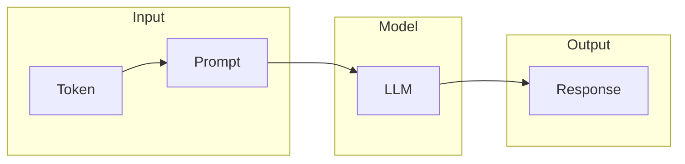
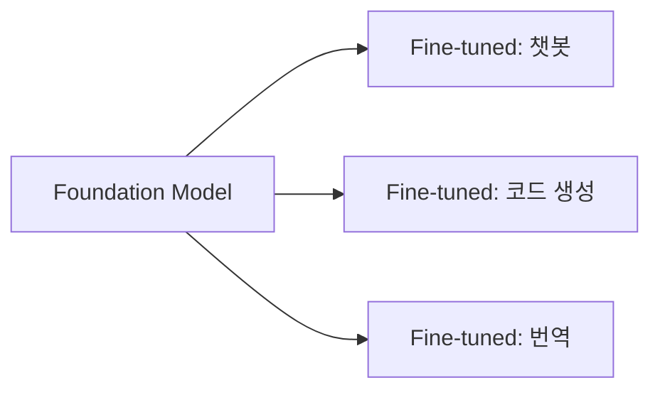
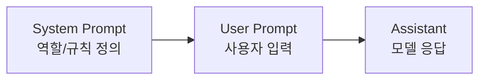
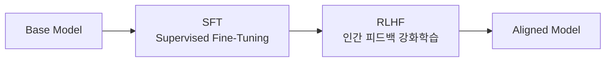

## 시리즈 소개

LLM, RAG, AI Agent 관련 개념을 체계적으로 정리하는 시리즈다. 입문자부터 실무자까지 참고할 수 있도록 학습 흐름 순서로 구성했다.

| 편 | 주제 |
|----|------|
| **1** | **LLM 기초** (현재) |
| 2 | 프롬프트 엔지니어링 |
| 3 | RAG 개요 |
| 4 | Vector & Embedding |
| 5 | 검색 전략 |
| 6 | Reranking |
| 7 | AI Agent 기초 |
| 8 | Multi-Agent 패턴 |
| 9 | Tool Calling |
| 10 | 평가 & 안정성 |
| 11 | Advanced RAG |

---

## 개요

LLM(Large Language Model)을 사용하려면 기본 용어를 이해해야 한다. 이 글에서는 모델의 종류, 입출력 구조, 생성 파라미터, 그리고 한계점까지 핵심 개념을 정리한다.

---

## 모델의 종류

### LLM (Large Language Model)

대규모 텍스트 데이터로 학습한 언어 모델이다. "Large"는 파라미터 수를 의미하며, 수십억(Billion) 단위가 일반적이다.

| 모델 | 파라미터 수 |
|------|------------|
| GPT-3 | 175B |
| LLaMA 2 | 7B ~ 70B |
| Claude 3 | 비공개 |

### Foundation Model

다양한 태스크에 활용할 수 있는 범용 모델이다. 특정 목적으로 학습하지 않고, 대규모 데이터로 사전학습(Pre-training)한 뒤 다운스트림 태스크에 적용한다.

### Base Model vs Instruct Model

| 구분 | Base Model | Instruct Model |
|------|-----------|----------------|
| 학습 | 텍스트 예측만 | 지시 따르기 학습 추가 |
| 출력 | 문장 이어쓰기 | 질문에 답변 |
| 예시 | GPT-3 base | GPT-3.5-turbo |

Base Model은 "다음 단어 예측"만 학습했다. "서울의 수도는?"이라고 물으면 "서울의 수도는 어디인가요?"처럼 문장을 이어갈 뿐, 답변하지 않는다.

Instruct Model은 RLHF(Reinforcement Learning from Human Feedback)로 추가 학습하여 지시를 따르도록 튜닝되었다.

### Chat Model

대화 형식에 최적화된 모델이다. System/User/Assistant 역할을 구분하여 멀티턴 대화를 처리한다.

---

## 입출력 구조

### Token & Tokenization

LLM은 텍스트를 **토큰** 단위로 처리한다. 토큰은 단어, 서브워드, 또는 문자 단위일 수 있다.

| 텍스트 | 토큰 수 (GPT-4) |
|--------|----------------|
| "Hello" | 1 |
| "Hello, world!" | 4 |
| "안녕하세요" | 3~4 |

한글은 영어보다 토큰 효율이 낮다. 같은 의미라도 더 많은 토큰을 소비한다.

**Tokenization**은 텍스트를 토큰으로 분할하는 과정이다. BPE(Byte Pair Encoding), SentencePiece 등의 알고리즘을 사용한다.

### Context Window

모델이 한 번에 처리할 수 있는 최대 토큰 수다.

| 모델 | Context Window |
|------|---------------|
| GPT-3.5 | 4K / 16K |
| GPT-4 | 8K / 128K |
| Claude 3 | 200K |

Context Window를 초과하면 오래된 내용부터 잘린다. 긴 문서를 처리할 때는 청킹(Chunking)이나 요약이 필요하다.

### Prompt 구조

Chat Model은 세 가지 역할로 프롬프트를 구성한다.

| 역할 | 용도 | 예시 |
|------|------|------|
| System | 모델의 행동 규칙 정의 | "너는 Python 전문가다" |
| User | 사용자의 질문/요청 | "리스트 정렬 방법 알려줘" |
| Assistant | 모델의 응답 | "sorted() 함수를 사용한다" |

---

## 생성 파라미터

### Temperature

출력의 무작위성을 조절한다. 0에 가까울수록 결정적(deterministic), 높을수록 창의적(stochastic)이다.

| Temperature | 특성 | 용도 |
|-------------|------|------|
| 0 | 항상 같은 출력 | 코드 생성, 사실 기반 답변 |
| 0.7 | 적당한 다양성 | 일반 대화 |
| 1.0+ | 높은 무작위성 | 창작, 브레인스토밍 |

### Top-p (Nucleus Sampling)

누적 확률이 p를 넘는 토큰들만 후보로 선택한다.

- Top-p = 0.9: 상위 90% 확률 토큰 중에서 샘플링
- Temperature와 함께 사용하여 출력 품질 조절

### Top-k

확률 상위 k개 토큰만 후보로 선택한다.

- Top-k = 50: 상위 50개 토큰 중에서 샘플링
- Top-p보다 단순하지만 덜 유연함

### Logit Bias

특정 토큰의 출력 확률을 조절한다. 특정 단어를 강제하거나 금지할 때 사용한다.

### Stop Sequence

지정한 문자열이 나오면 생성을 중단한다. 코드 블록 종료, 특정 패턴 이후 멈추기 등에 활용한다.

---

## 한계와 해결책

### Hallucination

모델이 사실이 아닌 내용을 자신있게 생성하는 현상이다. LLM은 "그럴듯한 다음 토큰"을 예측할 뿐, 사실 여부를 검증하지 않는다.

**완화 방법**

| 방법 | 설명 |
|------|------|
| RAG | 외부 지식 검색 후 답변 |
| Grounding | 출처 명시 강제 |
| Temperature 낮추기 | 무작위성 감소 |
| Fine-tuning | 도메인 특화 학습 |

### Alignment

모델의 출력이 인간의 의도와 가치관에 맞도록 조정하는 것이다.

- **SFT**: 좋은 응답 예시로 지도 학습
- **RLHF**: 인간이 선호하는 응답에 보상

### Safety & Guardrail

모델이 유해하거나 부적절한 출력을 생성하지 않도록 방어하는 장치다.

| 유형 | 예시 |
|------|------|
| Input Guardrail | 악의적 프롬프트 필터링 |
| Output Guardrail | 유해 콘텐츠 차단 |
| Policy | 특정 주제 응답 거부 |

---

## 정리

| 개념 | 핵심 |
|------|------|
| LLM | 대규모 언어 모델 |
| Foundation Model | 범용 사전학습 모델 |
| Base vs Instruct | 문장 이어쓰기 vs 지시 수행 |
| Token | LLM의 입출력 단위 |
| Context Window | 최대 처리 토큰 수 |
| Temperature | 출력 무작위성 조절 |
| Hallucination | 사실 아닌 내용 생성 |
| Alignment | 인간 의도에 맞춤 |

**다음 편**: 프롬프트 엔지니어링 - Zero-shot, Few-shot, Chain-of-Thought 등 효과적인 프롬프트 작성법을 다룬다.
