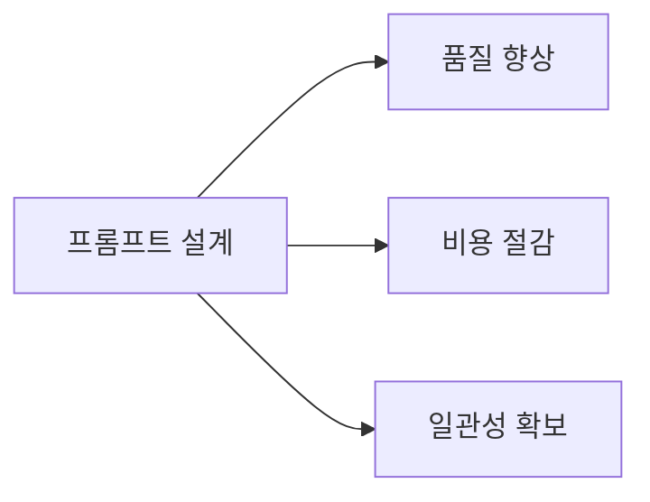
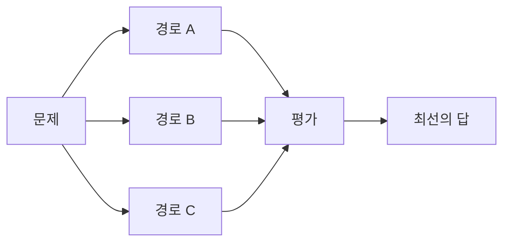
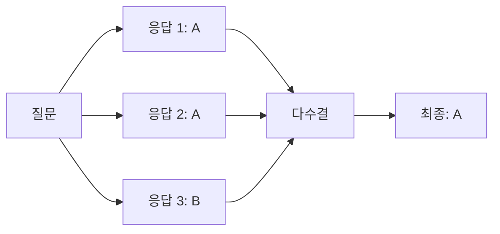
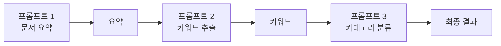
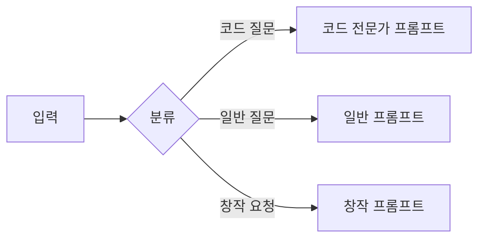

## 개요

프롬프트 엔지니어링은 LLM에서 원하는 출력을 얻기 위해 입력을 설계하는 기술이다. 같은 모델이라도 프롬프트에 따라 결과가 크게 달라진다.



---

## 기본 기법

### Zero-shot

예시 없이 지시만으로 태스크를 수행한다.

```
다음 문장의 감정을 분류하세요: "이 영화 정말 재미있었어요"
→ 긍정
```

모델이 사전학습에서 충분히 학습한 태스크에 효과적이다.

### Few-shot

몇 개의 예시를 함께 제공한다.

```
문장: "배송이 너무 늦어요" → 부정
문장: "품질이 좋아요" → 긍정
문장: "가격이 비싸지만 만족해요" → ?
→ 긍정
```

| 구분 | Zero-shot | Few-shot |
|------|-----------|----------|
| 예시 | 없음 | 1~5개 |
| 토큰 | 적음 | 많음 |
| 정확도 | 태스크에 따라 | 일반적으로 높음 |
| 용도 | 간단한 태스크 | 복잡하거나 도메인 특화 |

### In-context Learning

Few-shot의 일반화된 개념이다. 모델이 프롬프트에 포함된 예시로부터 패턴을 학습하여 새로운 입력에 적용한다. 파인튜닝 없이 프롬프트만으로 모델의 행동을 조정한다.

---

## 추론 강화 기법

### Chain-of-Thought (CoT)

단계별 추론 과정을 유도한다.


**일반 프롬프트:**
```
Roger has 5 tennis balls. He buys 2 more cans of 3. How many does he have?
→ 11 (오답)
```

**CoT 프롬프트:**
```
Roger has 5 tennis balls. He buys 2 more cans of 3. How many does he have?
Let's think step by step.
→ Roger started with 5 balls.
→ 2 cans of 3 = 6 balls.
→ 5 + 6 = 11 balls. (정답)
```

"Let's think step by step"만 추가해도 수학, 논리 문제에서 정확도가 크게 향상된다.

### Tree-of-Thought (ToT)

여러 추론 경로를 탐색하고 평가한다.



CoT가 단일 경로라면, ToT는 여러 가지 접근법을 시도한 뒤 가장 좋은 결과를 선택한다. 복잡한 문제 해결, 창의적 태스크에 유용하다.

### Self-Consistency

같은 질문에 여러 번 답변을 생성하고 다수결로 최종 답을 결정한다.



Temperature를 높여 다양한 응답을 생성한 뒤 일관된 답변을 선택한다.

---

## 프롬프트 구조화

### Prompt Template

재사용 가능한 프롬프트 틀을 만든다.

```
당신은 {role}입니다.
다음 {input_type}을 분석하고 {output_format} 형식으로 응답하세요.

입력: {input}
```

변수화하면 다양한 상황에 같은 구조를 적용할 수 있다.

### Role Prompt

모델에 특정 역할을 부여한다.

| 역할 | 효과 |
|------|------|
| "너는 시니어 개발자다" | 코드 품질 향상 |
| "너는 5살 아이에게 설명하듯" | 쉬운 설명 |
| "너는 보안 전문가다" | 보안 관점 분석 |

역할 설정은 System Prompt에 넣는 것이 효과적이다.

### Output Constraint

출력 형식을 명시적으로 제한한다.

```
다음 형식으로만 응답하세요:
- 요약: (2문장 이내)
- 키워드: (3개)
- 감정: (긍정/부정/중립)
```

### JSON Mode

구조화된 JSON 출력을 강제한다.

```
다음 형식의 JSON으로 응답하세요:
{
  "sentiment": "positive" | "negative" | "neutral",
  "confidence": 0.0-1.0,
  "keywords": ["string"]
}
```

OpenAI, Anthropic 등 주요 API는 JSON Mode를 공식 지원한다. 파싱 실패 없이 안정적인 출력을 보장한다.

---

## 복잡한 태스크 처리

### Prompt Chaining

여러 프롬프트를 순차적으로 연결한다.



| 장점 | 설명 |
|------|------|
| 디버깅 용이 | 각 단계 결과 확인 가능 |
| 품질 향상 | 단계별 최적화 가능 |
| 복잡도 분산 | 하나의 거대한 프롬프트 회피 |

### Prompt Routing

입력에 따라 다른 프롬프트로 분기한다.



입력 유형을 먼저 분류한 뒤, 특화된 프롬프트를 적용하여 품질을 높인다.

---

## 정리

| 기법 | 핵심 | 용도 |
|------|------|------|
| Zero-shot | 예시 없이 지시 | 간단한 태스크 |
| Few-shot | 예시 제공 | 복잡한/도메인 태스크 |
| CoT | 단계별 추론 | 수학, 논리 문제 |
| ToT | 여러 경로 탐색 | 복잡한 문제 해결 |
| Self-Consistency | 다수결 | 정확도 향상 |
| Prompt Template | 재사용 틀 | 일관성 확보 |
| JSON Mode | 구조화 출력 | API 연동 |
| Prompt Chaining | 순차 연결 | 복잡한 파이프라인 |

**다음 편**: RAG 개요 - LLM의 한계를 보완하는 검색 증강 생성(RAG) 파이프라인을 다룬다.
