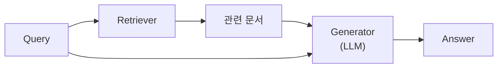
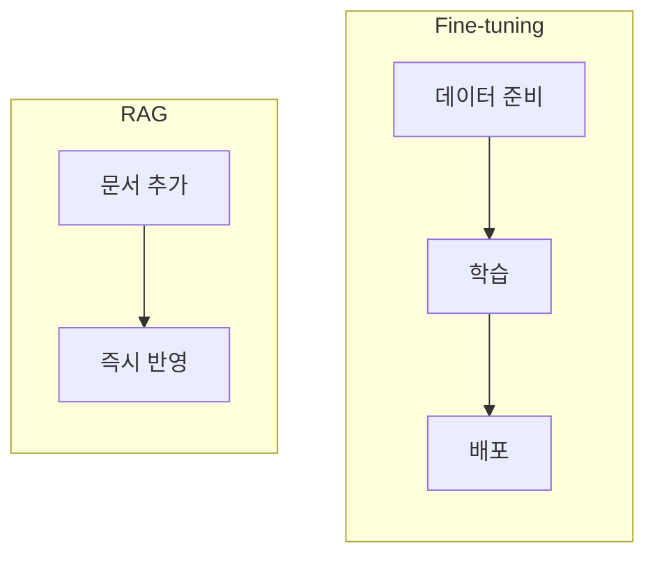
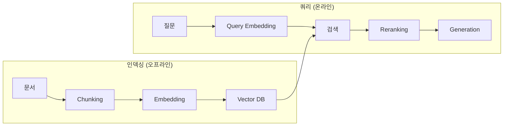
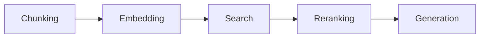

## 개요

RAG(Retrieval-Augmented Generation)는 외부 지식을 검색하여 LLM의 응답을 보강하는 기법이다. LLM의 지식 한계(학습 데이터 이후 정보, 도메인 특화 정보)를 해결한다.



---

## 왜 RAG인가?

| LLM 한계 | RAG 해결 |
|----------|----------|
| 학습 데이터 이후 정보 없음 | 최신 문서 검색 |
| Hallucination | 출처 기반 응답 |
| 도메인 지식 부족 | 전문 문서 참조 |
| 비용 높은 Fine-tuning | 문서 업데이트만으로 지식 갱신 |

**RAG vs Fine-tuning**



| 구분 | RAG | Fine-tuning |
|------|-----|-------------|
| 지식 갱신 | 문서 추가로 즉시 | 재학습 필요 |
| 비용 | 낮음 | 높음 |
| 출처 명시 | 가능 | 어려움 |
| 특화 스타일 | 제한적 | 가능 |

---

## RAG 파이프라인

### 전체 흐름



### 인덱싱 단계

1. **문서 수집**: Knowledge Base 구축
2. **청킹**: 문서를 적절한 크기로 분할
3. **임베딩**: 청크를 벡터로 변환
4. **저장**: Vector DB에 인덱싱

### 쿼리 단계

1. **쿼리 임베딩**: 질문을 벡터로 변환
2. **검색**: 유사한 청크 검색
3. **리랭킹**: 검색 결과 재정렬 (선택)
4. **생성**: 검색된 컨텍스트로 답변 생성

---

## Knowledge Base

### Corpus

RAG가 참조하는 문서 집합이다.

| 유형 | 예시 |
|------|------|
| 내부 문서 | 사내 위키, 기술 문서 |
| 외부 문서 | 웹 크롤링, 뉴스 |
| 구조화 데이터 | DB 스키마, API 문서 |

### Document Versioning

문서가 업데이트될 때 버전을 관리한다.

- 동일 문서의 여러 버전 공존 가능
- 최신 버전 우선 검색
- 이전 버전 참조 시 명시

### Cold Start vs Hot Update

| 구분 | Cold Start | Hot Update |
|------|-----------|------------|
| 시점 | 초기 구축 | 운영 중 추가 |
| 작업 | 전체 인덱싱 | 증분 인덱싱 |
| 시간 | 오래 걸림 | 빠름 |

---

## Chunking

### 왜 청킹이 필요한가?

- **Context Window 제한**: LLM이 처리할 수 있는 토큰 수 한계
- **검색 정확도**: 긴 문서보다 관련 부분만 검색
- **비용**: 불필요한 토큰 소비 방지

### Fixed-size Chunking

고정된 크기(토큰/문자 수)로 분할한다.

```
문서 → [청크1: 500토큰] [청크2: 500토큰] [청크3: 500토큰]
```

| 장점 | 단점 |
|------|------|
| 구현 간단 | 문맥 단절 가능 |
| 일관된 크기 | 의미 단위 무시 |

### Semantic Chunking

의미 단위로 분할한다. 문장 임베딩 유사도가 급격히 변하는 지점에서 분할한다.


| 장점 | 단점 |
|------|------|
| 의미 보존 | 구현 복잡 |
| 검색 정확도 향상 | 크기 불균일 |

### Markdown Header Chunking

마크다운 헤더(#, ##, ###)를 기준으로 분할한다.

```markdown
# 제목 1        → 청크 1
## 섹션 1.1     → 청크 2
## 섹션 1.2     → 청크 3
# 제목 2        → 청크 4
```

기술 문서, 위키 등 구조화된 문서에 효과적이다.

### Chunk Overlap

인접 청크 간 일부 내용을 중복시킨다.

```
[청크1: A B C D] [청크2: C D E F] [청크3: E F G H]
         ↑ overlap ↑
```

| Overlap | 효과 |
|---------|------|
| 0% | 문맥 단절 위험 |
| 10-20% | 적절한 연속성 |
| 50%+ | 중복 과다, 비용 증가 |

---

## 메타데이터 활용

### Metadata

청크에 추가 정보를 첨부한다.

```json
{
  "content": "청크 내용...",
  "metadata": {
    "source": "docs/api.md",
    "section": "Authentication",
    "date": "2024-01-15",
    "version": "2.0"
  }
}
```

검색 시 메타데이터로 필터링하면 정확도가 향상된다.

### Source Attribution / Citation

답변에 출처를 명시한다.

```
답변: OAuth 2.0을 사용합니다. [출처: docs/api.md#authentication]
```

| 장점 |
|------|
| Hallucination 검증 가능 |
| 사용자 신뢰도 향상 |
| 디버깅 용이 |

---

## 정리

| 개념 | 핵심 |
|------|------|
| RAG | 검색 + 생성 결합 |
| Knowledge Base | 참조 문서 집합 |
| Chunking | 문서 분할 전략 |
| Fixed-size | 고정 크기 분할 |
| Semantic | 의미 단위 분할 |
| Overlap | 청크 간 중복 |
| Metadata | 청크 부가 정보 |
| Citation | 출처 명시 |



**다음 편**: Vector & Embedding - 텍스트를 벡터로 변환하고 유사도를 계산하는 방법을 다룬다.
