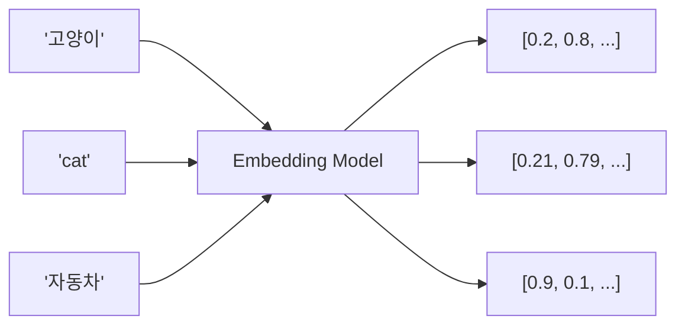
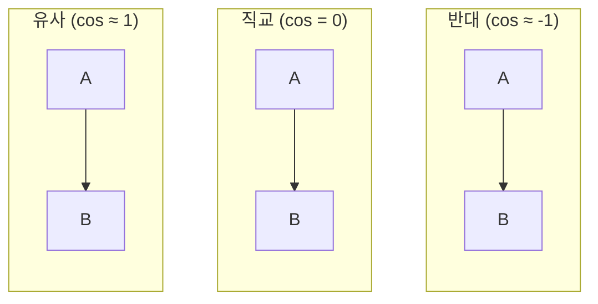
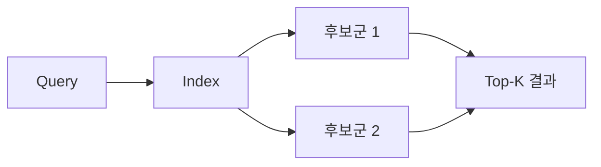
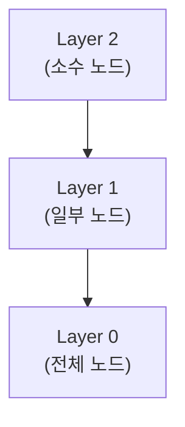
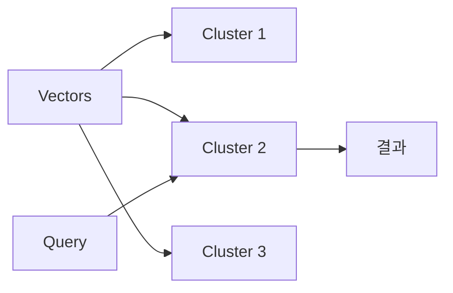
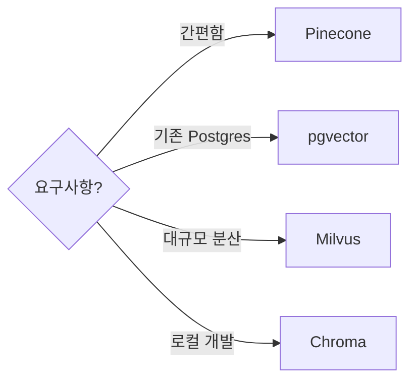
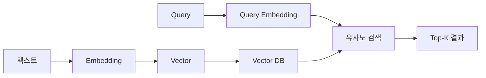

## 개요

Embedding은 텍스트를 고차원 벡터로 변환하는 기술이다. 의미가 유사한 텍스트는 벡터 공간에서 가까운 위치에 배치된다. RAG의 검색 단계에서 핵심 역할을 한다.



'고양이'와 'cat'은 유사한 벡터, '자동차'는 다른 벡터가 된다.

---

## Embedding 기초

### Embedding이란?

텍스트(단어, 문장, 문서)를 고정 크기의 실수 벡터로 변환하는 것이다.

```
"오늘 날씨가 좋다" → [0.12, -0.45, 0.78, ..., 0.33]  (1536차원)
```

### Embedding Model

텍스트를 벡터로 변환하는 모델이다.

| 모델 | 차원 | 특징 |
|------|------|------|
| OpenAI text-embedding-3-small | 1536 | 범용, API |
| OpenAI text-embedding-3-large | 3072 | 고품질 |
| Cohere embed-v3 | 1024 | 다국어 |
| BGE-M3 | 1024 | 오픈소스, 다국어 |
| sentence-transformers | 384~768 | 오픈소스 |

### Vector Dimension

벡터의 차원 수다. 차원이 높을수록 더 많은 의미 정보를 담지만, 저장 공간과 검색 비용이 증가한다.

| 차원 | 장점 | 단점 |
|------|------|------|
| 384 | 빠른 검색, 적은 저장 | 정보 손실 |
| 1536 | 균형 | - |
| 3072 | 높은 정확도 | 느린 검색, 많은 저장 |

---

## 유사도 계산

### Cosine Similarity

두 벡터 사이 각도의 코사인 값이다. 방향이 같으면 1, 반대면 -1, 직교하면 0이다.



**특징**: 벡터 크기에 영향받지 않고 방향만 비교한다.

### Dot Product (내적)

두 벡터를 요소별로 곱한 뒤 합산한다.

- Cosine Similarity와 달리 벡터 크기(magnitude)도 반영
- 정규화된 벡터에서는 Cosine과 동일

### Euclidean Distance

두 벡터 사이의 직선 거리다.

- 값이 작을수록 유사
- L2 거리라고도 함

| 메트릭 | 수식 | 특징 |
|--------|------|------|
| Cosine | cos(θ) | 방향 비교 |
| Dot Product | A·B | 크기+방향 |
| Euclidean | \|\|A-B\|\| | 거리 (작을수록 유사) |

---

## Vector Index

수백만 개의 벡터에서 유사한 것을 빠르게 찾으려면 인덱싱이 필요하다.

### Brute Force (정확 검색)

모든 벡터와 비교한다. 정확하지만 느리다.

- 시간 복잡도: O(n × d) (n: 벡터 수, d: 차원)
- 소규모 데이터에서만 사용

### ANN (Approximate Nearest Neighbor)

정확도를 약간 희생하고 속도를 크게 향상한다.



### HNSW (Hierarchical Navigable Small World)

그래프 기반 ANN 알고리즘이다. 계층적 구조로 빠른 탐색이 가능하다.



| 장점 | 단점 |
|------|------|
| 빠른 검색 | 메모리 사용 높음 |
| 높은 recall | 인덱스 구축 느림 |
| 동적 추가 가능 | - |

### IVF (Inverted File Index)

벡터를 클러스터로 분류하고, 쿼리와 가까운 클러스터만 검색한다.



### PQ (Product Quantization)

벡터를 압축하여 저장 공간을 줄인다. 속도와 메모리 효율이 좋지만 정확도가 낮아진다.

| 알고리즘 | 속도 | 정확도 | 메모리 |
|----------|------|--------|--------|
| Brute Force | 느림 | 100% | 높음 |
| HNSW | 빠름 | 95%+ | 높음 |
| IVF | 빠름 | 90%+ | 중간 |
| IVF-PQ | 매우 빠름 | 85%+ | 낮음 |

---

## Vector DB

벡터 저장과 유사도 검색에 특화된 데이터베이스다.

### 주요 Vector DB

| DB | 특징 | 배포 |
|----|------|------|
| FAISS | Meta 오픈소스, 라이브러리 | 임베딩 |
| Milvus | 분산 지원, 스케일러블 | 셀프호스팅/클라우드 |
| Pinecone | 완전 관리형, 간편 | 클라우드 |
| Weaviate | GraphQL API, 하이브리드 검색 | 셀프호스팅/클라우드 |
| Qdrant | Rust 기반, 고성능 | 셀프호스팅/클라우드 |
| Chroma | 경량, 개발용 | 임베딩 |
| pgvector | PostgreSQL 확장 | 기존 DB 활용 |

### 선택 기준



---

## Embedding 관리

### Cold Embedding

초기 인덱싱 시 전체 문서를 한 번에 임베딩한다.

### Re-embedding

Embedding Model을 변경하거나 업그레이드하면 전체 재임베딩이 필요하다.

| 상황 | 재임베딩 필요 |
|------|--------------|
| 문서 추가 | 신규 문서만 |
| 문서 수정 | 해당 문서만 |
| 모델 변경 | 전체 |
| 차원 변경 | 전체 |

---

## 정리

| 개념 | 핵심 |
|------|------|
| Embedding | 텍스트 → 벡터 변환 |
| Dimension | 벡터 차원 수 |
| Cosine Similarity | 방향 기반 유사도 |
| ANN | 근사 최근접 이웃 검색 |
| HNSW | 그래프 기반 인덱스 |
| IVF | 클러스터 기반 인덱스 |
| Vector DB | 벡터 전용 데이터베이스 |



**다음 편**: 검색 전략 - Lexical, Semantic, Hybrid Search의 차이와 활용법을 다룬다.
