쿼리 성능 문제를 해결하려면 PostgreSQL이 쿼리를 **어떻게** 실행하는지 알아야 한다. `EXPLAIN ANALYZE`는 이를 위한 가장 강력한 도구다.

## EXPLAIN vs EXPLAIN ANALYZE

```sql
-- 실행 계획만 보기 (실제 실행 안 함)
EXPLAIN SELECT * FROM users WHERE id = 1;

-- 실제 실행 + 실행 계획 (실제 실행됨!)
EXPLAIN ANALYZE SELECT * FROM users WHERE id = 1;

-- 권장: 모든 정보 포함
EXPLAIN (ANALYZE, BUFFERS, FORMAT TEXT) SELECT * FROM users WHERE id = 1;
```

**주의**: `EXPLAIN ANALYZE`는 쿼리를 실제로 실행한다. `INSERT`, `UPDATE`, `DELETE`를 분석할 때는 트랜잭션으로 감싸야 한다.

```sql
BEGIN;
EXPLAIN ANALYZE DELETE FROM orders WHERE created_at < '2020-01-01';
ROLLBACK;
```

## 실행 계획 기본 구조

```
Seq Scan on users  (cost=0.00..458.00 rows=10000 width=244) (actual time=0.009..2.198 rows=10000 loops=1)
```

실행 계획은 트리 구조다. 데이터는 **아래에서 위로** 흐른다.

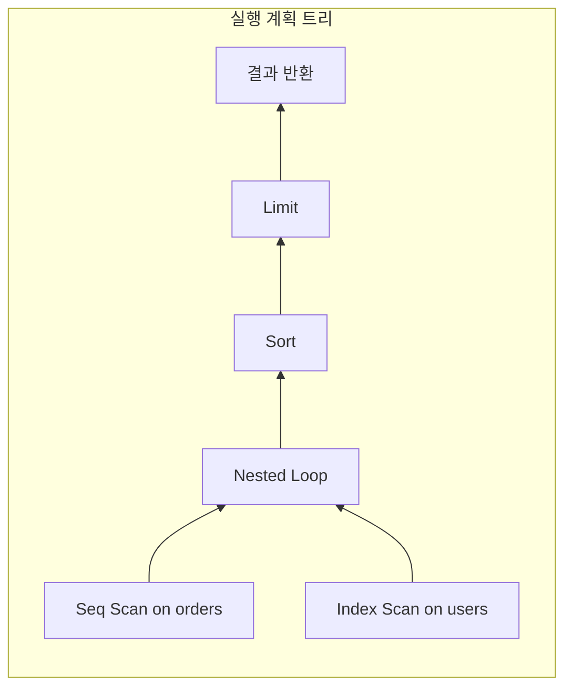

### cost (예상 비용)

`cost=0.00..458.00`의 의미는 다음과 같다.
- **0.00**: startup cost (첫 번째 행 반환 전 비용)
- **458.00**: total cost (모든 행 반환까지의 총 비용)

비용 단위는 임의 단위다. 밀리초가 아니다. 기본적으로 Sequential Page Read = 1.0을 기준으로 한다.

**비용 계산 공식**:
```
Seq Scan Cost = (pages × seq_page_cost) + (rows × cpu_tuple_cost)
             = (358 × 1.0) + (10000 × 0.01)
             = 458.00
```

### rows (예상 행 수)

플래너가 예측한 반환 행 수다. `pg_statistic`의 통계를 기반으로 계산한다.

**실제 행 수와 크게 다르면 문제다.** 통계가 오래되었거나 상관관계가 있는 컬럼일 수 있다.

### width (평균 행 크기)

반환되는 행의 평균 바이트 크기다. 메모리 할당 계획에 사용된다.

`width=0`이면 실제 값을 읽지 않고 위치(주소)만 읽는 것이다.

### actual time, rows, loops

```
(actual time=0.009..2.198 rows=10000 loops=1)
```

- **0.009**: 첫 행 반환까지 실제 시간 (ms)
- **2.198**: 모든 행 반환까지 실제 시간 (ms)
- **rows=10000**: 실제 반환된 행 수
- **loops=1**: 이 노드가 실행된 횟수

**loops > 1일 때 주의**: actual time은 **평균값**이다. 총 시간은 `time × loops`다.

```
Index Scan on orders  (actual time=0.015..0.020 rows=5 loops=1000)
-- 실제 총 시간: 0.020 × 1000 = 20ms
```

---

## Scan Types (스캔 방식)

PostgreSQL이 테이블에서 데이터를 읽는 방법이다.

**예시 테이블**:

```sql
-- 사용자 테이블
CREATE TABLE users (
    id SERIAL PRIMARY KEY,
    email VARCHAR(255) NOT NULL,
    name VARCHAR(100),
    status VARCHAR(20) DEFAULT 'active',
    created_at TIMESTAMP DEFAULT NOW()
);

-- 인덱스
CREATE INDEX idx_users_email ON users(email);
CREATE INDEX idx_users_status ON users(status);
CREATE INDEX idx_users_email_name ON users(email, name);  -- 복합 인덱스

-- 10만 건 데이터 삽입
INSERT INTO users (email, name, status)
SELECT
    'user' || i || '@example.com',
    'User ' || i,
    CASE WHEN i % 10 = 0 THEN 'inactive' ELSE 'active' END
FROM generate_series(1, 100000) i;

ANALYZE users;
```

### Sequential Scan (Seq Scan)

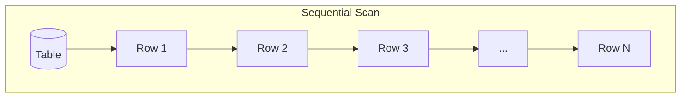

**예시 쿼리**: 대부분의 행을 조회하거나, 인덱스가 없는 컬럼으로 필터링

```sql
-- 90%의 행이 'active'이므로 Seq Scan이 효율적
EXPLAIN ANALYZE
SELECT * FROM users WHERE status = 'active';
```

```
Seq Scan on users  (cost=0.00..2137.00 rows=90000 width=52)
  Filter: (status = 'active')
  Rows Removed by Filter: 10000
  actual time=0.013..15.842 rows=90000 loops=1
```

테이블 전체를 처음부터 끝까지 순차적으로 읽는다.

**언제 사용되나?**
- 테이블 대부분의 행을 읽을 때
- 테이블이 매우 작을 때 (몇 페이지)
- 적절한 인덱스가 없을 때

**Seq Scan이 항상 나쁜 건 아니다.** 전체 데이터의 상당 부분을 읽어야 한다면 Seq Scan이 최적일 수 있다.

### Index Scan

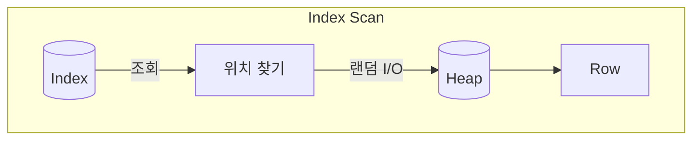

**예시 쿼리**: PK 또는 인덱스 컬럼으로 소수의 행 조회

```sql
-- PK로 단일 행 조회
EXPLAIN ANALYZE
SELECT * FROM users WHERE id = 42;

-- 유니크한 값으로 조회
EXPLAIN ANALYZE
SELECT * FROM users WHERE email = 'user500@example.com';
```

```
Index Scan using users_pkey on users  (cost=0.29..8.31 rows=1 width=52)
  Index Cond: (id = 42)
  actual time=0.019..0.020 rows=1 loops=1
```

인덱스를 통해 조건에 맞는 행의 위치를 찾고, 해당 위치로 직접 이동해서 데이터를 읽는다.

**언제 사용되나?**
- 소수의 행만 필요할 때 (selectivity가 높을 때)
- ORDER BY가 인덱스 순서와 일치할 때

**단점**: 랜덤 I/O가 발생한다. 많은 행을 읽으면 Seq Scan보다 느릴 수 있다.

### Bitmap Scan (Bitmap Index Scan + Bitmap Heap Scan)

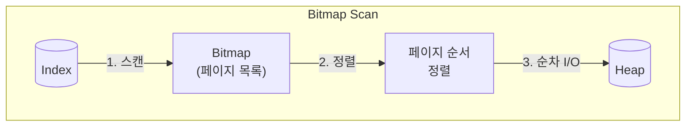

**예시 쿼리**: 중간 규모의 범위 조회, 또는 여러 인덱스 조건 결합

```sql
-- 10%의 행 조회 (Index Scan으로는 너무 많고, Seq Scan으로는 적음)
EXPLAIN ANALYZE
SELECT * FROM users WHERE status = 'inactive';

-- 여러 인덱스 조건 결합 (BitmapAnd)
EXPLAIN ANALYZE
SELECT * FROM users
WHERE status = 'inactive' AND email LIKE 'user1%';
```

```
Bitmap Heap Scan on users  (cost=189.00..1020.25 rows=10000 width=52)
  Recheck Cond: (status = 'inactive')
  ->  Bitmap Index Scan on idx_users_status  (cost=0.00..186.50 rows=10000 width=0)
        Index Cond: (status = 'inactive')
  actual time=1.205..5.842 rows=10000 loops=1
```

Index Scan과 Seq Scan의 중간 형태다.

**동작 방식**:
1. **Bitmap Index Scan**: 인덱스에서 조건에 맞는 모든 행의 위치를 비트맵으로 수집
2. **Bitmap Heap Scan**: 비트맵을 페이지 순서대로 정렬 후 순차적으로 읽기

**장점**:
- 여러 인덱스를 BitmapAnd/BitmapOr로 결합 가능
- 랜덤 I/O를 순차 I/O로 변환
- Index Scan보다 많은 행을 효율적으로 처리

**PostgreSQL의 Bitmap Scan은 Oracle의 Bitmap Index와 다르다.** PostgreSQL은 물리적 Bitmap Index가 없고, B-tree 인덱스를 사용해 쿼리 시점에 동적으로 비트맵을 생성한다.

### Index Only Scan

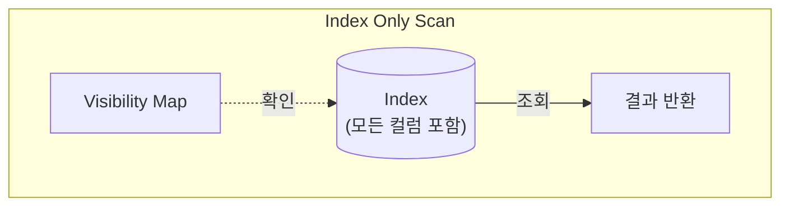

**예시 쿼리**: SELECT 절의 모든 컬럼이 인덱스에 포함된 경우

```sql
-- 복합 인덱스에 포함된 컬럼만 조회
EXPLAIN ANALYZE
SELECT email, name FROM users WHERE email = 'user500@example.com';

-- COUNT 쿼리 (인덱스만으로 충분)
EXPLAIN ANALYZE
SELECT COUNT(*) FROM users WHERE status = 'active';
```

```
Index Only Scan using idx_users_email_name on users  (cost=0.42..4.44 rows=1 width=32)
  Index Cond: (email = 'user500@example.com')
  Heap Fetches: 0
  actual time=0.025..0.026 rows=1 loops=1
```

인덱스만으로 쿼리를 완료한다. 힙(테이블)에 접근하지 않는다.

**조건**:
- SELECT 절의 모든 컬럼이 인덱스에 포함되어야 함
- Visibility Map이 업데이트되어 있어야 함

**Heap Fetches가 높으면?**
테이블이 자주 업데이트되어 Visibility Map이 오래됐다는 의미다. `VACUUM`을 실행하면 개선된다.

```sql
-- Visibility Map 확인
CREATE EXTENSION pg_visibility;
SELECT * FROM pg_visibility('users');
```

### Scan Types 비교

| Scan Type | Best For | 인덱스 사용 | I/O 패턴 |
|-----------|----------|------------|---------|
| Seq Scan | 대부분의 행 | No | Sequential |
| Index Scan | 소수의 행 | Yes | Random |
| Bitmap Scan | 중간 규모 | Yes | Sequential (변환됨) |
| Index Only Scan | 인덱스만으로 충분 | Yes | Minimal |

---

## Join Algorithms (조인 알고리즘)

PostgreSQL은 세 가지 조인 알고리즘을 사용한다.

**예시 테이블**:

```sql
-- 주문 테이블 (10만 건)
CREATE TABLE orders (
    id SERIAL PRIMARY KEY,
    user_id INT NOT NULL,
    product_name VARCHAR(100),
    amount DECIMAL(10, 2),
    created_at TIMESTAMP DEFAULT NOW()
);

CREATE INDEX idx_orders_user_id ON orders(user_id);

INSERT INTO orders (user_id, product_name, amount)
SELECT
    (random() * 99999 + 1)::int,
    'Product ' || (random() * 1000)::int,
    (random() * 1000)::decimal(10, 2)
FROM generate_series(1, 100000);

-- users 테이블은 Scan Types 섹션에서 생성한 것 사용
ANALYZE orders;
```

### Nested Loop Join

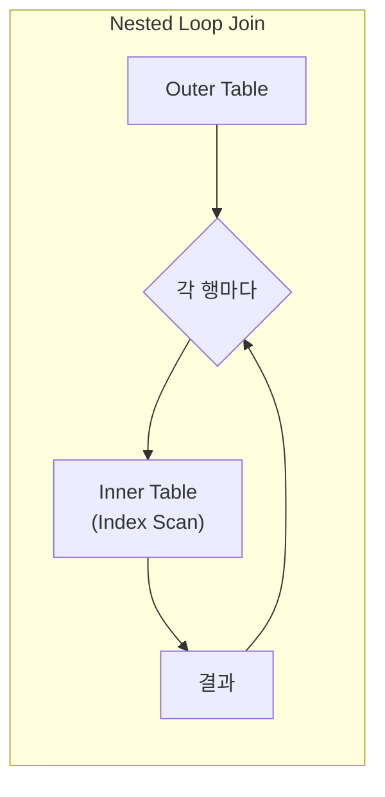

**예시 쿼리**: 소량의 주문과 사용자 조인 (내부 테이블에 인덱스 있음)

```sql
-- 특정 사용자의 주문 조회 (외부 테이블 작음)
EXPLAIN ANALYZE
SELECT u.name, o.product_name, o.amount
FROM orders o
JOIN users u ON u.id = o.user_id
WHERE o.user_id = 42;

-- LIMIT이 있어서 Nested Loop 선호
EXPLAIN ANALYZE
SELECT u.name, o.product_name
FROM orders o
JOIN users u ON u.id = o.user_id
LIMIT 10;
```

```
Nested Loop  (cost=0.57..25.64 rows=5 width=128)
  ->  Index Scan using idx_orders_user_id on orders o  (cost=0.29..12.30 rows=5 width=52)
        Index Cond: (user_id = 42)
  ->  Index Scan using users_pkey on users u  (cost=0.29..2.50 rows=1 width=76)
        Index Cond: (id = o.user_id)
  actual time=0.035..0.089 rows=5 loops=1
```

외부 테이블의 각 행에 대해 내부 테이블을 스캔한다.

**복잡도**: O(n × m) - 단, 내부 테이블에 인덱스가 있으면 O(n × log m)

**언제 좋은가?**
- 한쪽 테이블이 매우 작을 때
- 내부 테이블에 효율적인 인덱스가 있을 때
- OLTP 시스템의 짧은 쿼리

**장점**: startup cost가 없다. 첫 번째 결과를 즉시 반환할 수 있다.

### Hash Join

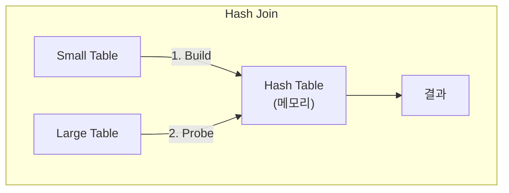

**예시 쿼리**: 두 테이블 모두 대량 조회

```sql
-- 모든 주문과 사용자 조인 (대량 데이터)
EXPLAIN ANALYZE
SELECT u.name, o.product_name, o.amount
FROM orders o
JOIN users u ON u.id = o.user_id;

-- 집계와 함께 사용 (전체 스캔 필요)
EXPLAIN ANALYZE
SELECT u.name, COUNT(*) as order_count, SUM(o.amount) as total
FROM orders o
JOIN users u ON u.id = o.user_id
GROUP BY u.id, u.name;
```

```
Hash Join  (cost=3084.00..5765.00 rows=100000 width=128)
  Hash Cond: (o.user_id = u.id)
  ->  Seq Scan on orders o  (cost=0.00..1834.00 rows=100000 width=52)
  ->  Hash  (cost=1834.00..1834.00 rows=100000 width=76)
        Buckets: 131072  Batches: 1  Memory Usage: 8945kB
        ->  Seq Scan on users u  (cost=0.00..1834.00 rows=100000 width=76)
  actual time=45.123..156.789 rows=100000 loops=1
```

작은 테이블로 해시 테이블을 만들고, 큰 테이블을 스캔하며 해시 조회한다.

**복잡도**: O(n + m) - 선형 복잡도

**언제 좋은가?**
- 두 테이블 모두 클 때
- Equi-join (= 조건)일 때
- `work_mem`이 충분할 때

**단점**:
- 해시 테이블 생성 완료 전까지 결과 반환 불가 (높은 startup cost)
- Equi-join만 가능 (>, < 불가)
- `work_mem` 부족 시 디스크 사용

### Merge Join

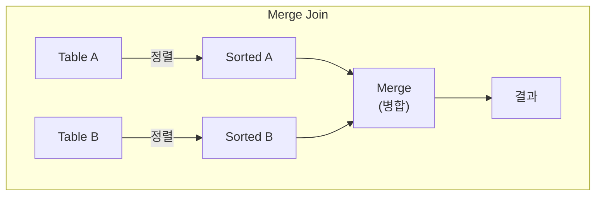

**예시 쿼리**: 이미 정렬되어 있거나 정렬이 필요한 경우

```sql
-- ORDER BY가 조인 키와 일치 (정렬 재사용)
EXPLAIN ANALYZE
SELECT u.id, u.name, o.product_name
FROM users u
JOIN orders o ON o.user_id = u.id
ORDER BY u.id;

-- Hash Join이 메모리 부족할 때 대안
SET work_mem = '64kB';  -- 강제로 Merge Join 유도
EXPLAIN ANALYZE
SELECT u.name, o.product_name
FROM orders o
JOIN users u ON u.id = o.user_id;
RESET work_mem;
```

```
Merge Join  (cost=0.71..15234.71 rows=100000 width=128)
  Merge Cond: (u.id = o.user_id)
  ->  Index Scan using users_pkey on users u  (cost=0.29..4234.29 rows=100000 width=76)
  ->  Index Scan using idx_orders_user_id on orders o  (cost=0.29..8500.29 rows=100000 width=52)
  actual time=0.045..234.567 rows=100000 loops=1
```

두 테이블을 조인 키로 정렬한 후 병합한다.

**복잡도**: O(n log n + m log m) - 정렬 포함

**언제 좋은가?**
- 데이터가 이미 정렬되어 있을 때 (인덱스)
- Range join (>=, <=)이 필요할 때
- `work_mem` 부족으로 Hash Join이 디스크를 사용할 때

### Semi Join / Anti Join

`EXISTS`, `IN`, `NOT EXISTS`, `NOT IN` 서브쿼리에 사용된다.

**예시 쿼리**: 주문이 있는 사용자만 조회

```sql
-- Semi Join: EXISTS 사용
EXPLAIN ANALYZE
SELECT u.id, u.name
FROM users u
WHERE EXISTS (SELECT 1 FROM orders o WHERE o.user_id = u.id);

-- Semi Join: IN 사용 (같은 실행 계획)
EXPLAIN ANALYZE
SELECT u.id, u.name
FROM users u
WHERE u.id IN (SELECT user_id FROM orders);
```

```
Hash Semi Join  (cost=2693.00..4527.00 rows=63212 width=80)
  Hash Cond: (u.id = o.user_id)
  ->  Seq Scan on users u  (cost=0.00..1834.00 rows=100000 width=80)
  ->  Hash  (cost=1834.00..1834.00 rows=100000 width=4)
        ->  Seq Scan on orders o  (cost=0.00..1834.00 rows=100000 width=4)
  actual time=25.123..89.456 rows=63212 loops=1
```

**Semi Join**: 매칭되는 첫 번째 행만 찾으면 중단 (EXISTS)
**Anti Join**: 매칭되는 행이 없을 때만 반환 (NOT EXISTS)

**예시 쿼리**: 주문이 없는 사용자 조회

```sql
-- Anti Join: NOT EXISTS 사용 (권장)
EXPLAIN ANALYZE
SELECT u.id, u.name
FROM users u
WHERE NOT EXISTS (SELECT 1 FROM orders o WHERE o.user_id = u.id);
```

```
Hash Anti Join  (cost=2693.00..4527.00 rows=36788 width=80)
  Hash Cond: (u.id = o.user_id)
  ->  Seq Scan on users u  (cost=0.00..1834.00 rows=100000 width=80)
  ->  Hash  (cost=1834.00..1834.00 rows=100000 width=4)
        ->  Seq Scan on orders o  (cost=0.00..1834.00 rows=100000 width=4)
  actual time=25.123..95.678 rows=36788 loops=1
```

**중요**: `NOT IN`은 NULL 처리 문제로 비효율적일 수 있다. **항상 `NOT EXISTS`를 사용하라.**

```sql
-- 비권장: NOT IN (NULL이 있으면 전체 결과가 빈 집합)
SELECT * FROM orders WHERE user_id NOT IN (SELECT id FROM banned_users);

-- 권장: NOT EXISTS
SELECT * FROM orders o
WHERE NOT EXISTS (SELECT 1 FROM banned_users b WHERE b.id = o.user_id);
```

### Join Algorithm 비교

| Algorithm | 복잡도 | Startup Cost | Best For |
|-----------|--------|--------------|----------|
| Nested Loop | O(n×m) | 낮음 | 작은 테이블, 인덱스 있음 |
| Hash Join | O(n+m) | 높음 | 큰 테이블, Equi-join |
| Merge Join | O(n log n) | 중간 | 정렬된 데이터, Range join |

---

## Buffer 통계

`EXPLAIN (ANALYZE, BUFFERS)`로 I/O 패턴을 분석한다.

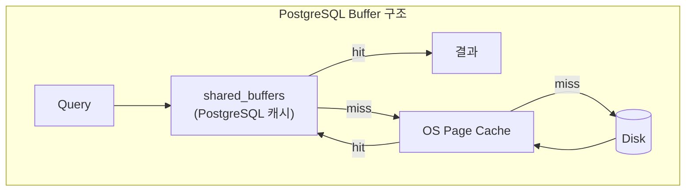

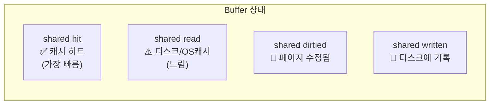

```
Seq Scan on large_table  (cost=0.00..18334.00 rows=1000000 width=37)
  Buffers: shared hit=512 read=7822 dirtied=10 written=5
```

### Buffer 종류 (Prefix)

- **shared**: 일반 테이블/인덱스 데이터
- **local**: 임시 테이블 데이터
- **temp**: 정렬, 해시 등 중간 작업 데이터

### Buffer 상태 (Suffix)

| 상태 | 의미 |
|------|------|
| **hit** | shared_buffers 캐시에서 읽음 (빠름) |
| **read** | 디스크 또는 OS 캐시에서 읽음 (느림) |
| **dirtied** | 이 쿼리가 페이지를 수정함 |
| **written** | 캐시에서 디스크로 쓰여진 페이지 |

### 해석 방법

```
Buffers: shared hit=10000 read=500
```

- 총 10,500 블록 접근
- 캐시 히트율: 10000 / 10500 = 95.2%

**read가 높으면?**
- 첫 실행이라 데이터가 캐시에 없음 (warm-up 필요)
- `shared_buffers`가 작음
- 데이터셋이 메모리보다 큼

**dirtied/written이 SELECT에서 나타나면?**
hint bits 업데이트 때문이다. VACUUM이 하는 일을 SELECT가 대신한 것이다.

---

## 통계와 카디널리티 추정

PostgreSQL 플래너는 `pg_statistic`의 통계를 사용해 실행 계획을 결정한다.

### 통계 수집

```sql
-- 수동 통계 수집
ANALYZE users;

-- 특정 컬럼만
ANALYZE users (email, status);

-- 통계 상세도 조정 (기본값: 100, 최대: 10000)
ALTER TABLE users ALTER COLUMN status SET STATISTICS 500;
ANALYZE users;
```

### 주요 통계 항목

**pg_stats 뷰에서 확인:**

```sql
SELECT attname, n_distinct, most_common_vals, most_common_freqs, histogram_bounds
FROM pg_stats
WHERE tablename = 'users' AND attname = 'status';
```

| 항목 | 설명 |
|------|------|
| n_distinct | 고유값 개수 (-1이면 모두 고유) |
| most_common_vals | 가장 흔한 값들 |
| most_common_freqs | 각 값의 빈도 |
| histogram_bounds | 값 분포 히스토그램 |

### Selectivity 계산

```sql
-- 예: status = 'active' 조건의 selectivity
-- most_common_vals에 'active'가 있고 빈도가 0.3이면
-- selectivity = 0.3

-- 예상 행 수 = 전체 행 수 × selectivity
-- rows = 10000 × 0.3 = 3000
```

### 상관관계 문제

```sql
-- 문제: city와 country는 상관관계가 있음
SELECT * FROM addresses
WHERE city = 'Seoul' AND country = 'Korea';
```

PostgreSQL은 각 조건을 독립적으로 계산한다.
```
selectivity = selectivity(city='Seoul') × selectivity(country='Korea')
            = 0.01 × 0.05 = 0.0005
```

실제로는 Seoul이면 거의 Korea인데, 플래너는 이를 모른다.

**해결: Extended Statistics**

```sql
CREATE STATISTICS city_country_stats (dependencies) ON city, country FROM addresses;
ANALYZE addresses;
```

### 예상 vs 실제 행 수

```
Seq Scan on users  (cost=... rows=100) (actual ... rows=10000)
```

**rows 예상치가 크게 틀리면?**
1. `ANALYZE` 실행 (통계 갱신)
2. 상관관계 컬럼에 Extended Statistics 생성
3. `default_statistics_target` 증가

---

## 주요 설정값

### 비용 계산 파라미터

| 파라미터 | 기본값 | 설명 |
|----------|--------|------|
| seq_page_cost | 1.0 | Sequential page read 비용 |
| random_page_cost | 4.0 | Random page read 비용 |
| cpu_tuple_cost | 0.01 | 행 처리 비용 |
| cpu_index_tuple_cost | 0.005 | 인덱스 항목 처리 비용 |
| cpu_operator_cost | 0.0025 | 연산자/함수 실행 비용 |

**SSD 환경에서는 random_page_cost를 낮춰라:**

```sql
-- SSD에서 권장
SET random_page_cost = 1.1;

-- 또는 테이블스페이스별 설정
ALTER TABLESPACE fast_ssd SET (random_page_cost = 1.1);
```

### 메모리 설정

#### work_mem

정렬, 해시 조인 등에 사용되는 메모리다.

```sql
-- 세션별 설정
SET work_mem = '256MB';

-- EXPLAIN에서 확인
Sort  (cost=...)
  Sort Method: external merge  Disk: 102400kB  -- work_mem 부족!
```

**"external merge Disk"가 보이면** work_mem을 늘려야 한다.

**주의**: work_mem은 쿼리당이 아니라 **작업당**이다. 복잡한 쿼리는 여러 배의 work_mem을 사용할 수 있다.

```
work_mem × 정렬/해시 개수 × 동시 연결 수 = 총 메모리 사용량
```

#### effective_cache_size

플래너에게 "캐시로 사용 가능한 총 메모리"를 알려준다. 실제 메모리를 할당하지는 않는다.

```sql
-- 총 메모리의 50~75%로 설정
SET effective_cache_size = '4GB';
```

**값이 높으면**: 인덱스 스캔 선호
**값이 낮으면**: Sequential 스캔 선호

---

## 병렬 쿼리

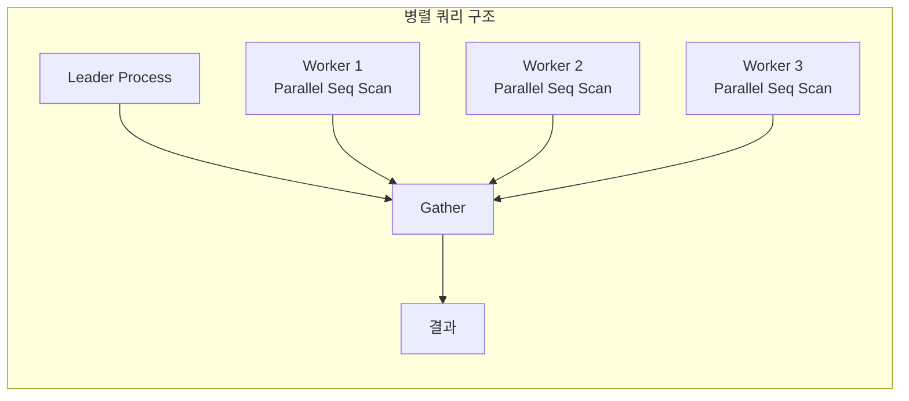

```
Gather  (cost=1000.00..9876.54 rows=100000 width=244)
  Workers Planned: 4
  Workers Launched: 4
  ->  Parallel Seq Scan on large_table  (cost=0.00..8765.43 rows=25000 width=244)
        Filter: (status = 'active')
```

### Gather vs Gather Merge

- **Gather**: 워커들의 결과를 임의 순서로 수집
- **Gather Merge**: 정렬 순서를 유지하며 병합

### Workers Planned vs Launched

- **Planned**: 플래너가 계획한 워커 수
- **Launched**: 실제 시작된 워커 수

Launched < Planned면 워커 부족이다.

### 관련 설정

```sql
-- 쿼리당 최대 워커 수
SET max_parallel_workers_per_gather = 4;

-- 전체 병렬 워커 수
SET max_parallel_workers = 8;

-- 병렬 쿼리 시작 임계값
SET min_parallel_table_scan_size = '8MB';
```

---

## 실전 최적화 체크리스트

### 1. 예상 vs 실제 행 수 확인

```
rows=100 (예상) vs rows=10000 (실제)
```

10배 이상 차이나면 `ANALYZE` 실행.

### 2. Seq Scan이 의도치 않게 발생하는가?

인덱스가 있는데 Seq Scan이면 원인은 대체로 세 가지다.
- `random_page_cost`가 너무 높음
- 통계가 오래됨
- 너무 많은 행을 조회해서 Seq Scan이 실제로 최적

### 3. Nested Loop의 loops가 높은가?

```
->  Index Scan  (actual ... loops=100000)
```

내부 테이블 스캔이 10만 번이면 Hash Join으로 바꾸는 게 나을 수 있다.

### 4. 디스크 정렬이 발생하는가?

```
Sort Method: external merge  Disk: 102400kB
```

`work_mem`을 늘려서 메모리 정렬로 전환.

### 5. Buffer read가 높은가?

```
Buffers: shared hit=100 read=50000
```

캐시 히트율이 낮으면 `shared_buffers` 증가 고려.

### 6. Heap Fetches가 높은가?

```
Index Only Scan  ...  Heap Fetches: 8500
```

`VACUUM`을 실행해서 Visibility Map 갱신.

---

## 유용한 도구

### explain.dalibo.com

실행 계획을 시각화해준다.

```sql
EXPLAIN (ANALYZE, COSTS, VERBOSE, BUFFERS, FORMAT JSON)
SELECT * FROM users WHERE status = 'active';
```

JSON 출력을 붙여넣으면 트리 구조로 시각화된다.

### auto_explain

느린 쿼리의 실행 계획을 자동으로 로깅한다.

```sql
-- postgresql.conf
shared_preload_libraries = 'auto_explain'
auto_explain.log_min_duration = '1s'
auto_explain.log_analyze = true
auto_explain.log_buffers = true
```

### pg_stat_statements

쿼리별 실행 통계를 수집한다.

```sql
SELECT query, calls, mean_exec_time, rows
FROM pg_stat_statements
ORDER BY mean_exec_time DESC
LIMIT 10;
```

---

## 정리

EXPLAIN ANALYZE를 효과적으로 사용하려면 다음을 기억하자.

1. **cost, rows, width**의 의미를 이해하라
2. **Scan 타입**별 특성과 적합한 상황을 파악하라
3. **Join 알고리즘**별 복잡도와 트레이드오프를 알아라
4. **Buffer 통계**로 I/O 패턴을 분석하라
5. **통계 시스템**이 어떻게 작동하는지 이해하고 최신 상태로 유지하라
6. **설정값**을 환경에 맞게 튜닝하라

쿼리 최적화는 "예상과 실제의 차이"를 줄이는 작업이다. EXPLAIN ANALYZE가 보여주는 숫자들을 읽을 수 있다면, 어디서 문제가 발생하는지 정확히 짚어낼 수 있다.

### 참고 자료

**공식 문서**
- [PostgreSQL EXPLAIN Documentation](https://www.postgresql.org/docs/current/sql-explain.html)
- [Using EXPLAIN](https://www.postgresql.org/docs/current/using-explain.html)
- [Query Planning Configuration](https://www.postgresql.org/docs/current/runtime-config-query.html)

**Scan & Join**
- [PostgreSQL Indexing: Index Scan vs Bitmap Scan vs Sequential Scan - CYBERTEC](https://www.cybertec-postgresql.com/en/postgresql-indexing-index-scan-vs-bitmap-scan-vs-sequential-scan-basics/)
- [Join Strategies and Performance in PostgreSQL - CYBERTEC](https://www.cybertec-postgresql.com/en/join-strategies-and-performance-in-postgresql/)
- [One Index, Three Different PostgreSQL Scan Types - Percona](https://www.percona.com/blog/one-index-three-different-postgresql-scan-types-bitmap-index-and-index-only/)

**Semi Join & Anti Join**
- [Optimize PostgreSQL Semi-Joins and Anti-Joins](https://postgresqlblog.hashnode.dev/essential-tips-for-optimizing-postgresql-semi-joins-and-anti-joins)
- [SQL Optimizations in PostgreSQL: IN vs EXISTS vs ANY/ALL vs JOIN - Percona](https://www.percona.com/blog/sql-optimizations-in-postgresql-in-vs-exists-vs-any-all-vs-join/)

**성능 튜닝**
- [How to Tune PostgreSQL Memory - EDB](https://www.enterprisedb.com/postgres-tutorials/how-tune-postgresql-memory)
- [effective_cache_size: What it means - CYBERTEC](https://www.cybertec-postgresql.com/en/effective_cache_size-what-it-means-in-postgresql/)
- [Reading a Postgres EXPLAIN ANALYZE Query Plan - Thoughtbot](https://thoughtbot.com/blog/reading-an-explain-analyze-query-plan)

**Buffer & Statistics**
- [Explaining the Unexplainable – Part 6: Buffers - depesz](https://www.depesz.com/2021/06/20/explaining-the-unexplainable-part-6-buffers/)
- [Cardinality Estimation in PostgreSQL - Netdata](https://www.netdata.cloud/academy/cardinality-estimation-in-postgres/)

**도구**
- [explain.dalibo.com](https://explain.dalibo.com/) - 실행 계획 시각화
- [pgMustard](https://www.pgmustard.com/) - 실행 계획 분석 도구
