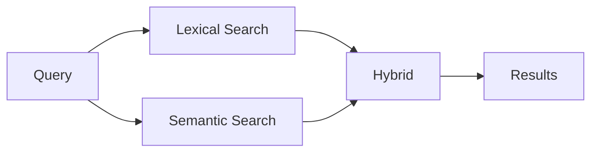
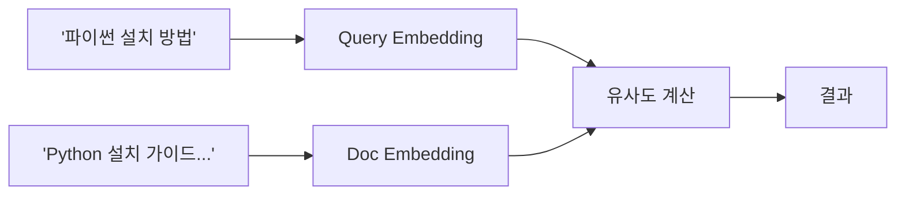
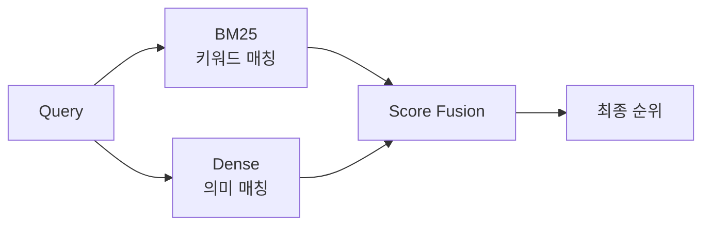
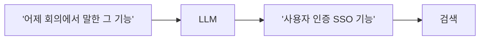
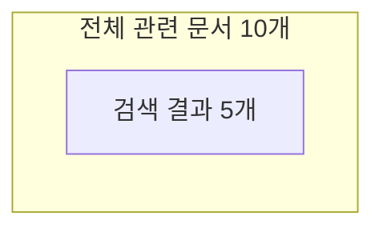
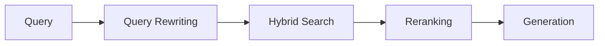

## 개요

RAG에서 검색(Retrieval)은 질문과 관련된 문서를 찾는 단계다. 검색 품질이 최종 답변 품질을 좌우한다.



---

## Lexical Search (키워드 검색)

텍스트의 단어를 직접 매칭한다. 전통적인 검색 방식이다.

### Keyword Search

정확히 일치하는 단어를 찾는다.

```
쿼리: "Python 설치"
→ "Python", "설치"가 포함된 문서 검색
```

### TF-IDF

단어 빈도(TF)와 역문서 빈도(IDF)를 조합한다.

| 구성 요소 | 의미 |
|-----------|------|
| TF (Term Frequency) | 문서 내 단어 등장 빈도 |
| IDF (Inverse Document Frequency) | 전체 문서에서 희귀할수록 높음 |

흔한 단어(the, 이, 를)는 가중치가 낮고, 희귀한 단어는 가중치가 높다.

### BM25

TF-IDF의 개선 버전이다. Elasticsearch, Lucene 등에서 기본으로 사용한다.

**TF-IDF 대비 개선점**:
- 문서 길이 정규화
- 단어 빈도 포화 (너무 많이 등장해도 일정 이상 증가 안 함)

| 상황 | BM25 성능 |
|------|-----------|
| 정확한 키워드 매칭 | 우수 |
| 동의어/유사어 | 부족 |
| 문맥 이해 | 부족 |

---

## Semantic Search (의미 검색)

텍스트의 의미를 벡터로 비교한다.

### Dense Retrieval

쿼리와 문서를 모두 고밀도(dense) 벡터로 변환하여 유사도를 계산한다.



| 장점 | 단점 |
|------|------|
| 동의어 이해 | 계산 비용 |
| 문맥 파악 | 키워드 정확도 낮음 |
| 다국어 지원 | 임베딩 모델 의존 |

### Sparse Retrieval

희소(sparse) 벡터를 사용한다. 대부분의 값이 0이고, 특정 단어 위치만 값이 있다.

- BM25도 sparse retrieval의 일종
- SPLADE 같은 학습 기반 sparse 모델도 존재

---

## Hybrid Search

Lexical과 Semantic을 결합한다. 각각의 약점을 보완한다.



### 왜 Hybrid인가?

| 쿼리 유형 | BM25 | Semantic | Hybrid |
|-----------|------|----------|--------|
| 정확한 용어 ("RFC 7231") | ✅ | ❌ | ✅ |
| 동의어 ("에러" vs "오류") | ❌ | ✅ | ✅ |
| 문맥 ("배터리 오래가는 폰") | ❌ | ✅ | ✅ |

### Score Fusion 방법

| 방법 | 설명 |
|------|------|
| Linear Combination | α × BM25 + (1-α) × Semantic |
| RRF (Reciprocal Rank Fusion) | 순위 기반 결합 |
| Learned Fusion | 모델로 최적 가중치 학습 |

RRF는 각 검색 결과의 순위를 역수로 합산한다. 점수 스케일이 다른 두 검색을 결합할 때 유용하다.

---

## Query 처리 기법

### Query Expansion

쿼리에 관련 단어를 추가한다.

```
원본: "ML 모델 배포"
확장: "ML 모델 배포 deployment serving inference"
```

동의어, 관련어를 추가하여 검색 범위를 넓힌다.

### Query Rewriting

쿼리를 검색에 최적화된 형태로 변환한다.



**활용 사례**:
- 대화 맥락 반영 (대명사 해소)
- 모호한 표현 구체화
- 다국어 번역

### Multi-Query

하나의 질문을 여러 쿼리로 분해한다.

```
원본: "Python과 Java의 장단점"
→ 쿼리 1: "Python 장점"
→ 쿼리 2: "Python 단점"
→ 쿼리 3: "Java 장점"
→ 쿼리 4: "Java 단점"
```

각 쿼리 결과를 합쳐 더 포괄적인 컨텍스트를 확보한다.

---

## 검색 품질 지표

### Recall과 Precision



| 지표 | 의미 | 계산 |
|------|------|------|
| Recall | 관련 문서 중 검색된 비율 | 검색된 관련 / 전체 관련 |
| Precision | 검색 결과 중 관련 비율 | 검색된 관련 / 검색 결과 |

**RAG에서는 Recall이 더 중요하다.** 관련 문서를 놓치면 LLM이 답변할 수 없다.

### Top-K Retrieval

상위 K개 문서만 가져온다.

| K 값 | 장점 | 단점 |
|------|------|------|
| 작음 (3-5) | 빠름, 정확 | 놓칠 위험 |
| 큼 (10-20) | 높은 Recall | 노이즈 증가 |

Reranking과 함께 사용하면 높은 K로 검색 후 상위만 선택할 수 있다.

---

## 정리

| 방식 | 특징 | 적합한 상황 |
|------|------|-------------|
| BM25 | 키워드 매칭 | 정확한 용어 검색 |
| Semantic | 의미 유사도 | 동의어, 문맥 |
| Hybrid | 결합 | 범용 |
| Query Rewriting | 쿼리 최적화 | 대화형, 모호한 질문 |



**다음 편**: Reranking - 검색 결과를 재정렬하여 품질을 높이는 기법을 다룬다.
