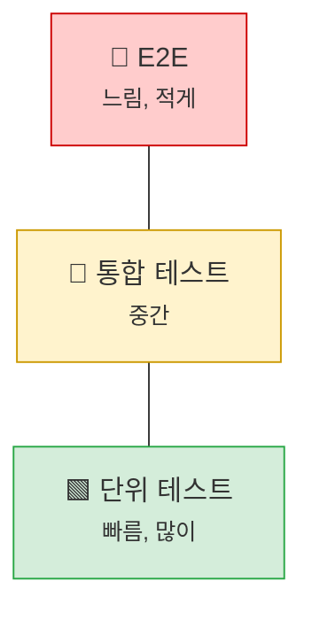
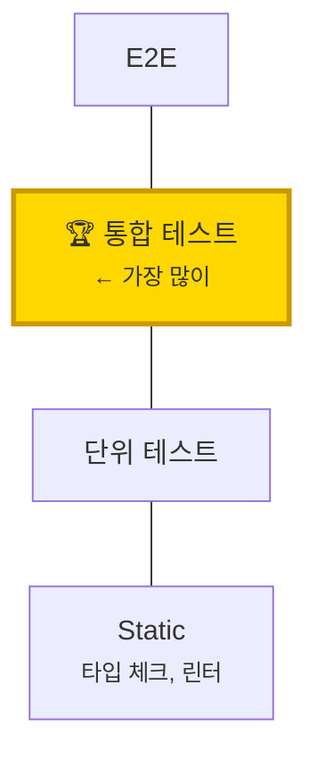
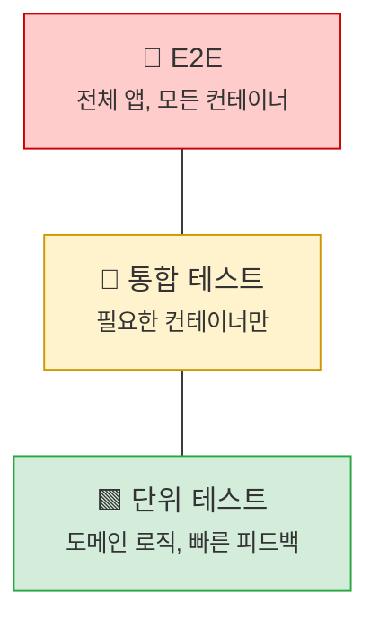

## 들어가며

Spring Boot 프로젝트에서 테스트는 크게 두 가지로 나뉜다.

| 테스트 유형 | 특징 | 실행 속도 |
|------------|------|----------|
| **단위 테스트** | 외부 의존성 없음, 즉각적 피드백 | 빠름 |
| **통합 테스트** | DB, Kafka, Redis 등 실제 인프라 사용 | 느림 |

단위 테스트는 코드 변경에 따른 피드백을 즉각적으로 받을 수 있어 개발 속도를 높인다. 통합 테스트는 시스템 간 상호작용, 설정 오류, 환경 변수 누락 등 실환경 이슈를 사전에 포착한다.

문제는 테스트를 빠르게 만들기 위해 **Mock을 남용**하는 것이다. Mock이 늘어날수록 테스트와 프로덕션의 괴리가 생긴다. 테스트는 통과했는데 프로덕션에서 실패하는 상황, 경험해봤을 것이다.

이 글에서 다루는 전략이다.

1. **흔히 하는 실수** - @MockBean 남용, @SpringBootTest 과용
2. **Source Set 분리** - 단위/통합 테스트를 구조적으로 분리
3. **Testcontainers** - H2 대신 실제 PostgreSQL, Redis, Kafka 사용
4. **Mock 어댑터 패턴** - 외부 API만 Mock, 내부 인프라는 실제 사용
5. **단위 테스트 전략** - 도메인 로직은 Spring 없이 테스트
6. **CI 전략** - 단위 테스트는 항상, 통합 테스트는 필요 시 실행

---

## 흔히 하는 실수들

Spring Boot 테스트에서 개발자들이 자주 하는 실수를 먼저 살펴본다.

### 1. @MockBean 남용

`@MockBean`은 편리하지만 **숨겨진 비용**이 있다. 매번 새로운 ApplicationContext를 생성한다.

```kotlin
// ❌ 나쁜 예: 각 테스트 클래스마다 다른 @MockBean 조합
@SpringBootTest
class UserServiceTest {
    @MockBean lateinit var userRepository: UserRepository  // Context 1
}

@SpringBootTest
class OrderServiceTest {
    @MockBean lateinit var orderRepository: OrderRepository  // Context 2 (새로 생성!)
}

@SpringBootTest
class PaymentServiceTest {
    @MockBean lateinit var paymentGateway: PaymentGateway  // Context 3 (또 새로 생성!)
}
```

**문제**: Spring은 `@MockBean` 조합이 다르면 Context를 캐시하지 못한다. 테스트 클래스마다 Context를 새로 로드하면서 **12초 이상**의 지연이 발생할 수 있다.

```kotlin
// ✅ 좋은 예: 공통 베이스 클래스로 Context 재사용
@SpringBootTest
abstract class BaseIntegrationTest {
    @MockBean lateinit var userRepository: UserRepository
    @MockBean lateinit var orderRepository: OrderRepository
    @MockBean lateinit var paymentGateway: PaymentGateway
}

class UserServiceTest : BaseIntegrationTest() { ... }
class OrderServiceTest : BaseIntegrationTest() { ... }  // 같은 Context 재사용
```

또는 **Mock 대신 실제 구현을 테스트**하는 것이 더 낫다. 이 글에서 다루는 Testcontainers + Mock 어댑터 패턴이 그 해결책이다.

### 2. @SpringBootTest 남용

모든 테스트에 `@SpringBootTest`를 붙이면 전체 Context를 로드한다.

```kotlin
// ❌ 나쁜 예: 단순 유틸리티 테스트에 @SpringBootTest
@SpringBootTest
class DateUtilsTest {
    @Test
    fun `날짜 포맷팅 테스트`() {
        val result = DateUtils.format(LocalDate.now())
        // ...
    }
}
```

**문제**: Spring Context가 전혀 필요 없는 테스트에 수 초의 로딩 시간이 추가된다.

```kotlin
// ✅ 좋은 예: 순수 단위 테스트
class DateUtilsTest {
    @Test
    fun `날짜 포맷팅 테스트`() {
        val result = DateUtils.format(LocalDate.now())
        // Spring 없이 즉시 실행
    }
}
```

### 3. @DirtiesContext 남발

```kotlin
// ❌ 나쁜 예: 매 테스트마다 Context 재생성
@SpringBootTest
@DirtiesContext(classMode = DirtiesContext.ClassMode.AFTER_EACH_TEST_METHOD)
class SomeTest { ... }
```

**문제**: `@DirtiesContext`는 Context 캐시를 무효화한다. 테스트마다 Context를 새로 생성하면 빌드 시간이 급격히 증가한다.

```kotlin
// ✅ 좋은 예: DatabaseCleanup으로 데이터만 정리
@SpringBootTest
class SomeTest(
    private val databaseCleanup: DatabaseCleanup
) {
    @BeforeEach
    fun setUp() {
        databaseCleanup.execute()  // Context는 유지, 데이터만 정리
    }
}
```

### 4. @Mock과 @MockBean 혼용

```kotlin
// ❌ 나쁜 예: 같은 테스트에서 두 어노테이션 혼용
@SpringBootTest
@ExtendWith(MockitoExtension::class)
class ConfusedTest {
    @Mock lateinit var userRepository: UserRepository      // Mockito Mock
    @MockBean lateinit var userRepository: UserRepository  // Spring MockBean - 충돌!
}
```

| 어노테이션 | 용도 | Context |
|-----------|------|---------|
| `@Mock` | Mockito 단독 사용 | Spring 불필요 |
| `@MockBean` | Spring Context 내 빈 교체 | Spring 필요 |

### 5. JUnit 4와 JUnit 5 혼용

```kotlin
// ❌ 나쁜 예: JUnit 4와 5 어노테이션 혼용
import org.junit.Test           // JUnit 4
import org.junit.jupiter.api.BeforeEach  // JUnit 5

class MixedTest {
    @BeforeEach  // JUnit 5
    fun setUp() { ... }

    @Test  // JUnit 4 - @BeforeEach가 실행 안 됨!
    fun testSomething() { ... }
}
```

**해결**: 프로젝트 전체에서 JUnit 5로 통일한다.

### 테스트 속도 개선 사례

이러한 실수들을 수정하면 빌드 시간이 극적으로 개선된다.

> "After addressing these issues, build time decreased from **10 minutes to 4 minutes** on Jenkins."
> — [10pines Blog](https://blog.10pines.com/2022/05/20/a-quick-guide-to-spring-tests-optimization/)

---

## Source Set 분리

### 왜 분리하는가

`src/test`에 모든 테스트를 넣으면 문제가 생긴다.

- 단위 테스트와 통합 테스트가 섞여 실행 시간 예측이 어려움
- 통합 테스트가 늘어날수록 전체 테스트 시간 증가
- CI에서 선택적 실행이 어려움

Gradle의 Source Set을 활용하면 `src/test`(단위)와 `src/integrationTest`(통합)를 명확히 분리할 수 있다.

### 디렉토리 구조

```
src/
├── main/kotlin/...
├── test/                      ← 단위 테스트
│   └── kotlin/
│       └── domain/
│           └── VehicleTest.kt
└── integrationTest/           ← 통합 테스트
    ├── kotlin/
    │   ├── TestContainerConfig.kt
    │   ├── support/
    │   │   └── BaseTestContainerSpec.kt
    │   └── test/
    │       ├── config/
    │       │   ├── TestConfig.kt
    │       │   └── DatabaseCleanup.kt
    │       └── mock/
    │           └── TestVdpServiceAdapter.kt
    └── resources/
        └── application.yml
```

### build.gradle.kts 설정

```kotlin
sourceSets {
    val integrationTest by creating {
        kotlin.srcDir("src/integrationTest/kotlin")
        resources.srcDir("src/integrationTest/resources")
        compileClasspath += sourceSets["main"].output + configurations["testRuntimeClasspath"]
        runtimeClasspath += output + compileClasspath
    }
}

configurations {
    create("integrationTestImplementation") {
        extendsFrom(configurations["testImplementation"])
    }
}

tasks.register<Test>("integrationTest") {
    testClassesDirs = sourceSets["integrationTest"].output.classesDirs
    classpath = sourceSets["integrationTest"].runtimeClasspath
    shouldRunAfter("test")
    useJUnitPlatform()
}

tasks.named("check") {
    dependsOn("integrationTest")
}
```

이제 `./gradlew test`는 단위 테스트만, `./gradlew integrationTest`는 통합 테스트만 실행한다.

---

## Testcontainers 기반 인프라

H2 같은 인메모리 DB는 편리하지만 프로덕션과 다른 SQL 문법, 다른 동작을 보인다. [Testcontainers](https://testcontainers.com/)를 사용하면 Docker 컨테이너로 실제 인프라를 띄울 수 있다.

### TestContainerConfig

```kotlin
class TestContainerConfig : ApplicationContextInitializer<ConfigurableApplicationContext> {

    companion object {
        private val postgres = PostgreSQLContainer("postgres:15-alpine")
            .withDatabaseName("app_test")
            .withInitScript("test-schema.sql")
            .apply { start() }

        private val redis = GenericContainer(DockerImageName.parse("redis:7-alpine"))
            .withExposedPorts(6379)
            .apply { start() }

        private val kafka = KafkaContainer(DockerImageName.parse("confluentinc/cp-kafka:7.4.0"))
            .apply { start() }
    }

    override fun initialize(ctx: ConfigurableApplicationContext) {
        TestPropertyValues.of(
            "spring.datasource.url=${postgres.jdbcUrl}",
            "spring.datasource.username=${postgres.username}",
            "spring.datasource.password=${postgres.password}",
            "spring.data.redis.host=${redis.host}",
            "spring.data.redis.port=${redis.getMappedPort(6379)}",
            "spring.kafka.bootstrap-servers=${kafka.bootstrapServers}"
        ).applyTo(ctx)
    }
}
```

**핵심 포인트:**
- `companion object`: 여러 테스트 클래스가 같은 컨테이너를 공유 (재사용)
- `ApplicationContextInitializer`: Spring Context에 동적 프로퍼티 주입
- 실제 PostgreSQL → 프로덕션과 동일한 SQL 문법 보장

### LocalStack으로 AWS S3 테스트

```kotlin
private val localstack = LocalStackContainer(DockerImageName.parse("localstack/localstack:3.0"))
    .withServices(LocalStackContainer.Service.S3)
    .apply { start() }

// initialize에서
val endpoint = localstack.getEndpointOverride(LocalStackContainer.Service.S3).toString()
registry.add("aws.s3.endpoint") { endpoint }
registry.add("cloud.aws.s3.bucket") { "test-bucket" }
```

---

## 테스트 격리 전략

통합 테스트에서 각 테스트는 독립적이어야 한다. 이전 테스트의 데이터가 다음 테스트에 영향을 주면 안 된다.

### DatabaseCleanup

```kotlin
@Component
@Profile("integration")
class DatabaseCleanup(
    private val entityManager: EntityManager,
    @Value("\${spring.jpa.properties.hibernate.default_schema}")
    private val dbSchema: String
) : InitializingBean {

    private lateinit var tableNames: String

    override fun afterPropertiesSet() {
        val managedTables = entityManager.metamodel.managedTypes
            .filter { it.javaType.kotlin.findAnnotation<Entity>() != null }
            .map { dbSchema + "." + extractTableName(it) }
            .filter { tableExists(it) }

        tableNames = managedTables.joinToString(",")
    }

    @Transactional
    fun execute() {
        if (tableNames.isNotBlank()) {
            entityManager.createNativeQuery(
                "TRUNCATE TABLE $tableNames RESTART IDENTITY CASCADE"
            ).executeUpdate()
        }
    }

    private fun extractTableName(type: ManagedType<*>): String {
        val annotation = type.javaType.kotlin.findAnnotation<Table>()
        return annotation?.name?.takeIf { it.isNotEmpty() }
            ?: camelToSnake(type.javaType.simpleName)
    }

    private fun camelToSnake(str: String) =
        str.replace("([a-z])([A-Z])".toRegex(), "$1_$2").lowercase()

    private fun tableExists(tableName: String) = runCatching {
        entityManager.createNativeQuery("SELECT 1 FROM $tableName LIMIT 1").resultList
        true
    }.getOrDefault(false)
}
```

`RESTART IDENTITY CASCADE`로 Auto Increment ID 초기화와 FK 제약 조건을 함께 처리한다.

### BaseTestContainerSpec

Kotest의 BehaviorSpec을 베이스 클래스로 만든다.

```kotlin
@SpringBootTest(
    webEnvironment = SpringBootTest.WebEnvironment.RANDOM_PORT,
    classes = [Application::class, TestConfig::class]
)
@ContextConfiguration(initializers = [TestContainerConfig::class])
@ActiveProfiles("integration")
@AutoConfigureMockMvc
abstract class BaseTestContainerSpec(
    protected val mockMvc: MockMvc,
    private val databaseCleanup: DatabaseCleanup
) : BehaviorSpec() {

    override fun isolationMode() = IsolationMode.InstancePerLeaf
    override fun extensions() = listOf(SpringExtension)

    init {
        beforeSpec { databaseCleanup.execute() }
    }
}
```

| 설정 | 목적 |
|-----|------|
| `RANDOM_PORT` | 포트 충돌 방지 |
| `TestConfig::class` | Mock 어댑터 로드 |
| `IsolationMode.InstancePerLeaf` | 각 테스트 케이스 격리 |
| `beforeSpec` | 테스트 시작 전 DB 정리 |

---

## Mock 어댑터 패턴

여기서 핵심 원칙이 등장한다: **내부 인프라(DB, Redis, Kafka)는 실제로 테스트하고, 외부 API만 Mock한다.**

### 왜 외부 API만 Mock하는가

| 대상 | Mock 여부 | 이유 |
|-----|----------|------|
| PostgreSQL | ❌ 실제 사용 | SQL 문법, 트랜잭션 동작 검증 |
| Redis | ❌ 실제 사용 | 캐시 만료, 분산 락 동작 검증 |
| Kafka | ❌ 실제 사용 | 메시지 직렬화, 컨슈머 동작 검증 |
| **외부 API** | ✅ Mock | 네트워크 의존성 제거, 테스트 속도 |

### Mock 어댑터 구현

Hexagonal Architecture에서 외부 시스템은 Adapter를 통해 접근한다. 테스트용 Adapter를 만들어 교체한다.

```kotlin
@Component("vdpServiceAdapter")
@Primary
class TestVdpServiceAdapter : VdpOut {

    private val store = mutableMapOf<String, VdpDeviceInfo>()

    override fun registerDevice(deviceSourceId: String, ...): VdpDeviceInfo {
        store[deviceSourceId]?.let { return it }

        val info = VdpDeviceInfo(
            deviceId = UUID.randomUUID(),
            isActivated = true
        )
        store[deviceSourceId] = info
        return info
    }

    override fun removeDevice(deviceId: UUID) {
        store.entries.removeIf { it.value.deviceId == deviceId }
    }
}
```

**핵심:**
- `@Component("vdpServiceAdapter")`: 프로덕션과 같은 빈 이름
- `@Primary`: 테스트에서 이 빈이 우선 선택됨
- 인메모리 저장소로 실제 API 호출 없이 동작

### TestConfig

```kotlin
@Configuration
@ComponentScan(basePackages = ["com.example.test.mock"])
class TestConfig {
    // Mock 어댑터가 있는 패키지 스캔
}
```

프로덕션 Config는 그대로 사용되고, `@Primary`가 붙은 Mock만 교체된다. 이것이 Hexagonal Architecture의 핵심 이점이다.

---

## 통합 테스트 예제

```kotlin
class DeviceIntegrationTest(
    mockMvc: MockMvc,
    databaseCleanup: DatabaseCleanup,
    private val objectMapper: ObjectMapper,
    private val vehicleOut: VehicleOut
) : BaseTestContainerSpec(mockMvc, databaseCleanup) {

    init {
        Given("차량이 등록된 상태에서") {
            val vehicle = vehicleOut.save(createTestVehicle())
            val request = CreateDeviceRequest(
                vehicleId = vehicle.id,
                deviceSourceId = "device-001"
            )

            When("단말 생성 API를 호출하면") {
                Then("단말이 정상적으로 생성된다") {
                    mockMvc.post("/api/v1/devices") {
                        contentType = MediaType.APPLICATION_JSON
                        content = objectMapper.writeValueAsString(request)
                    }.andExpect {
                        status { isCreated() }
                        jsonPath("$.id") { exists() }
                    }
                }
            }
        }
    }
}
```

Port 인터페이스(`vehicleOut`)로 테스트 데이터를 삽입한다. Repository가 아닌 Port를 사용하므로 도메인 로직을 거친다.

---

## CI 전략

통합 테스트는 Testcontainers 구동, 외부 시스템 연결로 시간이 오래 걸린다. 매 커밋마다 실행하면 비용이 크다.

### 권장 전략

| 테스트 유형 | 실행 시점 | CI 설정 |
|------------|----------|---------|
| 단위 테스트 | 모든 커밋 | 자동 실행 |
| 통합 테스트 | MR 검토, 중요 변경 시 | **수동 실행** |

### GitLab CI 예시

```yaml
# 단위 테스트: 항상 실행
unit_test:
  stage: test
  script:
    - ./gradlew test
  rules:
    - when: always

# 통합 테스트: 수동 실행
integration_test:
  stage: test
  when: manual  # 버튼 클릭으로 실행
  image: cimg/openjdk:21.0.5
  tags:
    - runner-dind  # Docker-in-Docker 필요
  script:
    - ./gradlew integrationTest
```

### GitHub Actions 예시

```yaml
jobs:
  unit-test:
    runs-on: ubuntu-latest
    steps:
      - uses: actions/checkout@v4
      - name: Run unit tests
        run: ./gradlew test

  integration-test:
    runs-on: ubuntu-latest
    if: github.event_name == 'workflow_dispatch'  # 수동 실행
    steps:
      - uses: actions/checkout@v4
      - name: Run integration tests
        run: ./gradlew integrationTest
```

단위 테스트로 빠른 피드백을 받고, 통합 테스트는 MR 리뷰나 배포 전에 실행한다.

---

## 단위 테스트 전략

통합 테스트만큼 중요한 것이 단위 테스트다. **도메인 로직은 Spring 없이 테스트**해야 빠른 피드백을 받을 수 있다.

### 도메인 모델 테스트

```kotlin
// src/test/kotlin/domain/VehicleTest.kt
class VehicleTest : BehaviorSpec({

    Given("차량이 생성되면") {
        val vehicle = Vehicle.create(
            vin = Vin("1HGBH41JXMN109186"),
            model = "Model S",
            manufacturer = "Tesla"
        )

        Then("상태는 INACTIVE") {
            vehicle.status shouldBe VehicleStatus.INACTIVE
        }

        When("활성화하면") {
            vehicle.activate()

            Then("상태가 ACTIVE로 변경된다") {
                vehicle.status shouldBe VehicleStatus.ACTIVE
            }

            Then("활성화 이벤트가 발생한다") {
                vehicle.domainEvents shouldContain VehicleActivated(vehicle.id)
            }
        }
    }

    Given("이미 활성화된 차량에서") {
        val vehicle = Vehicle.create(...).apply { activate() }

        When("다시 활성화하면") {
            Then("예외가 발생한다") {
                shouldThrow<IllegalStateException> {
                    vehicle.activate()
                }
            }
        }
    }
})
```

**핵심 포인트:**
- `@SpringBootTest` 없음 → 즉시 실행
- 도메인 로직(상태 전이, 유효성 검증)만 테스트
- 도메인 이벤트 발행까지 검증

### UseCase 테스트

UseCase는 Port 인터페이스를 Mock해서 테스트한다.

```kotlin
class ActivateVehicleUseCaseTest : BehaviorSpec({

    val vehiclePort = mockk<VehiclePort>()
    val eventPublisher = mockk<DomainEventPublisher>(relaxed = true)
    val useCase = ActivateVehicleUseCase(vehiclePort, eventPublisher)

    Given("비활성 차량이 존재할 때") {
        val vehicle = Vehicle.create(...)
        every { vehiclePort.findById(vehicle.id) } returns vehicle
        every { vehiclePort.save(any()) } answers { firstArg() }

        When("활성화 요청을 하면") {
            val result = useCase.execute(vehicle.id)

            Then("차량이 활성화된다") {
                result.status shouldBe VehicleStatus.ACTIVE
            }

            Then("이벤트가 발행된다") {
                verify { eventPublisher.publish(any<VehicleActivated>()) }
            }
        }
    }
})
```

**Mock 사용 기준:**
- ✅ Port 인터페이스 → Mock (외부 의존성 추상화)
- ❌ 도메인 모델 → 실제 객체 사용

### 단위 테스트 vs 통합 테스트 배치

| 대상 | 테스트 방식 | 위치 |
|-----|-----------|------|
| 도메인 모델 | 순수 단위 테스트 | `src/test` |
| UseCase | Port Mock | `src/test` |
| Adapter (DB) | Testcontainers | `src/integrationTest` |
| API 엔드포인트 | 전체 통합 | `src/integrationTest` |

---

## 테스트 철학: Pyramid vs Trophy

테스트 전략에 대한 두 가지 관점이 있다.

### Testing Pyramid (전통적)

Mike Cohn의 "Succeeding with Agile"에서 제안한 모델이다.



**원칙**: 단위 테스트를 가장 많이, E2E를 가장 적게.

### Testing Trophy (현대적)

[Kent C. Dodds](https://kentcdodds.com/blog/write-tests)가 제안한 모델이다.



유명한 격언이 있다.

> **"Write tests. Not too many. Mostly integration."**
> — Guillermo Rauch

**철학**
- 테스트가 **실제 사용 방식**과 유사할수록 더 많은 신뢰를 준다
- 통합 테스트가 **ROI(Return on Investment)**가 가장 높다
- 단위 테스트는 복잡한 로직에만, 나머지는 통합 테스트로

### 어떤 것을 선택할까?

| 상황 | 권장 |
|-----|------|
| 복잡한 도메인 로직 | 단위 테스트 많이 (Pyramid) |
| CRUD 중심 앱 | 통합 테스트 중심 (Trophy) |
| 외부 API 연동 많음 | Mock 어댑터 + 통합 테스트 |
| 레거시 코드 | 통합 테스트로 안전망 확보 |

이 글에서 다루는 전략은 **두 접근의 장점을 조합**한다.

1. **도메인 로직** → 단위 테스트 (빠른 피드백)
2. **어댑터/API** → 통합 테스트 (실제 동작 검증)
3. **외부 API** → Mock 어댑터 (의존성 제거)

핵심은 "통합 테스트"라고 해서 느릴 필요가 없다는 것이다. Testcontainers로 실제 인프라를 쓰면서도, Source Set 분리와 CI 전략으로 효율을 유지한다.

---

## 테스트 레벨별 구성



| 레벨 | Import 범위 | 사용 컨테이너 | 상대 시간 |
|-----|------------|-------------|----------|
| 단위 | 없음 | 없음 | 1x (기준) |
| 어댑터 | PersistenceConfig | PostgreSQL만 | ~2x |
| 서비스 통합 | 어댑터 + UseCase | PostgreSQL + Redis | ~3x |
| E2E | 전체 앱 | 전체 | ~5x |

범위에 맞는 Config만 Import하면 불필요한 빈 로드 없이 빠른 피드백을 받을 수 있다.

---

## Hexagonal Architecture와의 연결

[Alistair Cockburn의 원문](https://alistair.cockburn.us/hexagonal-architecture/)에서 Hexagonal Architecture의 목표를 이렇게 정의한다.

> "Allow an application to equally be driven by users, programs, automated test or batch scripts"

사용자, 프로그램, **자동화된 테스트**가 동등하게 애플리케이션을 구동할 수 있어야 한다.

이 글에서 다룬 패턴은 이 목표를 Spring Boot에서 구현하는 방법이다.

- **Port 인터페이스**: 외부 의존성을 추상화
- **Adapter 교체**: 테스트용 Mock 어댑터로 교체 가능
- **@Primary**: Spring DI로 자연스럽게 교체

Adapter를 쉽게 교체할 수 있으면 테스트도 쉬워진다. Mock 어댑터는 Hexagonal Architecture의 핵심 이점이다.

---

## 정리

| 전략 | 목적 | 핵심 구현 |
|-----|------|----------|
| Source Set 분리 | 단위/통합 테스트 구조화 | `src/integrationTest` |
| Testcontainers | 실제 인프라 테스트 | PostgreSQL, Redis, Kafka |
| DatabaseCleanup | 테스트 간 격리 | `TRUNCATE CASCADE` |
| Mock 어댑터 | 외부 API만 Mock | `@Primary` + Port 인터페이스 |
| CI 전략 | 리소스 효율화 | 단위: 항상, 통합: 수동 |

**핵심 원칙:**
1. 내부 인프라(DB, Cache, MQ)는 Testcontainers로 실제 테스트
2. 외부 API만 Mock 어댑터로 교체
3. 프로덕션과 테스트의 빈 구성 일치 → 테스트 결과 신뢰

Mock을 줄이고 실제 인프라로 테스트하면, "테스트는 통과했는데 프로덕션에서 실패"하는 상황을 방지할 수 있다.

---

## 참고 자료

### 테스트 전략
- [Write tests. Not too many. Mostly integration. - Kent C. Dodds](https://kentcdodds.com/blog/write-tests)
- [The Testing Trophy and Testing Classifications - Kent C. Dodds](https://kentcdodds.com/blog/the-testing-trophy-and-testing-classifications)
- [A Quick Guide to Spring Tests Optimization - 10pines](https://blog.10pines.com/2022/05/20/a-quick-guide-to-spring-tests-optimization/)
- [Optimizing Spring Integration Tests - Baeldung](https://www.baeldung.com/spring-tests)

### Spring Boot 테스트 실수
- [@MockBean Context Reload Issue - Spring Boot GitHub](https://github.com/spring-projects/spring-boot/issues/7174)
- [Testing Spring Boot Applications: Common Pitfalls - rieckpil](https://rieckpil.de/common-pitfalls-when-testing-spring-boot-applications/)

### Hexagonal Architecture & Testing
- [Hexagonal Architecture - Alistair Cockburn](https://alistair.cockburn.us/hexagonal-architecture/)
- [Avoid mocks and test your core domain faster with Hexagonal Architecture](https://philippe.bourgau.net/avoid-mocks-and-test-your-core-domain-faster-with-hexagonal-architecture/)
- [Domain-Driven Hexagon - GitHub](https://github.com/Sairyss/domain-driven-hexagon)

### 도구
- [Testcontainers](https://testcontainers.com/)
- [Kotest Spring Extension](https://kotest.io/docs/extensions/spring.html)
- [Spring Boot Testing Reference](https://docs.spring.io/spring-boot/reference/testing/index.html)
