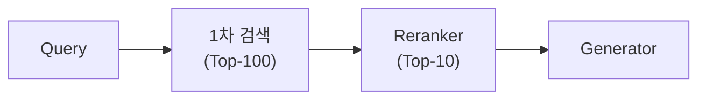
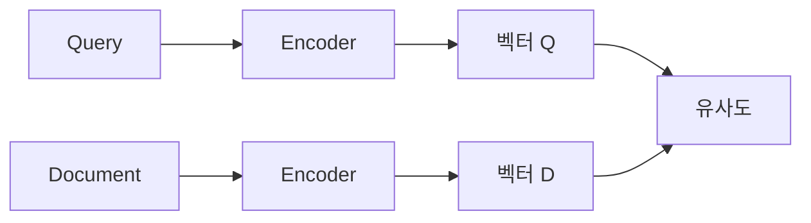
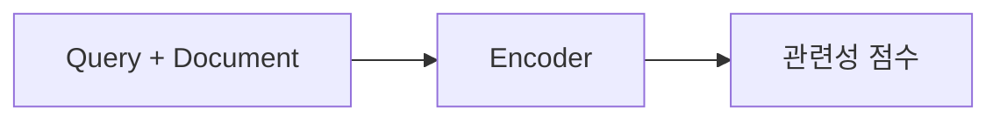
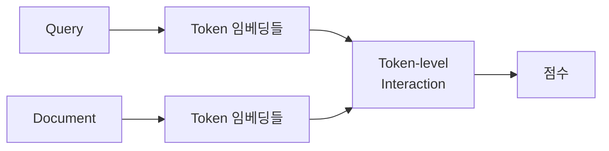
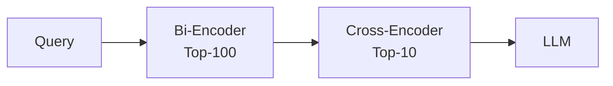
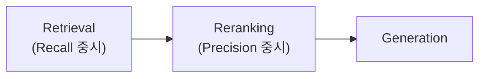

## 개요

Reranking은 1차 검색 결과를 더 정밀하게 재정렬하는 단계다. 검색(Retrieval)이 넓게 후보를 찾는다면, Reranking은 정확도를 높인다.



---

## 왜 Reranking인가?

### 1차 검색의 한계

| 문제 | 설명 |
|------|------|
| 속도 우선 | ANN은 정확도를 희생하고 속도를 얻음 |
| 독립 임베딩 | 쿼리와 문서를 따로 임베딩 |
| 얕은 비교 | 단순 벡터 유사도만 계산 |

### Reranking의 역할

1차 검색이 빠르게 Top-100을 찾으면, Reranker가 이 중에서 진짜 관련 있는 Top-10을 선별한다.

---

## Bi-Encoder vs Cross-Encoder

### Bi-Encoder

쿼리와 문서를 각각 독립적으로 임베딩한다.



| 특징 | 설명 |
|------|------|
| 속도 | 빠름 (문서 벡터 사전 계산) |
| 정확도 | 상대적 낮음 |
| 용도 | 1차 검색 |

### Cross-Encoder

쿼리와 문서를 함께 입력하여 관련성 점수를 직접 계산한다.



| 특징 | 설명 |
|------|------|
| 속도 | 느림 (매번 계산) |
| 정확도 | 높음 |
| 용도 | Reranking |

### 비교

| 구분 | Bi-Encoder | Cross-Encoder |
|------|------------|---------------|
| 입력 | 쿼리, 문서 분리 | 쿼리+문서 결합 |
| 출력 | 각각의 벡터 | 관련성 점수 |
| 속도 | O(1) 조회 | O(n) 계산 |
| 정확도 | 중간 | 높음 |
| 스케일 | 수백만 문서 | 수십~수백 문서 |

---

## Late Interaction

Bi-Encoder의 속도와 Cross-Encoder의 정확도를 절충한 방식이다.



**대표 모델**: ColBERT

- 쿼리와 문서의 각 토큰을 임베딩
- 토큰 간 유사도를 계산하여 최종 점수 산출
- 문서 토큰은 사전 계산 가능

| 구분 | Bi-Encoder | Late Interaction | Cross-Encoder |
|------|------------|------------------|---------------|
| 속도 | ⚡⚡⚡ | ⚡⚡ | ⚡ |
| 정확도 | ⭐ | ⭐⭐ | ⭐⭐⭐ |

---

## 주요 Reranker 모델

| 모델 | 유형 | 특징 |
|------|------|------|
| Cohere Rerank | Cross-Encoder | API, 다국어 |
| BGE Reranker | Cross-Encoder | 오픈소스 |
| ColBERT | Late Interaction | 오픈소스, 빠름 |
| Jina Reranker | Cross-Encoder | 오픈소스, 다국어 |
| ms-marco MiniLM | Cross-Encoder | 경량, 영어 |

---

## 실무 적용 전략

### Two-Stage Retrieval



1. **1차 검색**: 빠른 Bi-Encoder로 Top-100 후보 추출
2. **Reranking**: 정밀한 Cross-Encoder로 Top-10 선별
3. **생성**: 선별된 문서로 LLM 답변 생성

### Rerank Top-N 설정

| 단계 | N 값 | 이유 |
|------|------|------|
| 1차 검색 | 50-100 | 높은 Recall 확보 |
| Reranking | 5-10 | Context Window 고려 |

### Rerank Threshold

점수가 특정 임계값 이하인 문서는 제외한다.

```
rerank_results = [doc for doc in results if doc.score > 0.5]
```

관련 없는 문서가 LLM에 전달되는 것을 방지한다.

### Score Fusion

1차 검색 점수와 Reranking 점수를 결합한다.

```
final_score = α × retrieval_score + (1-α) × rerank_score
```

---

## Reranking 비용 고려

| 요소 | 고려사항 |
|------|----------|
| 레이턴시 | Cross-Encoder는 느림, 캐싱 고려 |
| 비용 | API 사용 시 문서당 과금 |
| 배치 | 여러 문서 한 번에 처리 |

**최적화 방법**:
- 1차 검색 결과를 적절히 제한
- 필요한 경우만 Reranking 적용
- 캐싱으로 반복 쿼리 처리

---

## 정리

| 개념 | 핵심 |
|------|------|
| Reranking | 검색 결과 재정렬 |
| Bi-Encoder | 독립 임베딩, 빠름 |
| Cross-Encoder | 결합 입력, 정확 |
| Late Interaction | 토큰 수준 상호작용 |
| Two-Stage | 1차 검색 + Reranking |



**다음 편**: AI Agent 기초 - LLM이 도구를 사용하고 자율적으로 작업하는 Agent 아키텍처를 다룬다.
