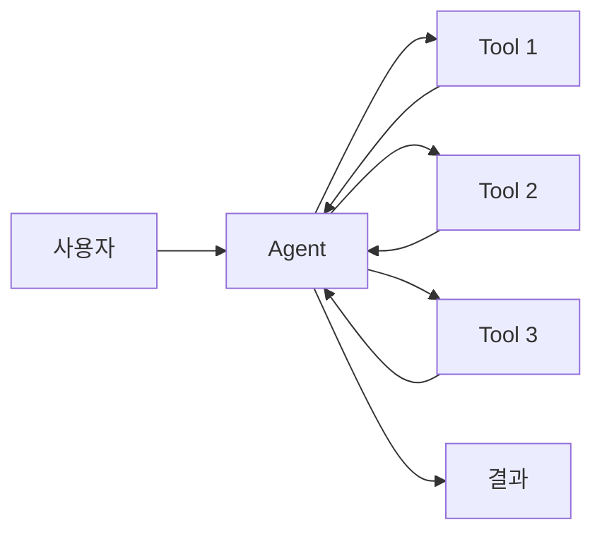
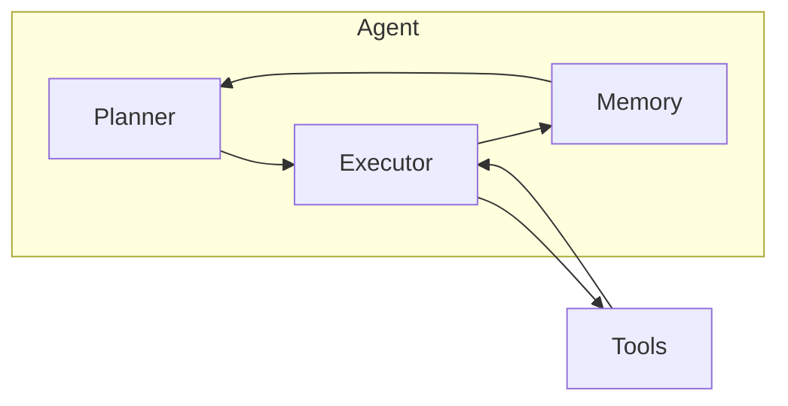
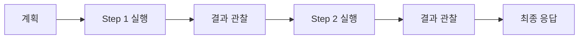
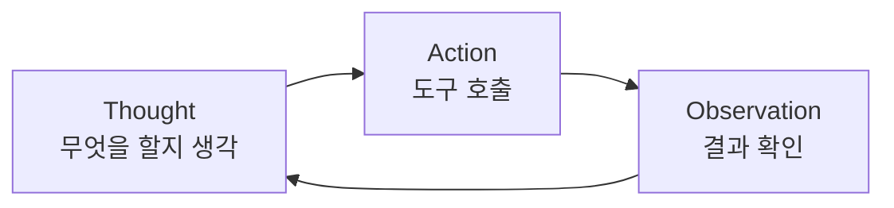
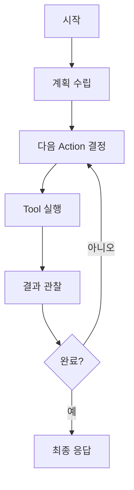
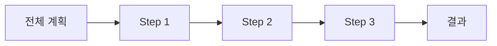
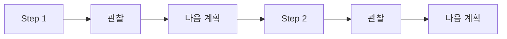
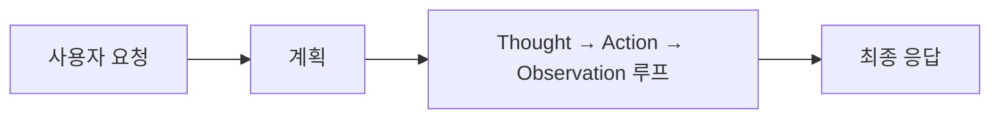

## 개요

AI Agent는 LLM이 도구를 사용하고 자율적으로 작업을 수행하는 시스템이다. 단순한 Q&A를 넘어 복잡한 태스크를 계획하고 실행한다.



---

## Agent vs Chatbot

| 구분 | Chatbot | Agent |
|------|---------|-------|
| 상호작용 | 단일 Q&A | 다단계 작업 |
| 도구 사용 | 제한적 | 적극적 |
| 자율성 | 낮음 | 높음 |
| 계획 | 없음 | 계획 수립 |
| 예시 | 고객 상담 | 코드 작성, 리서치 |

---

## Agent 구성 요소

### 전체 구조



### Planner

태스크를 분석하고 실행 계획을 수립한다.

```
사용자: "내일 서울 날씨 알려주고 우산 필요한지 말해줘"

Planner 분석:
1. 내일 서울 날씨 조회 (Weather API)
2. 강수 확률 확인
3. 우산 필요 여부 판단
```

### Executor

계획에 따라 도구를 호출하고 결과를 처리한다.



### Memory

Agent의 상태와 히스토리를 저장한다.

| 유형 | 설명 | 예시 |
|------|------|------|
| Short-term | 현재 세션 맥락 | 대화 히스토리 |
| Long-term | 세션 간 지속 | 사용자 선호도 |
| Episodic | 과거 경험 | 이전 작업 결과 |
| Semantic | 지식 저장 | 학습된 정보 |

### Tool

Agent가 사용하는 외부 기능이다.

| 도구 유형 | 예시 |
|-----------|------|
| 검색 | 웹 검색, RAG |
| API 호출 | 날씨, 주식, 캘린더 |
| 코드 실행 | Python, SQL |
| 파일 조작 | 읽기, 쓰기 |

---

## 실행 사이클

### Thought-Action-Observation

Agent는 사고(Thought) → 행동(Action) → 관찰(Observation)을 반복한다.



### ReAct 패턴

Reasoning과 Acting을 결합한 패턴이다.

```
Question: 테슬라 현재 주가와 어제 대비 변화율은?

Thought 1: 테슬라 현재 주가를 조회해야 한다.
Action 1: stock_price("TSLA")
Observation 1: 현재가 $248.50

Thought 2: 어제 종가를 조회해야 한다.
Action 2: stock_price_yesterday("TSLA")
Observation 2: 어제 종가 $245.00

Thought 3: 변화율을 계산한다.
Action 3: calculate((248.50-245.00)/245.00*100)
Observation 3: 1.43%

Thought 4: 결과를 정리한다.
Answer: 테슬라 현재 주가는 $248.50이며, 어제 대비 1.43% 상승했다.
```

### ReAct 장점

| 장점 | 설명 |
|------|------|
| 추론 과정 명시 | Thought에서 왜 그 행동을 하는지 설명 |
| 디버깅 용이 | 각 단계 추적 가능 |
| 오류 복구 | Observation으로 피드백 반영 |

---

## Agent Loop

### 기본 루프



### 종료 조건

| 조건 | 설명 |
|------|------|
| 태스크 완료 | 목표 달성 |
| 최대 반복 | 무한 루프 방지 |
| 에러 발생 | 복구 불가능한 오류 |
| 사용자 중단 | 명시적 취소 |

---

## 계획 수립 방식

### 단일 계획 (Plan-then-Execute)

처음에 전체 계획을 세우고 순차 실행한다.



**장점**: 일관된 실행
**단점**: 중간 결과에 따른 유연성 부족

### 동적 계획 (Iterative Planning)

매 단계마다 다음 행동을 결정한다.



**장점**: 유연한 대응
**단점**: 일관성 부족 가능

---

## 실무 고려사항

### 안전성

| 위험 | 대책 |
|------|------|
| 무한 루프 | 최대 반복 횟수 제한 |
| 위험한 Action | 도구 권한 제한 |
| 할루시네이션 | 결과 검증 단계 |

### 비용 최적화

| 방법 | 설명 |
|------|------|
| 도구 캐싱 | 같은 호출 재사용 |
| 계획 단순화 | 불필요한 단계 제거 |
| 모델 선택 | 간단한 판단은 작은 모델 |

---

## 정리

| 개념 | 핵심 |
|------|------|
| Agent | 자율적 작업 수행 시스템 |
| Planner | 계획 수립 |
| Executor | 도구 실행 |
| Memory | 상태/히스토리 저장 |
| Tool | 외부 기능 |
| ReAct | 추론 + 행동 패턴 |
| Observation | 실행 결과 피드백 |



**다음 편**: Multi-Agent 패턴 - 여러 Agent가 협력하는 아키텍처를 다룬다.
