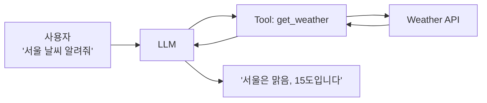
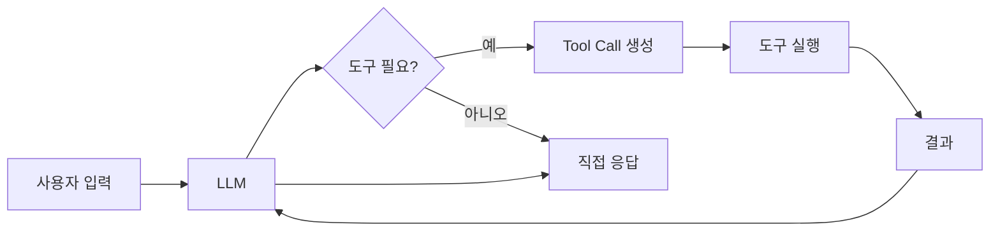
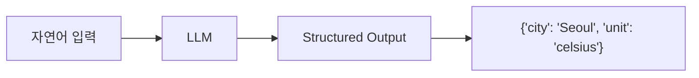
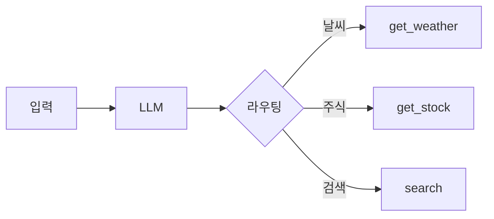
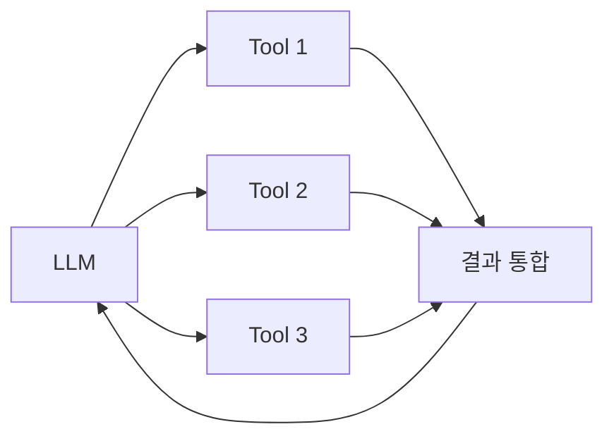
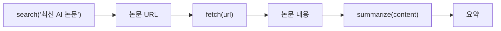
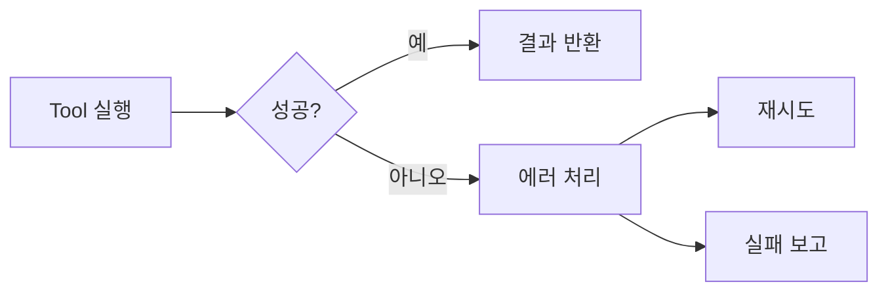
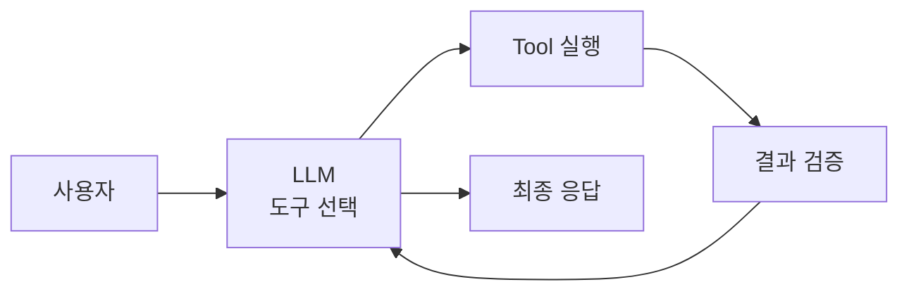

## 개요

Tool Calling은 LLM이 외부 함수나 API를 호출하는 기능이다. LLM의 지식 한계를 넘어 실시간 데이터 조회, 계산, 시스템 조작 등이 가능해진다.



---

## Tool Calling vs Function Calling

같은 개념의 다른 이름이다. 벤더마다 용어가 다르다.

| 벤더 | 용어 |
|------|------|
| OpenAI | Function Calling → Tool Calling |
| Anthropic | Tool Use |
| Google | Function Calling |

이 글에서는 Tool Calling으로 통일한다.

---

## 동작 방식

### 전체 흐름



### 단계별 과정

1. **도구 정의**: 사용 가능한 도구와 스키마를 LLM에 제공
2. **LLM 판단**: 도구 호출이 필요한지 결정
3. **호출 생성**: 도구명과 인자를 JSON으로 출력
4. **실행**: 애플리케이션이 실제 도구 실행
5. **결과 반환**: 실행 결과를 LLM에 전달
6. **최종 응답**: LLM이 결과를 바탕으로 답변 생성

---

## Schema 정의

### JSON Schema

도구의 입력 형식을 정의한다.

```json
{
  "name": "get_weather",
  "description": "지정한 도시의 현재 날씨를 조회한다",
  "parameters": {
    "type": "object",
    "properties": {
      "city": {
        "type": "string",
        "description": "도시 이름 (예: Seoul, Tokyo)"
      },
      "unit": {
        "type": "string",
        "enum": ["celsius", "fahrenheit"],
        "description": "온도 단위"
      }
    },
    "required": ["city"]
  }
}
```

### 좋은 Schema 작성법

| 요소 | 권장 |
|------|------|
| name | 명확한 동사+명사 (get_weather) |
| description | 기능을 구체적으로 설명 |
| parameters | 필수/선택 구분 명확히 |
| enum | 가능한 값 제한 |

### Structured Output

LLM 출력을 JSON Schema로 강제한다.



파싱 실패 없이 일관된 형식을 보장한다.

---

## Tool Selection

### 단일 도구 선택

LLM이 가장 적합한 도구 하나를 선택한다.

```
사용자: "서울 날씨 알려줘"
→ get_weather(city="Seoul")
```

### 다중 도구 선택

여러 도구를 순차 또는 병렬로 호출한다.

```
사용자: "서울과 도쿄 날씨 비교해줘"
→ get_weather(city="Seoul")
→ get_weather(city="Tokyo")
```

### Tool Routing

입력에 따라 적절한 도구로 분기한다.



---

## 실행 관리

### Parallel Tool Calls

독립적인 도구 호출을 병렬 실행한다.



응답 시간을 단축한다.

### Tool Chaining

이전 도구 결과를 다음 도구 입력으로 사용한다.



---

## 오류 처리

### Tool Failure Handling

| 오류 유형 | 대응 |
|-----------|------|
| 타임아웃 | 재시도 또는 대체 도구 |
| 잘못된 인자 | LLM에 오류 반환, 수정 요청 |
| API 오류 | 사용자에게 안내 |



### 재시도 전략

| 전략 | 설명 |
|------|------|
| 즉시 재시도 | 일시적 오류 대응 |
| Exponential Backoff | 점진적 대기 시간 증가 |
| 대체 도구 | 다른 도구로 시도 |

---

## 안전성

### Side Effect

도구 실행이 시스템 상태를 변경하는 경우다.

| 유형 | 예시 | 위험도 |
|------|------|--------|
| 읽기 전용 | 날씨 조회, 검색 | 낮음 |
| 쓰기 | 이메일 전송, 파일 수정 | 높음 |
| 삭제 | 데이터 삭제 | 매우 높음 |

### Idempotency

같은 호출을 여러 번 해도 결과가 동일해야 한다.

```
✅ get_weather("Seoul")  # 멱등
❌ send_email(to, body)   # 비멱등 (여러 번 전송됨)
```

### 권한 제어

| 방법 | 설명 |
|------|------|
| 도구 화이트리스트 | 허용된 도구만 제공 |
| 인자 검증 | 위험한 값 필터링 |
| 사용자 확인 | 중요 작업 전 승인 요청 |

---

## API Contract

도구와 LLM 간 인터페이스를 명확히 정의한다.

### 입력 계약

- 필수 파라미터 명시
- 타입과 형식 정의
- 유효한 값 범위

### 출력 계약

- 성공/실패 형식 정의
- 에러 메시지 포맷
- 결과 스키마

```json
{
  "success": true,
  "data": {
    "temperature": 15,
    "condition": "sunny"
  }
}
```

```json
{
  "success": false,
  "error": {
    "code": "CITY_NOT_FOUND",
    "message": "도시를 찾을 수 없습니다"
  }
}
```

---

## 정리

| 개념 | 핵심 |
|------|------|
| Tool Calling | LLM의 외부 도구 호출 |
| Schema | 도구 입력 형식 정의 |
| Structured Output | 출력 형식 강제 |
| Tool Routing | 적절한 도구 선택 |
| Idempotency | 반복 호출 안전성 |
| Side Effect | 상태 변경 위험 |



**다음 편**: 평가 & 안정성 - RAG와 Agent의 품질을 측정하고 안전하게 운영하는 방법을 다룬다.
