## 개요

기본 RAG는 단순한 검색-생성 파이프라인이다. 복잡한 질문, 다단계 추론, 자기 검증이 필요한 경우 한계가 있다. 이 글에서는 이를 극복하는 Advanced RAG 기법들을 다룬다.

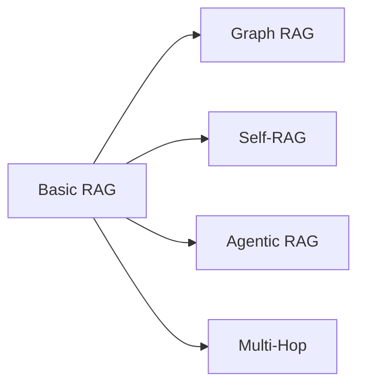

---

## Graph RAG

### 개념

지식 그래프(Knowledge Graph)와 RAG를 결합한다. 엔티티 간 관계를 활용하여 연결된 정보를 검색한다.

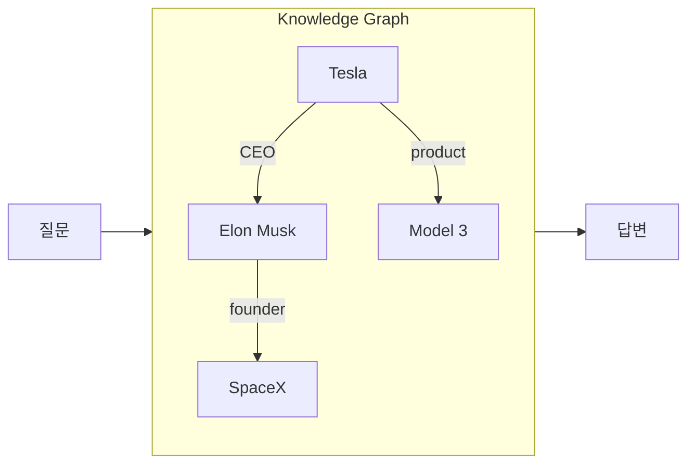

### Knowledge Graph란?

엔티티(노드)와 관계(엣지)로 지식을 표현하는 구조다.

| 요소 | 예시 |
|------|------|
| 엔티티 | Tesla, Elon Musk, SpaceX |
| 관계 | CEO_of, founded, produces |
| 속성 | 설립연도, 본사위치 |

### 동작 방식

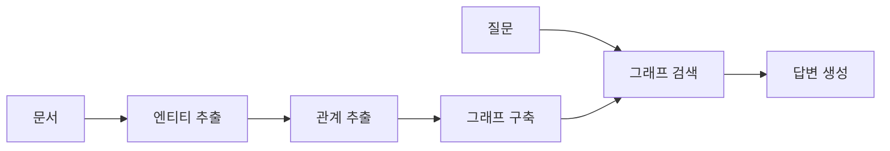

1. **그래프 구축**: 문서에서 엔티티와 관계 추출
2. **그래프 검색**: 질문 관련 엔티티부터 그래프 탐색
3. **컨텍스트 구성**: 연결된 정보를 LLM에 전달

### 장점

| 장점 | 설명 |
|------|------|
| 관계 추론 | "A의 CEO가 설립한 다른 회사는?" |
| 다중 홉 | 여러 단계 연결된 정보 탐색 |
| 구조화된 지식 | 일관된 정보 표현 |

---

## Self-RAG

### 개념

LLM이 스스로 검색 필요성을 판단하고, 생성한 답변을 자체 평가한다.

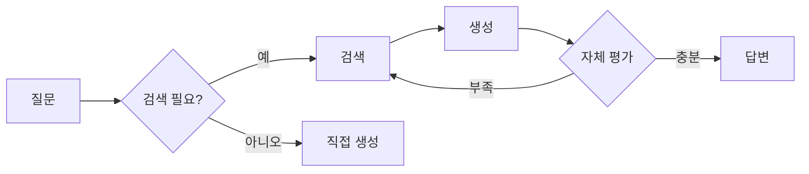

### 핵심 토큰

Self-RAG는 특수 토큰으로 상태를 표현한다.

| 토큰 | 의미 |
|------|------|
| [Retrieve] | 검색 필요 여부 |
| [IsRel] | 검색 결과 관련성 |
| [IsSup] | 답변이 출처 기반인지 |
| [IsUse] | 답변이 유용한지 |

### 장점

| 기존 RAG | Self-RAG |
|----------|----------|
| 항상 검색 | 필요시만 검색 |
| 결과 무조건 사용 | 관련성 평가 후 사용 |
| 외부 평가 필요 | 자체 품질 평가 |

---

## Corrective RAG (CRAG)

### 개념

검색 결과의 품질을 평가하고, 필요시 대체 검색을 수행한다.

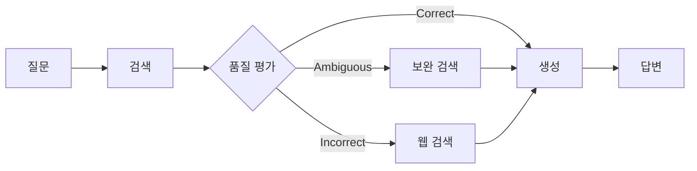

### 평가 등급

| 등급 | 조치 |
|------|------|
| Correct | 그대로 사용 |
| Ambiguous | 지식 정제 후 사용 |
| Incorrect | 웹 검색으로 대체 |

---

## Agentic RAG

### 개념

RAG를 Agent 아키텍처로 구현한다. 검색이 단순 파이프라인이 아닌 도구가 된다.

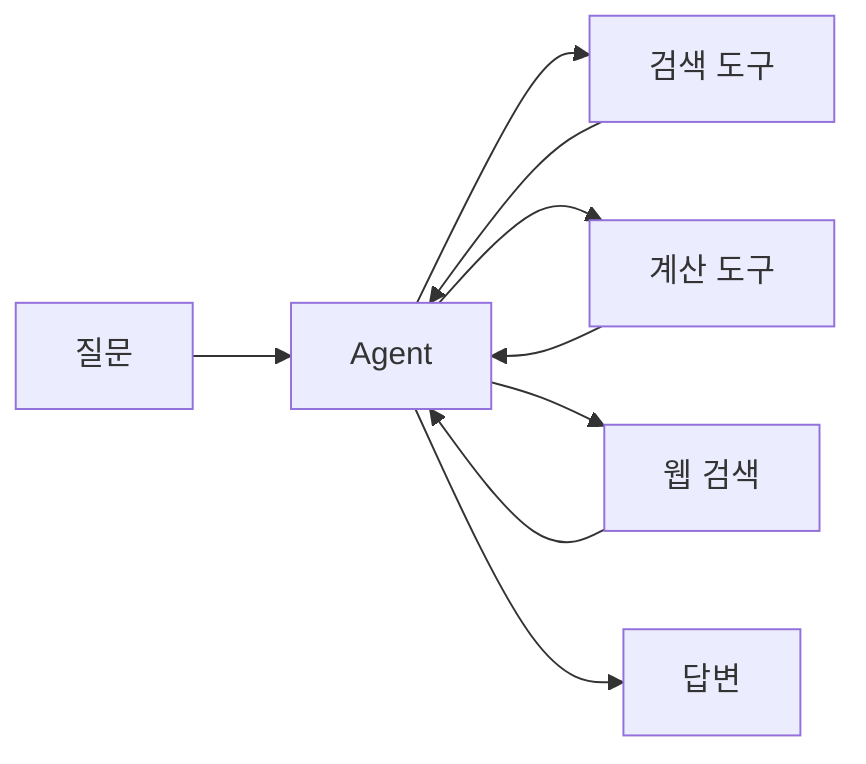

### 특징

| Basic RAG | Agentic RAG |
|-----------|-------------|
| 고정 파이프라인 | 동적 계획 |
| 단일 검색 | 다중 검색/도구 |
| 즉시 생성 | 반복 개선 |

### 활용 예시

```
질문: "2023년 매출 1위 기업과 2위 기업의 차이는?"

Agent 동작:
1. 검색: "2023년 매출 1위 기업" → Apple, $394B
2. 검색: "2023년 매출 2위 기업" → Samsung, $234B
3. 계산: $394B - $234B = $160B
4. 생성: "Apple이 Samsung보다 $160B 높다"
```

---

## RAG Fusion

### 개념

하나의 질문을 여러 쿼리로 변환하고, 검색 결과를 융합한다.

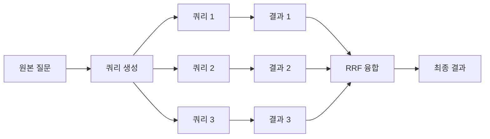

### 다중 쿼리 생성

```
원본: "Python 웹 개발 프레임워크 추천"
→ "Python 웹 프레임워크 비교"
→ "Django vs Flask 장단점"
→ "Python REST API 프레임워크"
```

### RRF (Reciprocal Rank Fusion)

각 쿼리 결과의 순위를 역수로 합산한다.

```
문서 A: 쿼리1에서 1위, 쿼리2에서 3위
RRF(A) = 1/(60+1) + 1/(60+3) = 0.0159 + 0.0159 = 0.0318
```

---

## Multi-Hop Retrieval

### 개념

여러 단계의 검색을 연결하여 복잡한 질문에 답한다.

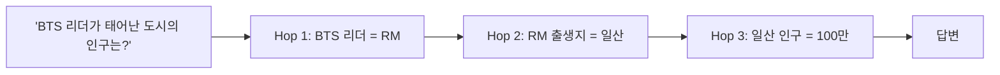

### 질문 분해

| 단계 | 하위 질문 | 답변 |
|------|-----------|------|
| Hop 1 | BTS 리더는 누구? | RM |
| Hop 2 | RM은 어디서 태어났나? | 일산 |
| Hop 3 | 일산 인구는? | 약 100만 |

### Retrieval Planning

검색 순서와 전략을 사전에 계획한다.

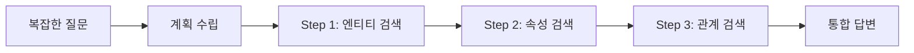

---

## Tool-Augmented RAG

검색 외 다양한 도구를 RAG에 통합한다.

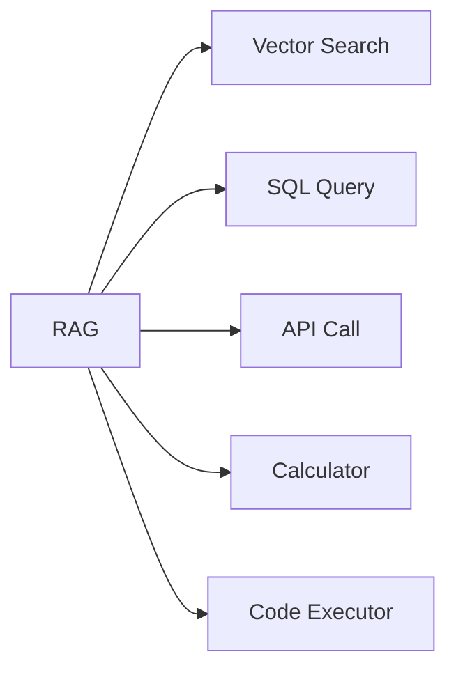

| 도구 | 용도 |
|------|------|
| SQL | 구조화 데이터 조회 |
| API | 실시간 데이터 |
| Calculator | 수치 계산 |
| Code Executor | 코드 실행 결과 |

---

## 기법 선택 가이드

| 상황 | 적합한 기법 |
|------|------------|
| 엔티티 관계 질문 | Graph RAG |
| 불필요한 검색 줄이기 | Self-RAG |
| 검색 품질 보장 | Corrective RAG |
| 복잡한 다단계 태스크 | Agentic RAG |
| 검색 범위 확장 | RAG Fusion |
| 연결된 정보 필요 | Multi-Hop |

---

## 정리

| 기법 | 핵심 아이디어 |
|------|---------------|
| Graph RAG | 지식 그래프 + 검색 |
| Self-RAG | 자체 판단, 자체 평가 |
| Corrective RAG | 검색 결과 품질 검증 |
| Agentic RAG | Agent로 동적 검색 |
| RAG Fusion | 다중 쿼리 + 결과 융합 |
| Multi-Hop | 단계적 검색 연결 |

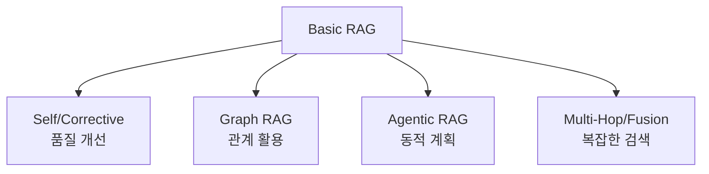

---

## 시리즈 마무리

이 시리즈에서 LLM 기초부터 Advanced RAG까지 핵심 개념을 정리했다.

| 편 | 주제 |
|----|------|
| 1 | LLM 기초 |
| 2 | 프롬프트 엔지니어링 |
| 3 | RAG 개요 |
| 4 | Vector & Embedding |
| 5 | 검색 전략 |
| 6 | Reranking |
| 7 | AI Agent 기초 |
| 8 | Multi-Agent 패턴 |
| 9 | Tool Calling |
| 10 | 평가 & 안정성 |
| 11 | Advanced RAG |

각 개념은 독립적으로도, 조합하여도 활용된다. 실제 시스템에서는 요구사항에 맞게 적절히 선택하고 결합한다.
