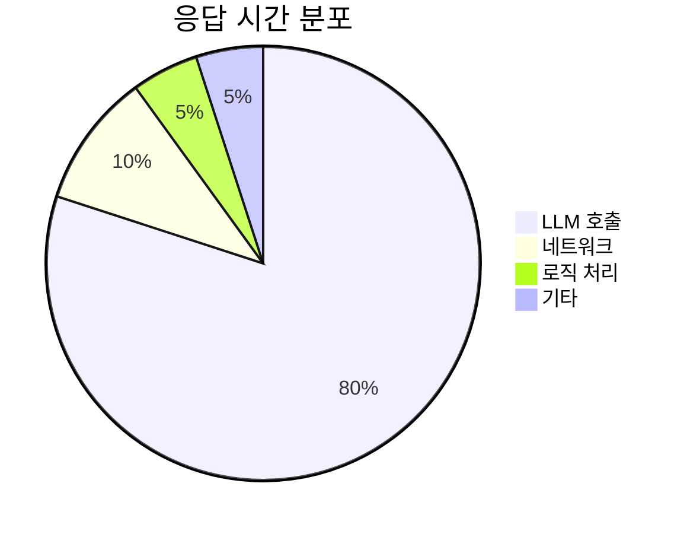
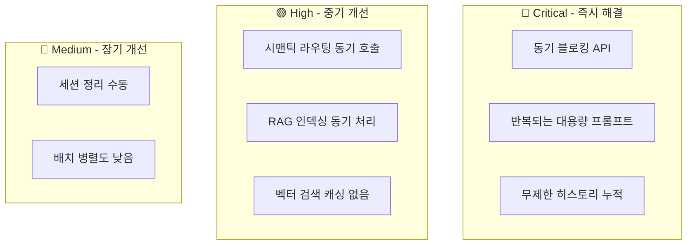
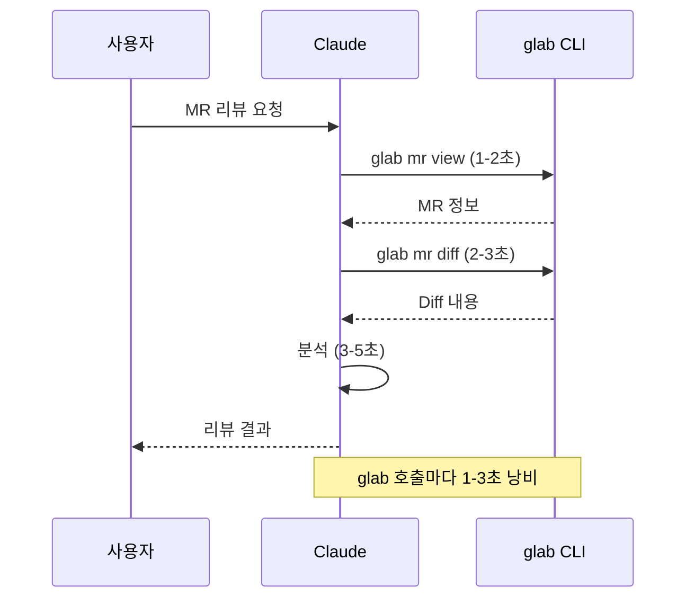
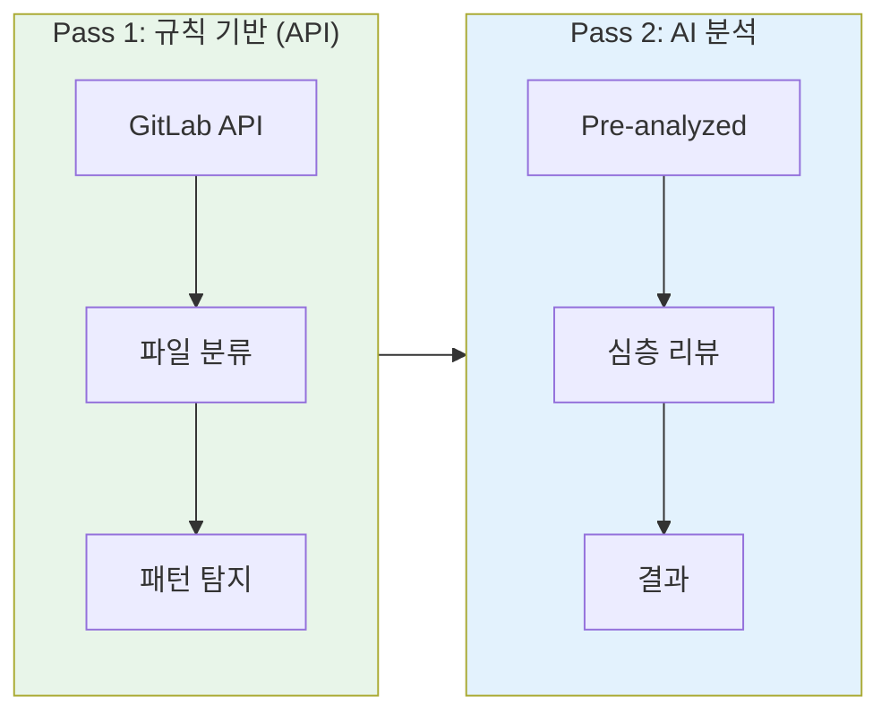
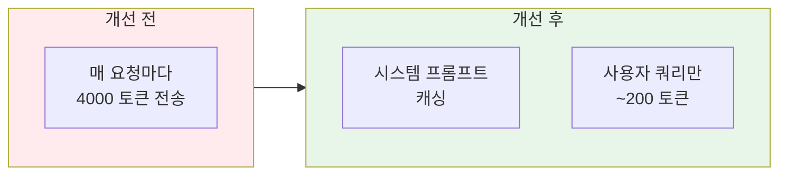
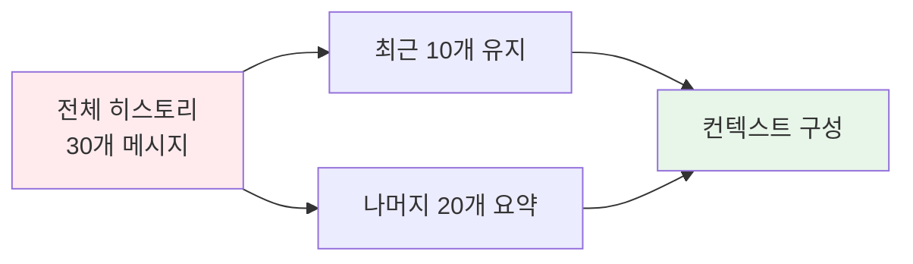
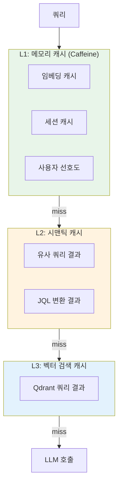
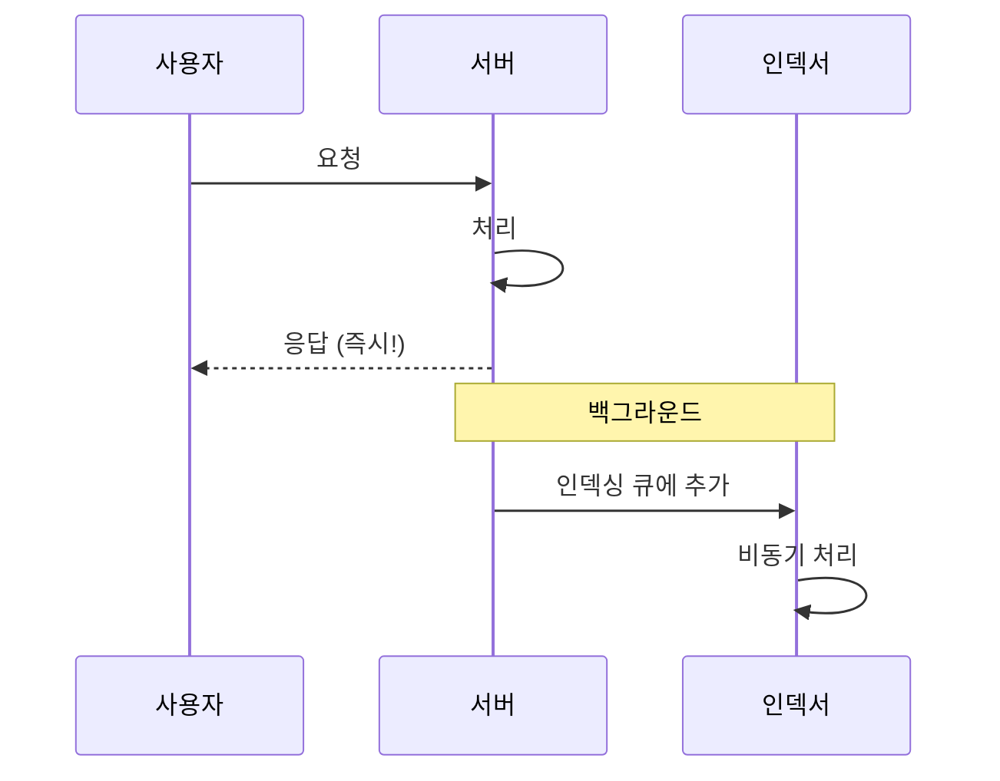
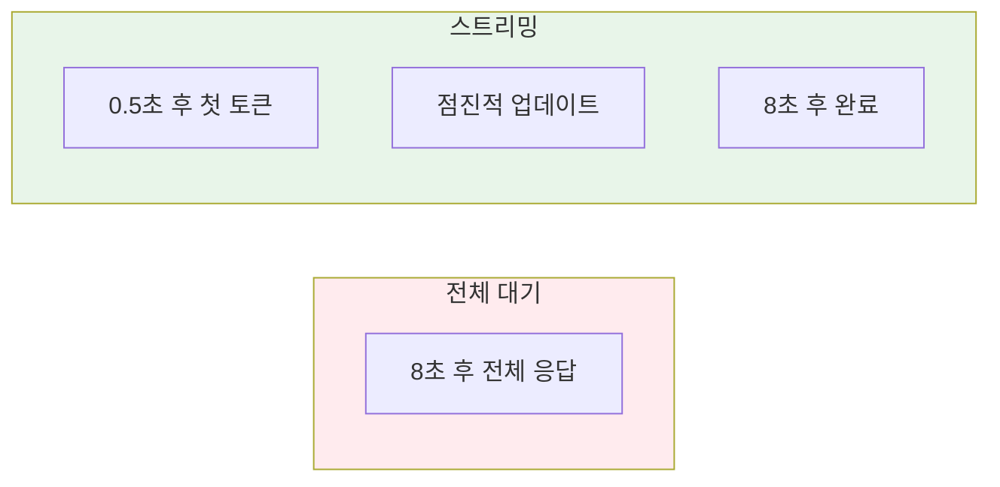

> 이 글은 [Claude Flow](https://github.com/Gyeom/claude-flow) 프로젝트를 개발하면서 정리한 내용이다. 전체 아키텍처는 [개발기](/dev-notes/posts/2025-11-22-claude-flow-development-story/)와 [설계기](/dev-notes/posts/2025-12-28-claude-flow-ai-agent-platform/)에서 확인할 수 있다.
>
> **관련 개념**: [AI Agent 아키텍처의 이해](/dev-notes/posts/2025-10-01-ai-agent-architecture-fundamentals/) - AI 에이전트의 구성 요소와 설계 원칙

## 현황 분석: LLM이 병목이다

AI 에이전트 시스템에서 **LLM 호출이 전체 응답 시간의 80% 이상**을 차지한다. 최적화 대상을 정확히 파악하는 것이 첫 번째 단계다.

> "The first rule of optimization is: don't do it. The second rule is: don't do it yet. And the third rule is: **measure before optimizing**."
> — Michael A. Jackson

### LLM 호출 지점

| 위치 | 기능 | 평균 지연 | 토큰 |
|------|------|----------|------|
| ClaudeExecutor | Claude CLI 실행 | 3-15초 | 2000-8000 |
| JiraAnalysisController | 자연어→JQL 변환 | 5-10초 | 4000 |
| AgentRouter | 시맨틱 라우팅 | 1-2초 | 500 |
| EmbeddingService | 텍스트 임베딩 | 100-500ms | - |

### 병목점 분류

## 최적화 전략 1: Pre-Analysis

### 문제: AI가 CLI를 호출한다

MR 리뷰에서 Claude가 `glab` CLI를 호출하는 것은 비효율적이다. AI가 "MR 정보 조회"라는 단순 작업에 시간을 쓰고 있다.

### 해결: 2-Pass 아키텍처

AI가 할 일과 규칙으로 처리할 일을 분리한다.

> "Do what machines do best. Let humans do what humans do best."
> — 이 원칙을 AI에도 적용한다. 단순 분류는 규칙으로, 심층 분석은 AI로.

### 파일 분류 정확도 향상

GitLab API는 파일 변경 유형을 플래그로 제공한다. AI가 diff를 파싱해서 추론하는 것보다 **API 플래그를 직접 사용**하는 게 정확하다.

| 플래그 | 의미 | 표시 |
|--------|------|------|
| `renamed_file: true` | 파일명 변경 | ✏️ Rename |
| `new_file: true` | 신규 파일 | ➕ Add |
| `deleted_file: true` | 삭제된 파일 | ➖ Delete |
| 그 외 | 내용 수정 | 📝 Modify |

AI가 "이 diff는 파일 삭제인가 이름 변경인가?"를 추론하려면 전체 diff를 읽어야 한다. API 플래그를 쓰면 **0.1초**로 끝난다.

### 효과

| 지표 | 개선 전 | 개선 후 | 효과 |
|------|--------|--------|------|
| glab 호출 횟수 | 2-3회 | 0회 | -100% |
| 응답 시간 | 10-15초 | 5-8초 | -50% |
| 파일 분류 정확도 | 80% | 100% | +20% |

## 최적화 전략 2: 프롬프트 최적화

### 시스템 프롬프트 캐싱

Jira 자연어→JQL 변환에서 800줄(~4000 토큰) 시스템 프롬프트를 매번 전송하는 것은 낭비다.

> Anthropic의 [Prompt Caching](https://docs.anthropic.com/en/docs/build-with-claude/prompt-caching) 기능을 사용하면 동일한 시스템 프롬프트를 캐싱해서 **토큰 비용을 최대 90%** 절감할 수 있다.

### 대화 히스토리 제한

스레드 전체 히스토리를 프롬프트에 포함하면 토큰이 폭발한다.

| 히스토리 | 토큰 수 | 비용 |
|---------|--------|------|
| 30+ 메시지 (전체) | 15,000+ | 💸💸💸 |
| 최근 10개 + 요약 | 3,000 | 💸 |

오래된 대화는 요약해서 압축한다. 대부분의 경우 최근 대화가 더 중요하다.

## 최적화 전략 3: 캐싱 계층

### 3단계 캐싱

### 시맨틱 캐싱의 핵심

동일한 의미의 쿼리는 캐시된 결과를 반환한다.

| 쿼리 | 시맨틱 유사도 | 캐시 |
|------|------------|------|
| "PROJ-123 이슈 분석해줘" | - | 저장 |
| "PROJ-123 분석" | 0.97 | 히트 ✅ |
| "PROJ-456 분석해줘" | 0.65 | 미스 ❌ |

> "The fastest code is the code that doesn't run."
> — 이 원칙이 LLM에도 적용된다. **가장 빠른 LLM 호출은 호출하지 않는 것**이다.

임베딩 유사도 0.95 이상이면 같은 질문으로 간주한다. 벡터 DB(Qdrant)에 쿼리-응답 쌍을 저장하고, 새 쿼리가 들어오면 유사한 쿼리를 먼저 검색한다.

## 최적화 전략 4: 비동기 처리

### RAG 인덱싱 백그라운드 처리

응답 후 동기적으로 인덱싱하면 사용자가 기다린다.

응답을 먼저 보내고, 인덱싱은 백그라운드 큐에서 처리한다. 사용자 체감 응답 시간이 **500ms 단축**된다.

### 스트리밍 우선

전체 응답을 기다리는 대신 스트리밍으로 TTFT(Time To First Token)를 줄인다.

Slack 메시지를 "🤔 생각 중..."으로 먼저 보내고, 스트리밍으로 내용을 업데이트한다. 사용자는 **즉시 피드백**을 받는다.

## 구현 로드맵

| 단계 | 작업 | 예상 효과 |
|------|------|----------|
| **Phase 1** | Pre-analysis API | 응답 시간 -30% |
| **Phase 2** | 시스템 프롬프트 분리 | 토큰 비용 -40% |
| **Phase 3** | 시맨틱 캐싱 | 반복 쿼리 -80% |
| **Phase 4** | 비동기 인덱싱 | 응답 시간 -10% |

## 결론

| 최적화 전략 | 핵심 아이디어 |
|------------|-------------|
| Pre-Analysis | LLM 호출 전에 규칙 기반으로 전처리 |
| 프롬프트 최적화 | 시스템 프롬프트 캐싱, 히스토리 제한 |
| 캐싱 계층 | 시맨틱 캐싱으로 유사 쿼리 재사용 |
| 비동기 처리 | 인덱싱 백그라운드, 스트리밍 우선 |

AI 에이전트 성능 최적화의 핵심은 **LLM을 덜 호출하고, 호출할 때는 효율적으로** 하는 것이다. Pre-analysis와 캐싱으로 불필요한 호출을 줄이고, 스트리밍과 비동기 처리로 체감 속도를 높인다.

> 전체 구현은 [GitHub](https://github.com/Gyeom/claude-flow)에서 확인할 수 있다.

## 참고 자료

- [Latency Optimization in LLM Streaming](https://latitude-blog.ghost.io/blog/latency-optimization-in-llm-streaming-key-techniques/) - Latitude
- [Anthropic Prompt Caching](https://docs.anthropic.com/en/docs/build-with-claude/prompt-caching) - Anthropic
- [Semantic Caching for LLMs](https://www.trychroma.com/blog/semantic-cache) - Chroma

---

> **시리즈**: [Claude Flow 개발기](/dev-notes/posts/2025-11-22-claude-flow-development-story/) | **이전 글**: [Context Enrichment Pipeline](/dev-notes/posts/2025-12-26-context-enrichment-pipeline/)
