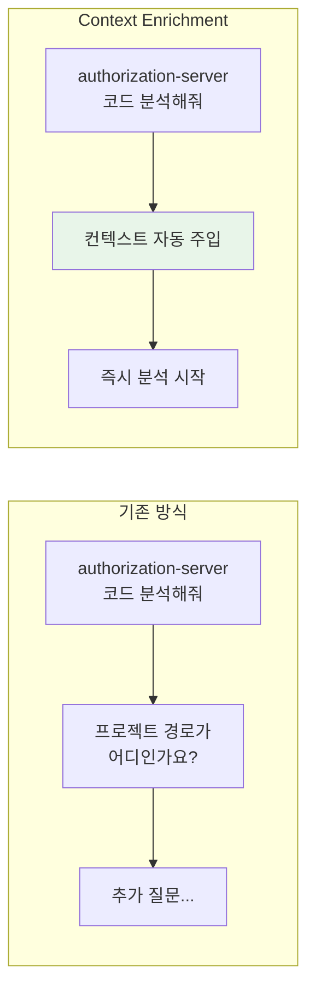
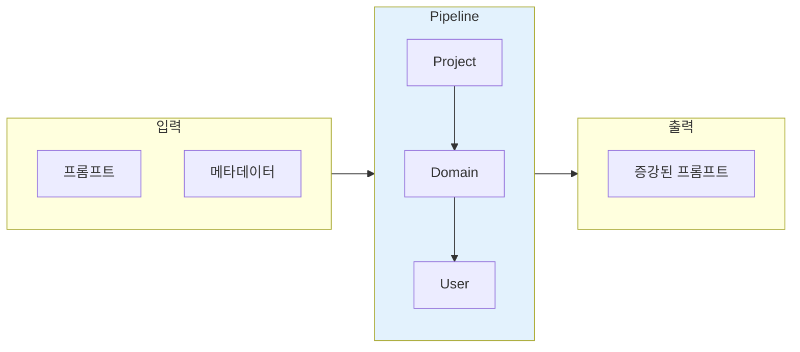
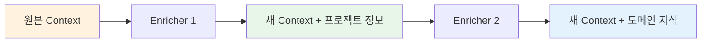
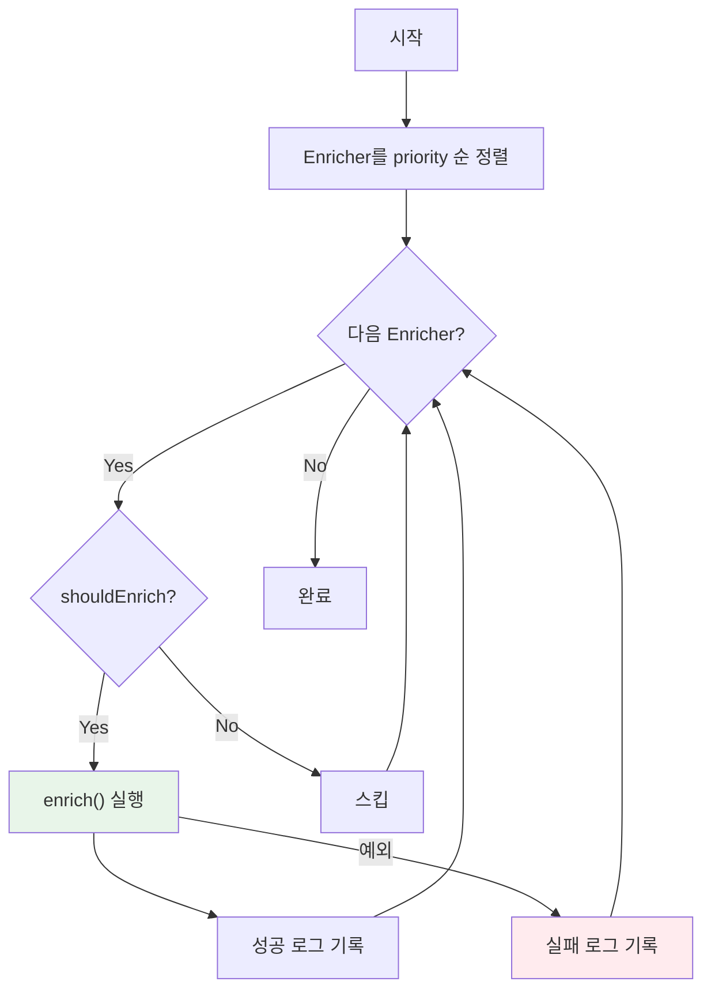
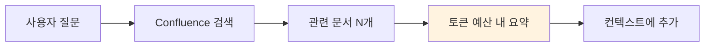
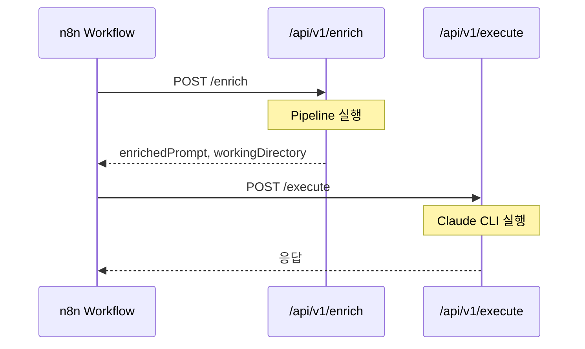

> 이 글은 [Claude Flow](https://github.com/Gyeom/claude-flow) 프로젝트를 개발하면서 정리한 내용이다. 전체 아키텍처는 [개발기](/dev-notes/posts/2025-11-22-claude-flow-development-story/)와 [설계기](/dev-notes/posts/2025-12-28-claude-flow-ai-agent-platform/)에서 확인할 수 있다.
>
> **관련 개념**: [Context Engineering의 이해](/dev-notes/posts/2025-10-10-context-engineering-fundamentals/) - Context Enrichment가 왜 중요한지

## 문제: AI가 맥락을 모른다

AI 에이전트에게 "authorization-server 코드 분석해줘"라고 요청하면, 에이전트는 해당 프로젝트가 어디 있는지, 어떤 기술 스택을 사용하는지 모른다. 매번 프로젝트 경로와 컨텍스트를 직접 입력해야 한다.



이 문제는 단순한 불편함이 아니다. 매번 컨텍스트를 입력하면 **사용자 경험이 떨어지고, 응답 시간이 늘어나고, 토큰이 낭비된다**. AI가 스스로 필요한 정보를 찾아서 프롬프트에 붙여주면 어떨까?

## 해결: Context Enrichment Pipeline

사용자 프롬프트가 Claude에게 전달되기 전에 **자동으로 컨텍스트를 주입**하는 파이프라인을 구축한다.



핵심 아이디어는 간단하다. **"authorization-server"라는 키워드가 보이면**, 프로젝트 경로(`/workspace/authorization-server`), 기술 스택(Kotlin, Spring Security), 관련 문서를 자동으로 찾아서 프롬프트 앞에 붙여준다.

## 설계: Chain of Responsibility 패턴

> "Avoid coupling the sender of a request to its receiver by giving more than one object a chance to handle the request."
> — Gang of Four, Design Patterns

Chain of Responsibility는 요청을 처리할 수 있는 객체들을 체인으로 연결하는 패턴이다. 각 객체는 요청을 처리하거나 다음 객체에게 넘긴다. 이 패턴이 Context Enrichment에 적합한 이유는 다음과 같다.

| 요구사항 | Chain of Responsibility |
|---------|------------------------|
| 여러 컨텍스트 소스 | 각 Enricher가 독립적으로 동작 |
| 순서 제어 | priority로 실행 순서 결정 |
| 실패 격리 | 한 Enricher 실패가 전체를 막지 않음 |
| 확장성 | 새 Enricher 추가가 쉬움 |

### 핵심 인터페이스

`ContextEnricher`는 하나의 컨텍스트 소스를 담당한다. 프로젝트 정보, 도메인 지식, 사용자 규칙 등 각각 별도의 Enricher로 구현한다.

```kotlin
interface ContextEnricher {
    val priority: Int get() = 100  // 낮을수록 먼저 실행

    /** 이 Enricher가 적용되어야 하는지 판단 */
    fun shouldEnrich(context: EnrichmentContext): Boolean

    /** 컨텍스트 주입 (불변 객체 반환) */
    suspend fun enrich(context: EnrichmentContext): EnrichmentContext
}
```

### 불변 객체로 안전성 확보

파이프라인을 통과하면서 컨텍스트가 점점 풍부해진다. 이때 **불변 객체**를 사용하면 각 Enricher가 다른 Enricher의 결과를 실수로 변경할 수 없다.



`EnrichmentContext`는 `data class`의 `copy()` 메서드로 새 객체를 반환한다. Kotlin의 불변 컬렉션과 결합하면 스레드 안전성까지 확보된다.

## 구현: 파이프라인 동작

파이프라인은 모든 Enricher를 priority 순으로 실행한다. 핵심 로직은 단순하다.



실패 격리가 중요하다. 한 Enricher가 예외를 던져도 **다음 Enricher는 계속 실행된다**. 로그만 남기고 넘어간다. 이렇게 하면 Confluence가 다운되어도 프로젝트 컨텍스트는 정상 주입된다.

## Enricher 구현 예시

### ProjectContextEnricher (priority: 10)

프로젝트명을 감지하고 관련 컨텍스트를 주입한다. 두 가지 방식을 조합한다.

| 방식 | 장점 | 단점 |
|-----|------|------|
| RAG 시맨틱 검색 | 유사 이름도 찾음 | 벡터 DB 필요 |
| 패턴 매칭 | 빠름, 정확함 | 정확한 이름만 가능 |

RAG를 우선 시도하고, 못 찾으면 패턴 매칭으로 보완한다. "인증 서버 분석해줘"처럼 정확한 프로젝트명이 아니어도 **시맨틱 검색으로 authorization-server를 찾아낸다**.

### DomainKnowledgeEnricher (priority: 20)

Confluence에서 도메인 지식을 가져온다. 토큰 예산(기본 1500)을 설정해서 너무 많은 정보가 주입되는 것을 방지한다.



> "The key challenge in retrieval augmented generation is not finding relevant documents, but **fitting them into the context window**."
> — [Langchain RAG Tutorial](https://python.langchain.com/docs/tutorials/rag/)

토큰 예산 없이 모든 문서를 다 넣으면 정작 중요한 정보가 묻힌다.

## n8n과의 통합

REST API로 Enrichment를 외부에 공개하면, n8n 워크플로우에서 호출할 수 있다.



이 구조의 장점은 **책임 분리**다.

| 구분 | Kotlin 코드 | n8n 워크플로우 |
|------|------------|---------------|
| 역할 | Enricher 로직 구현 | 워크플로우 조합 |
| 수정 시 | 빌드/배포 필요 | UI에서 즉시 수정 |
| 장점 | 타입 안전성, 성능 | 시각적 디버깅 |

"MR 리뷰 시 GitLab diff를 먼저 가져오자"는 요구사항이 들어왔을 때, 코드를 건드리지 않고 n8n 워크플로우만 수정해서 30분 만에 배포할 수 있었다.

## 확장 가능성

새로운 Enricher는 인터페이스를 구현하고 Bean으로 등록하면 끝이다. 파이프라인이 자동으로 수집한다.

| Enricher | 설명 | priority |
|----------|------|----------|
| GitHistoryEnricher | 최근 변경 파일 컨텍스트 | 15 |
| JiraContextEnricher | 관련 이슈 정보 주입 | 25 |
| TeamGuidelineEnricher | 팀 코딩 가이드라인 | 30 |
| ConversationSummaryEnricher | 이전 대화 요약 | 40 |

## 결론

| 핵심 원칙 | 구현 |
|----------|------|
| Chain of Responsibility | 독립적인 Enricher 체인 |
| 불변 객체 | EnrichmentContext copy() |
| 실패 격리 | try-catch로 개별 처리 |
| 확장성 | 인터페이스 구현 + Bean 등록 |
| API 공개 | n8n 워크플로우에서 호출 가능 |

프롬프트 증강은 AI 에이전트의 품질을 결정하는 핵심 요소다. Chain of Responsibility 패턴으로 구현하면 각 컨텍스트 소스를 독립적으로 관리하면서 유연하게 확장할 수 있다.

> 전체 구현은 [GitHub](https://github.com/Gyeom/claude-flow)에서 확인할 수 있다.

## 참고 자료

- [Chain of Responsibility Pattern](https://refactoring.guru/design-patterns/chain-of-responsibility) - Refactoring Guru
- [Kotlin Data Classes](https://kotlinlang.org/docs/data-classes.html) - Kotlin Official Docs
- [RAG Tutorial](https://python.langchain.com/docs/tutorials/rag/) - Langchain

---

> **시리즈**: [Claude Flow 개발기](/dev-notes/posts/2025-11-22-claude-flow-development-story/) | **이전 글**: [코드 임베딩으로 MR 리뷰 컨텍스트 구축](/dev-notes/posts/2025-11-20-code-embedding-mr-review/) | **다음 글**: [AI 에이전트 성능 최적화](/dev-notes/posts/2025-12-26-ai-agent-performance-optimization/)
