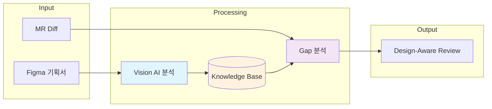
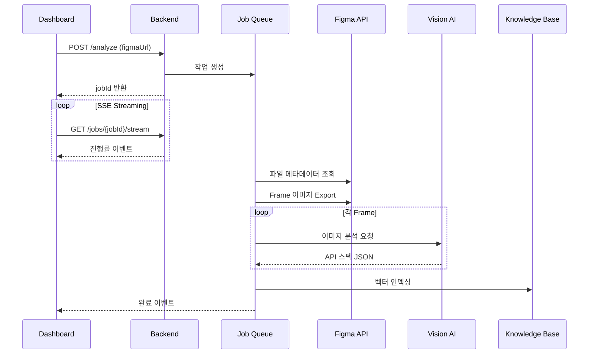
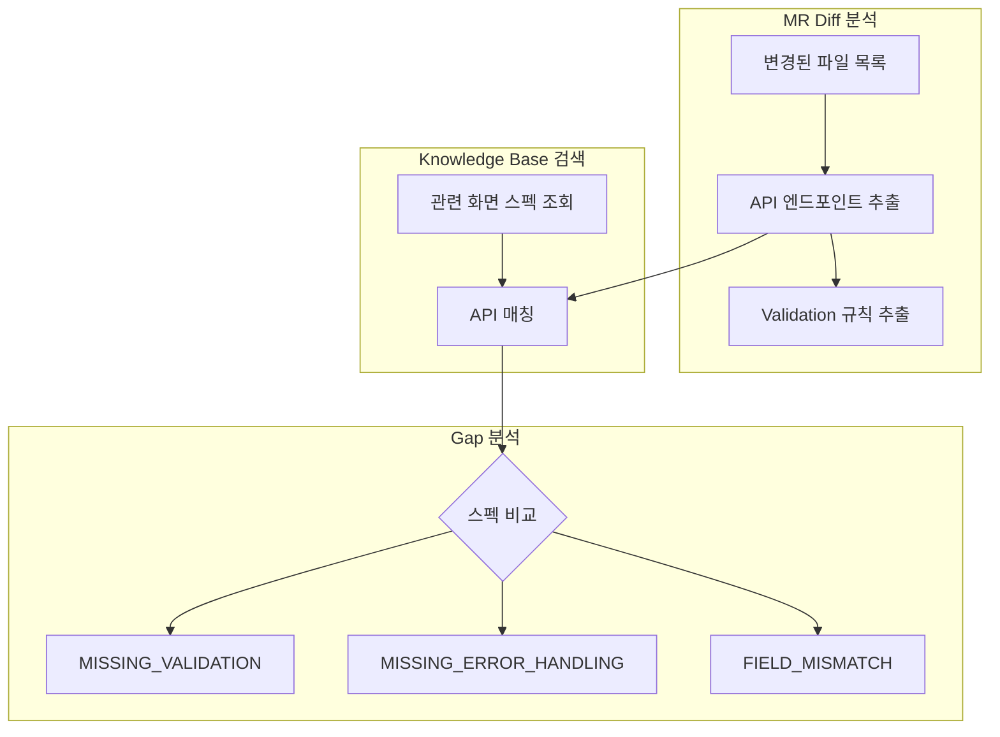

## 문제: 기획서와 구현의 괴리

서버 개발자에게 익숙한 상황이 있다. Figma 기획서를 보고 API를 구현했는데, 리뷰어가 묻는다.

> "이 validation 규칙, 기획서랑 다른 것 같은데요?"

기획서를 다시 열어 확인해보면, 비밀번호가 "8자 이상"이 아니라 "8자 이상 + 특수문자 포함"이었다. 기획서 화면 구석에 작게 적혀 있던 규칙을 놓친 것이다.

이런 문제가 반복되는 이유는 명확하다.

- 기획서는 **이미지(Figma)** 로 존재한다
- 코드 리뷰는 **텍스트(diff)** 로 진행된다
- 둘을 비교하려면 **사람이 수동으로** 대조해야 한다

Vision AI가 이미지를 이해할 수 있다면, 이 과정을 자동화할 수 있지 않을까?

## 해결책: Figma → Vision AI → API Spec → Code Review



1. **Figma API**로 각 화면(Frame) 이미지를 Export
2. **Vision AI**가 이미지를 분석하여 API 스펙 추출
3. 추출된 스펙을 **Knowledge Base**에 벡터 인덱싱
4. MR이 올라오면 변경된 코드와 기획서 스펙을 **자동 매칭**
5. 불일치(Gap) 발견 시 리뷰 코멘트로 알림

## Vision AI 프롬프트 설계

핵심은 Vision AI에게 "서버 개발자 관점"을 주입하는 것이다.

```text
이 Figma 화면을 백엔드 서버 개발자 관점에서 분석해주세요.

## 분석 관점
- 이 화면을 구현하기 위해 필요한 API 엔드포인트
- 각 입력 필드의 Validation 규칙
- 비즈니스 로직 및 제약사항
- 에러 케이스 및 예외 처리

## 출력 형식 (JSON)
{
  "screen_name": "로그인",
  "apis": [
    {
      "method": "POST",
      "path": "/api/v1/auth/login",
      "request_fields": [
        {"name": "email", "validations": ["email_format"]},
        {"name": "password", "validations": ["min:8", "contains_special"]}
      ],
      "errors": [
        {"code": 401, "condition": "잘못된 비밀번호"},
        {"code": 423, "condition": "계정 잠금 (5회 실패)"}
      ]
    }
  ],
  "business_rules": [
    "로그인 실패 5회 시 30분 계정 잠금"
  ]
}
```

프롬프트의 핵심 포인트:

| 요소 | 이유 |
|------|------|
| 역할 지정 | "백엔드 서버 개발자 관점" → 클라이언트 구현이 아닌 API 스펙에 집중 |
| 구조화된 출력 | JSON 형식 → 파싱 용이, Knowledge Base 인덱싱 가능 |
| 에러 케이스 명시 | UI에 보이지 않는 예외 상황도 추론하도록 유도 |

## 아키텍처: 비동기 Job 기반 파이프라인

Figma 파일 하나에 수십 개의 Frame이 있을 수 있다. 동기 처리는 타임아웃 위험이 있으므로, 비동기 Job 기반으로 설계했다.



### 동시성 제어

Vision AI 호출은 비용이 발생하므로, 동시 분석 수를 제한한다.

```kotlin
companion object {
    private const val MAX_CONCURRENT_ANALYSIS = 3
    private const val ANALYSIS_TIMEOUT_SECONDS = 120L
}

// Chunk 단위 병렬 처리
frames.chunked(MAX_CONCURRENT_ANALYSIS).forEach { chunk ->
    val results = chunk.map { (frameId, frameName) ->
        async(Dispatchers.IO) {
            analyzeFrameWithVision(frameId, frameName, imageUrl)
        }
    }.awaitAll()
}
```

### SSE 기반 실시간 진행률

클라이언트는 EventSource로 진행 상황을 실시간 수신한다.

```typescript
// React 클라이언트
const eventSource = new EventSource(`/api/jobs/${jobId}/stream`);

eventSource.onmessage = (event) => {
  const job = JSON.parse(event.data);
  setProgress({
    current: job.progress.analyzedFrames,
    total: job.progress.totalFrames,
    currentFrame: job.progress.currentFrame
  });
};
```

## 도메인 모델: API 스펙 구조화

Vision AI 응답을 파싱하여 구조화된 도메인 모델로 변환한다.

```kotlin
data class ScreenApiSpec(
    val screenName: String,           // "로그인"
    val apis: List<ApiEndpointSpec>,  // API 엔드포인트 목록
    val businessRules: List<String>,  // 비즈니스 규칙
    val validations: List<ValidationRule>,
    val uiStates: List<String>        // [default, loading, error, success]
)

data class ApiEndpointSpec(
    val method: String,               // POST
    val path: String,                 // /api/v1/auth/login
    val requestFields: List<FieldSpec>,
    val responseFields: List<FieldSpec>,
    val errorCases: List<ErrorCase>
)

data class ValidationRule(
    val field: String,                // password
    val rules: List<String>,          // [required, min:8, contains_special]
    val errorMessage: String?
)
```

## Design Gap 분석: MR과 기획서 비교

MR이 올라오면, 변경된 코드와 Knowledge Base의 기획서 스펙을 매칭한다.



Gap 유형을 Enum으로 정의한다.

```kotlin
enum class GapType {
    MISSING_API,              // API 미구현
    MISSING_VALIDATION,       // Validation 누락
    MISSING_BUSINESS_RULE,    // 비즈니스 규칙 미구현
    MISSING_ERROR_HANDLING,   // 에러 처리 누락
    FIELD_MISMATCH,           // 필드 불일치
    TYPE_MISMATCH             // 타입 불일치
}

enum class GapSeverity {
    HIGH,      // 핵심 기능 누락
    MEDIUM,    // 보조 기능 누락
    LOW        // 권장 사항
}
```

## 실제 리뷰 결과 예시

아래는 실제 MR 리뷰에서 발견된 Gap 예시다.

```json
{
  "gaps": [
    {
      "type": "MISSING_VALIDATION",
      "severity": "HIGH",
      "title": "비밀번호 특수문자 검증 누락",
      "description": "기획서에는 '특수문자 포함' 규칙이 있으나, 코드에서 검증하지 않음",
      "codeLocation": "AuthController.kt:45",
      "designRef": "로그인 화면",
      "suggestion": "@Pattern(regexp=\".*[!@#$%^&*].*\") 추가 필요"
    },
    {
      "type": "MISSING_ERROR_HANDLING",
      "severity": "MEDIUM",
      "title": "계정 잠금 에러 코드 누락",
      "description": "5회 실패 시 423 응답이 기획서에 명시되어 있으나 구현되지 않음",
      "codeLocation": "AuthService.kt:78",
      "designRef": "로그인 화면"
    }
  ],
  "summary": {
    "totalGaps": 2,
    "highSeverity": 1,
    "overallScore": 0.85
  }
}
```

## 한계와 개선 방향

### 현재 한계

| 한계 | 원인 | 완화 방법 |
|------|------|----------|
| Vision AI 비용 | Frame당 API 호출 | 캐싱, 변경 감지 시만 재분석 |
| 추론 정확도 | UI만으로 API 추론 | 기획자가 API 스펙 직접 작성하는 규칙 도입 |
| 복잡한 비즈니스 로직 | 이미지에 표현되지 않음 | Figma 코멘트, 별도 스펙 문서 연동 |

### 개선 방향

1. **Figma Plugin 연동**: 기획자가 Frame에 API 스펙을 직접 입력하면 Vision AI 없이 추출 가능
2. **증분 분석**: 마지막 분석 이후 변경된 Frame만 재분석
3. **피드백 루프**: 리뷰어가 Gap을 수정하면 학습 데이터로 활용

## 정리

| 구성요소 | 역할 |
|----------|------|
| Figma API | Frame 이미지 Export |
| Vision AI | 이미지 → API 스펙 추출 |
| Knowledge Base | 스펙 벡터 인덱싱 및 검색 |
| Gap Analyzer | MR diff와 스펙 비교 |
| SSE Streaming | 실시간 진행률 UI |

기획서와 코드의 불일치는 커뮤니케이션 비용을 증가시킨다. Vision AI를 활용하면 이 간극을 자동으로 감지할 수 있다. 완벽하지는 않지만, "기획서 다시 확인해주세요"라는 리뷰 코멘트를 줄이는 데 기여한다.
