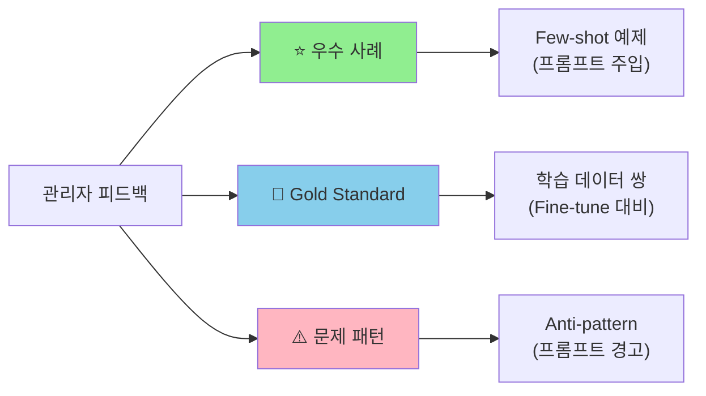
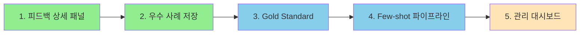

## 관리자 피드백의 가치

일반 사용자의 👍/👎 피드백은 응답률이 높지만 정보량이 적다. 반면 관리자(서비스 운영자)의 피드백은 다르다.

| 구분 | 일반 사용자 | 관리자 |
|------|-------------|--------|
| 피드백 빈도 | 높음 (자동 수집) | 낮음 (의도적 평가) |
| 데이터 품질 | Binary 수준 | 다차원 + 코멘트 |
| 활용 가치 | 라우팅 점수 조정 | 직접 학습 데이터 |

Claude Flow에서는 관리자가 **"이렇게 답했어야 해"**를 직접 작성할 수 있다. 이 Gold Standard 응답이 가장 강력한 학습 데이터가 된다.

## 피드백 UI 설계

### 기본 레이아웃

```text
┌─────────────────────────────────────────────────────────┐
│ [👍] [👎]  빠른 분류                                    │
├─────────────────────────────────────────────────────────┤
│ 품질 평가 (0-4)                                         │
│ 정확성     ○ ○ ● ○ ○    3/4                            │
│ 유용성     ○ ○ ○ ● ○    4/4                            │
│ 적절한길이  ○ ● ○ ○ ○    2/4  (너무 장황)              │
├─────────────────────────────────────────────────────────┤
│ 이슈 태그 (다중 선택)                                    │
│ [사실오류] [장황함] [핵심벗어남] [실행불가] [맥락무시]   │
├─────────────────────────────────────────────────────────┤
│ 관리자 코멘트                                           │
│ ┌─────────────────────────────────────────────────────┐ │
│ │ MR 리뷰 시 보안 이슈는 잘 짚었으나,                  │ │
│ │ 스타일 지적이 너무 많음. 핵심만 3개 이내로.          │ │
│ └─────────────────────────────────────────────────────┘ │
├─────────────────────────────────────────────────────────┤
│ ⭐ 우수 사례로 저장 (Few-shot 예제용)                   │
│ ✏️ 이상적 응답 직접 작성 (Gold Standard)                │
└─────────────────────────────────────────────────────────┘
```

### 기능별 활용

| 기능 | 용도 | 활용 |
|------|------|------|
| 👍/👎 | 빠른 트리아지 | 라우팅 점수 조정 |
| 다차원 점수 | 세부 품질 분석 | 에이전트별 약점 파악 |
| 이슈 태그 | 문제 유형 분류 | Anti-pattern 프롬프트 생성 |
| 코멘트 | 구체적 개선 지시 | 프롬프트 최적화 힌트 |
| 우수 사례 마킹 | Few-shot 예제 | 동적 프롬프트 주입 |
| Gold Standard | Ground Truth | 직접 학습 데이터 생성 |

## Gold Standard 응답 작성

가장 임팩트 있는 기능이다. 관리자가 "올바른 응답"을 직접 작성하면, 원본 질문과 함께 학습 데이터 쌍이 된다.

### 예시

```text
원본 질문: "이 MR의 보안 이슈를 리뷰해줘"

AI 응답 (👎):
  "코드 스타일이 일관되지 않습니다..."

───────────────────────────────────────

관리자가 작성한 이상적 응답:
  "## 🔒 보안 이슈 발견
   1. SQL Injection 위험: line 42에서 raw query 사용
   2. 권한 검증 누락: admin 엔드포인트에 인증 없음

   ## 권장 수정
   - PreparedStatement 사용
   - @PreAuthorize 어노테이션 추가"
```

이 쌍이 저장되면 유사 질문에 Few-shot 예제로 주입된다.

## 학습 파이프라인



### 각 경로의 역할

**우수 사례 → Few-shot 예제**
- 관리자가 ⭐ 마킹한 응답을 프롬프트에 동적 주입
- "이런 식으로 답변해" 예시로 활용

**Gold Standard → 학습 데이터**
- (질문, 잘못된 응답, 올바른 응답) 트리플 저장
- 추후 Fine-tuning이나 RLHF에 활용

**문제 패턴 → Anti-pattern**
- 반복되는 이슈 태그 분석
- "이렇게 답하지 마" 경고 프롬프트 생성

## 데이터 스키마

```kotlin
data class AdminFeedback(
    val id: String,
    val executionId: String,
    val adminId: String,

    // 기본 분류
    val quickRating: Rating,  // POSITIVE, NEGATIVE

    // 다차원 평가 (0-4)
    val correctness: Int,
    val helpfulness: Int,
    val verbosity: Int,

    // 이슈 태그
    val issues: List<FeedbackIssue>,

    // 관리자 코멘트
    val comment: String?,

    // 학습용 플래그
    val isExemplary: Boolean = false,
    val goldResponse: String? = null,

    val createdAt: Instant
)

enum class FeedbackIssue {
    INCORRECT,      // 사실 오류
    TOO_VERBOSE,    // 너무 장황
    OFF_TOPIC,      // 핵심 벗어남
    NOT_ACTIONABLE, // 실행 불가
    CONTEXT_IGNORED // 맥락 무시
}
```

## 대시보드 UI

### 피드백 관리 페이지

```text
┌────────────────────────────────────────────────────────────┐
│  📊 피드백 관리                                            │
├────────────────────────────────────────────────────────────┤
│  필터: [모두 ▼] [MR리뷰 ▼] [👎만 ▼] [미평가 ▼]           │
│                                                            │
│  ┌──────────────────────────────────────────────────────┐ │
│  │ 📅 2024-01-15 14:23                                  │ │
│  │ 🤖 code-reviewer                                     │ │
│  │ Q: MR !142 리뷰해줘                                  │ │
│  │ A: "코드 스타일이 일관되지 않습니다..."             │ │
│  │                                                      │ │
│  │ [👍] [👎]  정확성: ●●○○○  유용성: ●●●○○           │ │
│  │ [미평가] ← 클릭하여 상세 피드백                     │ │
│  └──────────────────────────────────────────────────────┘ │
│                                                            │
│  ┌──────────────────────────────────────────────────────┐ │
│  │ 📅 2024-01-15 13:45                     ⭐ 우수사례  │ │
│  │ 🤖 code-reviewer                                     │ │
│  │ Q: 이 함수의 보안 취약점 찾아줘                      │ │
│  │ A: "SQL Injection 위험이 있습니다..."               │ │
│  │                                                      │ │
│  │ [👍✓] [👎]  정확성: ●●●●○  유용성: ●●●●●          │ │
│  │ [평가완료] 코멘트: "보안 이슈 정확히 파악"          │ │
│  └──────────────────────────────────────────────────────┘ │
└────────────────────────────────────────────────────────────┘
```

## 구현 우선순위



| 단계 | 작업 | 효과 | 노력 |
|------|------|------|------|
| 1 | 피드백 상세 패널 UI | 높음 | 중간 |
| 2 | 우수 사례 저장 기능 | 높음 | 낮음 |
| 3 | Gold Standard 작성 기능 | 매우 높음 | 중간 |
| 4 | Few-shot 주입 파이프라인 | 매우 높음 | 높음 |
| 5 | 피드백 관리 대시보드 | 중간 | 중간 |

1-2단계만 구현해도 프롬프트 개선에 즉시 활용할 수 있다. 3-4단계가 완성되면 시스템이 스스로 개선되는 선순환이 시작된다.

## 정리

Claude Flow 관리자 피드백 시스템의 핵심은 두 가지다.

1. **Gold Standard 응답 작성** - "이렇게 답했어야 해"를 직접 작성하면 최고의 학습 데이터가 된다
2. **우수 사례 마킹** - 클릭 한 번으로 Few-shot 예제 풀을 구축한다

일반 사용자 피드백(👍/👎)은 양으로 승부하고, 관리자 피드백은 질로 승부한다. 두 시스템을 병행하면 빠른 피드백 수집과 고품질 학습 데이터 생성을 동시에 달성할 수 있다.
