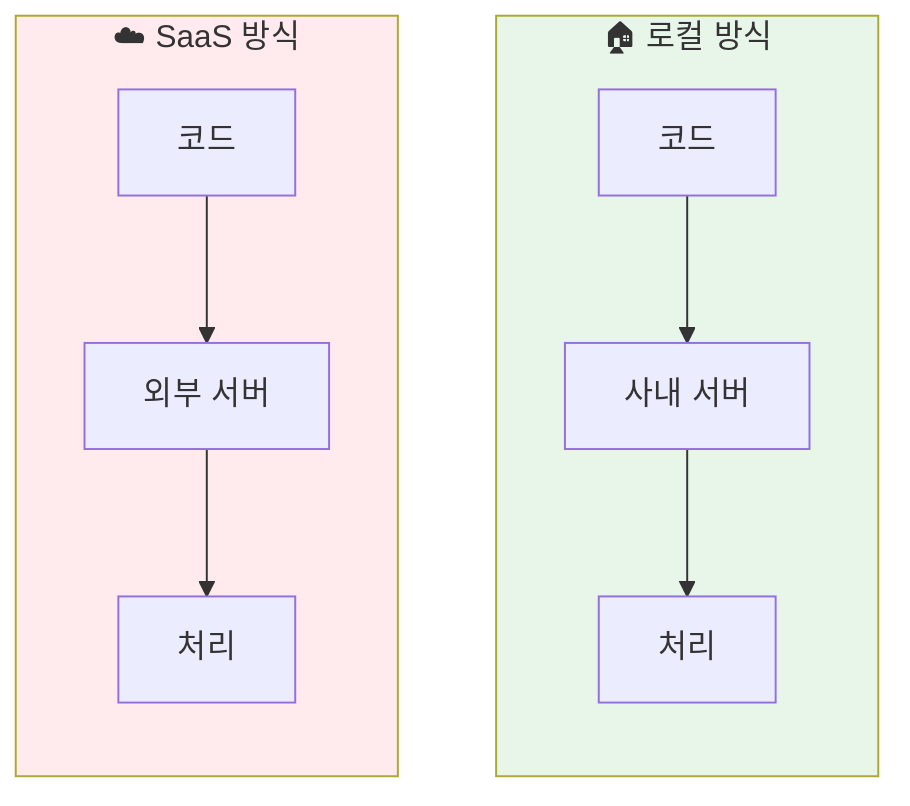
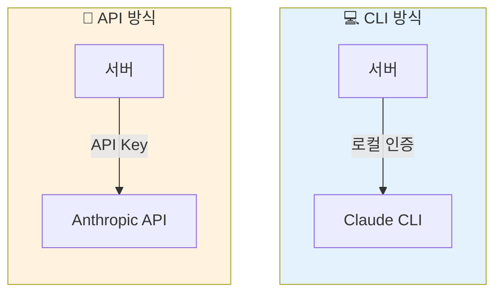
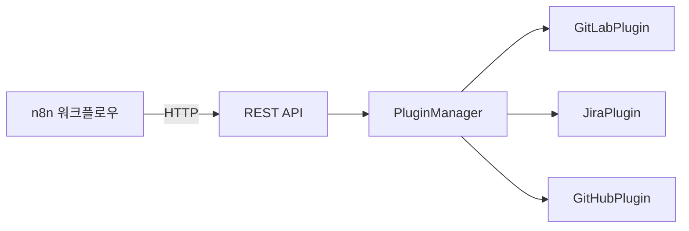
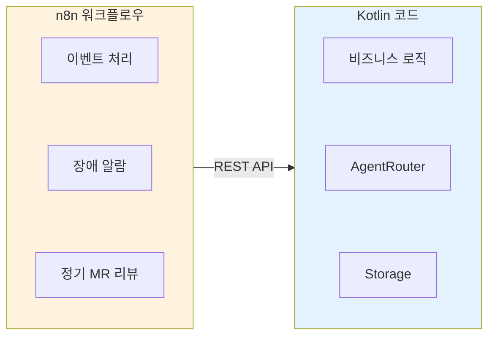
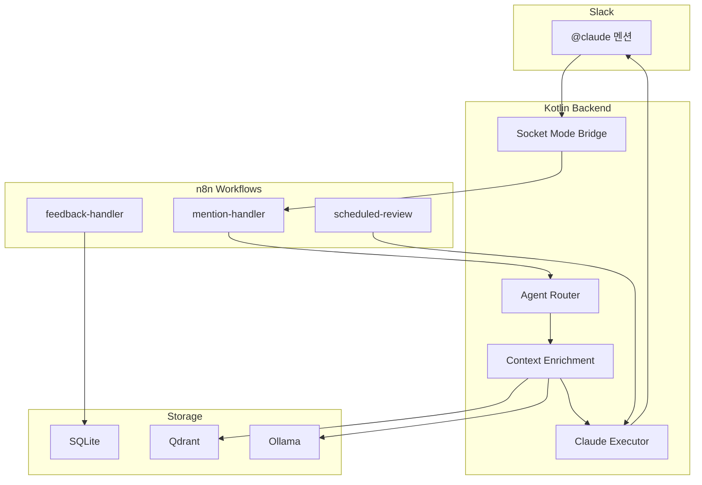
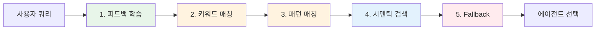
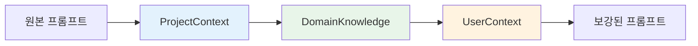
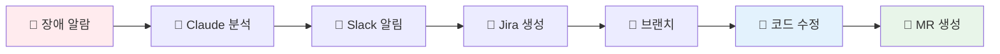
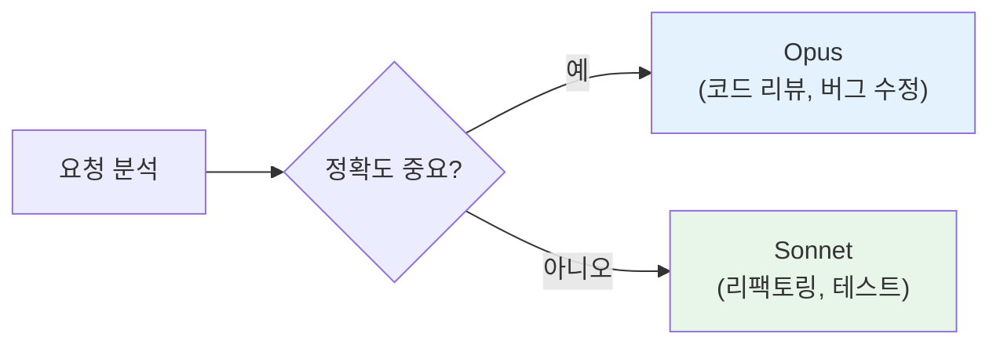
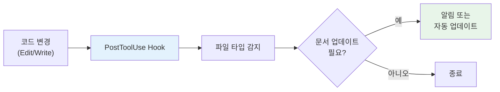

## 개요

**Claude Flow**는 팀 생산성 향상을 위한 AI 에이전트 오케스트레이션 플랫폼이다. Slack에서 `@claude`로 자연어 명령을 내리면, 적절한 에이전트를 선택하고 컨텍스트를 보강한 뒤 Claude를 실행하는 엔드투엔드 파이프라인을 구현했다.

### 설계 원칙: 원커맨드 시작

```
./start.sh → 모든 서비스 구동 → 설정 자동 로드 → 즉시 사용 가능
```

| 원칙 | 설명 |
|------|------|
| **단일 진입점** | `./start.sh` 하나로 인프라 + 앱 전체 시작 |
| **설정 자동 로드** | `.env`, `projects.json`, `application.yml` 자동 반영 |
| **재시작 시 최신화** | 워크플로우, 프로젝트 설정 재시작 시 자동 동기화 |
| **실패 시 명확한 피드백** | 누락된 설정, 포트 충돌 즉시 알림 |

### 핵심 기능

| 기능 | 설명 |
|------|------|
| **Slack 통합** | Socket Mode 기반 실시간 이벤트 처리 |
| **자동 코드 리뷰** | GitLab MR을 RAG로 분석 후 Claude Opus로 리뷰 |
| **Jira 연동** | 자연어 → JQL 변환, 이슈 자동 분류 |
| **워크플로 자동화** | n8n 기반 이벤트 오케스트레이션 |

### 기술 스택

```
Backend:   Kotlin 2.1, Spring Boot 3.4, Coroutines
AI/ML:     Claude CLI, Qdrant (Vector DB), Ollama (Embedding)
Frontend:  React, Vite, Recharts
Infra:     Docker Compose, n8n
Storage:   SQLite (WAL mode)
```

---

## 왜 만들었는가

### 문제 인식

팀에서 AI를 활용한 코드 리뷰, 버그 분석, 문서 작성 요청이 늘어났다. 하지만 기존 방식에는 한계가 있었다.

| 기존 방식 | 문제점 |
|----------|--------|
| ChatGPT/Claude 웹 | 코드 복사-붙여넣기 반복, 컨텍스트 유실 |
| GitHub Copilot | 코드 작성에는 좋지만 리뷰/분석에는 부족 |
| 각자 API 호출 | 프롬프트 품질 편차, 비용 관리 어려움 |

### 목표

1. **Slack에서 바로 사용**: 별도 도구 없이 `@claude`로 즉시 호출
2. **팀 지식 축적**: 좋은 프롬프트와 피드백을 학습해 점점 똑똑해지는 시스템
3. **비용 투명성**: 누가 얼마나 사용하는지 추적
4. **보안**: 회사 코드가 외부로 유출되지 않음

---

## 설계 결정의 배경

### 1. 왜 로컬 아키텍처인가?

**SaaS가 아닌 로컬 배포를 선택한 이유**:



| 고려 사항 | SaaS | 로컬 |
|----------|------|------|
| 코드 보안 | 외부 전송 필요 | 사내 네트워크 내 유지 |
| 네트워크 지연 | 인터넷 왕복 | 최소 지연 |
| 커스터마이징 | 제한적 | 완전한 제어 |
| 운영 비용 | 구독료 | 인프라 비용만 |

회사 코드를 외부로 보내지 않고, 사내 네트워크에서 모든 처리를 완료하는 것이 핵심이었다.

### 2. 왜 Claude CLI인가? (API가 아닌)

**Claude API 대신 CLI를 래핑한 이유**:



| 기능 | API | CLI |
|------|-----|-----|
| 인증 | 서버가 API 키 관리 | 사용자 로컬 인증 활용 |
| 세션 지속 | 직접 구현 필요 | `--resume` 플래그 지원 |
| 토큰 비용 | 매번 전체 컨텍스트 | 세션으로 30-40% 절감 |
| 스트리밍 | 별도 구현 | `stream-json` 기본 지원 |

**핵심 이점: 세션 지속**

```bash
# 첫 요청: 새 세션 생성
claude -p "이 코드 분석해줘"  # → sessionId: abc123

# 후속 요청: 세션 재사용 (컨텍스트 유지, 토큰 절감)
claude --resume abc123 "그럼 리팩토링 방향은?"
```

동일 Slack 스레드 내 대화에서 세션을 재사용하면 토큰 사용량이 30-40% 감소한다.

### 3. 왜 MCP가 아닌 플러그인 시스템인가?

**MCP(Model Context Protocol) 대신 커스텀 플러그인을 선택한 이유**:

Claude Code가 제공하는 MCP는 강력하지만, 이 프로젝트의 요구사항과 맞지 않았다.

| 요구사항 | MCP | 커스텀 플러그인 |
|----------|-----|----------------|
| n8n 워크플로우 통합 | 제한적 | REST API로 자연스럽게 연동 |
| 동적 로딩/언로딩 | 설정 기반 | 런타임에 활성화/비활성화 |
| 버전 관리 | Claude 버전에 의존 | 독립적 업데이트 |
| 커스텀 로직 | 제한적 | 완전한 제어 |

**플러그인 아키텍처**:

```kotlin
interface Plugin {
    val id: String
    val commands: List<PluginCommand>

    suspend fun execute(command: String, args: Map<String, Any>): PluginResult
    fun shouldHandle(message: String): Boolean
}
```

**n8n과의 통합이 핵심**:



MCP를 사용했다면 Claude CLI 프로세스 내에서만 동작하지만, REST API 기반 플러그인은 n8n에서 직접 호출할 수 있다. 이는 "코드 변경 없이 워크플로우 수정"이라는 핵심 원칙과 일치한다.

### 4. 왜 n8n인가?

**코드 대신 n8n 워크플로우로 자동화를 구현한 이유**:

| 구현 방식 | 수정 시 | 디버깅 | 확장 |
|----------|--------|--------|------|
| Kotlin 코드 | 빌드/배포 필요 | 로그 분석 | 개발자만 가능 |
| n8n 워크플로우 | 즉시 반영 | 시각적 실행 이력 | 누구나 가능 |



**예시: 장애 알람 → MR 자동 생성**

이 파이프라인을 코드로 구현했다면 수십 개의 클래스가 필요했을 것이다. n8n 워크플로우로 구현하니 UI에서 흐름을 한눈에 파악하고, 단계별 입출력을 즉시 확인할 수 있다.

---

## 시스템 아키텍처



### 설계 결정

**Claude CLI (API 아님)를 선택한 이유**:
- API 키 관리 불필요 (로컬 인증 활용)
- `--resume` 플래그로 세션 지속 (30-40% 토큰 절감)
- 스트리밍 출력 지원 (`stream-json` 포맷)

**Kotlin + n8n 하이브리드**:
- Kotlin: 타입 안전성, 코루틴 기반 비동기 처리
- n8n: 시각적 워크플로 편집, 즉시 배포 (빌드 없이 변경 반영)

---

## 지능형 에이전트 라우팅

5단계 파이프라인으로 최적의 에이전트를 선택한다.



| 단계 | 신뢰도 | 설명 |
|------|--------|------|
| 피드백 학습 | 0.9 | 과거 긍정 피드백 기반 추천 |
| 키워드 매칭 | 0.95 | 직접 키워드 룩업 (가장 빠름) |
| 패턴 매칭 | 0.85 | 정규식 기반 (`mr|pr|#\d+`) |
| 시맨틱 검색 | 0.8 | 벡터 유사도 기반 |
| Fallback | 0.5 | General 에이전트 |

### 피드백 학습 서비스

사용자 만족도(👍/👎)를 학습해 라우팅 정확도를 개선한다.

```kotlin
class FeedbackLearningService {
    fun recommendAgentFromSimilar(
        query: String,
        userId: String,
        topK: Int = 5
    ): AgentRecommendation? {
        // 1. 유사 쿼리 벡터 검색 (similarity ≥ 0.7)
        val similar = vectorService.findSimilar(query, topK)

        // 2. 긍정/부정 피드백 집계
        val agentSuccess = similar.groupBy { it.agentId }
            .mapValues { (_, items) ->
                items.count { it.positive } / items.size.toFloat()
            }

        // 3. 성공률 기반 추천
        return agentSuccess.maxByOrNull { it.value }
    }
}
```

---

## RAG 기반 컨텍스트 보강

Chain of Responsibility 패턴으로 프롬프트를 동적으로 보강한다.



### Enricher 파이프라인

```kotlin
class ContextEnrichmentPipeline(
    private val enrichers: List<ContextEnricher>
) {
    private val sorted = enrichers.sortedBy { it.priority }

    suspend fun enrich(ctx: EnrichmentContext): EnrichmentContext {
        return sorted.fold(ctx) { current, enricher ->
            if (enricher.shouldEnrich(current)) {
                enricher.enrich(current)
            } else current
        }
    }
}
```

### 주입되는 컨텍스트

**프로젝트 컨텍스트**:
```
Available projects: [my-org/auth-server, my-org/data-pipeline]
Tech stack: Kotlin, Spring Boot, PostgreSQL
Team conventions: Google Java Style
```

**도메인 지식** (RAG):
```
Similar questions in codebase:
1. "How to add logging?" (similarity: 0.92)
   → Related: LoggingUtil.kt, SLF4J config
```

**사용자 컨텍스트**:
```
User preferences:
- Max turns: 10 (cost control)
- Allowed tools: [bash, read]
```

---

## 임베딩 서비스

Ollama 기반 로컬 임베딩으로 외부 API 의존성을 제거했다.

### 배치 처리 with Fallback

```kotlin
suspend fun embedBatchNative(
    texts: List<String>,
    batchSize: Int = 16  // M2 Pro 최적화
): List<FloatArray?> {
    return texts.chunked(batchSize).flatMap { batch ->
        try {
            requestBatchEmbedding(batch)
        } catch (e: Exception) {
            // Fallback: 배치 크기 절반으로 재시도
            batch.chunked(batchSize / 2).flatMap {
                requestBatchEmbedding(it)
            }
        }
    }
}
```

### 모델 선택

| 모델 | 차원 | 용도 |
|------|------|------|
| qwen3-embedding:0.6b | 1024 | 기본 (MTEB 1위) |
| nomic-embed-text | 768 | 경량 |
| bge-m3 | 1024 | 다국어 |

---

## 실시간 분석

### 대시보드 메트릭

```kotlin
data class DashboardStats(
    val totalExecutions: Int,
    val successRate: Double,
    val avgDurationMs: Long,
    val thumbsUp: Int,
    val thumbsDown: Int,
    val totalTokens: Long,
    val topUsers: List<UserStat>,
    val topAgents: List<AgentStat>,
    val hourlyTrend: List<HourlyTrend>,
    val satisfactionScore: Double
)
```

### Percentile 추적

```kotlin
fun getPercentiles(days: Int): PercentileStats {
    val durations = repo.getAllDurations(days).sorted()
    return PercentileStats(
        p50 = durations.percentile(50),
        p90 = durations.percentile(90),
        p95 = durations.percentile(95),
        p99 = durations.percentile(99)
    )
}
```

---

## 보안 설계

### 프로세스 격리

```kotlin
// ❌ 취약: 쉘 인젝션 가능
Runtime.exec("claude " + userInput)

// ✅ 안전: ProcessBuilder (쉘 메타문자 무효화)
ProcessBuilder(listOf("claude") + args)
```

### 경로 탈출 방지

```kotlin
fun validateWorkingDirectory(path: String): Pair<File?, String?> {
    val canonical = File(path).canonicalFile
    val baseWorkspace = getBaseWorkspacePath()

    // 경계 검사
    if (!canonical.startsWith(baseWorkspace)) {
        return null to "Path escape attempt detected"
    }
    return canonical to null
}
```

### 환경 변수 필터링

```kotlin
private val ALLOWED_ENV_VARS = setOf(
    "PATH", "HOME", "CLAUDE_API_KEY", "USER", "LANG"
)

fun getFilteredEnvironment() = System.getenv()
    .filterKeys { it in ALLOWED_ENV_VARS }
```

---

## 멀티모델 전략

용도에 따라 모델을 선택해 비용과 품질을 최적화한다.

| 에이전트 | 모델 | 이유 |
|----------|------|------|
| Code Reviewer | claude-opus-4 | 정밀한 분석 필요 |
| Bug Fixer | claude-opus-4 | 근본 원인 추적 |
| Refactoring | claude-sonnet-4 | 비용 대비 충분 |
| General | claude-sonnet-4 | 범용 대화 |

---

## 세션 관리

`--resume` 플래그로 대화 맥락을 유지해 토큰을 절감한다.

```kotlin
private val sessionCache = ConcurrentHashMap<String, SessionInfo>()

fun getOrCreateSession(userId: String, threadTs: String): String {
    val key = "$userId:$threadTs"
    return sessionCache.getOrPut(key) {
        SessionInfo(
            sessionId = UUID.randomUUID().toString(),
            createdAt = Instant.now(),
            ttl = Duration.ofMinutes(30)
        )
    }.sessionId
}
```

**효과**: 동일 스레드 내 후속 질문에서 30-40% 토큰 절감

---

## n8n 워크플로

### 주요 워크플로

| 워크플로 | 트리거 | 동작 |
|----------|--------|------|
| slack-mention-handler | @claude 멘션 | 라우팅 → 실행 → 응답 |
| slack-feedback-handler | 👍/👎 리액션 | 피드백 기록 → 학습 |
| scheduled-mr-review | 5분 간격 | 오픈 MR 자동 리뷰 |

### 하이브리드 아키텍처 장점

```
Kotlin (비즈니스 로직)     n8n (오케스트레이션)
├─ 타입 안전성            ├─ 시각적 편집
├─ 성능 최적화            ├─ 즉시 배포
└─ 복잡한 로직            └─ 실행 이력
         ↓                        ↓
    REST API로 연결 (느슨한 결합)
```

---

## 장애 알람 자동화 파이프라인

장애 알람을 감지하면 분석부터 MR 생성까지 자동으로 처리한다.



### n8n 워크플로우

| 워크플로우 | 트리거 | 동작 |
|----------|--------|------|
| `alert-channel-monitor` | Slack 장애 채널 메시지 | Claude가 알람 분석, 액션 버튼 전송 |
| `alert-to-mr-pipeline` | 리액션/버튼 클릭 | Jira→브랜치→코드 수정→MR 생성 |

이 파이프라인은 n8n 워크플로우로 구현되어, 코드 수정 없이 UI에서 흐름을 조정할 수 있다.

---

## 플러그인 시스템

### 인터페이스

```kotlin
interface Plugin {
    val id: String
    val commands: List<PluginCommand>

    suspend fun execute(
        command: String,
        args: Map<String, Any>
    ): PluginResult

    fun shouldHandle(message: String): Boolean
}
```

### 통합 플러그인

- **GitLab**: MR 리뷰, 코드 인덱싱
- **Jira**: 이슈 생성, JQL 변환
- **GitHub**: PR 분석

---

## 서브에이전트 시스템

복합 작업 처리를 위한 전문화된 서브에이전트 구조다.

### 에이전트 구성

| 에이전트 | 역할 | 모델 | 사용 시점 |
|---------|------|------|----------|
| `code-reviewer` | 코드 리뷰, MR 분석 | **Opus** | MR 리뷰, 코드 검토 |
| `bug-fixer` | 버그 분석 및 수정 | **Opus** | 에러, 버그, 수정 요청 |
| `refactor` | 코드 리팩토링 | Sonnet | 개선, 정리, 클린업 |
| `security-reviewer` | 보안 취약점 검토 | Sonnet | 보안 검토, OWASP |
| `test-writer` | 테스트 코드 작성 | Sonnet | 테스트 추가 |

### 모델 선택 기준



- **Opus**: 정밀한 분석이 필요한 작업 (코드 리뷰, 버그 수정)
- **Sonnet**: 비용 대비 충분한 품질의 작업 (리팩토링, 테스트)

### 복합 작업 처리 흐름

```
사용자: "버그 수정하고 리뷰해줘"

1. Task tool로 bug-fixer 호출
2. 수정 결과를 code-reviewer에 전달
3. 통합 결과 응답
```

에이전트 정의는 `.claude/agents/` 디렉토리에 위치한다.

---

## 배운 점

### 1. CLI Wrapping의 장단점

**장점**:
- 인증 위임 (사용자 로컬 설정 활용)
- 세션 지속으로 토큰 절감
- 스트리밍 출력 자연스럽게 지원

**단점**:
- 서버 배포 시 인증 관리 필요
- 프로세스 오버헤드

### 2. RAG 시스템 운영

- 임베딩 배치 크기는 하드웨어에 맞게 튜닝 (M2 Pro: 16)
- Fallback 체인으로 부분 실패 방지
- 캐시 레이어로 중복 임베딩 방지

### 3. 피드백 루프의 중요성

사용자 피드백(👍/👎)을 라우팅에 반영하니 시간이 지날수록 정확도가 향상됐다. 단순한 규칙 기반보다 학습 기반이 장기적으로 효과적이다.

---

## 문서 자동화 시스템

코드 변경 시 문서가 자동으로 동기화된다.



### 자동 감지 패턴

| 파일 패턴 | 업데이트 대상 |
|-----------|---------------|
| `*/storage/repository/*.kt` | CLAUDE.md, ARCHITECTURE.md |
| `*/plugin/*.kt` | CLAUDE.md, 클래스 다이어그램 |
| `*/rest/*Controller.kt` | README.md API 테이블 |
| `build.gradle.kts` | 기술 스택 |

### Hook 기반 동작

1. **PostToolUse Hook**: 파일 편집 후 `doc-sync.sh` 실행
2. **파일 타입 감지**: 경로 패턴으로 Repository/Plugin/Controller 분류
3. **문서 확인**: 해당 클래스가 문서에 있는지 확인
4. **알림**: 누락 시 터미널에 업데이트 필요 알림

---

## REST API 개요

주요 API 엔드포인트 카테고리다. 전체 목록은 README 참조.

| 카테고리 | 설명 | 주요 엔드포인트 |
|----------|------|----------------|
| **Execute** | Claude 실행 | `/api/v1/execute`, `/api/v1/chat/stream` |
| **Projects** | 프로젝트 관리 | `/api/v1/projects`, `/api/v1/projects/{id}/agents` |
| **Agents** | 에이전트 관리 | `/api/v2/agents`, `/api/v2/agents/{id}` |
| **Analytics** | 통계/분석 | `/api/v1/analytics/dashboard`, `/api/v1/analytics/percentiles` |
| **Users** | 사용자 컨텍스트 | `/api/v1/users/{userId}/context` |
| **Jira** | AI 기반 분석 | `/api/v1/jira/analyze/{issueKey}`, `/api/v1/jira/nl-to-jql` |
| **Plugins** | 플러그인 실행 | `/api/v1/plugins/{id}/execute` |
| **n8n** | 워크플로우 관리 | `/api/v1/n8n/workflows/generate` |

---

## 결론

### 설계 결정 요약

| 결정 | 선택 | 이유 |
|------|------|------|
| 배포 방식 | 로컬 | 코드 보안, 네트워크 지연 최소화 |
| AI 통합 | Claude CLI 래핑 | 세션 지속, 토큰 절감, 인증 위임 |
| 외부 연동 | 커스텀 플러그인 | n8n 통합, 완전한 제어 |
| 자동화 | n8n 워크플로우 | 빌드 없이 변경, 시각적 디버깅 |
| 벡터 DB | Qdrant + Ollama | 외부 의존성 없는 로컬 RAG |

### 검증된 가치

1. **CLI 세션 재사용**으로 토큰 30-40% 절감
2. **피드백 학습**으로 라우팅 정확도 지속 개선
3. **n8n 하이브리드**로 워크플로우 변경 시간 수 시간 → 수 분
4. **원커맨드 시작**으로 온보딩 시간 단축
5. **장애 자동화 파이프라인**으로 대응 시간 단축

### 다음 단계

- [ ] Semantic Router 고도화 (현재 키워드 중심 → 임베딩 기반)
- [ ] 비용 예측 모델 (월별 예상 비용 알림)
- [ ] 멀티 LLM 지원 (OpenAI, Gemini 추가)

**GitHub**: [github.com/Gyeom/claude-flow](https://github.com/Gyeom/claude-flow)

---

## 참고 자료

- [Claude Code Documentation](https://docs.anthropic.com/en/docs/agents-and-tools/claude-code)
- [Qdrant Vector Database](https://qdrant.tech/)
- [n8n Workflow Automation](https://n8n.io/)
- [Ollama Embedding Models](https://ollama.com/)
