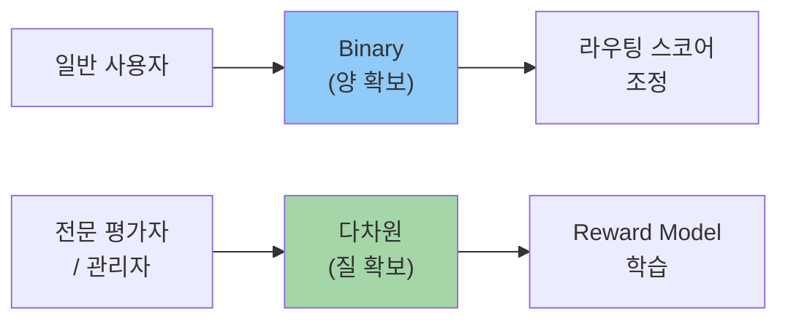
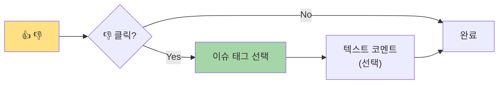
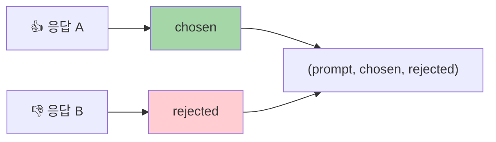
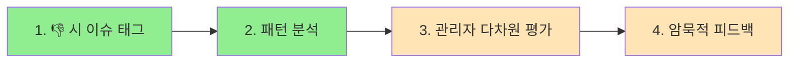

> **시리즈**: LLM 피드백과 학습
> - [Part 1: SFT, RLHF, DPO 비교](/dev-notes/posts/2025-12-28-llm-training-methods-comparison/)
> - **Part 2**: 피드백 수집 설계 (현재 글)
> - [Part 3: 피드백 활용 파이프라인](/dev-notes/posts/2025-12-28-llm-feedback-utilization-pipeline/)

## 피드백 수집의 딜레마

[Part 1](/dev-notes/posts/2025-12-28-llm-training-methods-comparison/)에서 RLHF와 DPO가 선호도 데이터를 필요로 한다고 했다. 그렇다면 이 데이터를 어떻게 수집할까?

피드백 UI 설계에는 근본적인 트레이드오프가 있다.

> 응답률이 높으면 데이터 품질이 낮고, 품질이 높으면 응답률이 낮다.

ChatGPT, Claude 같은 서비스가 단순한 👍/👎 버튼을 사용하는 이유가 여기에 있다.

## 피드백 방식 비교

| 방식 | 응답률 | 데이터 품질 | 학습 효과 | 사용자 피로도 |
|------|--------|-------------|-----------|---------------|
| Binary (👍/👎) | 98%+ | 낮음 | 중간 | 최저 |
| 5점 Likert | 60-70% | 높음 | 높음 | 중간 |
| 다차원 평가 | 40-50% | 매우 높음 | 매우 높음 | 높음 |
| 텍스트 코멘트 | 5-15% | 매우 높음 | 매우 높음 | 높음 |

12분 이상의 설문은 이탈률이 3배 증가한다는 연구도 있다. 피드백 수집도 마찬가지다.

## Binary vs 다차원: 어떤 데이터가 더 유용한가

### Binary 피드백의 한계

👍/👎 만으로는 **왜** 좋거나 나쁜지 알 수 없다.

```
응답: "코드 스타일이 일관되지 않습니다. 변수명을 camelCase로..."
👎

왜 👎인가?
- 보안 리뷰를 요청했는데 스타일 지적?
- 너무 장황해서?
- 틀린 내용이 있어서?
```

Reward Model 학습에는 사용할 수 있지만, 문제 진단과 개선에는 부족하다.

### 다차원 평가의 효과: HelpSteer2 사례

NVIDIA의 HelpSteer2 데이터셋은 **10,000개 샘플만으로 Reward-Bench 1위(92.0%)**를 달성했다. 비결은 5가지 속성에 대한 세분화된 평가다.

| 속성 | 설명 | 평가 범위 |
|------|------|----------|
| Helpfulness | 전반적 유용성 | 0-4 |
| Correctness | 사실적 정확성 | 0-4 |
| Coherence | 일관성과 명확성 | 0-4 |
| Complexity | 지적 깊이 | 0-4 |
| Verbosity | 응답 길이 적절성 | 0-4 |

다차원 평가가 학습 효과 면에서 압도적이지만, 이 방식은 **전문 평가자**를 대상으로 한 것이다. 일반 사용자에게 5개 항목을 매번 평가하라고 하면 응답률이 급락한다.

### 핵심 인사이트



두 방식을 분리해서 운영하는 것이 현실적이다.

## Progressive Disclosure 전략

두 가지 장점을 결합하는 방법이 있다. **기본은 Binary로 응답률을 확보하고, 부정 피드백 시에만 세부 정보를 수집**한다.



### 기본 UI

```text
👍 도움됐어요  |  👎 개선 필요
```

### 👎 클릭 시 확장

```text
무엇이 문제였나요? (선택)
□ 정확하지 않음
□ 너무 장황함
□ 핵심을 벗어남
□ 실행 불가능한 제안

[텍스트 코멘트 입력] (선택)
```

이 방식의 장점:

| 장점 | 설명 |
|------|------|
| 기본 응답률 유지 | 98% (👍 클릭만으로 완료) |
| 디버깅 정보 수집 | 👎인 이유를 알 수 있음 |
| 사용자 피로도 최소화 | 문제 있을 때만 추가 입력 |

## 암묵적 피드백 수집

명시적 평가 외에도 사용자 행동에서 피드백을 추출할 수 있다.

### 수정 기반 피드백

> "사용자가 출력을 수정하면, 그 자체가 ground-truth 데이터다."

```
원본 응답: "sorted() 함수를 사용하세요."
사용자 수정: "sorted() 함수를 사용하세요. reverse=True로 내림차순 정렬이 가능합니다."

→ (원본, 수정본) 쌍이 학습 데이터
```

별도 평점 없이 "원하는 응답"을 직접 캡처하는 방식이다.

### 행동 기반 신호

| 행동 | 해석 | 신뢰도 |
|------|------|--------|
| 응답 복사 | 유용함 | 중간 |
| 재생성 요청 | 불만족 | 높음 |
| 대화 이탈 | 불만족 | 낮음 |
| 후속 질문 | 관심 있음 | 중간 |

암묵적 피드백은 응답률 100%지만, 해석에 노이즈가 있다.

## 채널별 권장 전략

서비스 채널마다 최적의 피드백 방식이 다르다.

| 채널 | 권장 방식 | 이유 |
|------|----------|------|
| Slack/Discord | Binary only | 모바일 사용, 빠른 응답 필수 |
| 웹 Chat | Binary + 👎 시 세부 옵션 | UX 공간 있음, 디버깅 정보 필요 |
| MR Review | Binary + 태그 선택 | "버그 발견" vs "스타일 지적" 구분 |
| Admin 대시보드 | 다차원 Likert | 품질 분석, 모델 튜닝용 |

## 피드백 → 학습 데이터 변환

수집한 피드백은 어떻게 학습 데이터가 될까?

### RLHF/DPO용 선호도 데이터



같은 프롬프트에 대해 👍 받은 응답과 👎 받은 응답을 쌍으로 구성한다.

```json
{
  "prompt": "Python 리스트 정렬 방법",
  "chosen": "sorted() 함수를 사용합니다...",
  "rejected": "리스트 정렬에는 여러 방법이 있는데..."
}
```

### 다차원 점수 → Multi-Objective Reward

HelpSteer2 스타일의 다차원 점수는 더 정교한 Reward Model을 학습시킬 수 있다.

```python
reward = (
    0.4 * correctness +      # 정확성 가중치 높음
    0.4 * helpfulness +
    0.2 * (2 - abs(verbosity - 2))  # 적절한 길이 보상
)
```

| 속성 | 가중치 | 이유 |
|------|--------|------|
| Correctness | 40% | 틀린 정보는 치명적 |
| Helpfulness | 40% | 핵심 가치 |
| Verbosity 적절성 | 20% | 너무 짧거나 길면 감점 |

### 이슈 태그 → 분류 레이블

```python
# 이슈 태그 분포 분석
issue_distribution = {
    "TOO_VERBOSE": 42%,
    "INCORRECT": 28%,
    "OFF_TOPIC": 15%,
    "NOT_ACTIONABLE": 10%,
    "OTHER": 5%
}
```

이 분포는:
- Anti-pattern 프롬프트 생성에 활용
- 에이전트별 약점 파악
- 시스템 프롬프트 개선 우선순위 결정

## 데이터 스키마 설계

Progressive Disclosure를 지원하는 스키마 예시다.

```kotlin
data class UserFeedback(
    val executionId: String,
    val userId: String,

    // 기본 (필수)
    val rating: Rating,  // POSITIVE, NEGATIVE

    // 세부 (👎 시 선택)
    val issues: List<FeedbackIssue>? = null,
    val comment: String? = null,

    // 메타데이터
    val source: String,  // slack, chat, api
    val isVerified: Boolean,  // 요청자 본인 여부
    val createdAt: Instant
)

enum class FeedbackIssue {
    INCORRECT,      // 사실 오류
    TOO_VERBOSE,    // 너무 장황
    OFF_TOPIC,      // 핵심 벗어남
    NOT_ACTIONABLE, // 실행 불가
    TOO_BRIEF       // 너무 짧음
}
```

### 관리자용 확장 스키마

일반 사용자와 관리자의 피드백을 분리한다.

```kotlin
data class AdminFeedback(
    val executionId: String,
    val adminId: String,

    // 다차원 평가 (0-4)
    val correctness: Int,
    val helpfulness: Int,
    val verbosity: Int,

    // 학습용 데이터
    val isExemplary: Boolean = false,  // Few-shot 예제용
    val goldResponse: String? = null,   // 이상적 응답

    val comment: String?
)
```

## Verified Feedback

모든 피드백을 동일하게 취급하면 노이즈가 섞인다. 실제 질문한 사람의 피드백만 **verified**로 처리한다.

| 피드백 유형 | 저장 | 학습 반영 |
|------------|------|----------|
| 요청자 본인 피드백 | ✅ | ✅ |
| 타인의 피드백 | ✅ | ❌ (참고용) |

Slack 같은 공개 채널에서는 누구나 리액션을 달 수 있다. 하지만 학습에는 요청자 본인의 평가만 반영해야 **신호 대비 노이즈 비율(SNR)**이 높아진다.

## 구현 우선순위



| 단계 | 작업 | 효과 | 노력 |
|------|------|------|------|
| 1 | 👎 클릭 시 이슈 태그 선택 UI | 높음 | 낮음 |
| 2 | FeedbackIssue 기반 패턴 분석 | 높음 | 중간 |
| 3 | 관리자용 다차원 평가 UI | 중간 | 중간 |
| 4 | 암묵적 피드백 수집 | 중간 | 높음 |

1단계만 구현해도 "INCORRECT 비율이 높은 에이전트" 같은 패턴을 발견할 수 있다.

## 정리

| 대상 | 수집 방식 | 활용 |
|------|----------|------|
| 일반 사용자 | Binary + Progressive Disclosure | 라우팅 조정, 이슈 패턴 분석 |
| 관리자 | 다차원 Likert + Gold Response | Reward Model, Few-shot 예제 |
| 시스템 | 암묵적 행동 신호 | 보조 지표 |

Binary(👍/👎)를 기본으로 유지하되, 👎 클릭 시 이슈 태그를 추가하는 것이 가장 효과적이다. 응답률을 유지하면서 디버깅에 필요한 정보를 수집할 수 있다.

## 참고 자료

### 피드백 스케일 연구
- [Rating Scales for UX Research](https://www.interaction-design.org/literature/article/rating-scales-for-ux-research)
- [Rating Scale Guide](https://maze.co/blog/rating-scale/)

### RLHF & Reward Model
- [RLHF Book - Reward Models](https://rlhfbook.com/c/07-reward-models)
- [Understanding Reward Models](https://cameronrwolfe.substack.com/p/reward-models)

### Multi-Attribute Feedback
- [NVIDIA HelpSteer2 Dataset](https://huggingface.co/datasets/nvidia/HelpSteer2)
- [HelpSteer2 Paper](https://arxiv.org/abs/2406.08673)

---

> **다음 글**: [Part 3: 피드백 활용 파이프라인](/dev-notes/posts/2025-12-28-llm-feedback-utilization-pipeline/) - 수집한 피드백을 어떻게 활용할까?
