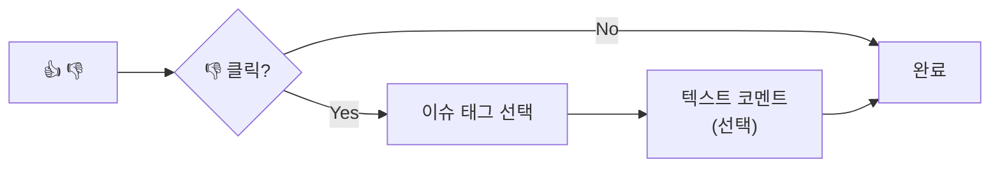
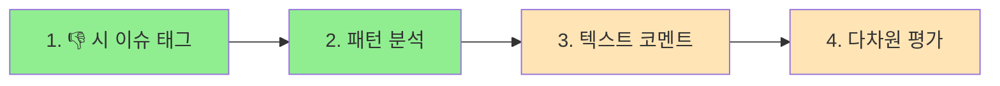

## 피드백 수집의 딜레마

LLM 기반 서비스에서 사용자 피드백은 모델 개선의 핵심 데이터다. 하지만 피드백 UI 설계에는 근본적인 트레이드오프가 존재한다.

> 응답률이 높으면 데이터 품질이 낮고, 품질이 높으면 응답률이 낮다.

ChatGPT, Claude 같은 서비스가 단순한 👍/👎 버튼을 사용하는 이유가 여기에 있다.

## 피드백 방식 비교

| 방식 | 응답률 | 데이터 품질 | 학습 효과 | 사용자 피로도 |
|------|--------|-------------|-----------|---------------|
| Binary (👍/👎) | 98%+ | 낮음 | 중간 | 최저 |
| 5점 Likert | 60-70% | 높음 | 높음 | 중간 |
| 다차원 평가 | 40-50% | 매우 높음 | 매우 높음 | 높음 |
| 텍스트 코멘트 | 5-15% | 매우 높음 | 매우 높음 | 높음 |

12분 이상의 설문은 이탈률이 3배 증가한다는 연구 결과도 있다.

## 업계 사례 분석

### NVIDIA HelpSteer2: 다차원 평가의 성공 사례

NVIDIA의 HelpSteer2 데이터셋은 **10,000개 샘플만으로 Reward-Bench 1위(92.0%)**를 달성했다. 비결은 5가지 속성에 대한 세분화된 평가다.

| 속성 | 설명 |
|------|------|
| Helpfulness | 전반적 유용성 |
| Correctness | 사실적 정확성 |
| Coherence | 일관성과 명확성 |
| Complexity | 지적 깊이 |
| Verbosity | 응답 길이 적절성 |

다차원 평가가 학습 효과 면에서 압도적이지만, 이 방식은 전문 평가자를 대상으로 한 것이다. 일반 사용자에게 적용하면 응답률이 급격히 떨어진다.

### Anthropic/OpenAI: 암묵적 피드백

> "사용자가 출력을 수정하면, 그 자체가 ground-truth 데이터다."

사용자가 응답을 복사 후 수정하면, 원본과 수정본의 차이가 자동으로 학습 데이터가 된다. 별도 평점 없이 "원하는 응답"을 직접 캡처하는 방식이다.

### 채널별 응답률 벤치마크 (2025)

| 채널 | 응답률 |
|------|--------|
| 인앱/웹 즉시 | 20-40% |
| 이메일 | 6-25% |
| SMS (바이너리) | 높음 |
| 패시브 버튼 | 3-5% |

## Progressive Disclosure 전략

두 가지 장점을 결합하는 방법이 있다. **기본은 Binary로 응답률을 확보하고, 부정 피드백 시에만 세부 정보를 수집**하는 것이다.



### 기본 UI

```text
👍 도움됐어요  |  👎 개선 필요
```

### 👎 클릭 시 확장

```text
무엇이 문제였나요? (선택)
□ 정확하지 않음
□ 너무 장황함
□ 핵심을 벗어남
□ 실행 불가능한 제안

[텍스트 코멘트 입력] (선택)
```

이 방식은 세 가지 장점이 있다.

- 기본 응답률 98% 유지
- 부정 피드백에서만 디버깅 정보 수집
- 사용자 피로도 최소화

## 채널별 권장 전략

| 채널 | 권장 방식 | 이유 |
|------|----------|------|
| Slack | Binary only | 모바일 사용, 빠른 응답 필수 |
| 웹 Chat | Binary + 👎 시 세부 옵션 | UX 공간 있음, 디버깅 정보 필요 |
| MR Review | Binary + 태그 선택 | "버그 발견" vs "스타일 지적" 구분 가치 |
| Admin 대시보드 | 다차원 Likert | 품질 분석, 모델 튜닝용 |

## 데이터 스키마 설계

Progressive Disclosure를 지원하는 스키마 예시다.

```kotlin
data class EnhancedFeedback(
    val executionId: String,
    val userId: String,

    // 기본 (필수)
    val overallRating: Rating,  // POSITIVE, NEGATIVE

    // 세부 (👎 시 선택)
    val issues: List<FeedbackIssue>? = null,
    val comment: String? = null,

    // 다차원 (분석용)
    val correctness: Int? = null,     // 0-4
    val helpfulness: Int? = null,     // 0-4
    val verbosity: Int? = null,       // 0-4

    val source: String  // slack, chat, api
)

enum class FeedbackIssue {
    INCORRECT,      // 사실 오류
    TOO_VERBOSE,    // 너무 장황
    OFF_TOPIC,      // 핵심 벗어남
    NOT_ACTIONABLE, // 실행 불가
    TOO_BRIEF       // 너무 짧음
}
```

## 구현 우선순위



| 단계 | 작업 | 효과 | 노력 |
|------|------|------|------|
| 1 | 👎 클릭 시 이슈 태그 선택 UI | 높음 | 낮음 |
| 2 | FeedbackIssue 기반 패턴 분석 | 높음 | 중간 |
| 3 | 텍스트 코멘트 선택적 수집 | 중간 | 낮음 |
| 4 | 다차원 평가 (분석 대시보드 전용) | 중간 | 높음 |

1단계만 구현해도 "INCORRECT 비율이 높은 에이전트" 같은 패턴을 발견할 수 있다.

## 정리

Binary(👍/👎)를 기본으로 유지하되, 👎 클릭 시 "무엇이 문제였나요?" 이슈 태그를 추가하는 것이 가장 효과적이다. 응답률을 유지하면서 디버깅에 필요한 정보를 수집할 수 있다.

| 목표 | 권장 방식 |
|------|----------|
| 응답률 최대화 | Binary only |
| 디버깅 정보 수집 | Binary + 이슈 태그 |
| 모델 튜닝 | 다차원 Likert (전문 평가자) |

## 참고 자료

### 피드백 스케일 연구
- [Rating Scales for UX Research](https://www.interaction-design.org/literature/article/rating-scales-for-ux-research)
- [Rating Scale Guide](https://maze.co/blog/rating-scale/)
- [LLM as a Judge](https://www.evidentlyai.com/llm-guide/llm-as-a-judge)

### RLHF & Reward Model
- [RLHF Book - Reward Models](https://rlhfbook.com/c/07-reward-models)
- [Understanding Reward Models](https://cameronrwolfe.substack.com/p/reward-models)

### Multi-Attribute Feedback
- [NVIDIA HelpSteer2 Dataset](https://huggingface.co/datasets/nvidia/HelpSteer2)
- [HelpSteer2 Paper](https://arxiv.org/abs/2406.08673)

### UX & Response Rates
- [Survey Response Rate Guide](https://www.clootrack.com/cx-guide/survey-response-rate-guide-cx-insights)
- [Survey Response Rate Benchmarks 2025](https://surveysparrow.com/blog/survey-response-rate-benchmarks/)
