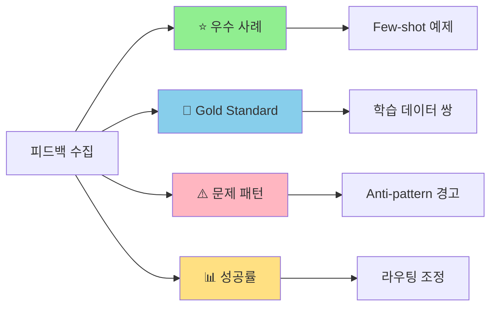
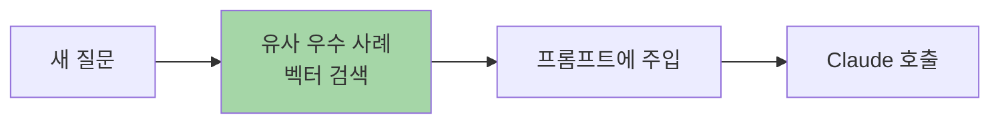
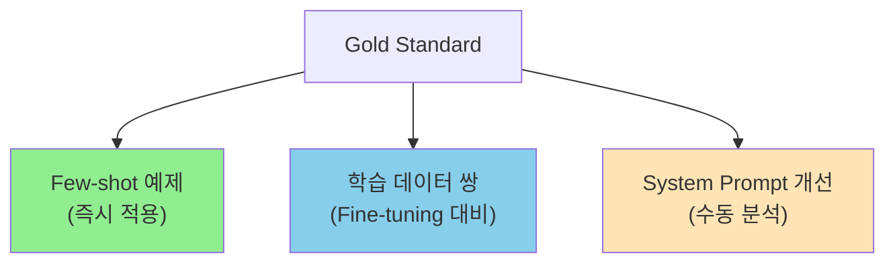
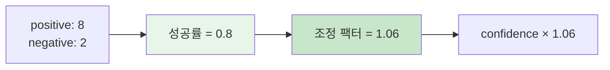
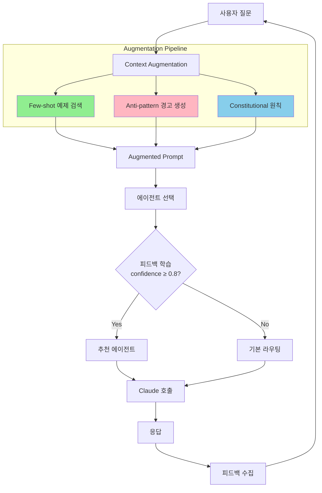
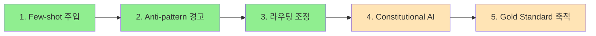

> **시리즈**: LLM 피드백과 학습
> - [Part 1: SFT, RLHF, DPO 비교](/dev-notes/posts/2025-12-28-llm-training-methods-comparison/)
> - [Part 2: 피드백 수집 설계](/dev-notes/posts/2025-12-28-llm-feedback-collection-strategy/)
> - **Part 3**: 피드백 활용 파이프라인 (현재 글)

## 들어가며

[Part 2](/dev-notes/posts/2025-12-28-llm-feedback-collection-strategy/)에서 피드백을 수집했다. 이제 이 데이터를 어떻게 활용할까?

[Part 1](/dev-notes/posts/2025-12-28-llm-training-methods-comparison/)에서 설명했듯이, Claude API 환경에서는 Fine-tuning이 불가능하다. 하지만 피드백 데이터는 여전히 가치 있다. **프롬프트 엔지니어링**을 통해 모델 출력을 개선할 수 있다.



## 1. Few-shot 예제 주입

가장 직접적인 활용법이다. 관리자가 "우수 사례"로 마킹한 응답을 프롬프트에 동적으로 주입한다.

### 동작 원리



### 프롬프트 구조

```text
## 과거 좋은 평가를 받은 응답 예시

### 예시 1
**질문**: MR 리뷰해줘
**좋은 응답**:
## 🔒 보안 이슈 발견
1. SQL Injection 위험: line 42에서 raw query 사용
2. 권한 검증 누락: admin 엔드포인트에 인증 없음

## 권장 수정
- PreparedStatement 사용
- @PreAuthorize 어노테이션 추가

---

이제 다음 질문에 답해주세요:
{user_question}
```

### 구현 예시

```kotlin
class FewShotInjectionService(
    private val feedbackRepository: AdminFeedbackRepository,
    private val embeddingService: EmbeddingService
) {
    fun buildAugmentedPrompt(
        agentId: String,
        userQuery: String
    ): String {
        // 1. 우수 사례 검색 (최대 3개)
        val exemplars = feedbackRepository
            .findExemplary(agentId, limit = 3)
            .filter { it.isExemplary }

        if (exemplars.isEmpty()) return userQuery

        // 2. 유사도 기반 필터링
        val queryEmbedding = embeddingService.embed(userQuery)
        val relevant = exemplars
            .filter { similarity(queryEmbedding, it.embedding) > 0.6 }

        // 3. 프롬프트 구성
        return buildString {
            appendLine("## 과거 좋은 평가를 받은 응답 예시")
            appendLine()
            relevant.forEachIndexed { i, ex ->
                appendLine("### 예시 ${i + 1}")
                appendLine("**질문**: ${ex.originalQuery}")
                appendLine("**좋은 응답**: ${ex.response}")
                appendLine()
            }
            appendLine("---")
            appendLine()
            appendLine("이제 다음 질문에 답해주세요:")
            appendLine(userQuery)
        }
    }
}
```

### 효과

| 장점 | 주의점 |
|------|--------|
| 모델 가중치 변경 없이 즉시 적용 | 예제 품질이 중요 |
| 도메인 특화 스타일 유도 | 토큰 비용 증가 |
| A/B 테스트 용이 | 컨텍스트 길이 제한 |

## 2. Anti-pattern 경고 주입

자주 발생하는 문제 유형을 분석하여 프롬프트에 경고로 추가한다.

### 이슈 분포 분석

[Part 2](/dev-notes/posts/2025-12-28-llm-feedback-collection-strategy/)에서 수집한 FeedbackIssue를 집계한다.

```kotlin
fun getTopIssues(agentId: String, limit: Int = 3): Map<FeedbackIssue, Int> {
    return feedbackRepository
        .findByAgentId(agentId)
        .flatMap { it.issues }
        .groupingBy { it }
        .eachCount()
        .toList()
        .sortedByDescending { it.second }
        .take(limit)
        .toMap()
}
```

### 프롬프트 경고 생성

```kotlin
fun buildAntiPatternPrompt(topIssues: Map<FeedbackIssue, Int>): String {
    val warnings = topIssues.map { (issue, _) ->
        when (issue) {
            INCORRECT -> "**사실 오류**: 불확실하면 모른다고 말하세요"
            TOO_VERBOSE -> "**장황함**: 핵심만 간결하게 전달하세요"
            OFF_TOPIC -> "**핵심 벗어남**: 질문에 직접 답변하세요"
            NOT_ACTIONABLE -> "**실행 불가**: 구체적인 단계를 제시하세요"
            else -> null
        }
    }.filterNotNull()

    return """
        ## 피해야 할 응답 패턴
        ${warnings.joinToString("\n")}
    """.trimIndent()
}
```

### 결과 예시

```text
## 피해야 할 응답 패턴
- **장황함**: 핵심만 간결하게 전달하세요
- **사실 오류**: 불확실하면 모른다고 말하세요
- **핵심 벗어남**: 질문에 직접 답변하세요
```

## 3. Constitutional AI 스타일 원칙

문제 유형 태깅을 "헌법 원칙"으로 변환한다. 모델이 응답을 자체 검토하도록 유도하는 방식이다.

> "Constitutional AI trains models to be helpful, harmless, and honest by having them critique and revise their own outputs according to a set of principles." — Anthropic

### 원칙 정의

```yaml
principles:
  - id: "BE_CONCISE"
    critique: "응답이 불필요하게 길고 반복적입니다"
    revision: "핵심만 간결하게 전달하세요"
    trigger: TOO_VERBOSE

  - id: "STAY_ON_TOPIC"
    critique: "질문의 핵심을 파악하지 못했습니다"
    revision: "질문에 직접 답변하세요"
    trigger: OFF_TOPIC

  - id: "BE_ACTIONABLE"
    critique: "제안이 현실적으로 적용 불가능합니다"
    revision: "구체적이고 실행 가능한 단계를 제시하세요"
    trigger: NOT_ACTIONABLE

  - id: "VERIFY_FACTS"
    critique: "정확하지 않은 정보가 포함되었습니다"
    revision: "확실한 정보만 제공하고, 불확실하면 명시하세요"
    trigger: INCORRECT
```

### 프롬프트 적용

```text
## 응답 원칙

응답하기 전에 다음 원칙을 스스로 점검하세요:

1. **간결성**: 불필요하게 길거나 반복적이지 않은가?
2. **관련성**: 질문의 핵심에 직접 답변하는가?
3. **실행 가능성**: 구체적이고 적용 가능한 제안인가?
4. **정확성**: 확실하지 않은 정보를 단정적으로 말하지 않는가?

위 원칙을 위반한다면 응답을 수정한 후 제출하세요.
```

### Self-Critique 패턴

더 명시적으로, 모델이 초안을 작성한 후 자체 검토하도록 유도할 수 있다.

```text
Step 1: 초안을 작성하세요.
Step 2: 위 원칙에 따라 초안을 검토하세요.
Step 3: 문제가 있다면 수정하세요.
Step 4: 최종 응답만 출력하세요.
```

## 4. Gold Standard 응답 활용

관리자가 "이렇게 답했어야 해"를 직접 작성한 경우, 가장 강력한 학습 데이터가 된다.

### 데이터 구조

```kotlin
data class TrainingPair(
    val prompt: String,           // 원본 질문
    val originalResponse: String, // Claude가 생성한 응답
    val goldResponse: String,     // 관리자가 작성한 이상적 응답
    val issues: List<FeedbackIssue>
)
```

### 활용 경로



### Fine-tuning 데이터 포맷

향후 Fine-tuning이 가능해지면 바로 사용할 수 있도록 표준 포맷으로 저장한다.

**SFT 포맷**:
```json
{
  "messages": [
    {"role": "user", "content": "{prompt}"},
    {"role": "assistant", "content": "{goldResponse}"}
  ]
}
```

**DPO 포맷**:
```json
{
  "prompt": "{prompt}",
  "chosen": "{goldResponse}",
  "rejected": "{originalResponse}"
}
```

## 5. 실시간 라우팅 조정

다중 에이전트 시스템에서 피드백을 라우팅 결정에 반영한다.

### 성공률 기반 스코어 조정



### 조정 공식

| 성공률 | 조정 팩터 | 효과 |
|--------|----------|------|
| > 0.7 | 1.0 + (성공률 - 0.5) × 0.2 | 최대 +10% 부스트 |
| < 0.3 | 1.0 - (0.5 - 성공률) × 0.3 | 최대 -15% 페널티 |
| 0.3 ~ 0.7 | 1.0 | 조정 없음 |

### 유사 쿼리 기반 추천

과거에 유사한 질문에서 높은 피드백을 받은 에이전트를 추천한다.

```kotlin
fun getSimilarQueryRecommendation(
    query: String,
    minSimilarity: Double = 0.7,
    minSamples: Int = 2
): AgentRecommendation? {
    val queryEmbedding = embeddingService.embed(query)

    val candidates = feedbackRepository.findAll()
        .filter { similarity(queryEmbedding, it.queryEmbedding) >= minSimilarity }
        .groupBy { it.agentId }
        .filter { it.value.size >= minSamples }

    return candidates
        .maxByOrNull { (_, feedbacks) ->
            val successRate = feedbacks.count { it.isPositive } / feedbacks.size.toDouble()
            val avgSimilarity = feedbacks.map { similarity(queryEmbedding, it.queryEmbedding) }.average()
            avgSimilarity * 0.3 + successRate * 0.7  // 피드백 성공률 가중치 높음
        }
        ?.let { AgentRecommendation(it.key, confidence = 0.85) }
}
```

### 피드백 루프 완화

추천 시스템의 고질적 문제인 피드백 루프를 방지한다.

| 전략 | 구현 |
|------|------|
| 조정 팩터 제한 | 최대 ±15% |
| 최소 샘플 요구 | 2개 이상 피드백 필요 |
| 신뢰도 임계값 | 0.8 이상만 강한 추천 |
| 캐시 만료 | 30분마다 재계산 |
| Verified Feedback | 요청자 본인 피드백만 반영 |

## 전체 파이프라인 통합

모든 활용 방법을 하나의 파이프라인으로 통합한다.



### 구현 예시

```kotlin
class ContextAugmentationService(
    private val fewShotService: FewShotInjectionService,
    private val feedbackService: FeedbackAnalysisService
) {
    fun buildFullAugmentation(
        agentId: String,
        userQuery: String
    ): AugmentedContext {
        // 1. Few-shot 예제
        val fewShot = fewShotService.getExemplars(agentId, userQuery, limit = 2)

        // 2. Anti-pattern 경고
        val antiPatterns = feedbackService.getTopIssues(agentId, limit = 3)
        val warnings = buildAntiPatternPrompt(antiPatterns)

        // 3. Constitutional 원칙 (이슈 기반)
        val principles = buildConstitutionalPrinciples(antiPatterns.keys)

        // 4. 프롬프트 조합
        return AugmentedContext(
            fewShotExamples = fewShot,
            antiPatternWarnings = warnings,
            constitutionalPrinciples = principles,
            originalQuery = userQuery
        )
    }
}
```

## 효과 측정

### A/B 테스트 설계

| 그룹 | 설정 | 측정 지표 |
|------|------|----------|
| Control | 기본 프롬프트 | 👍 비율 |
| Treatment A | + Few-shot | 👍 비율, 이슈 감소 |
| Treatment B | + Anti-pattern | 특정 이슈 감소 |
| Treatment C | + Constitutional | 전체 품질 점수 |

### 기대 효과

| 활용 방법 | 기대 효과 |
|----------|----------|
| Few-shot | 도메인 스타일 일관성 ↑ |
| Anti-pattern | 반복 문제 발생 ↓ |
| Constitutional AI | 자체 검토로 품질 ↑ |
| 라우팅 조정 | 에이전트 선택 정확도 ↑ |

## 구현 우선순위



| 단계 | 작업 | 효과 | 노력 |
|------|------|------|------|
| 1 | Few-shot 예제 주입 | 높음 | 중간 |
| 2 | Anti-pattern 경고 생성 | 높음 | 낮음 |
| 3 | 피드백 기반 라우팅 조정 | 높음 | 중간 |
| 4 | Constitutional AI 원칙 | 중간 | 중간 |
| 5 | Gold Standard 축적 | 장기 | 높음 |

1-3단계는 즉시 효과를 볼 수 있다. 4-5단계는 데이터가 쌓일수록 효과가 커진다.

## 정리

| 활용 방법 | 필요 데이터 | 즉시 적용 |
|----------|-------------|----------|
| Few-shot | ⭐ 우수 사례 | ✅ |
| Anti-pattern | 이슈 태그 분포 | ✅ |
| Constitutional AI | 이슈 → 원칙 매핑 | ✅ |
| 라우팅 조정 | 성공률 통계 | ✅ |
| Fine-tuning 대비 | Gold Standard | ❌ (향후) |

Fine-tuning이 불가능한 환경에서도, 피드백 데이터는 프롬프트 엔지니어링을 통해 충분히 활용할 수 있다. 핵심은 **피드백 → 패턴 분석 → 프롬프트 개선**의 선순환을 만드는 것이다.

## 참고 자료

- [Constitutional AI Paper](https://arxiv.org/abs/2212.08073) - Anthropic
- [RLHF Book](https://rlhfbook.com/) - Nathan Lambert
- [Prompt Engineering Guide](https://www.promptingguide.ai/)

---

> **시리즈 완료**: 이 글로 "LLM 피드백과 학습" 시리즈가 마무리됩니다.
> - [Part 1: SFT, RLHF, DPO 비교](/dev-notes/posts/2025-12-28-llm-training-methods-comparison/) - LLM 학습 방법론
> - [Part 2: 피드백 수집 설계](/dev-notes/posts/2025-12-28-llm-feedback-collection-strategy/) - 어떤 피드백을 어떻게 모을까
> - **Part 3**: 피드백 활용 파이프라인 - 수집한 피드백을 어떻게 활용할까
